# Maximo Inspección Visual (MVI) - Parte 2

En este laboratorio veremos cómo MVI facilita el entrenamiento de un modelo en un conjunto de datos previamente creado.

A continuación, explorará MVI Edge para ver cómo se facilita el escalado y la eficiencia.

Por último, vinculará la aplicación MVI Mobile iOS en su dispositivo a nuestra instancia central MVI y ejecutará la capacidad de inferencia de imágenes sobre la marcha.

## Entrenamiento de un modelo a partir de un conjunto de datos

### Paso 1: Crear modelo de detección de objetos en Maximo Visual Inspection (guiado por el instructor)

Ahora que tiene un conjunto de datos de imágenes viable, como el analista de activos, es el momento de entrenar a un modelo de detección de objetos en MVI utilizando estas imágenes etiquetadas. La formación es el proceso de ajuste de un modelo a los datos de entrada de tal manera que se puede utilizar para hacer predicciones sobre los datos que no ha visto antes en el futuro.

Durante el entrenamiento de un modelo de visión por ordenador, la información a nivel de píxel del conjunto de datos de la imagen se introduce en el algoritmo de entrenamiento. Una red neuronal convolucional (CNN) ayuda al algoritmo a "mirar" dividiendo las imágenes en píxeles (la CNN es un algoritmo popular para la visión por ordenador). Esta red neuronal también comprueba la exactitud de sus predicciones en una serie de iteraciones hasta que sus predicciones son precisas. En este punto, el modelo CNN está reconociendo o viendo imágenes como una red neuronal biológica humana (de ahí el nombre - *Red Neuronal* Convolucional). En esta demostración, el modelo que entrenarás es **Faster R-CNN** (Faster Region-based Convolutional Network). Faster **R- CNN** es una extensión de los modelos CNN que pertenece a una familia de modelos de visión por ordenador de detección de objetos.

La buena noticia es que Maximo Visual Inspection simplifica y agiliza este proceso de formación de modelos mediante la automatización y una solución sin código; esto pone el aprendizaje en profundidad en manos de un experto en la materia capacitado.

Ahora es el momento de iniciar el proceso de formación de su modelo de detección de tanques sucios utilizando el poder de la IA y la facilidad de uso de MVI.

**Acciones:**

1.  Haga clic en **Entrenar modelo** para iniciar el proceso de entrenamiento de detección de objetos.

2.  Se abre la página Entrenar modelo / Tanque de sedimentación aumentada. Seleccione Teja de **detección de** objetos en la sección **Seleccionar tipo de** entrenamiento **(A)**.
3.  En la sección **Optimizar modelo usando**, selecciona la ficha **R-CNN más rápida** **(B)**. 🟢

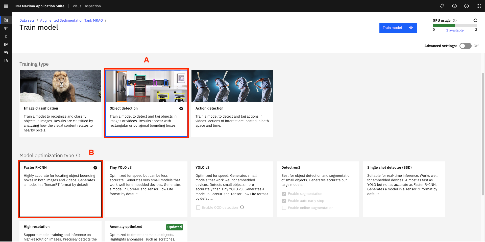

La ventana **Modelo de tren / Tanque de sedimentación aumentada** (captura de pantalla anterior) permite configurar los ajustes del modelo.

Para el caso de uso de esta demostración, utilizará el tipo de entrenamiento **Detección de objetos**, ya que desea entrenar un modelo que pueda analizar el estado del tanque sin confundirse con ninguna otra entidad de fondo en la imagen de la cámara entrante. Además, utilizará el tipo de modelo **R-CNN más rápido**, que está optimizado para una mayor precisión pero requiere más potencia de cálculo y de GPU que las alternativas (no pasa nada; usted quiere una mayor precisión).

Aparte de las opciones elegidas, Maximo Visual Inspection (MVI) incluye varios modelos para ejecutar inferencias relacionadas con la clasificación y la detección. Una breve descripción de cuándo utilizar cada tipo de modelo se puede leer dentro de cada mosaico de opciones de formación y modelos.

4.  Para obtener un mayor control sobre el entrenamiento del modelo, visualice los hiperparámetros de su modelo haciendo clic en el interruptor **Configuración avanzada** para **activarlo** (situado en la esquina superior derecha de la pantalla).

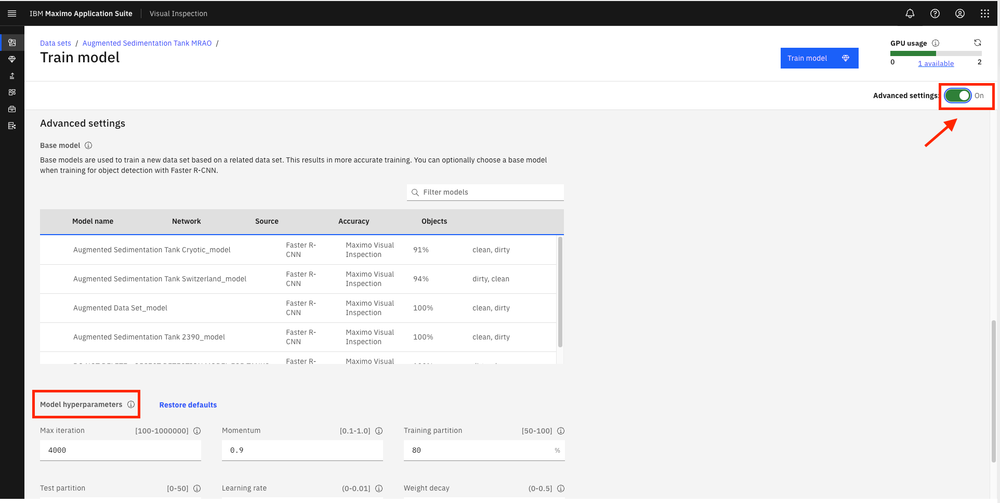

Debido a la facilidad de uso del IVM, los expertos en la materia suelen progresar muy rápidamente hasta convertirse en usuarios avanzados. A medida que se encuentran con nuevos niveles de comodidad y control, también pueden optar por explotar los ajustes avanzados para afinar aún más el modelo. Una vez activado el interruptor de **ajustes** avanzados, la sección de hiperparámetros **del modelo** pasa a estar disponible en la parte inferior de la pantalla. Los hiperparámetros se utilizan para optimizar el rendimiento del modelo; y cuando se trata de mejorar la precisión del modelo, estos parámetros son la opción a la que recurren los científicos de datos y los expertos en modelos. Se puede ver una breve descripción de cada uno de los hiperparámetros haciendo clic en el icono de **información** (la "**i"**en un círculo) al final de cada hiperparámetro correspondiente. Por ahora, mantenga los hiperparámetros en sus valores por defecto.

**IMPORTANTE** Si usted está haciendo esta demostración en un aula, o el tiempo es un factor, puede mantener el número de iteraciones bajo. Establecerlo en un valor más alto le llevará más tiempo, pero también significa un modelo más preciso con mejores resultados de inspección; para la demo, puede dejar los hiperparámetros en sus valores por defecto.

1.  Aunque puede hacer clic en el botón azul **Entrenar modelo** de la parte superior para iniciar el proceso de entrenamiento del modelo, **NO** se recomienda hacerlo en un entorno de demostración en vivo. 

Haciendo clic en **"Entrenar Modelo"** comenzará el proceso de entrenamiento, pero como el entrenamiento aquí tomará más de 25 minutos, esta guía le muestra los siguientes pasos usando un modelo pre-construido más práctico que ha sido construido usando los mismos pasos pero fue entrenado usando más de 2000 imágenes limpias y sucias de tanques y horas de computación.

En el momento de escribir estas líneas, sólo hay dos unidades de procesamiento gráfico (GPU) disponibles para el entrenamiento y la implementación de modelos en el clúster de demostración compartido mundial (puedes ver el uso actual de GPU en la parte superior derecha de la pantalla).

Por lo tanto, al hacer clic en Entrenar modelo, es probable que el proceso de entrenamiento se ponga en cola hasta que los recursos (GPU) vuelvan a estar disponibles. Si esto ocurre, verás una ventana que te pedirá que añadas el trabajo de entrenamiento a la cola o que canceles el entrenamiento. Puedes hacer clic en Cancelar para finalizar el proceso de entrenamiento y evitar la sobrecarga del sistema.

Para fines de demostración, a partir de este punto, se utilizará un modelo pre-construido de tanques de sedimentación "DONOT DELETE- Sedimentation tank model" construido sobre más de 2000 imágenes de tanques para mostrar los siguientes pasos (al igual que en un programa de cocina donde la comida ya está cocinada en el horno, y sólo la sacan en el programa).

6.  Haga clic en el icono de **la hamburguesa** (una barra apilada) en la parte superior izquierda para ver la lista de opciones de navegación de la página **(A)**.
7.  Seleccione **Modelos desplegados** en la lista para ver una lista de modelos predesplegados **(B)**.

8.  Se abre la página de modelos desplegados. Esta página muestra todos los modelos desplegados actualmente.

### Paso 2: Comprobación del modelo

**Probar el modelo de IA con una nueva imagen de tanque**

Una vez completado el entrenamiento del modelo (en este caso se está utilizando un modelo pre-construido), el modelo debe ser probado antes de ponerlo a disposición general. En la fase de validación, pasará imágenes de tanques al modelo que no formaban parte del conjunto de datos de entrenamiento (denominadas imágenes de validación o prueba) y dejará que el modelo detecte automáticamente el estado de limpieza o suciedad de las imágenes de tanques dadas. De este modo, se simula el escenario de una nueva imagen de inspección de un tanque enviada al modelo por las cámaras de campo y se somete al modelo a imágenes de tanques que nunca ha visto antes.

El uso de un conjunto de datos que no formó parte de la fase de construcción del modelo es un proceso estándar para comprobar el rendimiento del modelo (precisión). Esto ayuda a garantizar que los patrones detectados durante el entrenamiento del modelo son generalizables (también existen en las imágenes nunca vistas) y pueden utilizarse en el mundo real para predecir nuevas imágenes "no vistas".

**Acciones:**

1.  En la pantalla **Modelos desplegados**, bajo la columna **Nombre**, haga clic en **NO ELIMINAR - Modelo de tanque de sedimentación** (modelo pre-construido).

*   **Precaución:** Es posible que el nombre del modelo pre-construido haya cambiado de "DONOT DELETE- Sedimentation tank model" a otra cosa en el momento en que usted está intentando completar esta demostración. Por lo tanto, para identificar rápidamente el modelo pre-entrenado, vale la pena recordar que el modelo pre-entrenado tendrá un valor de conjunto de datos de "No encontrado", independientemente de su nombre, como se destaca en la captura de pantalla anterior. Este consejo rápido puede ayudarle a identificar el modelo preentrenado entre una lista de otros modelos desplegados, independientemente de cualquier cambio futuro en el nombre del modelo.
*   Dado que está trabajando en un entorno de clúster de demostración compartido en todo el mundo, es probable que vea otros modelos desplegados previamente en la pantalla **de Modelos desplegados**. Estos modelos pueden ser ignorados para los propósitos de esta demostración.

2.  Al hacer clic en el nombre del modelo desplegado, se accede a la pantalla del modelo seleccionado, donde se puede evaluar su rendimiento mediante una imagen de prueba. Haga clic en el botón **Arrastrar y soltar archivo aquí o haga clic para cargar (A)** en el mosaico **Modelo de** prueba para seleccionar una imagen para puntuar.

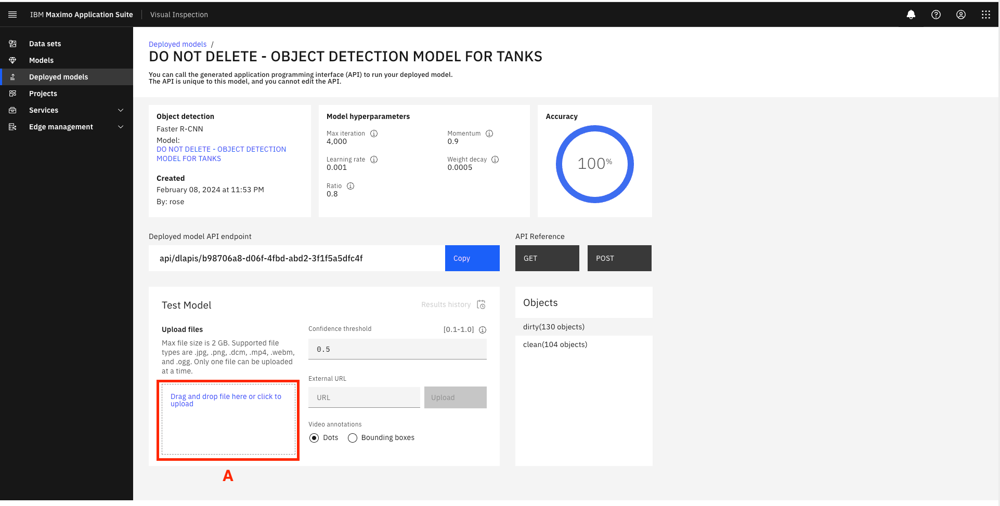

3.  Seleccione una imagen de un **tanque limpio** de la carpeta de imágenes de prueba del modelo (tendrá la palabra "**clean**" en su nombre) y confirme visualmente el resultado del modelo. En el caso de la captura de pantalla siguiente, el modelo predice con gran precisión (0,907) que la imagen cargada muestra un tanque de sedimentación limpio (lo cual es correcto).

4.  Haga clic en **Arrastrar y soltar archivo aquí o haga clic en Cargar (A)** de nuevo y esta vez seleccione una imagen de un tanque sucio de la misma carpeta de pruebas (la imagen tendrá la palabra "sucio" en su nombre). A continuación, haga clic en **Abrir (B)**. Confirme visualmente el resultado del modelo. En el caso de la captura de pantalla siguiente, el modelo predice con gran precisión (0,943) que la imagen cargada muestra un tanque de sedimentación sucio (lo cual es correcto)

Con un modelo validado, usted puede construir un tablero de instrumentos en Maximo Monitor que mostrará los resultados de las inspecciones de alimentación de cámara en vivo, como se demuestra en la primera parte de esta demostración. Usted observó cómo el modelo MVI AI envía alertas de inspección al tablero Monitor. También realizó los pasos para construir un modelo de visión por ordenador.

¡Enhorabuena! Acaba de utilizar IBM Maximo Visual Inspection para crear un modelo de visión por ordenador que puede identificar tanques de sedimentación de agua sucia.

 

## Inspecciones MVI Edge

**Ejemplo de diálogo**: Ahora que ha entrenado y validado el modelo de IA, es el momento de utilizarlo para inspecciones visuales automatizadas en IBM Maximo Visual Inspection (MVI) Edge. MVI Edge es una aplicación basada en web que se puede utilizar para realizar inspecciones basadas en IA utilizando una potente computación de borde.

La computación de borde es una forma de computación que tiene lugar en o cerca de la ubicación física del usuario o de la fuente de datos. Al situar los servicios informáticos más cerca de estas ubicaciones, los usuarios se benefician de servicios más rápidos y fiables, ya que se eliminan los problemas de latencia y se reduce el uso de ancho de banda. Por ejemplo, es ideal para su uso en despliegues de cámaras fijas en los que los datos están en formatos de vídeo de gran tamaño, como en este caso de demostración de tanques de sedimentación.

**Acción:**

1.  Acceda a Maximo Visual Inspection Edge (MVI Edge) haciendo clic en la **URL(A) de MVI Edge** indicada en el correo electrónico de acceso que recibió al solicitar acceso al entorno de demostración: También tome nota de las credenciales de acceso a MVI Edge proporcionadas en el mismo correo electrónico.

2.  Se abre la página MVI Edge **Dashboard** que muestra los resultados de la inspección en tiempo real de los diferentes dispositivos de esta autoridad WRA.

Desde el panel de control de MVI Edge, puede realizar fácilmente un seguimiento de la salud de su dispositivo en tiempo real visualizando el número total de las inspecciones de aprobado o suspenso correspondientes.

3.  Desde la pantalla del salpicadero, pasa el ratón por el panel lateral izquierdo para ver las principales opciones disponibles en el servidor Edge.

Varias opciones para configurar el entorno MVI Edge están disponibles en el panel lateral izquierdo. La **marca de verificación verde** en la parte inferior del panel lateral confirma que el servidor Edge está conectado actualmente al servidor de formación MVI (utilizando una clave API), lo que permite que cualquier modelo y conjunto de datos creados en el servidor de formación sean importados y desplegados en el entorno Edge. Utilizando la opción **Fuentes de entrada** de esta barra lateral, se pueden seleccionar imágenes, carpetas de vídeo o una alimentación de cámara RTSP (Real Time Streaming Protocol) como fuente de entrada para las inspecciones del modelo de IA.

4.  En la página **Panel de control**, haga clic en el enlace Tanque **1** bajo la columna **Inspección** para ver los detalles de la inspección del tanque (o si Tanque 1 no está disponible, haga clic en cualquier otro enlace de número de tanque que esté en **estado** "Inspeccionando" y tenga más de 0 inspecciones bajo la columna **Total de inspecciones** ).
5.  Se abre la pestaña**Imágenes** de la página **Inspección:** Se abre la página Inspección **del Tanque de Sedimentación 2**. Haga clic en la pestaña **Configuración** para ver las configuraciones de inspección de este tanque.

En la pestaña de configuración, mostrar que cualquier conjunto de datos, modelos y proyectos realizados en el servidor de formación MVI se pueden utilizar fácilmente en la aplicación MVI Edge simplemente seleccionando en las opciones correspondientes del menú desplegable**(A, B, C**).

**Importante:** Para esta demostración, el proyecto, el modelo y el conjunto de datos están preseleccionados para usted en la pantalla de inspección del Tanque de Sedimentación 2. **Por favor, no cambie estas opciones preestablecidas. ¡Sólo ver!**

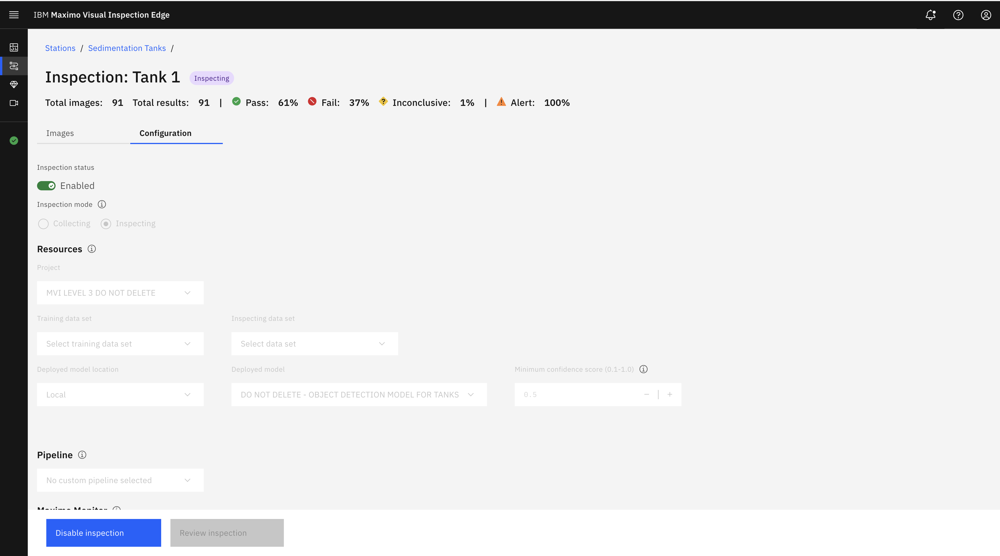

Con Edge, puede recopilar o inspeccionar imágenes seleccionando la opción adecuada en la sección **Modo de inspección** de la sección Estado de la inspección. En el modo **Recopilación**, las imágenes tomadas como parte de la inspección se recopilan simplemente para entrenar un modelo de IA en una fase posterior. En el modo **Inspeccionar**, estas imágenes son inspeccionadas por un modelo de IA previamente entrenado para realizar inferencias (detectar los elementos de la imagen utilizando visión por ordenador). Dado que desea inspeccionar las imágenes del tanque, asegúrese de que este modo está configurado en la opción **Inspeccionar**.

6.  Desplácese hasta la sección **Reglas**. En la fila **CLEAN\_TANK**, haz clic en el icono **del engranaje** bajo la columna **Configuración**. Aquí es donde puedes ver las reglas de inspección que el modelo de IA utilizará para categorizar la salud del tanque como Pasa o Falla.

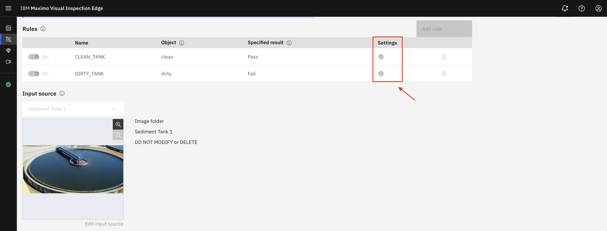

7.  Aparece la ventana **Configuración** de reglas. Aquí es donde se puede configurar el nombre de la inspección y las reglas para una inspección correcta o incorrecta. En esta pantalla, **mantenga los valores preseleccionados y no modifique nada**.

En pocas palabras, la puntuación de confianza es una medida de la confianza que tiene un modelo de IA en su predicción y se describe en un rango de 0-100%.

8.  En la pantalla de la ventana de **configuración de reglas**, desplácese hacia abajo para ver la sección **Tipo de** alerta. En esta sección, puede configurar los resultados de la inspección para que se envíen como notificaciones de alerta a través de dos aplicaciones externas, **MQTT (Message Queuing Telemetry Transport) o Twilio**. Una vez más, **Mantenga la configuración en sus valores preseleccionados y no cambie nada aquí**. 🟢

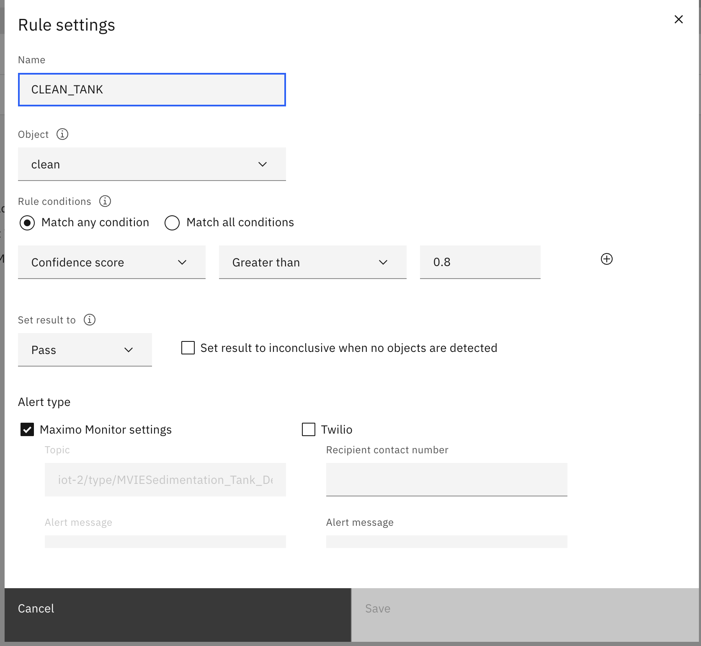

En las opciones de **tipo de alerta**, puede habilitar Maximo Visual Inspection Edge para enviar mensajes de alerta salientes a destinatarios externos configurando conexiones a un broker MQTT y al servicio de mensajería Twilio.

Mediante el protocolo MQTT, el servidor Edge se integra con otras aplicaciones de la suite MAS para mostrar alertas de inspección y permitir la creación de solicitudes de órdenes de trabajo, como ha visto anteriormente en esta demostración con MAS Monitor (primera parte de esta demostración). Además de MQTT, utilizando Twilio, los resultados de las inspecciones pueden enviarse inmediatamente como SMS a la persona interesada simplemente proporcionando su número de contacto.

9.  Haga clic en **Cancelar** para salir de la ventana de **configuración de reglas**.

Una vez completados los ajustes de las reglas, ya está realizando el procesamiento por lotes en múltiples imágenes de tanques en estado limpio y sucio. Después de ejecutar las inspecciones, el modelo de IA realizará inferencias en cada imagen y posteriormente activará los resultados de la inspección como Pasa o Falla, dependiendo de la condición del tanque. Las inspecciones pueden iniciarse configurando activadores de temas MQTT, que realizarán las inspecciones al recibir activadores remotos, o configurando intervalos basados en el tiempo. La configuración de los intervalos de inspección puede establecerse en función de los requisitos de la empresa; por ejemplo, las inspecciones de tanques podrían configurarse para que se realicen cada 24 horas (en segundos), etc.

**Nota:** Para evitar errores inesperados en el entorno de demostración, en esta demostración no se activará una nueva inspección. En lugar de ello, en los pasos siguientes mostrará los resultados de inspección precargados a los clientes.

10. Desplácese hacia arriba y haga clic en la pestaña **Imágenes**, donde podrá ver el resultado de la inspección precargado.

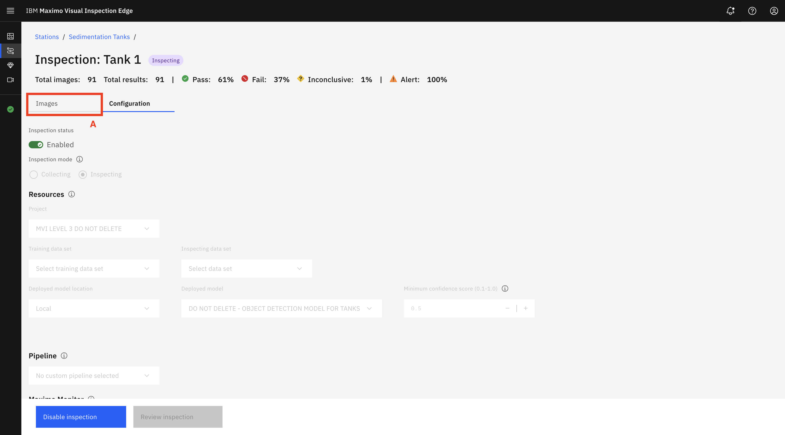

11. En la pestaña Imágenes se muestran los resultados de la inspección de las imágenes de la fuente de entrada. Si no hay imágenes en esta pantalla, haga clic varias veces en el icono **Actualizar** para que se carguen las imágenes.

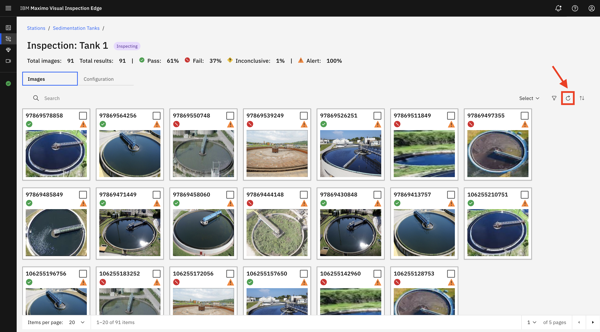

Todos los resultados de la inferencia se muestran en una sola pantalla junto con metadatos importantes. Si se estaba recibiendo una transmisión en directo, verá la inspección más reciente en la imagen superior izquierda. Para mayor comodidad, los iconos de las imágenes sirven para ver rápidamente los resultados de la inspección. Hay una marca de verificación verde para un tanque limpio y una **X** roja para un tanque sucio. También puede haber un signo de interrogación amarillo si el modelo no está seguro del resultado. Un alto índice de resultados no concluyentes podría indicar que el rendimiento del modelo es deficiente, que la configuración de las reglas es incorrecta o que la calidad de las imágenes de la cámara está comprometida.

Los signos de exclamación en el triángulo indican que el resultado de la inspección se ha enviado como notificaciones de alerta a Maximo Monitor a través de **MQTT o SMS a través de Twilio**, dependiendo de la(s) opción(es) que haya seleccionado en la fase de configuración de Reglas. Al hacer clic en cada una de estas imágenes se pueden mostrar más detalles sobre la inspección, como aquí se puede ver que la inspección del tanque más reciente falló debido al mal estado del tanque, y se envió inmediatamente una alerta sobre el resultado de la inspección. La rápida detección del mal estado del depósito ayuda a la Dirección General de Recursos Hídricos a evitar los problemas que suelen surgir cuando un problema no se detecta o se detecta demasiado tarde. 🟢

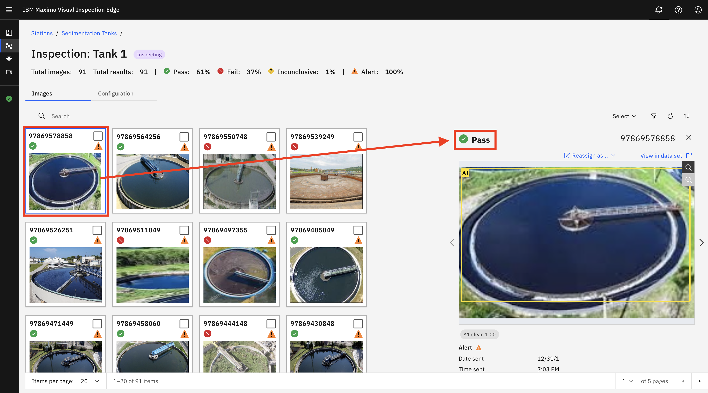

**Importante:** En este punto de la secuencia de comandos de demostración, usted está lo suficientemente lejos para pasar Maximo Visual Inspection Technical Sales Level 3 Badge.

 

## Inspecciones móviles MVI y alertas SMS opcionales

Esta parte de la demostración es opcional. Tenga en cuenta que, además del servidor de formación MVI, también necesitaría acceso a un dispositivo móvil iOS (iPad o iPhone) para realizar la demostración de esta parte, ya que la aplicación MVI Mobile sólo está disponible en dispositivos móviles iOS (en el momento de redactar este documento).

*Figura 2: Se requiere acceso al servidor de formación MVI y iOS dispositivo móvil*

Veamos ahora cómo puede utilizarse un modelo entrenado en el servidor Maximo Visual Inspection para realizar inspecciones utilizando la aplicación IBM Maximo Visual Inspection Mobile (MVI Mobile). Maximo Visual Inspection (MVI) Mobile es una aplicación móvil nativa iOS/iPadOS que se ejecuta en dispositivos Apple como el iPhone y el iPad. Esto proporciona una baja barrera de entrada en términos de costes de hardware y tiempo de valor. La sofisticada óptica de los dispositivos Apple se combina con la capacidad de ejecutar modelos generados a partir de la aplicación principal MVI, con soporte nativo 5G que permite a los clientes ejecutar inspecciones a escala.

Al igual que el resto de las aplicaciones de la solución MVI, MVI Mobile ofrece agilidad con la facilidad de apuntar y hacer clic, pero a través de la huella de una aplicación móvil, al tiempo que proporciona un potente punto de inspección en tiempo real impulsado por IA y una plataforma de gestión de datos. En cuestión de horas, los clientes pueden entrenar modelos complejos de visión por ordenador en la plataforma central MVI y desplegar el modelo entrenado en el dispositivo MVI Mobile para realizar inferencias.

La aplicación móvil puede configurarse en modo portátil o en modo fijo. Por ejemplo, considere una cámara fija que puede tomar fotos de soldaduras en una línea de fabricación y realizar una inspección automatizada in situ. Poder determinar en ese momento que una soldadura concreta está mal tiene muchas ventajas. No sólo se evita que esta pieza llegue a manos de un cliente (ya sea como pieza en sí o como componente de un artículo más grande) -lo que podría tener consecuencias desastrosas, dependiendo del artículo-, sino que podría ser síntoma de un problema con el equipo de soldadura, e identificar y solucionar el problema a tiempo significa menos producto desperdiciado. Del mismo modo, con el modo manual, un inspector de calidad puede llevar fácilmente el dispositivo móvil a un lugar de inspección y aprovechar la potencia de un potente modelo de IA para detectar cualquier anomalía con sólo hacer clic en una imagen de la pieza inspeccionada. El resultado es una mejora espectacular de la inspección de la calidad de la producción.

La siguiente parte de esta demo demostrará las capacidades básicas de MVI Mobile utilizando el modelo de visión por ordenador de sedimentación de agua pre-entrenado.

### Paso 1: Integración de MVI Mobile con el servidor MVI Training

**Acciones:**

1.  Inicie sesión en el servidor de formación MVI (el software en el que creó el modelo de IA).
2.  En la pantalla Bienvenido a **IBM Maximo Visual Inspection**, haga clic en el **icono de hamburguesa (** A) para abrir el panel lateral izquierdo. En el panel lateral izquierdo, haga clic en la opción de menú **Servicios (** B) para abrir el menú desplegable. En el menú desplegable Servicios, haga clic en **Clave API (C)**.

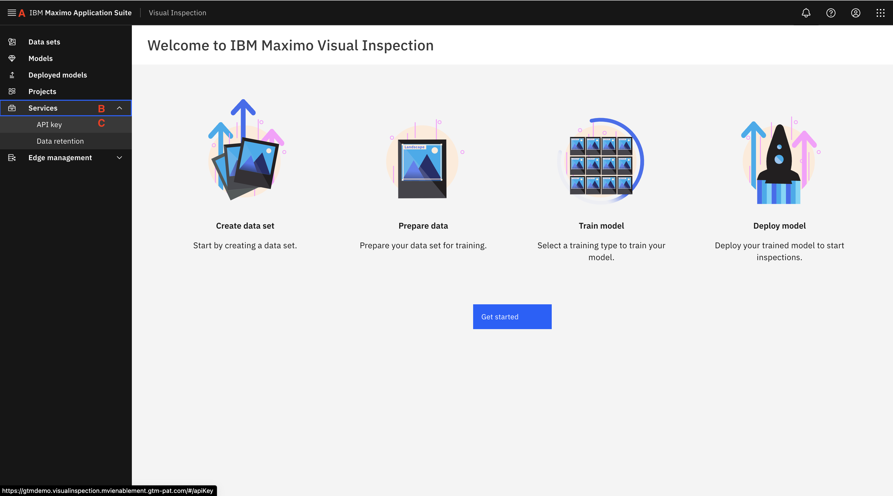

3.  Las pantallas API Key aparecen con una clave API (Application Programming Interface Key) y un código QR. En el siguiente paso dirigirá su dispositivo móvil iOS a este código QR para escanearlo e integrar automáticamente la aplicación.

4.  Utilizando su dispositivo móvil iOS, haga clic en la opción "**Escanear código**QR" en la pantalla de ajustes globales de la aplicación MVI Mobile. Aparecerá la pantalla de la cámara lista para escanear el código QR. Enfrente la cámara de su iPhone o iPad al código QR para integrar automáticamente la aplicación MVI Mobile y el servidor de formación MVI.

> Nota: También tiene la opción de escribir manualmente la clave API que se genera en el servidor de formación MVI.

5.  Una vez escaneado correctamente el código QR, haga clic en **Guardar** en la esquina superior derecha de la pantalla (la figura no se muestra para este paso).
6.  Es posible que aparezca la pantalla Información de licencia. Haga clic en **Aceptar y finalizar**.

Una vez completada la integración, aparece la página principal de Inspecciones. Aquí es donde se crean y gestionan las inspecciones con la ayuda de los proyectos de IVM.

 

 

### Paso 2: Creación de inspecciones en MVI Mobile

1.  Para crear una nueva inspección, haga clic en el **signo más azul** de la esquina superior derecha del panel izquierdo.

2.  Se abre una nueva pantalla. Introduzca un nombre para la inspección en el campo **Nombre de la inspección** (por ejemplo, "Detectar tanques de sedimentación limpios y sucios") **(A)**.
3.  Seleccione su proyecto haciendo clic en **Project Select >** y aparecerá la ventana Project. Seleccione **MVI NIVEL 3 NO ELIMINAR (B)** de la lista de proyectos que aparecen.

4.  Una vez que haya seleccionado su proyecto, se le presentarán ajustes de configuración adicionales para la inspección que se está creando. Haga clic en **Modelo**. El valor por defecto es no tener modelo (Sólo modo de recolección), pero usted quiere inspeccionar imágenes de tanques, no sólo recolectar. Por lo tanto, seleccione el modelo AI pre-construido **DO NOT DELETE - OBJECT DETECTION MODEL FOR TANKS** de la lista presentada.

5.  Ahora puede establecer reglas de inspección y umbrales que determinarán cuándo una inspección debe categorizarse como *Pasa* o *Falla*. Para ello, haga clic en **Establecer umbrales**.

En la pantalla **Establecer umbrales**, puede especificar si una inspección se considera *correcta* o *incorrecta*.

A cada etiqueta se le asigna un valor umbral y una condición de Suspenso por debajo del **umbral**. La inspección se marcará como *Suspenso* si la confianza devuelta para una etiqueta está por encima de su umbral especificado o por debajo del umbral si la opción Suspenso cuando está por debajo del umbral está activada. También existe la opción **Sin acción**, que permite a los usuarios ignorar el resultado cuando se detecta el objeto.

Para su modelo, tiene etiquetas de limpio y sucio (tanque). Para simplificar, vamos a centrarnos en los tanques sucios, por lo que sólo considerará que una inspección es un fallo si encuentra que el tanque está sucio. Si quiere ser muy cuidadoso, fijará el umbral para el nivel de confianza del tanque sucio por encima del 50%. Por otro lado, no se requieren más acciones para los tanques de sedimentación limpios. Por lo tanto, va a desactivar efectivamente la regla de tanque limpio como se muestra en los siguientes pasos.

6.  Pulse **Avanzado** bajo la etiqueta **Limpiar**.

7.  En la pantalla Avanzado para un depósito limpio, active **Sin acción** deslizando el interruptor hacia la derecha

(**A)** y, a continuación, haga clic en **Establecer umbrales** para volver **(B)**.

 

8.  Ahora haga clic en Avanzado bajo la etiqueta **Sucio** y establezca el valor del umbral en 50% (A) **.** Haga clic en **Establecer umbrales** para volver **(B)**

9.  Los valores de umbral que haya establecido aparecerán como se muestra en la siguiente captura de pantalla. Una vez verificados, haga clic en

**\< Modelo** para volver a la pantalla de selección de modelo.

10. Aparece la pantalla de la ventana **Modelo**. Haga clic en **\< Atrás** para volver a la pantalla **Crear nueva inspección**.

11. Cada inspección en MVI mobile debe tener asignado un conjunto de datos para almacenar las imágenes de inspección. Para especificar el conjunto de datos, En la pantalla de la ventana Crear nueva inspección, haga clic en la opción gris claro **Seleccionar >** de la fila **Conjunto de datos**.

12. Aparece la ventana Conjunto de datos. Haga clic en el conjunto de datos Tanque **1 Inspección (A)** (o en cualquier otro número de tanque si Tanque 1 no está disponible).
13. Para establecer un valor para la **Cadena de activación**, introduzca este texto `Tank Inspection`**.** Haga clic en **Listo**.
14. En este punto, se ha configurado correctamente una inspección en MVI Mobile. Esto es lo que se mostrará cuando se hace.

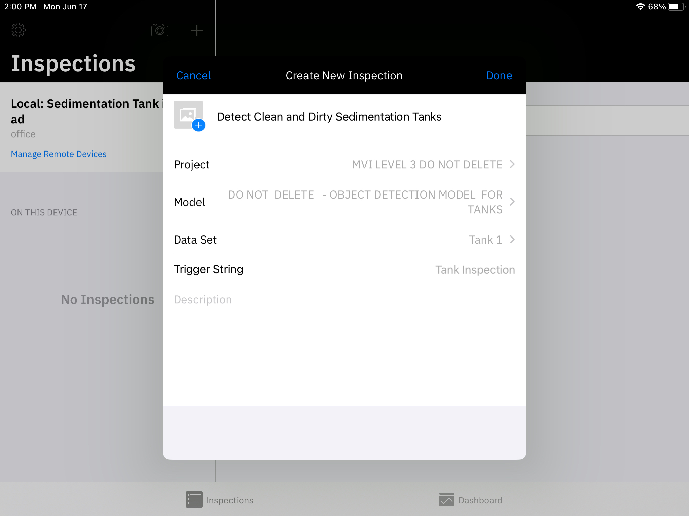

Si alguna vez desea eliminar una inspección que ha creado, simplemente haga clic en **Editar** en la parte superior derecha de la pantalla de inspección y se le presentará una opción para eliminar la inspección en la parte inferior izquierda de la pequeña ventana de la pantalla que aparece (por favor, no intente esto ahora para evitar la eliminación accidental de la inspección).

 

 

### Paso 3: (Opcional) Integración de MVI Mobile con la cuenta Twilio

Aunque todavía puede seguir adelante ahora y realizar inspecciones. Sin embargo, al igual que MVI Edge, MVI Mobile ofrece una fácil integración con la[ aplicación Twilio ](/maximo/mvi-prereq#step-4-signup-twilio-trial-account-for-text-message-sms-notifications)para que las alertas SMS sobre los resultados de la inspección se pueden enviar a la persona interesada. Esto sería muy beneficioso para nosotros ya que el supervisor de campo para la Planta de Recursos Hídricos es por lo general fuera de las rondas de inspección. Gracias a esta función, pueden recibir alertas por SMS inmediatamente si el estado del depósito se deteriora, sin necesidad de tener que supervisar constantemente los resultados de la inspección permaneciendo frente a la pantalla del ordenador.

**Acciones:**

1.  Haga clic en el **engranaje azul y el** icono **del teléfono** para abrir la página **Configurar dispositivo**.

2.  Se abre la página Configurar dispositivo, haga clic en **Configuración de Twilio** para introducir los detalles de la cuenta de prueba de Twilio anotados durante el Trabajo previo: Paso 4.

3.  En la página de **configuración de Twilio** introduzca todos los detalles requeridos en esta sección. Tenga en cuenta que el número de Supervisor es cualquier número de teléfono al que desee que se envíen las alertas de inspección durante la demostración (normalmente es su número de teléfono personal o corporativo). Una vez introducida toda la información, haga clic en **Guardar**. (Recuerde borrar esta información después de la demo como se describe en el Apéndice B: Pasos de limpieza de la demo).

Será más fácil simplemente copiar y pegar los detalles de la cuenta Twilio aquí en lugar de intentar escribir estos códigos.

 

 

### Paso 4: Realizar inspecciones en MVI Mobile

**Acciones:**

1.  Desde la página principal de Inspecciones, con su inspección seleccionada y mostrada en la parte derecha de la pantalla (como en la captura de pantalla siguiente), haga clic en el botón **Capturar**. Esto encenderá la cámara de su dispositivo móvil.

La pantalla de la cámara del dispositivo móvil está ahora activada. Si no se ha especificado un modelo dentro de una inspección, está en modo Recopilar: toma fotos y las carga en un conjunto de datos en IBM Maximo Visual Inspection para etiquetarlas y, a continuación, para entrenar un modelo.

Cuando se especifica un modelo dentro de una inspección (como se hizo en esta demostración) se encuentra en el modo Inspeccionar que también toma fotos pero luego utiliza el modelo entrenado para ejecutar la inferencia en las imágenes y cargar los resultados en el conjunto de datos especificado en IBM Maximo Visual Inspection.

2.  Para esta demostración, usted ejecutará la inferencia sobre una imagen *de* un tanque. Para ello, en su ordenador portátil, abra una de las imágenes de tanque descargadas en la sección Paso 2 del trabajo previo y manténgala en la pantalla para el siguiente paso.
3.  Tome una foto de la imagen de un tanque limpio o sucio mostrada en la pantalla de su ordenador o proyector (en este paso básicamente está tomando la imagen de una imagen).

La foto permanecerá en la pantalla de su dispositivo móvil, así que pulse el botón **atrás (\<)** para volver a la vista de la cámara. Estos son algunos ejemplos de lo que podría ver después de unas cuantas inspecciones.

Dependiendo de la precisión del modelo, ha identificado tanques limpios y sucios en la foto. Dado que se está tomando una imagen de una imagen, es posible que el modelo tenga dificultades para identificar con precisión los tanques o la salud de los tanques en la imagen. En un entorno real, esto podría resolverse tomando una imagen del objeto real (y no una imagen de una imagen) o con más datos y entrenamiento para una mayor precisión del modelo. Obsérvese que, además de los cuadros delimitadores superpuestos en la propia foto, la parte inferior de la pantalla muestra el nivel de confianza asociado a cada objeto inferido.

Ha realizado una inspección con éxito utilizando la potencia combinada de IBM Maximo Visual Inspection Mobile e IBM Maximo Visual Inspection.

4.  Puede hacer clic en **"Cancelar"** en cualquier momento para volver a la pantalla principal de **Inspecciones**.
5.  Si ha seguido los pasos para la integración de Twilio y ha introducido un número de supervisor, es posible que haya recibido alertas por SMS en el número que introdujo en la sección de configuración de Twilio.

 

 

### Paso 5: Explorar el panel de control de IVM Mobile

En la sección anterior ha definido las reglas que determinan si una inspección específica (foto) representa un fallo o no. Puede obtener una vista colectiva de las inspecciones que han pasado y fallado en el Dashboard de MVI Mobile (como el entorno de MVI Edge Server).

1.  En la pantalla **Inspecciones**, haga clic en **Cuadro de mandos**, la segunda opción en la parte inferior de la pantalla.

2.  Aquí debe seleccionar primero el proyecto que desea ver. Haga clic en el icono **de la elipse** (círculo azul con tres puntos) y, a continuación, en **Seleccionar proyecto**.

3.  En la pantalla de configuración del cuadro de mandos, deje la barra de desplazamiento **IMÁGENES A VISUALIZAR** como está.
4.  En la **sección SELECCIONE UN PROYECTO**, elija **MVI NIVEL 3 NO ELIMINAR**.
5.  Haga clic en **Conjunto de datos Seleccionar (A)>** y, a continuación, elija **Tanque 1 inspeccionando** (o el conjunto de datos que seleccionó anteriormente al crear la inspección MVI Mobile).

1.  Esto le llevará a la pantalla principal del salpicadero, y aquí verá las estadísticas asociadas a las fotos tomadas durante las inspecciones. Incluye todas las fotos tomadas durante la inspección. Estas estadísticas incluyen:

*   Número total de fotos de inspección
*   Número total de fotos recogidas
*   Porcentaje de suspensos en la inspección
*   Porcentaje de aprobados en la inspección

Puede ver el porcentaje de aprobados y suspensos de las inspecciones realizadas.

**¡Enhorabuena!** Acaba de utilizar IBM Maximo Visual Inspection Mobile para identificar tanques de sedimentación de agua sucia.

Con esto concluye la demostración. Ha observado cómo el modelo MVI AI envía alertas de inspección al Maximo Monitor. También realizó los pasos para construir un modelo de visión por computador y utilizó ese modelo para configurar las inspecciones en MVI Edge y en MVI Mobile. Por último, puede pensar en esta solución integral en la que un modelo de visión por ordenador AI envía alertas críticas más allá del caso de uso de los tanques de sedimentación y aplicarlo en cualquier área de misión crítica donde es esencial detectar visualmente objetos de interés repetidamente a un ritmo y escala rápidos. Un pequeño surtido de ejemplos incluye líneas de productos a gran velocidad, líneas de transmisión, control de calidad, etc.

## Limpieza de demostraciones

Una vez que la demostración se haya completado con éxito, se le pedirá que realice algunas tareas de limpieza para asegurar que el entorno de la aplicación de demostración no está sobrecargado, y que la información de su cuenta personal de Twilio se ha eliminado correctamente del entorno de demostración compartido.

 

### Paso 1: Elimine los conjuntos de datos originales y aumentados de IVM

1.  En la página principal de **Conjuntos de datos** de MVI, seleccione sus conjuntos de datos Original y Aumentado**(A**) y haga clic en el icono de **la papelera** para eliminar ambos conjuntos de datos**(B**).

2.  Se abre la ventana**Borrar** conjunto de datos. Haga clic en **Borrar** para confirmar la eliminación del conjunto de datos.

 

### Paso 2: Eliminar los datos de la cuenta Twilio de la aplicación MVI Mobile

Al igual que el entorno Edge puede que tenga que eliminar los detalles de la cuenta Twilio de su aplicación MVI Mobile (si ha seguido los pasos para la demostración de la Parte Cuatro opcional)

1.  Abra la aplicación MVI Mobile y haga clic en el **engranaje y el** icono **del teléfono** junto al título de su inspección (Sedimentation Tank iPad).

2.  Aparecerá la página Dispositivo de configuración. Haga clic en Configuración Twilio para ver los detalles de su cuenta.

3.  Desactiva el conmutador de Notificaciones Twilio y borra toda la información de tu cuenta en esta página. Una vez eliminada, haga clic en **Guardar.**

