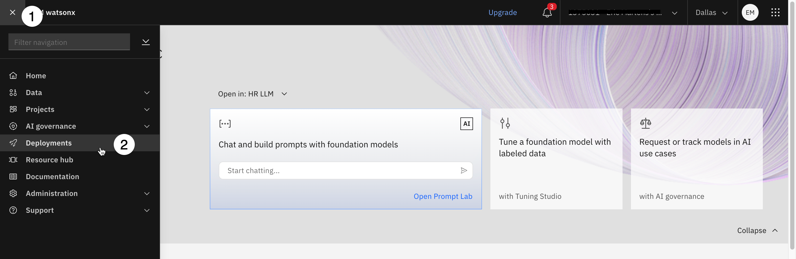
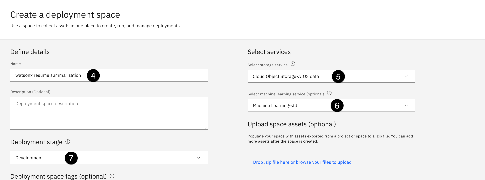
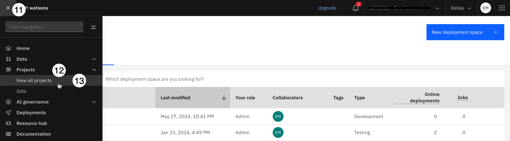
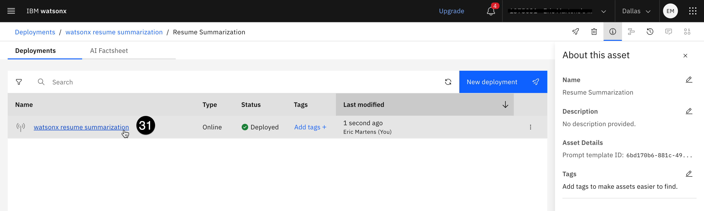
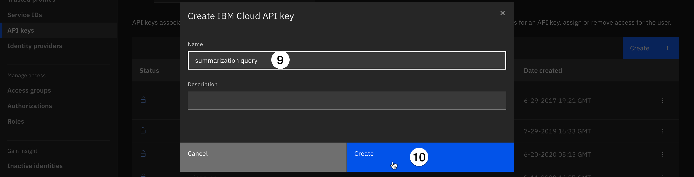
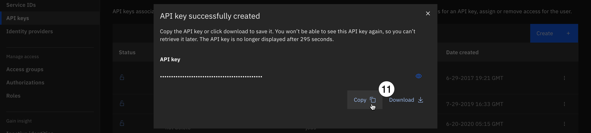

# 202: Deploy up a watsonx.ai model [optional]

In this lab, we will deploy a watsonx model.
This lab can be optional as it is only needed to complete the **Evaluate the watsonx model** step of the **[Lab 207: Govern generative models](/watsonx/watsonxgov/level-4/207)** lab.

## Prerequisites

This lab depends on the setup in [Lab 201](/watsonx/watsonxgov/level-4/201), which means having a running CP4D environment from TechZone.

## Configure a model inventory

The watsonx.governance solution allows organizations to group and track their models based on use cases, or issues that models are attempting to solve. Each use case stores and organizes data and lifecycle information for candidate models in development, testing, and production phases.

In a real world use case, an organization would identify a business need for an AI model, and create a use case to track that effort. Later in 2024, these use cases will be fully integrated into IBM OpenPages, a full risk management solution, and this lab will be updated to reflect those changes.

These use cases are collected as assets in a model inventory. Access to a model inventory is required to complete this lab. Follow the steps below to determine if you already have access to an inventory.

1. Sign in to IBM watsonx. If your software cluster has watsonx.ai installed, use the Cloud Pak for Data url and credentials. If you are using a TechZone watsonx.ai SaaS account, sign in using the link: [Americas](https://dataplatform.cloud.ibm.com/wx/home?context=wx) | [Europe](https://eu-de.dataplatform.cloud.ibm.com/wx/home?context=wx) | [Asia Pacific](https://jp-tok.dataplatform.cloud.ibm.com/wx/home?context=wx).

> **Note**: If you are using a TechZone SaaS account, ensure that you have switched to the correct account and region in the upper right portion of the screen.

   

2. Click on the hamburger menu in the upper left to expand it.

3. Locate the **AI governance** section of the menu, expanding it if necessary, and click on **AI use cases**.

    

4. Click on the **gear icon** to open the **Manage** menu for AI use cases.

    

5. Click on the **Inventories** item from the menu on the left to see the full list of inventories.

6. Examine the list of inventories in the middle of the screen. If you see the following screen, you do not have access to a model inventory:

    

7. Click on **New inventory**.

    

8. Give your inventory a name that includes some identifying information such as your initials and the purpose it will be used for. In this case, your inventory will deal with human resources models. You may also give your inventory a description.

9. Use the **Object storage instance** dropdown to select your object storage service.

10. Click **Create** to create your inventory. Inventory creation can take up to a minute to complete.
    
    

    Once the inventory has been created, you will have the opportunity to add collaborators. Click the **x** in the upper right to close the **Set collaborators** window, then click the **x** in the upper right to close the **Manage** window.

## Deploy a watsonx prompt template

To deploy a watsonx model, you must first create a deployment space. A [deployment space](https://dataplatform.cloud.ibm.com/docs/content/wsj/analyze-data/ml-spaces_local.html?context=cpdaas) is an object in Cloud Pak for Data and watsonx that contains deployable assets, deployments, deployment jobs, associated input and output data, and the associated environments.

> **Note**: If you are using a TechZone SaaS account, ensure that you have switched to the correct account and region in the upper right portion of the screen.

   

1. From the watsonx home screen, click on the **hamburger menu** in the upper left.

2. Click on the **Deployments** menu item. The **Deployments** screen opens.

   

3. Click on the **New deployment space** button. The **Create a deployment space** screen opens.

4. Enter `watsonx resume summarization` in the **Name** field.

5. Click on the **Select storage service** dropdown and select an available Cloud Object Storage instance.

6. Click on the **Select a machine learning service** dropdown and select an available Watson Machine Learning service.

7. Click on the **Deployment** stage dropdown and select **Development**.

> **Note**: If an object storage or machine learning service is unavailable, **DO NOT ATTEMPT TO PROVISION A NEW SERVICE**, especially if using a TechZone account. Instead, verify that you have switched to the correct account and region as specified above step 1 above. Verify that the account and region match your [TechZone reservation](https://techzone.ibm.com/my/reservations). If you are still unable to access the services, attempt to create your deployment space in your browser's private/incognito mode. If all of these steps fail, contact [TechZone help](https://techzone.ibm.com/help).

   

8. Click the **Create** button. Your deployment space will take up to one minute to create.

9. When the space has been successfully created, close the **The space is ready** dialog window.

   

Next, you will create a watsonx project containing a simple prompt template, which can be deployed to your space.

10. Download the [resume summarization project](https://raw.githubusercontent.com/ibm-build-lab/VAD-VAR-Workshop/main/content/Watsonx/WatsonxGov/files/resume_summarization_project.zip) project zip file to your machine.

11.   Click the **hamburger menu** in the upper left.

12.   Click on the **Projects** menu item to expand it.

13.   Click on the **View all projects** menu item. The **Projects** screen opens.
    
   

14.   Click the **New project** button. The **Create a project** screen opens.

15.   Click the **Local file** option from the list in the left panel.

16.   Drag and drop the project file you downloaded to the center portion of the screen, or click the **Browse** button to locate the file on your machine.

17.   Enter `watsonx resume summarization` in the **Name** field.

18.   Click the **Target Cloud Object Storage Instance** dropdown and select an object storage instance from the list.

19. Click **Create** to create your project. Project creation can take up to two minutes to complete.

    

20. When the project has been successfully created, click the **View new project** button in the dialog. The project information screen opens.

21. Click the **Assets** tab.

22. Click the **three vertical dots** to the right of the **Resume Summarization** prompt template in the list to open the context menu.

23. Click on the **Promote to space** menu item. The **Promote to space** window opens.

    

24. Click on the **Target space** dropdown and select the **watsonx resume summarization** space you created in previous steps.

25. Check the box next to **Go to the space after promoting the assets**.

    

26. Click the **Promote** button. The template will be promoted to the space, and the space screen opens.

27. Click the **New deployment** button. The **Create a deployment** window opens.

28. Enter `watsonx resume summarization` in the **Name** field.

29. Click the **Create** button to create the deployment. When the deployment has been successfully created, it will be available as a REST endpoint that can be called via the command line or Jupyter notebook. You can now proceed to gather the necessary credentials to perform those calls.

## Gather watsonx credentials

In this step, you will copy the public endpoint for the deployed model and generate an API key that will allow you to authenticate and call the model from a Jupyter notebook to perform evaluations.

> **Note**: **THESE CREDENTIALS ARE FOR THE IBM CLOUD SAAS ENVIRONMENT**, and are distinct from those you created earlier in the lab. They will be used to call the deployed watsonx model. When copying and pasting them into a text file, be sure to denote which credentials are for your Cloud Pak for Data software environment, and which are for the watsonx SaaS environment.

1. Click on the link for the new deployment from the list of deployments. The deployment details screen opens to the **API reference** tab.

    

    Four endpoints are available; two private, and two public.

2. Click the **copy icon** to the right of the top **Public endpoint** to copy the URL to your clipboard. Paste the URL into a text file; you will use it in the hands-on lab as the **WATSONX_BASE_URL**.

    

    Next, you will need to create an IBM Cloud SaaS API key.

3. Sign into [IBM Cloud](https://cloud.ibm.com/).
4. Ensure that you have switched to the correct IBM Cloud account that matches your [TechZone reservation](https://techzone.ibm.com/my/reservations).
5. Click on the **Manage** button. The **Manage** menu opens.
6. Click on the **Access (IAM)** menu item.
    
7. Click the **API keys** item from the **Manage identities** section in the panel on the right.
    
8. Click the **Create** button. The **Create IBM Cloud API key** dialog opens.
9. Enter `summarization query` in the **Name** field.
10. Click the **Create** button to create your key.
    
11. Click the **Copy** button to copy your key to the clipboard, then paste it into a text file. This key will be referenced in a Jupyter notebook in the hands-on lab as the **WATSONX_API_KEY** value.
    

Congratulations! you may now proceed to **[Lab 203](/watsonx/watsonxgov/level-4/203)**.
