_IBM OpenPages_ is IBM's AI-driven, highly scalable governance, risk and compliance (GRC) solution that runs on any cloud with IBM Cloud Pak for Data as its underpinning. The full feature-set and capabilities of OpenPages are beyond the scope of this lab, but this lab will focus on the features related to governing models such as customizable workflows & alerts, integration with Factsheets, and the ability to get an enterprise-wide view of the status of AI and machine learning initiatives within an organization. In the context of _watsonx.governance_, the OpenPages solution is referred to as the governance console. However, in many locations in the user interface and throughout this lab, you will see it simply being referred to as OpenPages.

The watsonx governance console can be fully customized to fit an individual organization based on requirements and other factors that an organization might deem important for governing their products. 

The first few sections of this lab will help showcase how you can customize business entities, create users, and modify views and workflows to see how the OpenPages solution can be customized to meet an organization's requirements. These customizations would be typically performed by an administrator persona, responsible for configuring the _watsonx.governance_ solution for the organization.

<QuizAlert text='Heads Up! Quiz material will be flagged like this!' />

# 204: Customize the Governance Console

## Prerequisites

This labs depends on the setup from the previous labs [Lab 201](/watsonx/watsonxgov/level-4/201), [Lab 202](/watsonx/watsonxgov/level-4/202), and [Lab 203](/watsonx/watsonxgov/level-4/203). This also means having a running CP4D environment from TechZone with some of the pre-configuration steps from all of those previous labs completed. If you have not already done so, then please take the time to complete those steps otherwise you may run into unexpected errors while completing this lab.

## Add the created user to the Governance Console

In previous configuration steps (pre-requisites) for this lab, you created a user in Cloud Pak for Data (CP4D) that represented a compliance officer for the organization. In this step, you will give that user access to the governance console.

_Important Note: In this environment, new users must be created in Cloud Pak for Data and then given access to the governance console using the method described below. You cannot create new users in OpenPages, as they will not be able to log in and use the service._

1. Start by logging into the Cloud Pak for Data home page. This is the same login you got from CP4D pipeline logs in [Lab 201](/watsonx/watsonxgov/level-4/201).

2. Click on the **hamburger menu** in the upper left.

3. Click on the **Services** menu item from the menu to expand it.

4. From the expanded menu, click on **Instances** to open the **Instances** screen.

 

5. Locate the instance of OpenPages in the table and click on the three vertical dots in the far right column.

6. Click on **Manage access** to open the access management page for the OpenPages service opens.

 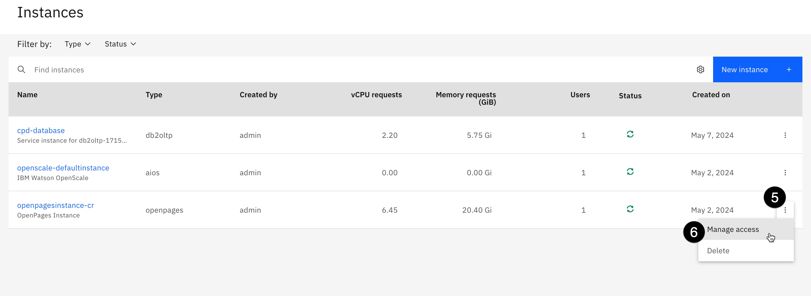

7. Click on the **Add users** button. A new modal window for _Grant access to users and user groups_ will open.

8. Select the Check the box to the left of the created user within the table .

9. From the same table click on the **Choose a role** dropdown to the right of the created user and select **OpenPagesUser**.

 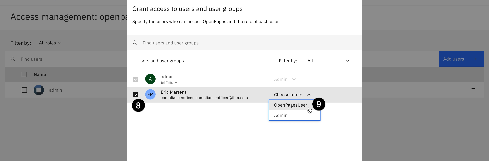

10. Click **Add** to add the user access to the OpenPages service.

<Warning text='While the user will be added to the authorized list of users in the governance console service automatically, this request is run a job within CP4D; it can take up to 20 minutes for the job to run, so the created user may not be immediately available in the OpenPages console after initial access is granted' />

## Launching the Governance Console

For this section, you will learn how to launch the OpenPages service.

1. Return to the Cloud Pak for Data home page by clicking the **IBM Cloud Pak for Data** link in the upper left.

2. Click on the **hamburger menu** in the upper left.

3. Click on the **Services** menu item from the menu to expand it.

4. From the expanded menu, click on **Instances** to open the **Instances** screen.

 

5. Locate the instance of **OpenPages** in the table and click on the link in the **Name** column to open the instance details screen.

 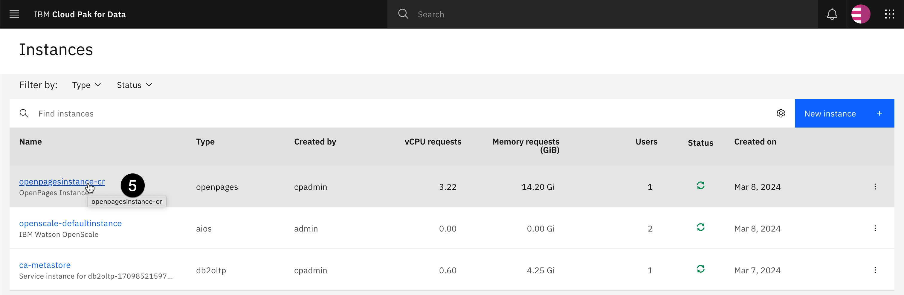

6. Scroll down to the **Access** information section, and click the **launch icon** to launch the service.

 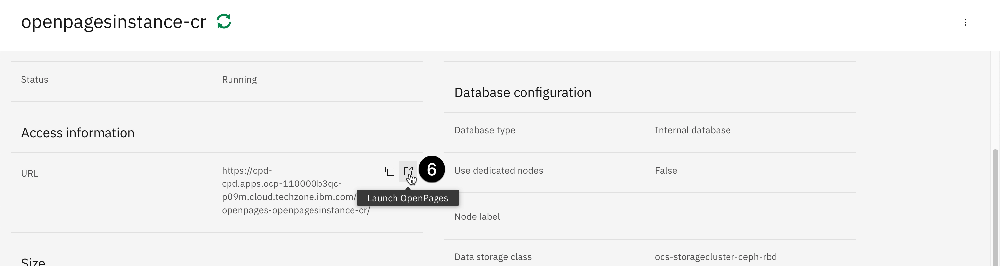

Now you have learned how to launch the OpenPages service, this URL that opens can be used to go back to the OpenPages service at anytime so long as you are logged into your CP4D account and your session is still active. 

## Update the User Profile

In the previous steps for this L4 lab you created a Cloud Pak for Data (CP4D) user, and provided them access to the governance console. In this step, you will give the created user access to the roles and permissions they need to perform required tasks within the Governance Console.

> NOTE: In this example, you provide the previously created user with multiple profiles that will allow them to perform all actions, in order to streamline the instructions and avoid repetitive login/logout actions to switch between user profiles. However, in a previous config lab you imported a set of sample users all of whom have been created with separate profiles, if you would prefer to actually switch users to perform different actions you can make attempt to do so with those sample users.

1. From the Governance Console, click the **gear** icon in the upper right to open the Administration view.

2. Click on the **Users and Security** menu option to expand it.

3. Click on **Users** menu item.

 

4. Locate the created user in the table, which is sorted alphabetically via first name. Select the created user from the table to open this users config page.

> NOTE: If the user you previously created does not appear in the table, then the list of governance console users has likely not updated yet from the previous step. As a reminder, it can take up to 20 minutes for the created user to appear as the job to add the user runs on a schedule.

 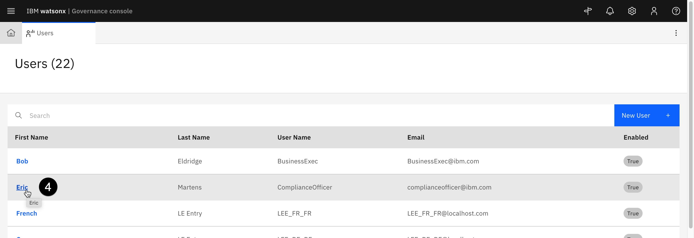

5. Click on the **Locale and Profiles** menu item from the menu on the left to scroll down to the **Locale and profiles** section.

6. Click the **pencil icon** next to **Allowed user profiles**.

 

7. Enter `watsonx` in the **Allowed user profiles** text box to narrow down the list of profiles we want to add to our user

8. Select the check boxes next to all four **watsonx.governance** profiles in the dropdown menu. 

 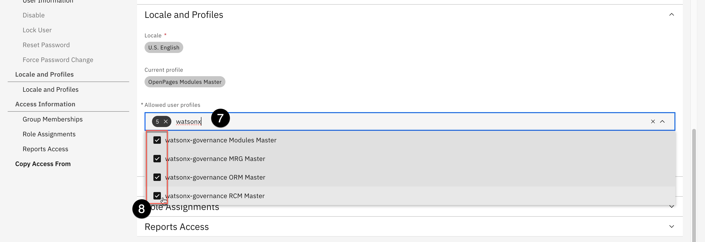

9. Scroll down to the **Role Assignments** section and click on the chevron/arrow to expand its options.

10. On the right hand-side click on **Assign Roles** button, the **Role Assignments** pane should now open.

 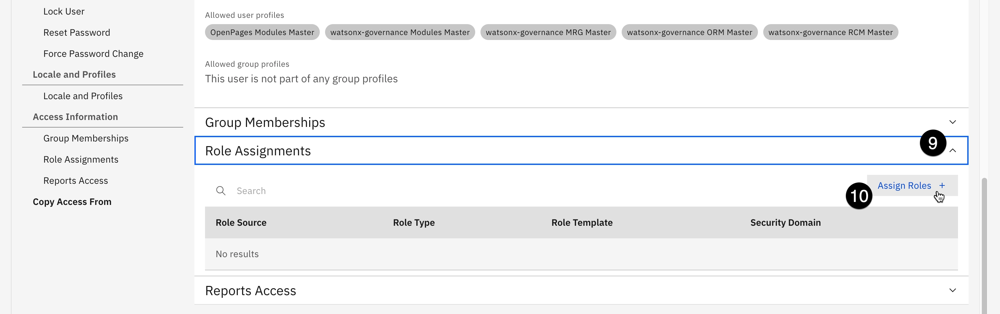

11. In the **Role Template** field, enter the text `mrg` to narrow down the search fields. 

> NOTE: In this context, `mrg` stands for _Model Risk Governance_, as you will be assigning related roles to your created user.

12. Select the checkbox next to **MRG - All Permissions**.

 

13. Within the same panel click on the **Choose** link to the right of **Security Domain**. _A new panel should open up with the organizational hierarchy._

> NOTE: You can expand the hierarchy to view all the different business units in the organization, which were created when you uploaded the FastMap configuration file during your environment set up. From this you can see, the governance console allows for fine-grained control over which users are allowed to access which data. For example, you could assign your user access to only models and metrics information for specific parts of the business

 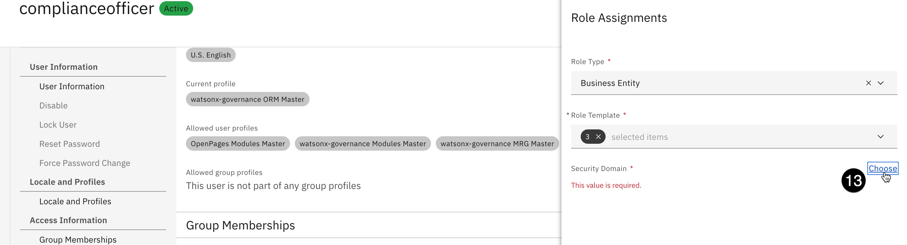

14. Select the `/` top-level checkbox above the **High Oaks Bank** box to provide access to all of the relevant model risk governance data for the organization. 

> NOTE: you must select the box one level ABOVE **High Oaks Bank** as shown in the screenshot, otherwise the user will not have access to all of the relevant model risk governance

15. Click **Done** to close the **Security Domain** panel.

 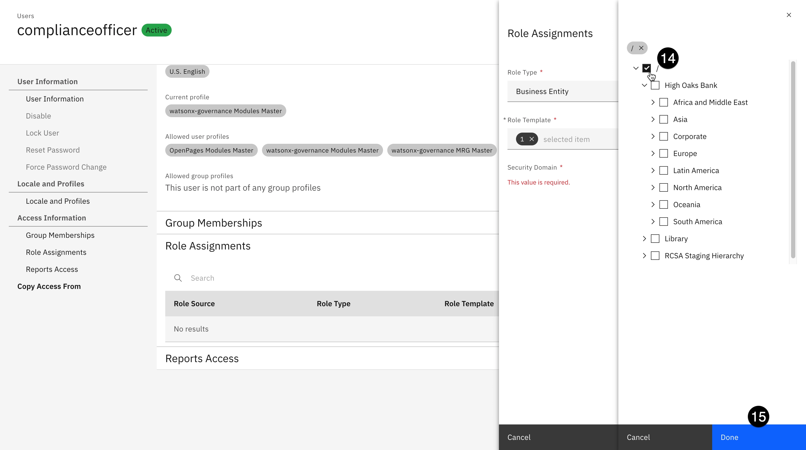

16. Click the **Add** button to add the role assignments to the user.

17. Click the **Save** button in the upper right to save the user profile changes.

## Create a Business Entity

Next, we will create a business entity, which is an abstract representation of a business structure. In the previous step, when assigning the security domain for the created user's roles, you saw some of the organizational structure created in the setup for this lab, this hierarchy was created when we loaded a FastMap file into the governance console. That file contained the structure for the _High Oaks bank _organization, including a Human Resources department.

> INFO: In the steps below, you will create a Regulatory Compliance entity beneath the Human Resources organization. However, when conducting a Proof of Experience (PoX) or demo, allowing the client/end user to create their own entities to mimic the structure of their organization can be a good way to engage with the client and allow them a sense of ownership over the solution you are building. Feel free to customize the steps to match client requirements or your own curiosities.

1. From the main watsonx Governance Console home screen, click on the **hamburger menu** in the upper left.

2. Click the **Organization** menu item to expand it.

3. Click on **Business Entities** and wait for the **Business Entities** tab to open.

 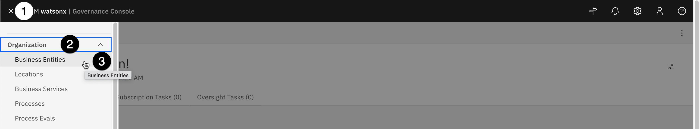

4. Type **High Oaks** in the **Search** field the appears and press the _Return/Enter_ key to narrow down the list of business entities within the organization.

5. Click on the link for **High Oaks Bank** in the table to open the entity.

 

6. Scroll down to the **Business Entity Map** section of the page, which shows a tree view of the different entities beneath the _High Oaks_ bank entity. 

> NOTE: the High Oaks Bank parent entity contains a variety of children, including other business entities, employees, models, and use cases. This view is a convenient way to quickly see all the different items associated with a part of an organization.

7. Click on the **Business Entities** item in the tree view to expand it. The **Children of High Oaks Bank** view opens in a new pane on the right of the screen.

 

8. Each of the child entities is represented by a tile in the view. Scroll down to the **Corporate** entity tile and click on it. A new tab opens to display the information for the **Corporate** business entity.

 

9. Scroll down to the **Child Business Entity** table in the **General** section of the screen and click on **Human Resources** to open a new tab for that entity.

> NOTE: the _Human Resources_ entity does not have any child business entities. If you scroll down to the _Business Entity Map_, you will see that it does contain models and use cases that are unique to this business entity.

 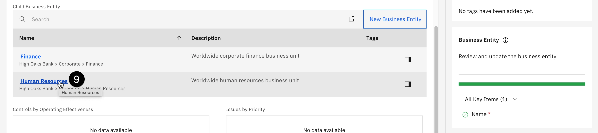

10. Scroll back to the **Child Business Entity** table and click the **New Business Entity** button.

 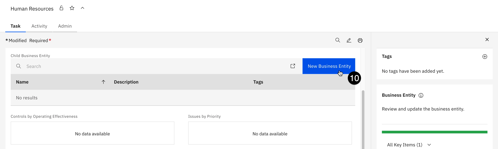

11. Enter **Regulatory Compliance** in the **Name** field.

12. Enter **complianceofficer** in the **Executive Owner** field.

> NOTE: the _Primary Business Entity_ has been pre-populated with the _Human Resources_ entity, but you can change this if you wish. Additionally, the _Create new Business Entity_ progress bar on the right shows that the one required field has been completed, turning the 
status bar green and enabling the _Save_ button.

13. Click **Save** to save the business entity.

 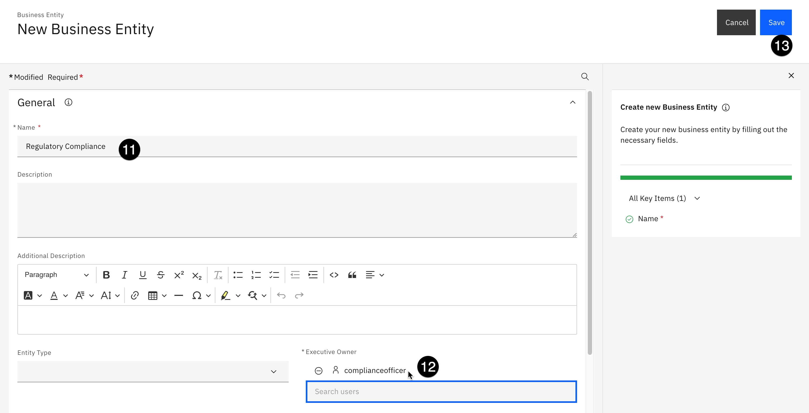

The new **Regulatory Compliance** business entity has now been created in the governance console, and will appear as a child of the **Human Resources** entity when viewing the _Business Entity Map_.

## Create a custom field for the use case view

watsonx.governance uses the concept of model use cases to organize machine learning and AI solutions to business problems. A model use case represents a single problem an organization is attempting to address with AI or machine learning. Many different models can be associated with a use case, whether they are in development, testing, or production phases.

There are no defined global standards for information that must be included in a use case; while there is a minimum set of information such as model metadata and performance metrics that should be present, specifics will vary widely between different industries and different organizations. The watsonx governance console is fully customizable to allow clients to tailor the forms and processes to their exact needs.

In this section of the lab, you will add a new field to the use case view. This particular example adds the **Secondary EU AI Review** field, though again you should engage with the client to allow them to choose fields or information that is relevant to them. Again, allowing the client to customize the solution can give them a sense of ownership and demonstrate value.

### Enable system admin mode

> INFO: In order to add a field to the internal database, we must first enable changes to the system.

1. From the main watsonx Governance Console home screen, click on the **hamburger menu** in the upper right.

2. Click `Enable System Admin Mode` menu item to enable changes.

 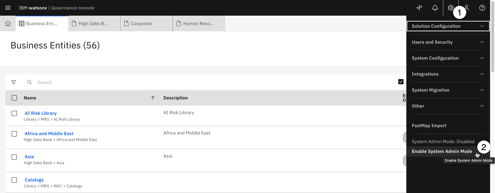

3. A new popup window will open, prompting you to confirm your choice, and notifying you that while the mode is enabled, the system will be unavailable to other users only the _admin_. Click the **Enable** button to confirm.

4. Click on the **gear icon** again to open the **Administration** menu.

5. Click on the **Solution Configuration** menu item to expand it.

6. Click on the **Object Types** menu item and wait for the **Object Types** tab to open.

 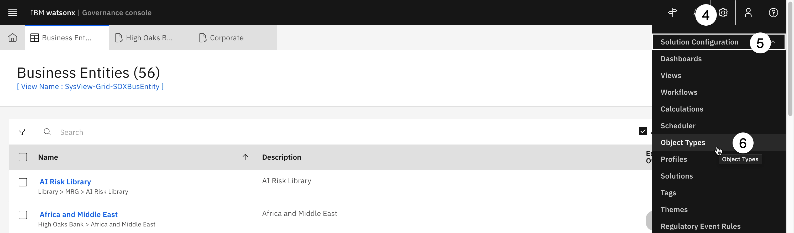

7. Enter `use case` in the search field that opens in order to narrow the list of _Object Types_.

8. Locate and click on **Use Case** from the table to open the **Use Case** object.

 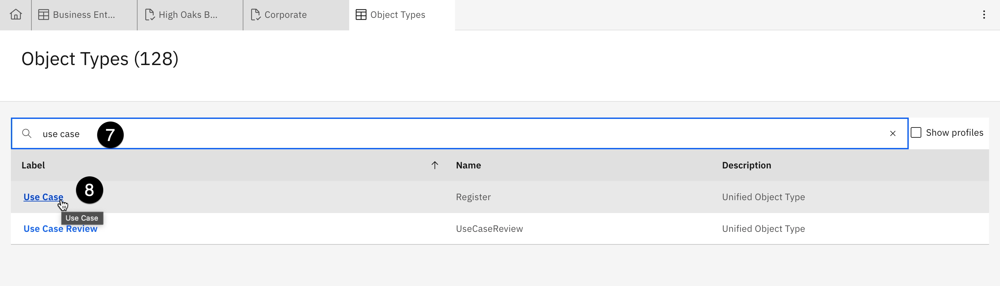

9. Click on the **Fields** section to expand it. You should see all the fields currently associated with model use cases listed in their existing groups.

10. Click on **New Field** button to open the **New Field** panel.

 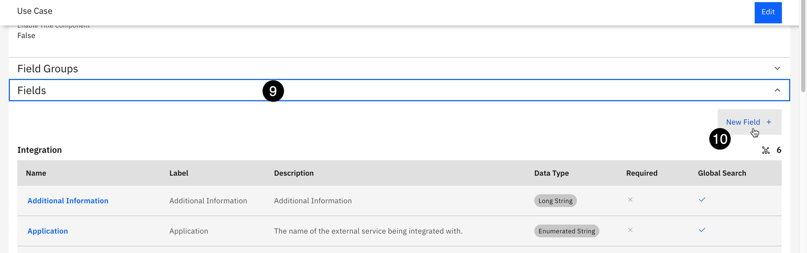

11. You will place the field in a new grouping. Click the **New** button above the **Field Group** dropdown. The **New Field Group** panel should now open, allowing us to change the grouping.

 

12. Enter **EU Compliance** in the **Name** field and click the **Create** button to create the grouping. The **New Field** panel updates, showing that the field is now contained in the **EU Compliance** group. 

> NOTE there is already a _Compliance_ field group in the use case, and, strictly speaking, the field you are creating could go there. In this lab you are creating a new group to see how it could be done for other fields that an end-user/client/compliance officer may want to create.

13. Enter **Secondary EU AI** Review in the **Name** field.

14. Click the **Data Type** dropdown and select **Enumerated String**. This data type will appear as a dropdown in the form. Note the other data types that are available, including _strings_, _integers_, _booleans_ (true/false), _dates_, _currencies_, and more.

 

> INFO: you have the option to set the field to _Required_ using the toggle. You can also set default values and descriptions.

15. Scroll to the **Enumerated String** Values section and click the **New Value** button. The **New Enum Value** panel should now open.

 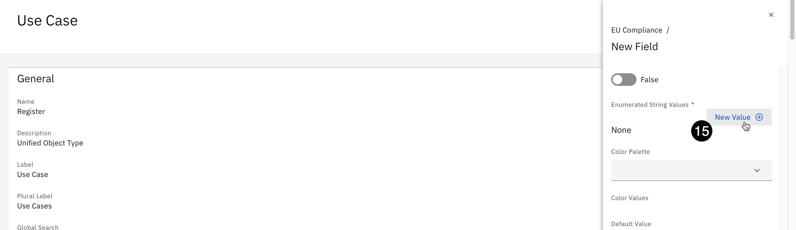

16. Enter **Approved** into both the **Name** and **Label** fields and then click **Create**.

17. Repeat _steps 15 and 16_ to add **Denied** and **N/A** values.

> INFO: you can set colors for the different values, which will show on the icon badges when the form is completed.

18. Assign colors to the values using the dropdowns.

19. Click **Create** to add the new field to the object.

 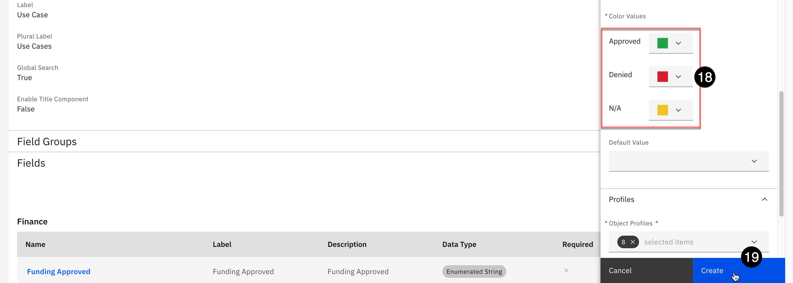

<Warning text='Occasionally, saving the field can take longer than expected and results in a Network error or the error message similar to the one below. If you get this message, try and save the field again. If you receive an error that the field _already exists_, then most likely the changes were saved successfully. Close the New Field panel and refresh the page, and you should see the field listed in the Fields section.' />

 

### Disable system admin mode

To allow other users to access the governance console again, you will need to disable system admin mode.

20. In the Governance Console, click on the **gear icon** to open the **Administration** menu.

21. Click on **Disable System Admin Mode** to return the console to its normal state.

 

> You will be prompted to confirm your choice. Click **Disable** to confirm and return to console to the normal state.

## Add custom field to the use-case view

In the previous section, you created a custom field. In this section, you will add that field to the view for use cases so that it can be included. Note that the system views cannot be modified; instead, you will copy the existing view, make changes to the copy, and then set your modified view as the new default.

To create a copy of a system view, you could locate the view from the inventory. However, there are hundreds of views included in the console, and it is not always clear which view corresponds with the object you wish to edit. Fortunately, there is a shortcut built into the system to identify which view is being shown.

1. In the governance console, click on the **hamburger menu** in the upper left.

2. Click on the **Inventory** menu item to expand it.

3. Click on the **Use Cases** menu item; a new tab should open listing all existing use cases.

 

4. Click on any use case from the list to open it.

5. Click on the **gear icon** in the upper right to open the **Administration** menu.

6. Click on the **Other** menu item to expand it.

7. Click on the **Display Debug Info** menu item.

 

> A link will appear beneath the name of the use case, identifying the view as _watsonx-governance-Task-Register_.

<Warning text='If the default view name shows as SysView-Task-Register, then the admin user is not using the correct profile. Go back and follow the steps for Enable on the watsonx profiles for the admin user instructions from the configuration steps of this lab in order to ensure that the watsonx profiles are assigned, and that the admin user has changed to one of those profiles.' />

8. Click the link for **watsonx-governance-Task-Register** to open the view in a new tab.

 

> A warning message will appear in the top right of the new tab, informing you that this is a read-only system view and cannot be changed.

9. Click the **Copy** view button just below the warning message; the **New View** panel should open.

 

10. Enter a name for your view in the **Name** field. Staying consistent with the watsonx views will make it easier to locate later, so choose a name like **`custom-watsonx-Task-Register`**. Your text entry will be automatically mirrored in the **Label** field.

 

11. Scroll to the bottom of the **New View** panel and check the box next to **Use as default view for this object type for all profiles**.

12. Click **Create** to create the view.

 

> When the view has finished saving, note that there is now a **Design** tab that allows you to change the design of the form in the view. Available fields that are not already included in the view are located in the left panel. The center panel shows the current layout of the view, divided into sections such as **Header**, **General**, and **Use Case Details**.

> From this view, you can create new sections of the form by scrolling to the bottom of the screen and clicking the **New** section button. However, since the field you will be adding is related to compliance, you will use the existing **Compliance** section.

13. Scroll to the **Compliance** section of the center panel.

14. Scroll to the **Object Fields** section of the left panel. Click and drag the **Secondary EU AI Act Review** object into the **Compliance** section in the center panel beneath the **Regulatory Applicability Assessment Completion Date** item.

 

15. Scroll the main window to the **Use Case Details** section.

16. Scroll the left panel to the **Relationship Fields** section.

17. Click and drag the **Grid** item from the left panel into the **Use Case Details** section. The **Relationship** panel opens on the right side of the screen.

 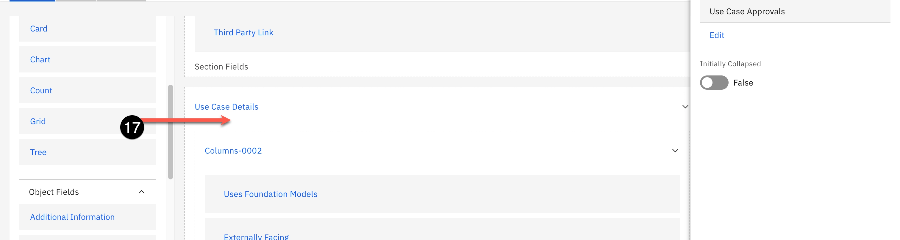

18. Enter **Use Case Reviews** in the **Label** field.

19. Click on the **Relationship Type** dropdown and select **Children**.

20. Click on the **Object Type** dropdown and select **Use Case Review**.

 

> The pending use case reviews will now show in this section of the view; however, it would be even more helpful to show their status, and the department responsible for reviewing them.

21. Scroll down to the **Fields** section and click the **Add** button. The **Fields** panel opens, showing all of the available fields for use case reviews.

 

22. From the list of fields, check the box to the left of the **Approval Status** item.

23. From the list of fields, check the box to the left of the **Stakeholder Departments** item.

24. Click the **Done** button to add the new fields to the grid. The **Fields** panel closes.

 

25. Click the **Done** button to finalize your changes to the grid and close the **Relationship** panel.

26. Click **Publish** in the upper right to publish your changes to the view.

 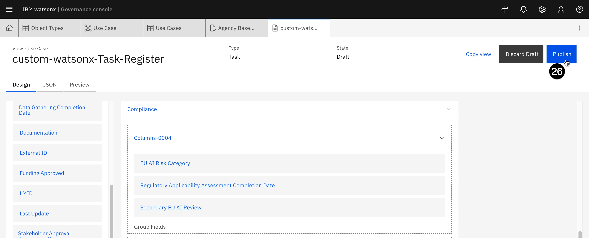

### Disable the old view

Now that we have updated the use case view to include the new custom fields, this view is still not easily viewable for all model use case. In this short section, you will learn how to disable the default system view, which will allow your changes for the custom view to appear for all use cases.

1. Click on the **gear icon** to open the **Administration** menu.

2. Click on the **Solution Configuration** menu item.

3. Click on the **Views** menu item to open a new tab listing all the views.

 

4. Ensure that the **Include system views** checkbox is checked.

5. Enter `watsonx` in the search field to narrow down the results.

6. Click on the **Filter by Object** type dropdown and select **Use Case** to further narrow the search results.

 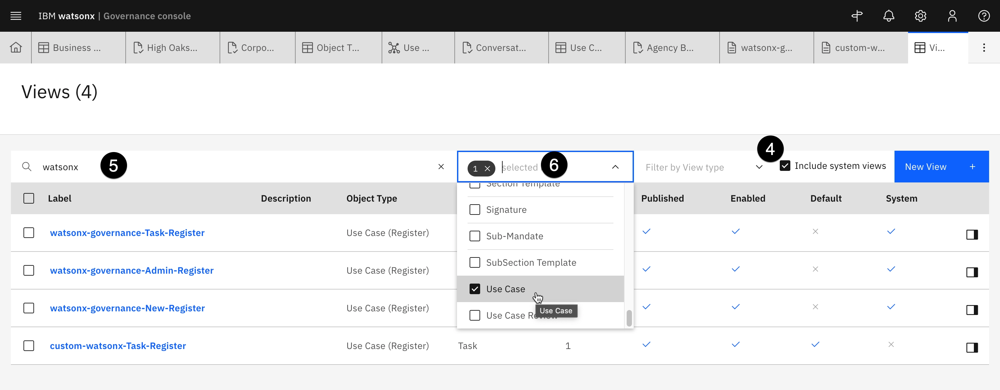

7. Click the box next to the **watsonx-governance-Task-Register** system view.

8. Click **Disable** from the context menu above the table.

 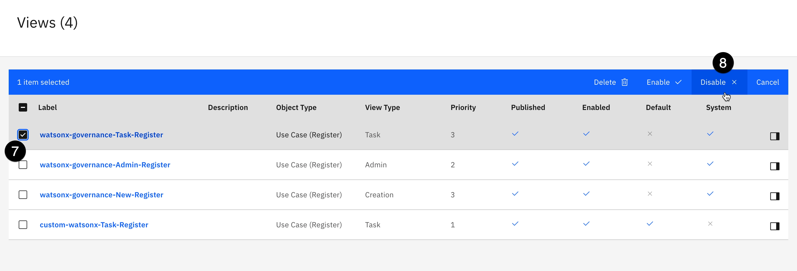

> Now you have successfully disabled the system view, this ensures the new view with the custom field, created earlier, will appear for all use cases as long as the user has the _watsonx_ profiles enabled for their account. You can open an existing use case to see the new field if you wish.

Congrats this is the end of lab 204! You can now proceed to **[Lab 205](/watsonx/watsonxgov/level-4/205)**.

