# 205: Create a questionnaire

The watsonx governance console provides the ability to create and employ [questionnaires](https://www.ibm.com/docs/en/openpages/9.0.0?topic=questionnaires-questionnaire-overview) to assist in the governance process. As with all elements of the governance console, questionnaires are fully customizable, and can be configured to automatically trigger further actions such as use case reviews, audits, communications, alerts, and more.

In this section of the lab, you will see how the questionnaire editor works by creating a form to edit the custom field you created in the previous step, allowing the compliance officer to fill out a form for their secondary review.

Finally, you will add the questionnaire as a part of the built-in AI assessment workflow, which will then allow you to integrate the questionnaire into the workflow for approving model use cases.

## Create the questionnaire template

1. From the Governance console click the **Hamburger menu** in the top left, then under **Assessments** click **Questionnaire Templates**. Note that, depending on the current profile for your user, you may have fewer items listed in your menu.  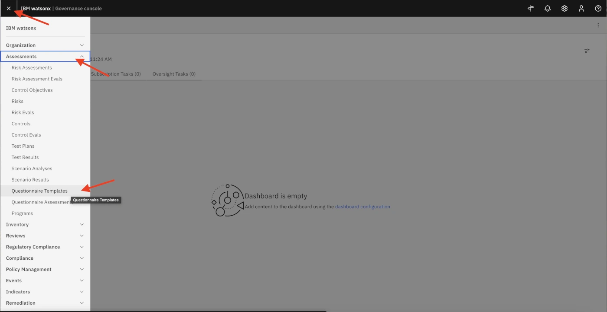
2. Click the blue **New** button, then fill out the fields as follows:
    - Name: `Secondary EU AI Act Review`
    - Description: `Second-level review to determine if the use case violates the EU AI Act.`
    - Primary Owner: Add your `complianceofficer` user.
    - Click the blue **Select folder** button and choose **Library**  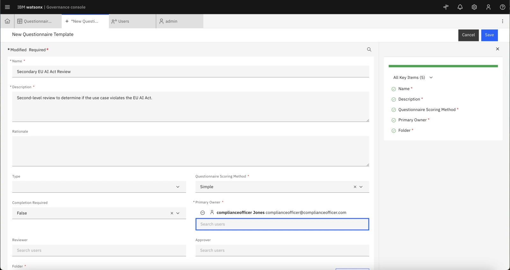
3. Click **Done** and then **Save**.

## Add questions

Now that the questionnaire template has been created, you may add questions to it. In this example, you will create a very simple set of questions to reflect a larger review, but when performing a Proof of Experience (PoX), it can be valuable to allow the client to create their own questions that are relevant to their organization's requirements.

1. From your new Questionnaire Template page, click on the **Editor** tab, and then click on the **Blank** tile.  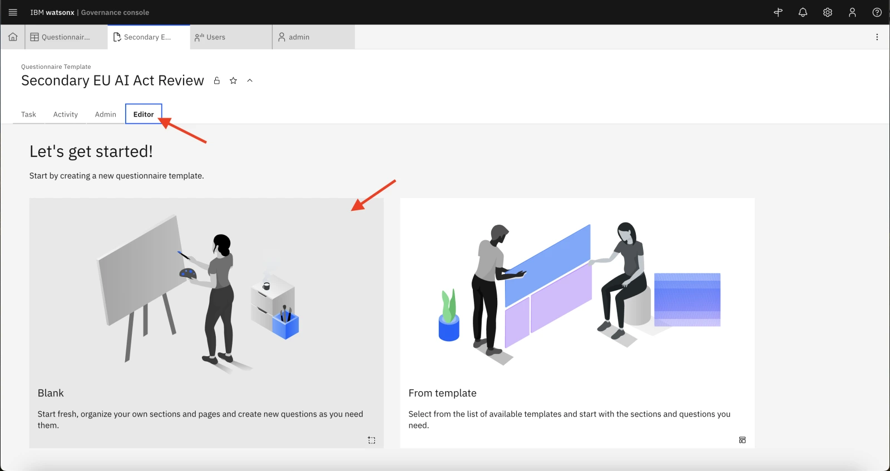
2. For **Name first section** put `Secondary Assessment` and for **Name first subsection** put `Compliance Review`, the click **Create**.  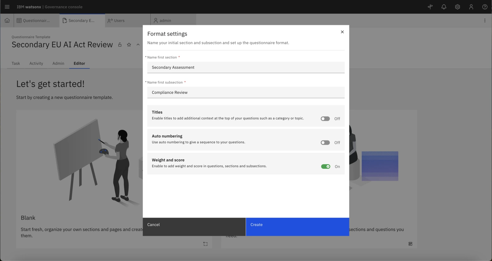
    > Note: If you receive a **Network error** message, you may need to close the current tab, return to the **Questionnaire Templates** tab, and refresh the page. From this point, the new template should appear in the list. You can click on it and switch to the **Editor** tab on the template screen.
3. The template has been pre-populated with a default question. Click the question tile to edit it.  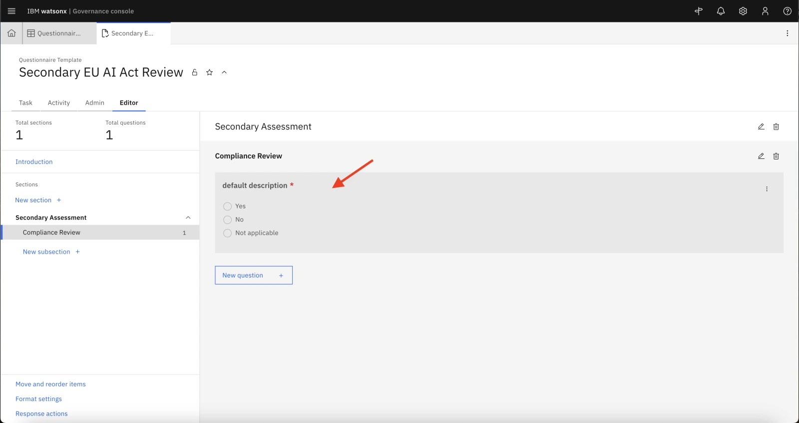
4. Replace the text in the **Question** field with `After a secondary review, is this use case acceptable under the EU AI Act?`. Remove the **Not applicable** answer option.  
5. Take a moment to review the other possible actions you can take on this question. You have the ability to build display logic to determine when this question appears. You can add additional context, set up multiple choice questions, and more. Creating full in-depth questionnaires is beyond the scope of this lab, but familiarizing yourself with some of the options and allowing the client to build their own questionnaires can be helpful in a PoX.
6. When you are finished exploring, click the gray area beneath the **Configure question** panel to save your changes. At this point, you may add additional questions as you wish. When you are satisfied with the questionnaire, you may proceed with the lab.

## Add the questionnaire to the existing AI assessments

You have just created a new type of assessment for AI models. In order to incorporate it into AI-related workflows, you will need to make further configuration changes to add it to the list of existing AI assessments.

1. From the Governance console, click the Gear icon and then click **Enable System Admin Mode** A popup window will open, prompting you to confirm your choice, and notifying you that while the mode is enabled, the system will be unavailable to other users. Click the **Enable** button to confirm.  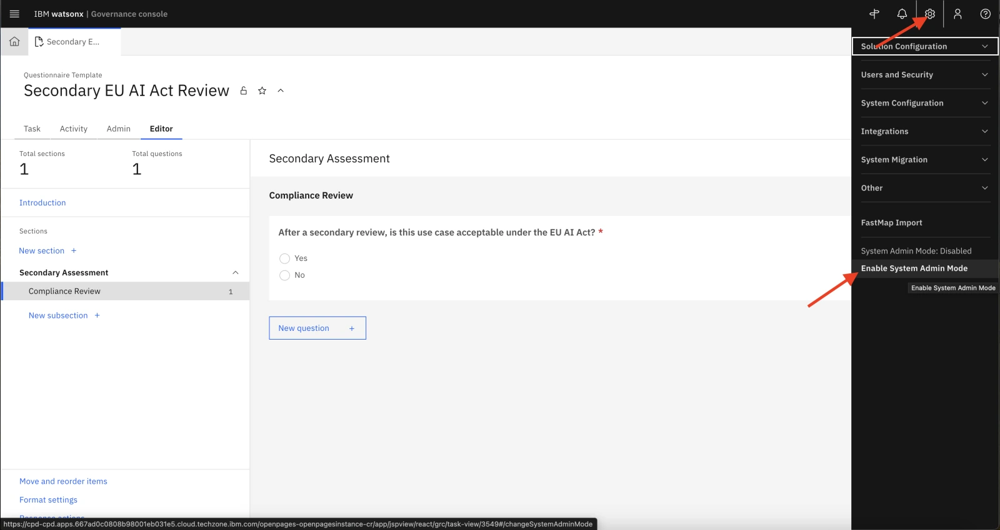
2. Once again click the Gear icon and under **Solution Configuration** click **Object Types**.  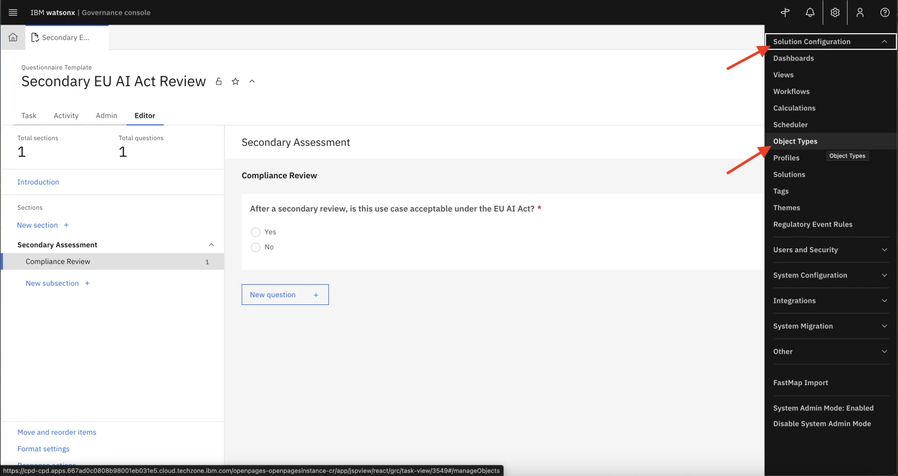
3. Search for **Questionnaire Assessment** and click on it.  
4. Expand the **Fields** section and scroll down to find **watsonx-QAssessment**, then click on **AI Assessment Type**. 
5. In the panel, find **Enumerated String Values** and click the **New value** button.  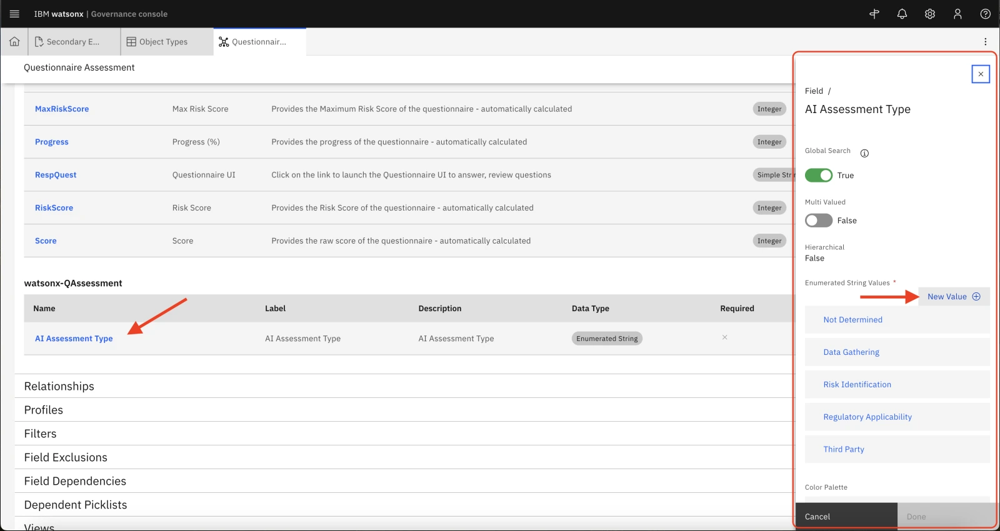
6. For both **Name** and **Label**, enter `Secondary EU Assessment`, then click **Create** and then **Done**.
7. Once the changes have saved, you can turn off System Admin mode. Click the Gear icon in the upper right, then click **Disable System Admin Mode** and **Disable** in the confirmation dialog.

## Update the AI assessment workflow

Now that you have created a new type of AI assessment, you will need to associate your assessment into the built-in AI workflow.

1. Once again click the Gear icon and underneath **Solution Configuration**, click **Workflows**. Note that you may receive a warning message about not having access to all of the items in the workflow; you can ignore it.  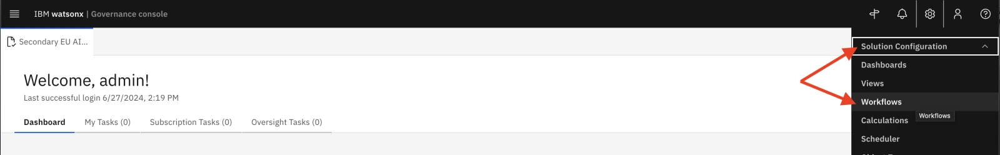 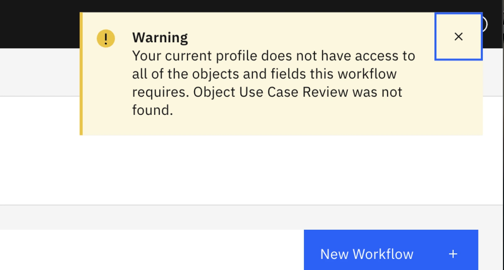
2. Click on **AI Assessment Workflow**. The workflow editor pallette will open.
3. Locate the **+** icon in the upper right of the palette window. Click and drag it to beneath the **Other Assessment** box to create a new workflow stage. The **New Stage** dialog will open. Name it `Secondary EU Assessment` and click **Create**  
4. You should see your new 'Secondary EU Assessment' box on the bottom. Hover your mouse pointer over the **Start** workflow stage to make four black dots appear on the stage border. Click and drag to the new **Secondary EU Assessment** stage box to create an action linking the two stages. Name it `Perform Secondary Assessment`  
5. In the **Action Properties** panel on the right, scroll down and click on the **Conditions** section to expand it, the click the **New condition** button.  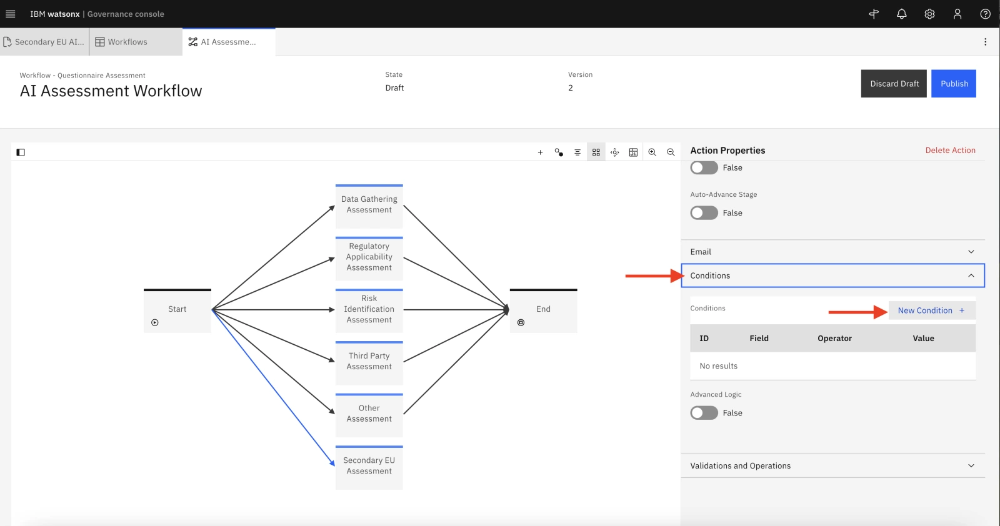
6. Under **Object Field** select **AI Assessment Type (watsonx-QAssessment:AI Assessment Type)** and under **AI Assessment Type** select **Secondary EU Assessment**, then click **Done**.  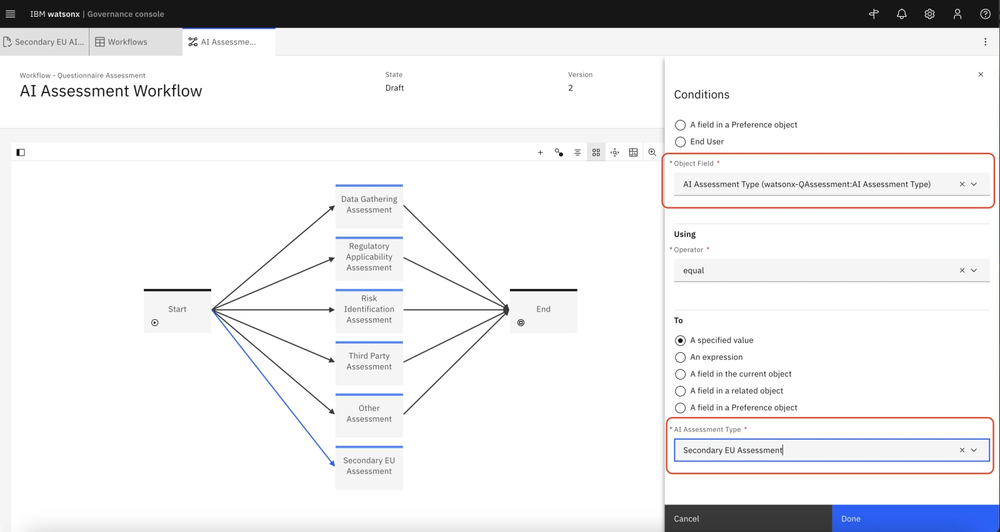
7. Open the **Validations and Operations** section underneath **Conditions**, and click the **New Operation** button.  
8. In the **Operations** panel which opens, fill out the following info:
    - **Operation**: select **Associate objects**
    - **Name**: **Associate Assessment**
9. Click the **New Condition** button and select:
    - **Object Field**: **AI Assessment Type (watsonx-QAssessment:AI Assessment Type)**
    - **AI Assessment Type**: **Secondary EU Assessment**
    - Then click **Done**  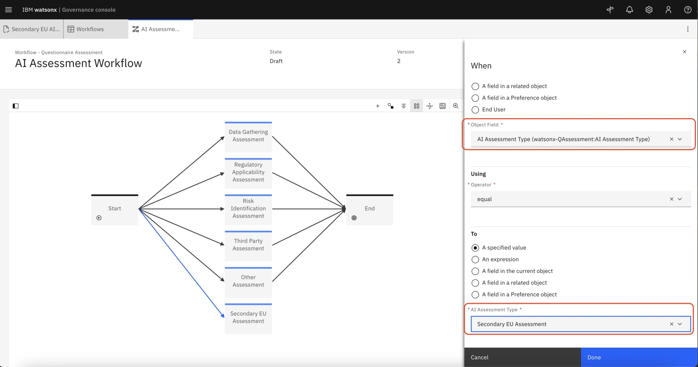
10. At the very bottom of the **Operations** panel, click the **Edit** button next to **Object to associate**, and select:
    - **Relationship Type**: **Direct Child**
    - **Related Object Type**: **Questionnaire Template**
    - Click **New Condition** and select **Name (System Fields:Name)**. In the **Name** field, enter the exact name of the questionnaire template you created in a previous step. If you have been following the instructions, you named it `Secondary EU AI Act Review`.  
11. Click **Done** to close the **Filter By**, **Object to associate**, and **Operations** panels.

You have now linked the **Start** stage and the **Secondary EU Assessment** stage using an action. To complete the process, you must link the **Secondary EU Assessment** stage to the **End** stage.

1.   Hover your mouse pointer over the **Secondary EU Assessment** stage box to make four black dots appear on the border. Click and drag the border to the **End** stage box to create an action linking the two stages, like we did with the **Start** stage.  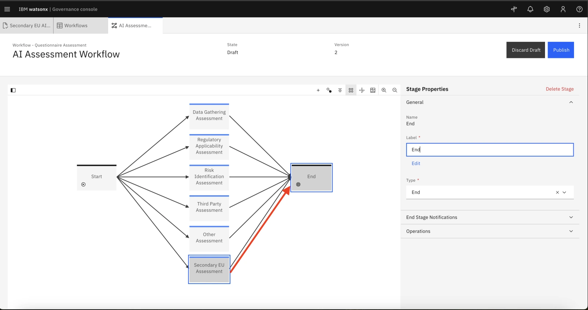
2.   Enter **Assessment complete** in the Name field, and click **Create**.
3.   Click the **Publish** button in the upper right of the screen to save your updates. Your new questionnaire has been added to the AI assessment workflow, and can now be integrated into the workflow for use case approval.

Congratulations, you can move on to [Lab 206](/watsonx/watsonxgov/level-4/206)

