# 206: Customize the use case approval workflow

Every organization will have their own requirements and preferences when it comes to governance processes. In the governance console, a workflow represents a business process and describes the tasks involved in the process. The ability to fully configure and customize an automated workflow is one of the main differentiators for watsonx.governance. Many clients will be relying on manual processes that involve email approval chains between developers, risk assessors, and other stakeholders. Others will have attempted to awkwardly fit their existing organizational structure into pre-set approval workflows offered by some of our competitors.

In this section of the lab, you will examine the workflow for a model use case request, and customize it. In this example, if the risk assessment questionnaire from the previous section results in a use case that is prohibited under the EU AI Act, the workflow will be configured to trigger a second-level audit by the compliance officer user you created earlier in the lab. As with all aspects of this lab, engaging with your client to alter the customization to fit their particular needs is a great way to demonstrate the flexibility of the solution.

<QuizAlert text='Heads Up! Quiz material will be flagged like this!' />

## Create workflow stages and actions

1. From the main watsonx Governance Console, click the **gear icon** in the upper right to open the **Administration** window.

2. Click on the **Solution Configuration** menu item to expand it.

3. Click on the **Workflows** menu item. A new tab listing all the existing workflows opens. 

> NOTE: you may receive a warning message stating you do not having access to all of the items in the workflow; this message can be ignored.

  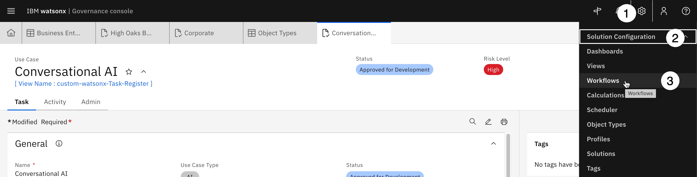

4. Locate **Use Case Request** in the table and click on it. The editor palette should open, showing the different stages of the workflow.

 

> Take a moment to explore the items in the palette by clicking on them and observing the Workflow Properties panel on the right of the screen. For example, click on the **Initial Approval** box. Boxes represent stages of the workflow. In the properties panel, you can see that the due date of the action is set to five days after the stage start date. If you click on the Assignees and Subscribers section to expand it, you can see that the stage gets assigned to the use case owner.

 

Next, click on the arrow joining the **Initial Approval** stage and the **Stakeholder Review** stage. Arrows represent actions that transition the use case between stages. Click on the Conditions section of the properties panel to expand it, and note that the two conditions here are being to bring about this action. First, that the **Use Case Risk Identification** assessment (the questionnaire from the previous section) has been completed. And second, that the **Use Case EU AI Risk Category** property generated by that questionnaire's results was not Prohibited. In plain language, after the use case passes initial approval, the owner would fill out the questionnaire to determine risk. If the use case is not deemed prohibited by the **EU AI Act**, then it can proceed to the individual stakeholder review.

However, what if the organization wanted a second assessment in the case of a Prohibited result? In the steps below you will configure that as part of the workflow

5. Locate the **`+` icon** on the palette toolbar, then click and drag it to the area on the palette shown below to create a new workflow stage. The **New Stage** dialog opens.

 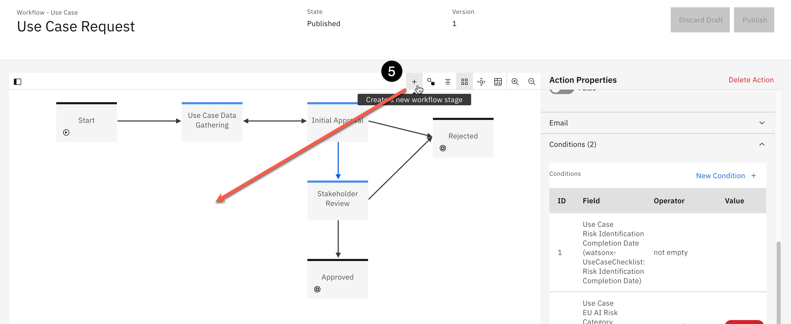

6. Enter **EU AI Act Second Assessment** in the **Name** field and click **Create**. The stage now appears on the palette.

7. In the **Stage Properties** panel, click the Edit button below the **Due Date**.

 

8. Note the different options for setting the due date, and the flexibility provided by the governance console. Set the **Number Of Days** field to 7 to give the reviewer one week to perform the action, and click **Done**.

9. In the **Stage Properties** panel, click on the **Assignees and Subscribers** section to expand it.

10. Click on the **Add Assignee** button. The **Assignees** panel opens.

 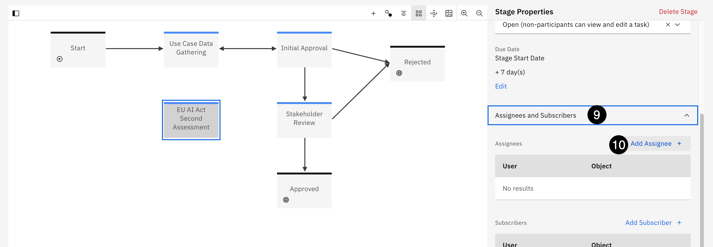

11. In the **Users or Groups** field, enter `complianceofficer` and select the user you created earlier in the lab to assign them to this task. Note that in a real-world example, you would likely have created a group of compliance officers and assigned this task to them, as opposed to one specific user.

12. Click **Done**

 

> The workflow stage has been created. Next, you will add actions to trigger it.

13. Locate the **Create a new workflow** action button on the palette toolbar to the right of the + icon and click it. The **New Action** dialog opens.

 

14. Click the **Start** dropdown and select the **Initial Approval** stage.

15. Click the **End** dropdown and select the **EU AI Act Second Assessment** stage you just created.

16. Enter **Prohibited Use Case Assessment** in the **Name** field. The text you enter into this field will appear as an available action in the **Actions** menu in the model use case view when the use case is in this stage.

17. Click **Create**. The action now appears as an arrow linking the **Initial Approval** 
stage with the **EU AI Act Second Assessment** stage.

 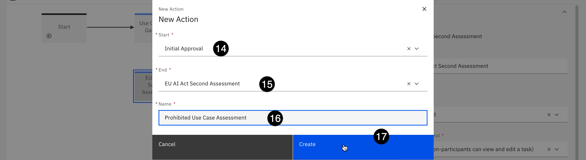

18. In the **Action Properties** panel on the right, scroll down to the **Conditions** section and click on it to expand it.

19. Click on the **New Condition** button. The **Conditions** panel should open.

 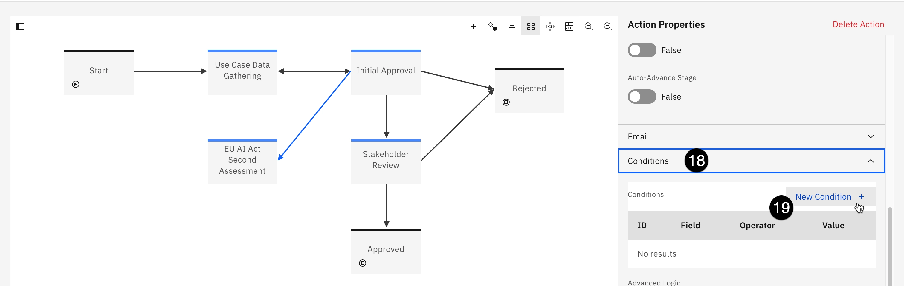

20. Click on the **Object Field** dropdown and select **Risk Identification Completion Date**....

21. Click on the **Operator** field and select **not empty** to designate that the completion date of the Risk Identification assessment has a value, meaning that the questionnaire has been filled out.

22. Click **Done** to add the new condition.

 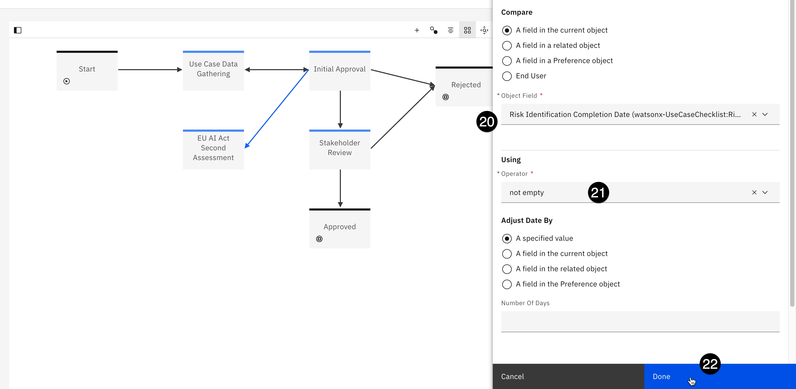

23. Click the **New Condition** button again to add a second condition.

24. Click on the **Object Field** dropdown and select **EU AI Risk Category**....

25. Click on the **Operator** dropdown and select equal.

26. Click on the **EU AI Risk Category** and select **Prohibited**.

27. Click **Done** to add the condition.

 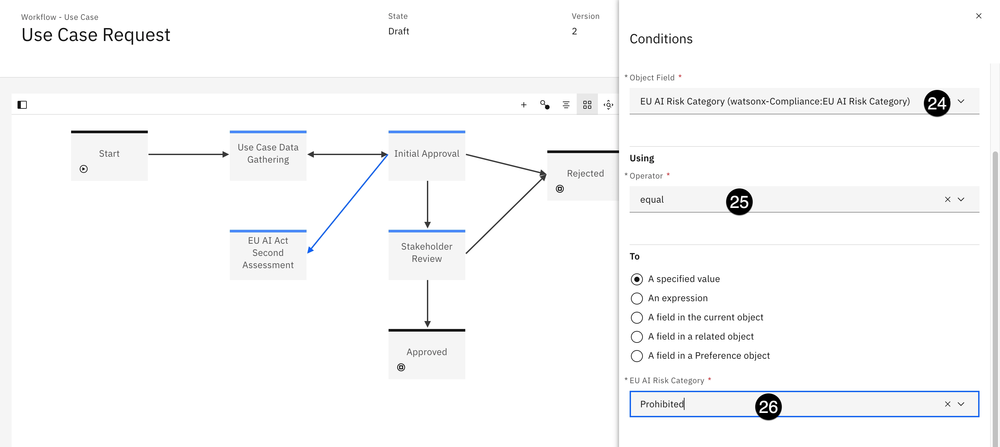

> The conditions for the action have been set so that it will trigger correctly. Next, you will need the action to automatically create the questionnaire for the secondary reviewer to fill out. In previous steps, you drafted questions for the form, and added the questionnaire to the AI assessment workflow. Taking those steps allows you to insert the new questionnaire into the current use case request workflow as operations that your action can take.

28. In the **Action Properties** panel, click on the **Validations and** Operations section to expand it.

29. Click on the **New Operation** button. The **Operations** panel should open.

 

30. Click on the **Operation** dropdown and select **Create** objects.

31. Enter a description like `Create secondary assessment questionnaire` in the **Name** field.

 

32. Scroll to the bottom of the **Operations** panel. Click on the **Related Object Type** dropdown and select **Questionnaire Assessment**.

33. Click the **Add Field** button. The **Fields** panels should open.

 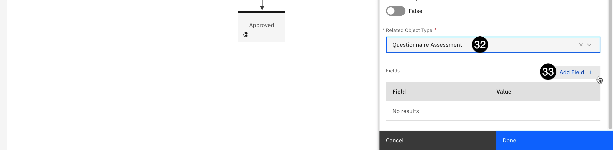

34. Click on the **Object Field** dropdown and select **AI Assessment Type**....

35. Click on the **AI Assessment Type** dropdown and select **Secondary EU Assessment**. This assessment type is visible because you added it to the AI assessment workflow in the previous step.

 

36. Click the **Done** button in the lower right to close the **Fields** panel.

37. Click the **Done** button to close the **Operations** panel.

> At this point, you have created a new workflow stage, an automated action to trigger that stage, and an action to prompt a stakeholder with your newly-created questionnaire. However, the stage also needs resolution actions. The secondary reviewer must be able to either confirm the questionnaire assessment that the use case is prohibited under the EU AI Act and reject it, or overrule the questionnaire assessment and send it to the next stage of the workflow (**Stakeholder Review**).

### Add resolution actions

1. Hover your mouse the **EU AI Act Second Assessment** stage; four black dots appear on the borders of the stage box. Click and drag one of the dots from the stage over to the **Rejected** stage on the palette to create an action linking the two. The **New Action** dialog appears.

 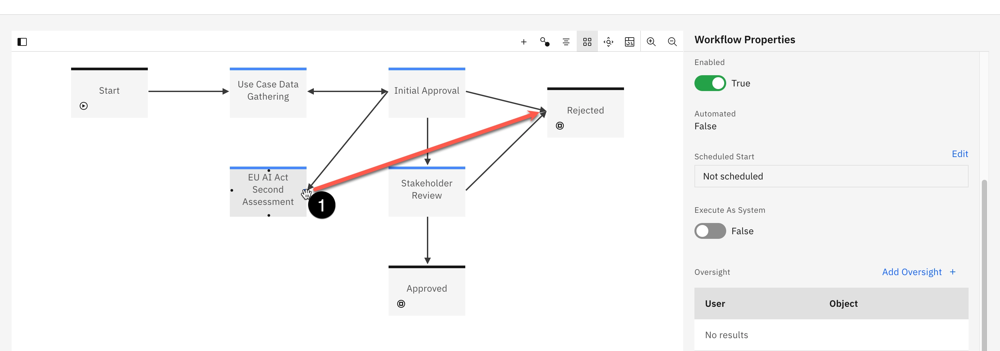

2. Enter **Reject Use Case** in the **Name** field and click **Create**. This value is what will appear in the user interface for the stage owner for them to reject the use case.

> In addition to conditions, actions can also have operations assigned to them. In this example, you will set the use case status to Rejected.

3. In the **Action Properties** panel, scroll down the bottom and click on the **Validations and Operations** section to expand it.

4. Click on **New Operation**. The Operations panel should open.

 

5. Enter `Set status as rejected` in the **Name** field.

6. Scroll to the bottom of the panel and click the **Add Field** button.

 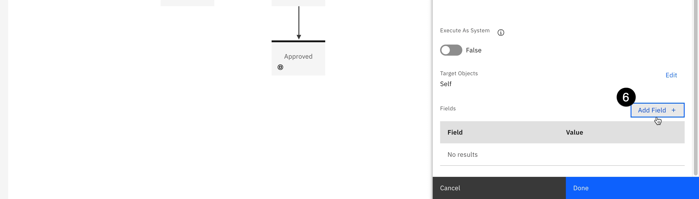

7. Click on the **Object Field** dropdown and select **Status (MRG-AIFacts-ModelUseCase:Status)**.

8. Click on the **Status** dropdown and select **Rejected**.

 

9. Click **Done** to create the field on the operation.

10. Click **Done** again to set the operation on the action. Performing the action will now update the model status.

11. Repeat step 1 above to create an action linking the **EU AI Act Second Assessment** stage to the **Stakeholder Review** stage.

12. Enter `Approve to Stakeholder Review` in the **Name** field and click **Create**.

> Note that the action linking the **Initial Approval** and **Stakeholder Review** stages has seven operations it performs, which you can see by clicking on it and expanding the **Validations and Operation**s section of the properties panel. These operations prompt use case reviews from different departments before the final use case is approved. In a real-world example, you would duplicate these operations on the action you just created to link the **EU AI Act Second Assessment** and **Stakeholder Review** stages, since this represents the same level of approval. However, for the sake of brevity, this lab will not go over adding the operations to the new action. You may do so if you wish.

Finally, because you made changes to the default use case view, you will need to update the workflow stages, since they reference the view. Failure to update the stages will cause errors when a use case request goes through the workflow.

13. Click on the **Use Case Data Gathering** stage in the workflow. The **Stage Properties** panel should open.

14. Scroll to the bottom of the **Stage Properties** panel and click on the **Task View Overrides** section to expand it.

15. Click on the **Select Task View** dropdown and select the customized view you modified in a previous lab from the list. 

 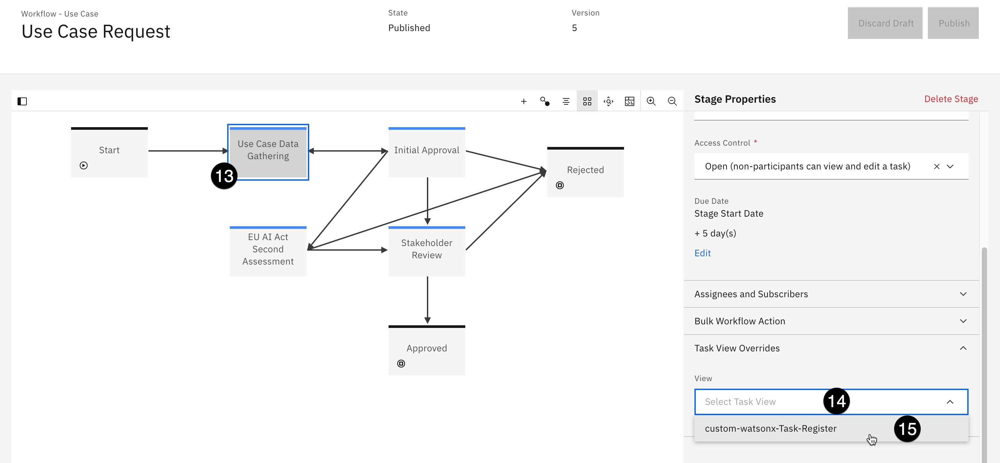

16. Repeat _steps 13-15_ for the three other stages intermediate stages in the workflow (it is NOT necessary to do this for the **Start**, **Rejected**, or **Approved** stages).

17. When you are finished, click the blue **Publish** button in the upper right to publish your changes to the workflow.

At this point in the lab, you have performed several customizations of the governance console. You have worked with user profiles, created business entities, set up custom fields, added those fields to views, experimented with questionnaires, and altered use case workflows.

The depth and configurability of the governance console is one of the major differentiators for _watsonx.governance_, and a successful proof of experience (PoX), demo, or MVP should spend time highlighting these capabilities and encouraging the customers/client/end-users to perform their own customizations based on their organization's requirements.

From this point on, the remaining labs will focus on governing models using the workflows and processes you created and customized in the previous steps.
