# 207: Govern generative models

In this section of the lab, you will go through the steps of the approval workflow you customized during the governance console configuration steps. The human resources department has received a large number of applications for open positions, and would like to use AI to summarize them to help save time for the hiring department, and process the applications more efficiently to improve the experience for the applicants.

Most use cases for generative models involve interacting with prompts and prompt templates, which help users provide clear input to a Large Language Model(LLM) by giving them a structured framework to follow, which in turn helps the model generate accurate responses.

## 1. Switch user personas

For this portion of the lab, you will switch to the user you created in the configuration portion, and have been granting access permissions. Recall that, for the sake of simplicity, you were instructed to create a single user with access to multiple pre-defined [roles](https://www.ibm.com/docs/en/cloud-paks/cp-data/4.8.x?topic=users-predefined-roles-permissions-in-cloud-pak-data) in Cloud Pak for Data. While creating and managing multiple user personas and groups is beyond the scope of this lab, doing so can provide a more realistic PoX for your client, particularly if they are unfamiliar with Cloud Pak for Data and the level of access control and collaboration it provides.

While the instructions did have you assign multiple roles to the Compliance Officer user, one role that you did **not** assign was that of administrator of the watsonx governance console (OpenPages) service. For this reason, when you log in as this user, the governance console view will have changed slightly, and you will not be able to modify views, workflows, or other aspects of the service.

Finally, it is **HIGHLY RECOMMENDED** that when logging in as the created user, you use a different browser or your browser's private/incognito mode. Previous session login information may persist and cause repeated errors when attempting to save your work or fill out questionnaires.

1.  Return to the Cloud Pak for Data home page.
    
2.  Click on the **avatar icon** in the upper right to open the user menu.
    
3.  Click on the **Log out** link. When given the option to confirm, click the **Log out** button. You will be returned to the login page.
    

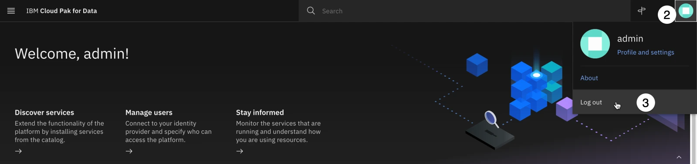

4.  Enter the username of the created user in the configuration portion of the lab. If you followed those instructions exactly, the username will be **complianceofficer**.
    
5.  Enter the password of the created user in the configuration portion of the lab. If you followed those instructions exactly, the password will be **passw0rd**.
    
6.  Click the **Log in** button to log into Cloud Pak for Data. Close any tutorial or welcome windows that open.
    

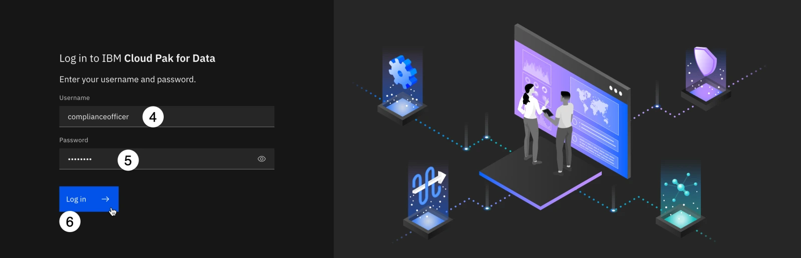

7.  From the **Overview** section on the left of the home screen, click on **OpenPages cr** to open the watsonx governance console. Note that if **OpenPages cr** is not listed, you may need to click on **Instances**, find the service from the list, and open it from the information screen.


8.  Once the governance console opens, you will need to switch to the correct profile to see all of the applicable fields. Click the **avatar icon** in the upper right. The **User** menu opens.
    
9.  Click the **Change Profile** menu item. The **Select profile** dialog opens.
    

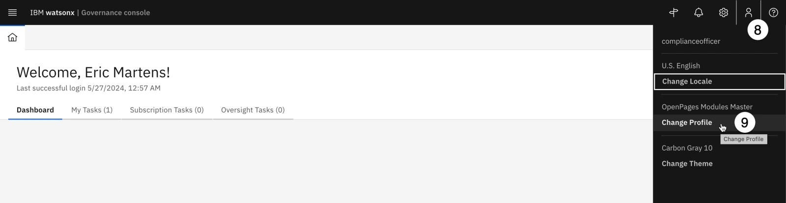

Take a moment to review the different profile roles and descriptions available. Each of these can be customized, or new profiles created, to fit the structure and requirements of the organization. While this lab will deal primarily with the **watsonx-governance MRG Master** for governing models, pre-defined profiles also exist for regulatory compliance officers (**watsonx-governance RCM Master**) and for risk managers (**watsonx-governance ORM Master**).

10.  Click on the **watsonx-governance MRG Master** profile from the list to select it.
    
11.  Click **Save** to finalize your choice.
    

Note that when you return to the dashboard, it is populated with several charts displaying metrics for the sample models and use cases you loaded in the configuration step. The pre-defined roles have been created to display the information most useful for that role in their dashboards. Like all aspects of the governance console, the dashboard charts can be customized per role, or per individual user.

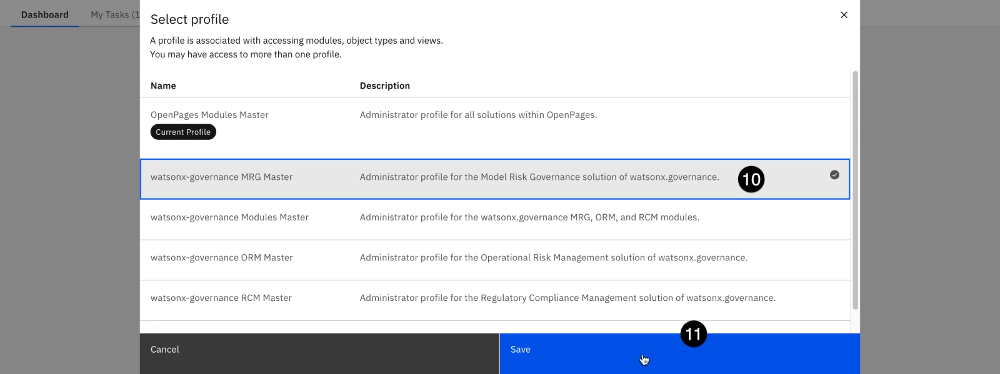

## 2\. Create a model use case

The model governance process begins with the creation of a model use case. A use case is meant to track and capture information about a collection of models and prompts that will be built to serve a particular purpose. A use case should be created whenever there is a business need requiring the use of a model (AI or non-AI) to be built. Model records should then be added as a child of the use case.

To ensure that model use cases are tracked across the entire solution, they should be created using the watsonx governance console. In the configuration lab, you turned on integration between the governance console (OpenPages) and Cloud Pak for Data, so any actions related to model use cases should now redirect you to the governance console interface.

Only the models that you add to use cases are tracked with AI Factsheets. You can control which models to track for an organization without tracking samples and other models that are not significant to the organization.

In a real-world scenario, this action would be performed by an organizational stakeholder who would like to request the development and implementation of a model; in this case, the manager of the human resources department, who is unable to keep up with the volume of resumes submitted for employment opportunities and would like help from an AI solution.

1.  Click on the **hamburger menu** in the upper left.
    
2.  Click on the **Inventory** menu item to expand it.
    
3.  Click on the **Use Cases** menu item. The **Use Cases** tab opens. Note that several sample uses cases were loaded during the FastMap import step you performed in the configuration lab.
    

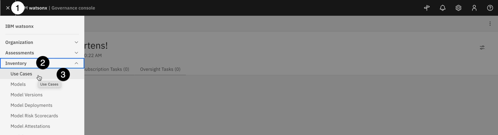

4.  Click the blue **New** button. The **New Use Case** tab opens.


Note that the **Model Use Case creation** information panel on the right of the screen offers helpful information about model use cases, as well as a list of required fields. Clicking on any of the fields in that panel will scroll the screen directly to that portion of the form, helping you quickly rectify any items needing attention.

5.  In the **General** section of the form, enter **Resume summarization** in the **Name** field. Note that when you enter a value in the field, the progress bar in the **Model Use Case creation** information panel updates.
    
6.  Click the **Owner** field and enter the **complianceofficer** created user into this field. Note that if you created multiple user personas in the environment configuration lab, you could choose a different user here. **DO NOT** select any of the sample users that were loaded during the system configuration import step, as they will not have associated Cloud Pak for Data accounts and will not be able to log in and work with the use case.
    
7.  Enter a description in the **Description** field.
    

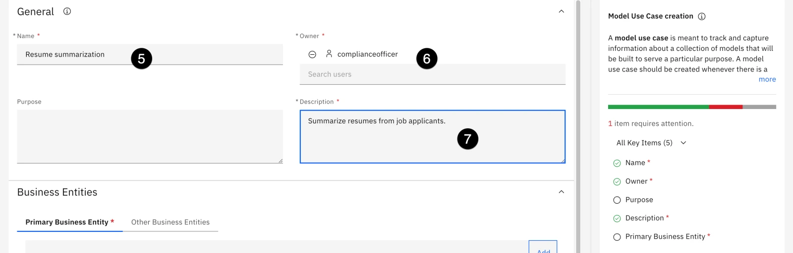

8.  All model use cases are owned by business entities, representing the part of the organization responsible for requesting the use case. In the **Business Entities** section of the form, click the **Add** button. The **Add** window opens with a list of business entities defined for the organization.


9.  Locate the **Human Resources** entity from the list and click on it to select it.
    
10.  Click **Done** to add the business entity to the use case. The **Add** window closes.
    


11.  Click the **Save** button in the upper right to save the use case.

When the use case has finished saving, the screen will reload with the view you customized in previous steps; you should see the **Secondary EU AI Review** field in the **Compliance** section of the use case. At this point, the use case has been created and is now governed by the **Use Case Request** workflow that you modified. Specifically, it is in the **Use Case Data Gathering** stage of the workflow.


To progress the use case through the workflow, you will now need to perform the actions specified in the **Action** items in the workflow.

## 3\. Progress the use case to the next phase

The use case request has progressed to the data gathering stage of the workflow, and has been assigned as an action for the appropriate owner. Recall that owners of each stage of the workflow can be configured, and alerts assigned.

1.  Click on the **Home** icon in the upper left to return to the user's home tab.


2.  Note that the **My Tasks** tab now shows a new entry. Click on the tab to open it.


The **My Tasks** tab shows a list of all the current tasks assigned to the user. It can be filtered by a variety of fields. At the moment, it only contains a single task, showing that the use case request is in the data gathering stage and is in need of action, along with the stage due date.

3.  Click on the link for the **Resume summarization** link in the table to return to the use case request tab.

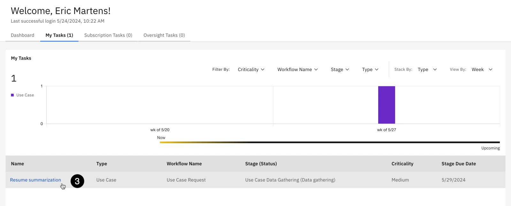

In an earlier section of the lab, you updated the model use case review to hold a new field (Secondary EU AI Review). When performing a PoX for your client, you may wish to add other fields to this view, which may contain other required information to be filled out in this stage. Information could include things like billing codes, additional documentation or justification, or more. In this case, you will only edit required fields specified in the information panel on the right before progressing to the next stage of the workflow.

**Risk Level** represents the risk to the organization should issues arise with the models used to address the requirements laid out by the use case. A full risk assessment is beyond the scope of this lab; however, because hiring and employment violations can lead to expensive litigation damage to an organization's reputation, this use case will be marked as high risk.

4.  In the **Risk** section of the form, click on the **pencil icon** next to the **Risk Level** field to edit it.


5.  Select **High** from the dropdown.
    
6.  Click on the **Use Case Type** item from the information panel to locate it in the form. The **Use Case Type** dropdown opens.
    

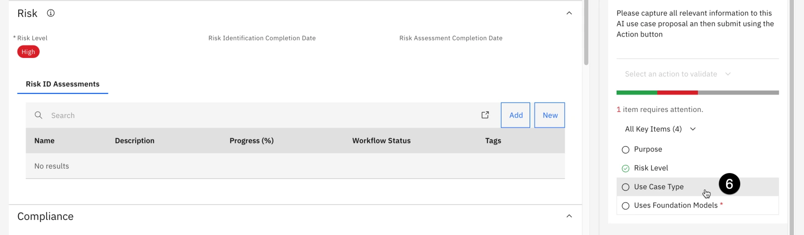

7.  Select **AI** in the **Use Case Type** dropdown.
    
8.  Click on **Uses Foundation Models** in the information panel on the right to locate it in the form. The **Uses Foundation Models** dropdown opens.
    
9.  Select **Yes** in the **Uses Foundation Models** dropdown, as you will optionally use IBM Foundation models and compare them to Azure OpenAI models.
    
10.  Scroll to the **General** section, click on the **Stakeholder Departments** dropdown, and select **Model Risk** from the list. As the model progresses through the workflow, this will require a stakeholder review from the **Model Risk** department. Recall that you added use case reviews to the use case view in previous steps.
    

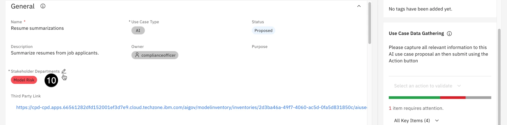

11.  Click the **Save** button in the upper right to save your changes.
    
12.  Once the changes have been saved, click on the **Action** button in the upper right to open the **Actions** menu.
    
13.  Click on the **Submit for initial approval** action. Note that the text of this action is defined by the **Name** field given to the action connecting the **Use Case Data Gathering** stage to the **Initial Approval** stage in the workflow. The **Submit for initial approval** confirmation dialog opens.
    


14.  Click the black **Continue** button to confirm your action, but keep the use case tab open.

> **Note:** If you receive an error message saying _The Use Case view referenced in the workflow stage Initial Approval does not exist or has been deleted..._, your changes to the workflow (particularly the **Task View Override**) may not have been published. You will need to log back in as the **admin** user and ensure that the **Task View Override** field is set on each intermediate stage, and that the workflow changes are published.

15.  When the action completes, note that the **Stage** field in the information panel on the right has updated once again to **Initial Approval**.


Recall that, in order to progress the use case to the next stage (**Stakeholder Review**) the action in the workflow requires the risk identification questionnaire to be filled out. As that questionnaire has yet to be completed, clicking on the **Actions** menu for the use case only shows two available actions: rejecting the use case (moving it to the **Rejected** stage, or returning it to the owner (moving it back to the **Use Case Data Gathering** stage). In order to continue forward, the questionnaire must be filled out.

## 4\. Identify use case risks

In this section, you will fill out the default risk assessment questionnaire included in the governance console. This questionnaire, which can be modified using the same method you used to create a questionnaire in earlier sections of the lab, has been configured to automatically associate relevant risks from IBM's AI risk atlas based on answers to the questions.

The [AI risk atlas](https://www.ibm.com/docs/en/watsonx/saas?topic=ai-risk-atlas) is an open source tool to help clients understand some of the risks of working with generative AI, foundation models, and machine learning models.

> **Note:** As mentioned when you switched user personas to the created user, if you receive frequent error messages stating that _The requested operation could not be completed_, you are likely encountering an issue with persistent session information in your browser. A browser cache clear may fix this issue, but the best way to avoid these errors is to use your browsers private/incognito mode when signed in as the created user.

1.  Click on the **Home** tab.
    
2.  Click on the **My Tasks** tab from the home screen to reopen the view of assigned tasks.
    
3.  Click on the **Risk Identification (Resume summarization)** task from the task list. The **Risk Identification** questionnaire assessment for the use case opens.
    

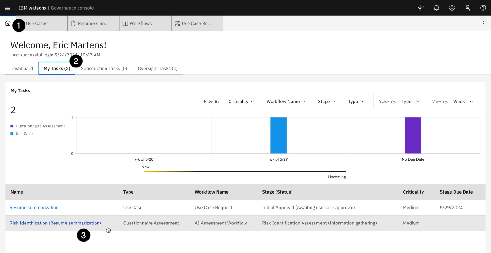

4.  Fill out the questionnaire for a model that will perform summarization of resumes provided by human applicants. Your answers should reflect that content will be provided by humans, and that the output will be reviewed by humans. Also specify that the model and the model training data are hosted internally, and have been screened for bias and hateful, aggressive, and profane speech (HAP). Note that the idea of this questionnaire is to identify potential risks in the model use case. Feel free to use generic answers when filling out the form, and evaluating how that changes the risks identified at later steps.

Note the progress panel on the left side of the screen will show any required questions that have not been answered, and you can use it to jump between sections of the questionnaire. You can also save your progress by clicking the **Save draft** button in the upper right.

5.  When you have finished filling out the survey, click the **Action** button in the upper right. The **Actions** menu opens.
    
6.  Click the **Risk identification complete** button. A confirmation dialog opens.
    


7.  Click **Submit** to submit the risk identification questionnaire.


8.  Based on the questionnaire answers, the governance console now calculates and assigns certain risks to the use case. You can view these by clicking on the **Home** tab.
    
9.  Click on the **My Tasks** tab of the **Home** tab. The use case appears in the list of tasks, with the stage set to **Initial Approval**.
    
10.  Click on the use case from the task list. The use case opens in a new tab.
    
11.  Scroll down to the **Risk** section of the page. Note that the **Risk Identification Completion Date** now has a value.
    
12.  Scroll down to the **Risk Status** and **Residual Risk Rating** graphs. Based on your questionnaire answers, your charts may look different than the screen shot. Click on the **Risk Status** graph. The **Risks** tab opens.
    


13.  Examine the table of risks. Note that each has a description, and a reference URL for more information. These risks have been populated from the [AI risk atlas](https://www.ibm.com/docs/en/watsonx/saas?topic=ai-risk-atlas).
    
14.  When you are finished examining the risks, close the tab and return to the use case tab.
    
15.  The use case is now ready to be progressed to the next stage of the workflow. Click on the **Actions** button in the upper right. The **Actions** menu opens.
    
16.  Click on the **Submit for stakeholder review** menu option. A confirmation dialog opens.
    


17.  Click on the **Continue** button to confirm your choice. The use case progresses to the **Stakeholder Review** stage.


18.  Refresh the browser window and scroll to the **Use Case Details** section of the page. The view has been updated to show that the stakeholder departments you identified in the **Use Case Data Gathering** stage have been assigned a use case review; the status shows as **Awaiting Approval**.
    
19.  Click on the name of the required review. The **Use Case Review** tab opens.
    

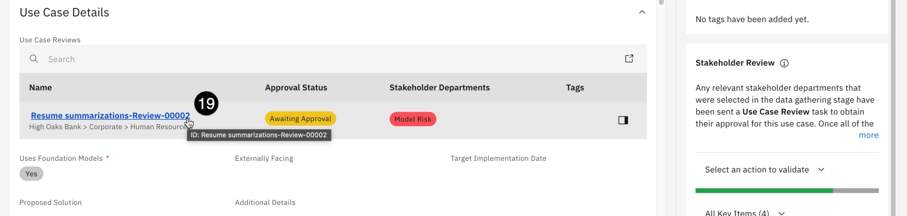

At this point in the process, the model risk department would review the use case, including the answers provided in the risk identification questionnaire. Note that the link to the questionnaire has been provided in the **Use Case Assessments** section of the page, for easy access.

20.  Click on the **edit icon** for the **Approval Status** field and set it to **Approved**.


Note that you can also identify the review, and add comments as necessary.

21.  Click on the **Save** button to save the status change.
    
22.  Return to the **Resume summarization** use case by clicking on its tab. Note that the **Approval Status** of the use case review by the Model Risk department has been updated. If you assigned any other stakeholder departments to the use case, perform those reviews now.
    
23.  Click on the **Actions** button once more. The **Actions** menu opens.
    
24.  Click on the **Approve for development** menu item to approve the use case. A confirmation dialog opens.
    

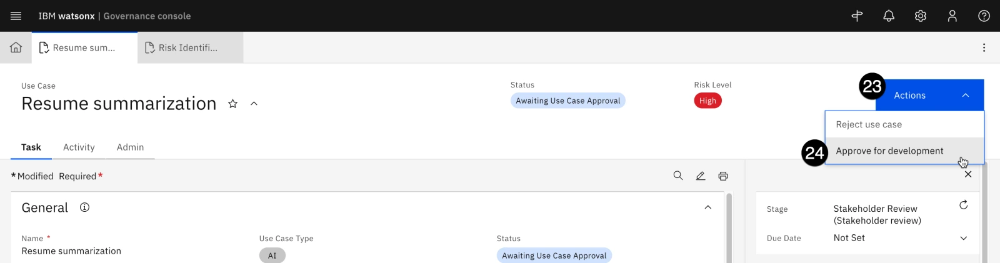

25.  Click the **Continue** button to confirm your choice. The **Status** field changes to **Approved for Development**.

If you click on the **Action** button again to progress the use case to the next stage of its lifecycle, you will receive an error stating that the use case view for the relevant workflow stage has been removed; because you disabled the default system use case view, to clear this error you would need to also set the **Task View Override** on the stages of the **Use Case Development and Validation** workflow to use the new, updated view. However, for the purposes of this lab, the focus will shift away from progressing the use case view to the development and monitoring of models. Feel free to update the workflow and continue progressing the use case through the different phases if your client would like to see the entire process.

At this point in the lifecycle, the model use case has been created, reviewed for risks, and approved by the various stakeholders. Personas involved are mostly non-technical, from the business user who requested the model to the risk and compliance officer who evaluated it. Next, the model would be developed by teams of data scientists and AI engineers. The following steps of the lab will take actions from the point of view of those personas.

## 5\. Develop the models

In this case, the AI engineers have elected to try two different frameworks for building a resume summarization model. One team will work with the Azure OpenAI service, and the other will work with an IBM foundation model.

**THESE EVALUATIONS ARE NOT INTENDED TO SHOW THE RELATIVE STRENGTHS OF THE TWO PLATFORMS, AND SHOULD NOT BE PRESENTED AS SUCH.** Both models are fairly simple prompts, and in a real-world scenario would be tuned and optimized for the individual use case. The evaluations here are presented to show how the watsonx.governance platform can collect facts and metrics for hybrid environments with models deployed on any platform.

This lab assumes that your environment does not have watsonx.ai installed, and will be using the shared TechZone SaaS account and model you deployed in the configuration lab. In this case, you will treat the watsonx.ai model almost as an external model, creating the model record in the governance console and evaluating it via Jupyter notebook, as you will do with the Azure OpenAI model.

If your environment _does_ have watsonx.ai installed, you could deploy the model there and click on the **Track this model** option in the user interface to add the model to the use case.

1.  From the watsonx governance console, click on the **hamburger menu** in the upper left.
    
2.  Click on the **Inventory** menu item to expand it.
    
3.  Click on the **Models** menu item. The **Models** tab opens.
    


4.  Click on the **New** button. The **New Model** tab opens.
    
5.  Enter **Azure Resume Summarization** in the **Name** field. Make a note of this value, as you will use it later in the evaluation Jupyter notebook as the **MODEL\_TITLE**.
    
6.  Enter a description in the **Description** field.
    
7.  Click on the **Model Status** dropdown and select **Under Development**.
    
8.  Click on the **Model Owner** dropdown and select the created user.
    
9.  Click on the **Model or Non-Model** dropdown and select **Model**.
    
10.  Click on the **Machine Learning Model** dropdown and select **No**.
    
11.  Click on the **Model Class** dropdown and select **Prompt-tuned**.
    


12.  Scroll down to the **Associations** section and click on the **Add** button in the **Parent Entities** tab. The **Add** window opens.

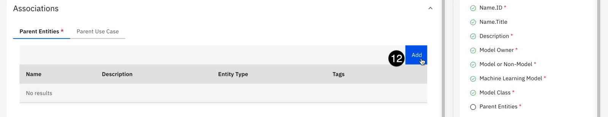

13.  Scroll down to the **Human Resources** business entity and click on it.
    
14.  Click on the **Done** button to associate the business entity. The **Add** window closes.
    
15.  Click on the **Parent Use Case** tab of the **Associations** section.
    
16.  Click on the **Add** button in the **Parent Use Case** tab. The **Add** window opens.
    


17.  Scroll down to the **Resume summarization** use case you created and moved through the workflow. Click on the use case to select it.
    
18.  Click on the **Done** button to add the model entry to the use case and close the **Add** window.
    
19.  Now that you have added all the required information, click on the **Save** button in the upper right to save your changes.
    
20.  Repeat steps 1-19 above to create an entry for the watsonx.ai model, with all information the same except for the name. Name this model **watsonx Resume Summarization**. Make a note of this value, as you will use it later in the evaluation Jupyter notebook as the **WATSONX\_MODEL\_TITLE**.
    

## 6\. Prepare to evaluate the Azure model

At the time of writing, watsonx.governance supports the evaluation of third-party generative models via Jupyter notebook. In this step, you will create a Watson Studio project, import and modify the Jupyter notebook, and perform the evaluation.

> **Note:** The notebook will perform an evaluation on an Azure OpenAI deployment of ChatGPT 3.5 Turbo. At the time this lab was written, TechZone does not offer reservations that can access these deployments, though they are coming soon. You can talk to your sales lead to gain access or use a customer's service. Alternatively, you can run the notebook without any credentials, in which case it will use pre-generated responses from an Azure OpenAI ChatGPT 3.5 Turbo deployment to perform the evaluation.

To begin, you will need to gather credentials used by the notebook. From Cloud Pak for Data, you will need the base Cloud Pak for Data URL, as well as the username and password of the created user. You will also create an API key for the user.

For Azure, you will need the base URL, API key, and engine. Instructions on finding these are in the **Getting Microsoft Azure credentials** section of the [configuration hands-on lab](https://cp4d-outcomes.techzone.ibm.com/l4-pox/governance-config).

1.  Return to the Cloud Pak for Data home screen.
    
2.  Click on the **avatar icon** in the upper right to open the user menu.
    
3.  Click on the **Profile and settings** item from the menu. The user profile screen opens.
    


4.  Click on the **API key** button in the upper right. The API key menu opens.
    
5.  Click on the **Generate new key** menu item. The **Generate new API key?** dialog window opens.
    

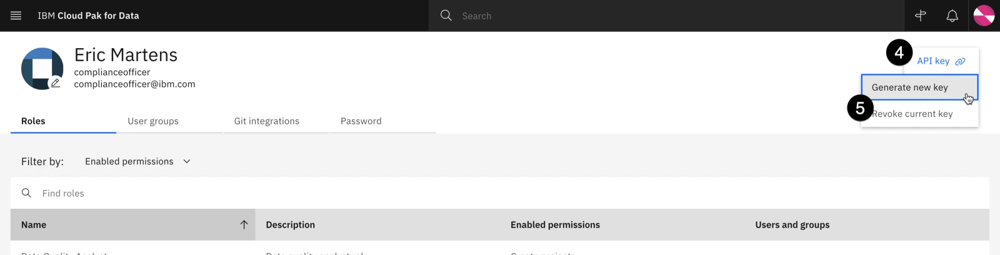

6.  Click the red **Generate** button to confirm API key creation. Note that, as the warning states, generating a new key will invalidate any existing keys you have.
    
7.  Click the **Copy** button to copy your new key to the clipboard. Paste it into a text file for later use in the notebook, where it will represent the **API\_KEY** value.

8.  Once you have pasted the key into a text file, click the **Close** button to close the window.

At this point, you have all the information necessary to run the model evaluation and write the resulting output to the model's Factsheet.

## 7\. Evaluate the Azure model

In Cloud Pak for Data, Jupyter notebooks are run from within Watson Studio projects. In this step, you will create a new project and download a notebook from GitHub. You will then customize the notebook with the credentials from the previous step and run it to perform the evaluation.

The notebook uses the _ibm-watson-openscale_ installable Python library, which allows users to configure and run model evaluations via Python code in both Python scripts and Jupyter notebooks.

1.  Click the **hamburger icon** in the upper left.
    
2.  Click on the **Projects** menu item to expand it.
    
3.  Click on the **All projects** menu item. The **Projects** screen opens.
    

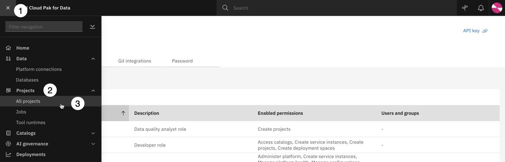

4.  Click the **New project** button to create a new project.
    
5.  Click the **Create an empty project** tile. The **New project** screen opens.
    

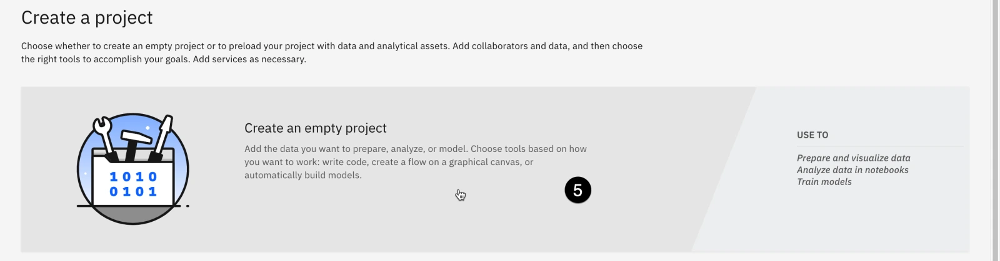

6.  Enter **Prompt evaluation** in the **Name** field.
    
7.  Click the **Create** button in the lower right to create the project.
    
8.  Click on the **Assets** tab to open it.
    
9.  Click on the **New asset** button. The **New asset** window opens.
    

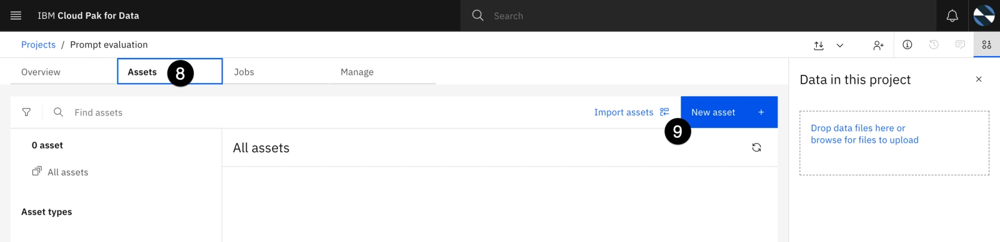

10.  Scroll down to the **Code editors** section and click on the **Jupyter notebook editor** tile. The **New notebook** window opens.


11.  Click on the **URL** button on the left.
    
12.  Enter **Evaluate Azure model** in the **Name** field.
    
13.  Copy and paste the following URL into the **URL** field:

```
https://raw.githubusercontent.com/CloudPak-Outcomes/Outcomes-Projects/main/watsonx-governance-l4/notebooks/azure_openai_evaluation.ipynb

```


1.   Click the **Create** button in the bottom right to create the notebook. The notebook will be downloaded from Github and made available for editing.
    
2.   Enter the credentials you gathered in the previous step in the cell. As a reminder, if you do not have access to an Azure OpenAI deployment, leave the Azure credentials blank. The **MODEL\_TITLE** will be the title of the model you created in the watsonx governance console in a previous step. If you followed the directions exactly, you named it **Azure Resume Summarization**, which has been already added to the cell. The **API\_KEY** value in this cell refers to the Cloud Pak for Data API key you generated with the created user.
    


You gathered the Azure credentials in the configuration portion of this lab; enter the values into the cell.

16.  Execute the cells of the notebook, reading the comments and paying attention to what each cell is doing. The notebook will download sample data and either query the Azure OpenAI model or retrieve pre-generated responses, then evaluate those responses for a variety of metrics. Finally, the metrics will be written to the model's record in watsonx.governance.

## 8\. Evaluate the watsonx model

In this step, you will run a similar set of evaluations on a watsonx model. **THESE EVALUATIONS ARE NOT INTENDED TO SHOW THE RELATIVE STRENGTHS OF THE TWO PLATFORMS, AND SHOULD NOT BE PRESENTED AS SUCH.** Both models are fairly simple prompts, and in a real-world scenario would be tuned and optimized for the individual use case. The evaluations here are presented to show how the watsonx.governance platform can collect facts and metrics for hybrid environments with models deployed on any platform.

1.  From the Jupyter notebook, click the **Prompt evaluation** breadcrumb link in the upper left to return to the project.


2.  Click on the **New asset** button. The **New asset** window opens.
    
3.  Scroll down to the **Code editors** section and click on the **Jupyter notebook editor** tile. The **New notebook** window opens.
    
4.  Click on the **URL** button on the left.
    
5.  Enter **Evaluate watsonx model** in the **Name** field.
    
6.  Copy and paste the following URL into the **URL** field:

```
https://raw.githubusercontent.com/CloudPak-Outcomes/Outcomes-Projects/main/watsonx-governance-l4/notebooks/watsonx_evaluation.ipynb

```

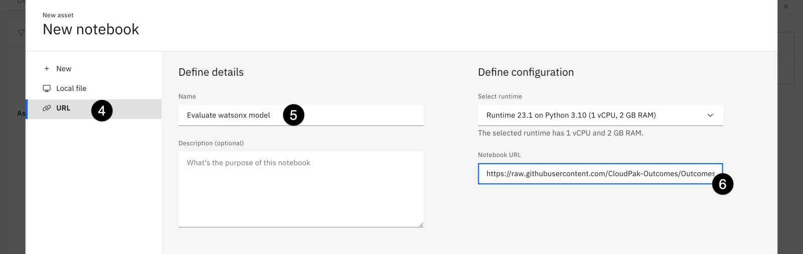

1.  Click the **Create** button in the bottom right to create the notebook. The notebook will be downloaded from Github and made available for editing.
    
2.  Enter the credentials you gathered in first code cell. The **CPD** credentials will be identical to those you used in the previous notebook. You gathered the **WATSONX** credentials during the configuration lab when you deployed the watsonx prompt template to a deployment space. The **WATSONX\_MODEL\_TITLE** will be the name of the model you created in the governance console in a previous step. If you followed the directions exactly, you named it **watsonx Resume Summarization**, which has been already added to the cell. The **API\_KEY** value in this cell refers to the Cloud Pak for Data API key you generated with the created user, and used in the previous notebook.
    


9.  Execute the cells of the notebook, reading the comments and paying attention to what each cell is doing. The notebook will download sample data query the watsonx model, then evaluate those responses for a variety of metrics. Finally, the metrics will be written to the model's entry in watsonx.governance.

## 9\. View the metrics in the governance console

Now that the metrics have been calculated, they can be viewed in the governance console.

1.  Signed in as the **complianceofficer** user in the watsonx governance console, click on the **hamburger menu** in the upper left.
    
2.  Click on the **Inventory** menu item to expand it.
    
3.  Click on the **Use Cases** menu item. The **Use Cases** tab opens.
    


4.  Locate the **Resume summarization** use case from the list and click on it. The **Use Case** tab opens.
    
5.  Scroll down to the **Relationships** section of the screen. Note that the **Resume summarization** parent node has two listed **Models** as child nodes.
    
6.  Click on the circle for the **Models** node to expand it.
    


7.  The Azure and watsonx resume summarization models you created and assigned to the use case are listed here. Click on one of them. The **Model** information panel opens on the right, showing the model details.
    
8.  Click on the **Open in tab** button at the top right of the panel. The model will open in a new tab in the governance console.
    

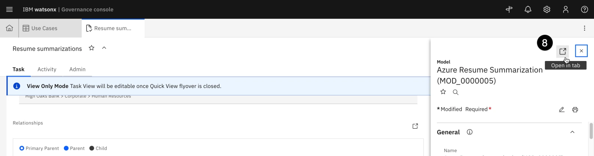

9.  Scroll down to the **Associations** section of the window. The different computed model metrics are displayed in a table. Click on one of them to view the evaluation score.


10.  The evaluation shows in the **Metric Values** section of the table.

> **Note:** The functionality for monitoring and displaying metrics for third-party generative models is under **rapid** development. In June 2024, a new release of watsonx.governance will significantly expand this capability and improve integration into the governance dashboard. If you would prefer to show your client more detailed visualizations of the metrics prior to that release, the best solution is to evaluate the watsonx model in the SaaS environment.

Congrats this is the end of lab 207! You can now proceed to **[Lab 208](/watsonx/watsonxgov/level-4/208)**.
