# 208: Govern predictive models

While much of the industry focus has been on ChatGPT and generative AI, the vast majority of models solving real-world business problems in production are traditional predictive machine learning models. Most organizations would significantly benefit from a governance solution for their predictive models, particularly given the increased regulatory environment.

In this section of the lab, you will create a model to make hiring recommendations for the HR department. You will then evaluate that model and compare it to an external model running on Amazon SageMaker.

## 1\. Create a hiring model use case

As discussed in the generative model section, model governance starts with a use case request.

1.  Signed in as the **complianceofficer** user in the watsonx governance console, click on the **hamburger menu** in the upper left.
    
2.  Click on the **Inventory** menu item to expand it.
    
3.  Click on the **Use Cases** menu item. The **Use Cases** tab opens.
    


4.  Click on the **New** button on the right. The **New Use Case** tab opens.


5.  Enter **Application screening** into the **Name** field.
    
6.  Enter **complianceofficer** into the **Owner** field.
    
7.  Enter **Screen applications for positions** or similar text in the **Description** field.
    


8.  Scroll down the **Business Entities** section and click the **Add** button. The **Add** dialog opens.
    
9.  Locate the **Human Resources** entity from the list and click on it.
    
10.  Click **Done** to add the entity and close the dialog.
    


11.  Click the **Save** button in the upper right to save the use case information.

You will now need to follow the same process you used for the generative model use case as described in Lab 207 [Progress the use case to the next phase](/watsonx/watsonxgov/level-4/207#3-progress-the-use-case-to-the-next-phase) and [Identify use case risks](/watsonx/watsonxgov/level-4/207#4-identify-use-case-risks) to approve the model use cases for the predictive models. When you have finished, proceed to the next step.

## 2\. Create a deployment space for the hiring model

Now that the use case for the model has been approved, you can create the models. The steps in this section would be typically undertaken by data scientists and AI engineers, as they work with data developed and cleaned by the data engineers to build models. This lab does not focus on the details of model creation and deployment; instead, you will rapidly prototype a model using [IBM's AutoAI service](https://www.ibm.com/docs/en/cloud-paks/cp-data/4.8.x?topic=models-autoai), and deploy it in your environment. Next, you will evaluate it as well as a similar model deployed on AWS SageMaker.

1.  Return to the Cloud Pak for Data home screen, signed in as the created user.
    
2.  Click on the **hamburger menu** in the upper left to open it.
    
3.  Click on the **Deployments** menu item. The **Deployments** screen opens.
    

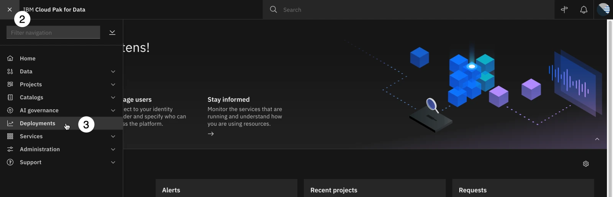

4.  Click the **New deployment space** button to create a deployment space. A [deployment space](https://dataplatform.cloud.ibm.com/docs/content/wsj/analyze-data/ml-spaces_local.html?context=cpdaas) is an object in Cloud Pak for Data and watsonx that contains deployable assets, deployments, deployment jobs, associated input and output data, and the associated environments.
    
5.  Enter **application screening development** in the **Name** field.
    
6.  Click on the dropdown for **Deployment stage** and select **Development**. This metadata for the space will be used by the monitoring service (OpenScale) to determine how data for the model is stored in the datamart when performing evaluations. Predictive models hosted internally (in the same Cloud Pak for Data environment as the monitoring service) that are deployed to **Production** spaces will automatically have their input and output data recorded in the datamart, and evaluations will be performed on that data. Models hosted in non-production spaces will be evaluated based on comma-separated value (CSV) file uploads.
    

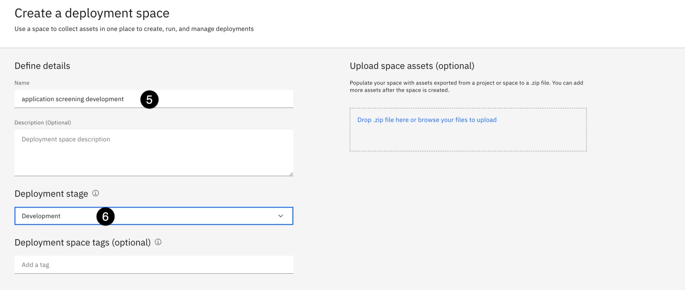

7.  Click **Create** to create the deployment space. When the space is finished creating, you will be able to deploy models to it as REST endpoints, and can begin monitoring the models in the monitoring service.
    
8.  When the dialog window shows **The space is ready**, click the **View new space** button. The new space opens.
    

## 3\. Create the hiring model

Next, you will build the hiring model, and begin tracking it through the approved hiring use case you created and moved through the workflow in previous steps.

1.  Click on the **hamburger menu** in the upper left.
    
2.  Click on the **Projects** menu item to open it.
    
3.  Click on the **All projects** menu item. The **Projects** screen opens.
    


4.  Click the **New project** button to create a new project.
    
5.  Click the **Create an empty project** tile. The **New project** screen opens.
    


6.  Enter **hiring model development** in the **Name** field.
    
7.  Click the **Create** button. A new empty project will be created, and will open to the **Overview** tab.
    
8.  Right click on the link for the [hiring training data file](https://raw.githubusercontent.com/CloudPak-Outcomes/Outcomes-Projects/main/watsonx-governance-l4/data/hiring_training_data.csv) and save it to your hard drive. Ensure that the file is saved with the **.csv** (comma-separated value) extension.
    
9.  From the **Data in this project** panel of the project screen, click the **Drop data files here...** link. The system file explorer opens. Browse to the file you downloaded and import it. When the file has been imported, it will show in the **All assets** list in the center of the screen.
    
10.  Click on the **New asset** button. The **New asset** window opens.
    


11.  From the **Automated builders** section, click on the **AutoAI** tile. The **Create an AutoAI experiment** window opens.
    
12.  In the **Define details** section, enter **application screening experiment** in the **Name** field.
    


13.  Click **Create** to create the experiment. The **Add data source** window opens.
    
14.  Click the **Select data from project** button. The **Select data from project** window opens.
    
15.  From the **Categories** list, click on the **Data asset** item. The **Data assets** list appears, showing all data assets in your project.
    
16.  Check the box to the left of the training data file you uploaded to the project.
    

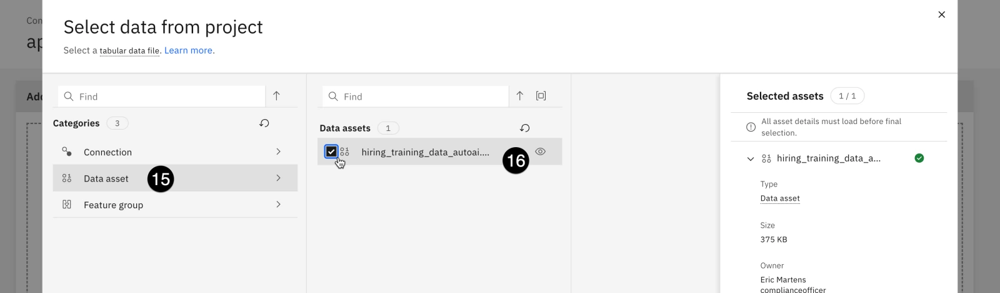

17.  Click the **Select asset** button in the bottom right. The **Configure details** panel opens.
    
18.  Click **No** in the **Create a time series analysis?** section.
    
19.  In the **What do you want to predict?** section, click on the **Prediction column** dropdown and select **HIRED**.
    
20.  Click the **Run experiment** button. The AutoAI service begins running, generating eight potential pipelines for a machine learning model. Note that it can take up to ten minutes to finish.
    

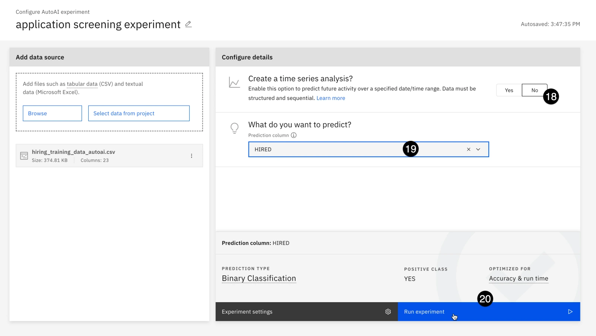

When the service finishes, the **Experiment summary** screen will show the pipelines generated, ranked based on accuracy. Note that the algorithm with the highest accuracy will likely differ than the screenshot below, based on the random selection of training and test data performed by the model.

21.  From the **Pipeline leaderboard** table, click on the entry with the highest accuracy score. The **Pipeline details** window opens.
    
22.  From the **Model viewer** section on the left, click on the **Feature summary** item. The **Feature summary** is displayed, ranking features by their importance. The more important the feature, the greater the effect it has on the output of the model when it is altered.
    
23.  Make a note of the important features for your model. In the screenshot below, **InterviewScore** and **YearsAtCurrentCompany** are by far the most important features; the ones in your model may differ. You will use this information later when configuring the drift V2 monitor.
    


24.  Click the **x** icon in the upper right of the **Pipeline details** window to close it.
    
25.  From the **Pipeline leaderboard** table, hover your mouse over the entry with the highest accuracy score. Click on the **Save as** button that appears. The **Save as** window opens.
    


26.  Click the **Create** button in the bottom right to save the pipeline as a model in your project.
    
27.  When the model finishes saving, a **Saved model successfully** notification will appear on your screen. Click the **View in project** link in the notification to go to the model information screen.
    


28.  To create a Factsheet for the model, it must be tracked as part of an AI use case. Click the **Track in AI use case** button in the **Governance** section. The **Track in AI use case** window opens, with a list of available use cases. Note that this list has been automatically populated with the list of use cases created in the governance console.

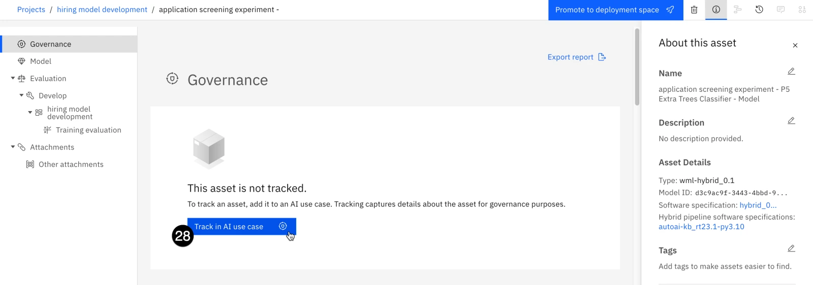

29.  Select the **Application screening** use case from the list.


30.  Click the **Next** button. The **Define approach** screen opens.
    
31.  Click on the **Next** button. The **Define asset record** screen opens. This screen allows you to specify an existing model entry created in the governenace console (OpenPages). Because you have not already created a model entry for this model, click on the tile for **New asset record**.
    

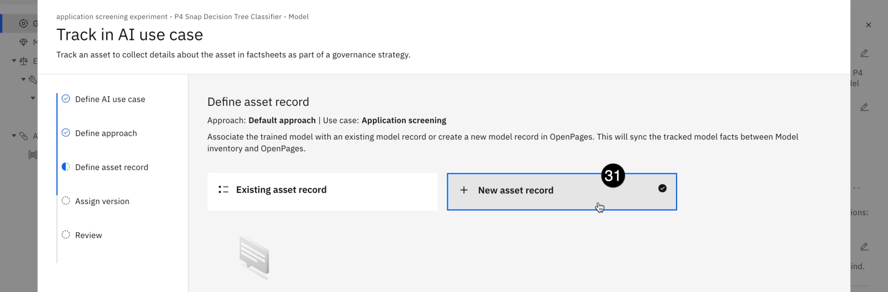

32.  Click the **Next** button. The **Assign version** screen opens. The version will be included in model metadata in the Factsheet.
    
33.  Click on the **Stable** tile to reflect a model that the model developers are ready to have evaluated.
    
34.  Click on the **Next** button. The **Review** screen opens.
    
35.  Click on the **Track asset** button to add the model to the use case. After the model is added, the Factsheet opens, displaying governance information.
    

Note that you may receive an error message that the model was not reachable, or that it is already being tracked; this typically occurs if the system call to track the model takes longer than expected to return, and can typically be fixed by refreshing the screen.

## 4\. Deploy the model

Now that the model has been added as part of the use case, the model Factsheet will start automatically collecting metadata about the model, including deployments, evaluation metrics, and more. If you wish, you can open the **Models** view from the inventory in the governance console to see how that data is represented there; you can also find it in the view of the **Application screening** use case.

Take a moment to review the information presented on the Factsheet. In the **Lifecycle** section, the model is shown as being in the **Develop** phase. You can see the model creator, the creation date, software specification, prediction type, and information on the training data features. Additionally, since the model was created in AutoAI, the initial evaluation done while training the model is available, showing model quality features such as **Accuracy**, **F1**, and **Precision**.

1.  When you have finished reviewing the Factsheet, click the **Promote to deployment space** button at the top of the screen. The **Promote to space** window opens.

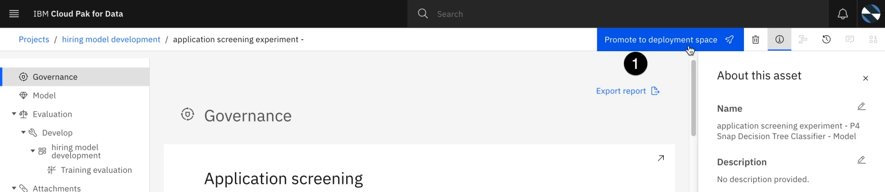

2.  Click on the **Target space** dropdown and select the deployment space you created in a previous step.
    
3.  Check the box to the left of **Go to the model in the space after promoting it**.
    


4.  Click the **Promote** button to promote the model to the space. Promoting the model can take up to a minute. When the process has finished, the deployment information screen for the model opens.
    
5.  Click the **New deployment** button. The **Create a deployment** window opens.
    

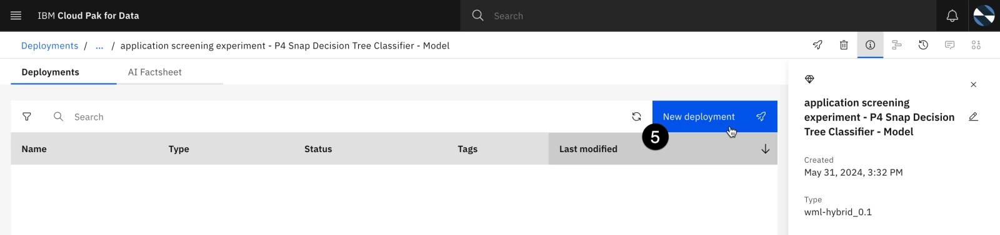

6.  Enter **application screening - dev** in the **Name** field.
    
7.  Click the **Create** button to create the deployment. The **Create a deployment** window closes. The deployment you created now shows in the list, with the **Status** field showing as **Initializing**. It may take up to two minutes for the deployment to be ready.
    
8.  When the **Status** field changes to **Deployed**, click on the name of the deployment. Its information screen opens.
    

## 5\. Configure model info

Models can be evaluated at any point during their lifecycle. In the next step, you will configure the evaluation settings.

1.  Click on the **Evaluations** tab.
    
2.  Click on the **Configure OpenScale evaluation settings** button. The **Associate a service instance** dialog opens.
    

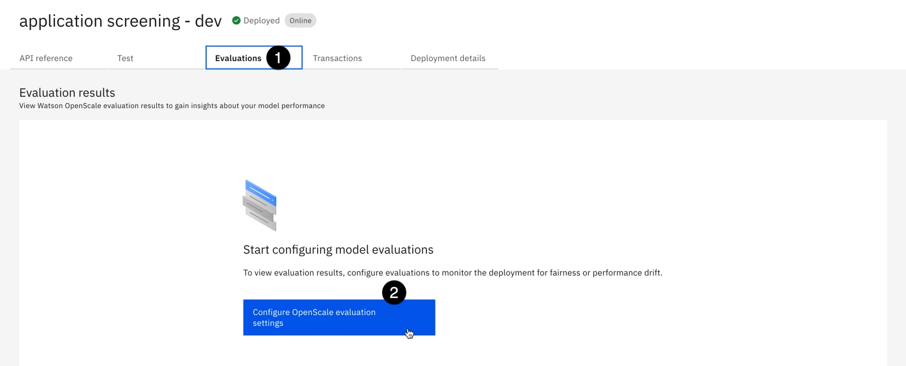

3.  Click the **Associate a service instance** button. The deployment space will be added as a machine learning provider for the watsonx.governance monitoring service (OpenScale), and a subscription will be created for the model. Note that you may receive an error or failure message here; typically, this is again related to a service call taking longer than expected and can be ignored.
    
4.  Click on the **hamburger menu** in the upper left.
    
5.  Click on the **Services** menu item to expand it.
    
6.  Click on the **Instances** menu item. The **Instances** screen opens.
    
7.  Locate the watsonx.governance monitoring service (OpenScale) instance from the list. Click the three vertical dots in the far right column of the list and click **Open**. The **Insights dashboard** opens.
    
8.  Note that a tile for your deployed model appears on the dashboard. Click on it. The subscription details screen opens.
    


9.  Click on the **Actions** button. The **Actions** menu opens.
    
10.  Click on the **Configure monitors** menu item. The **Model details** screen opens.
    

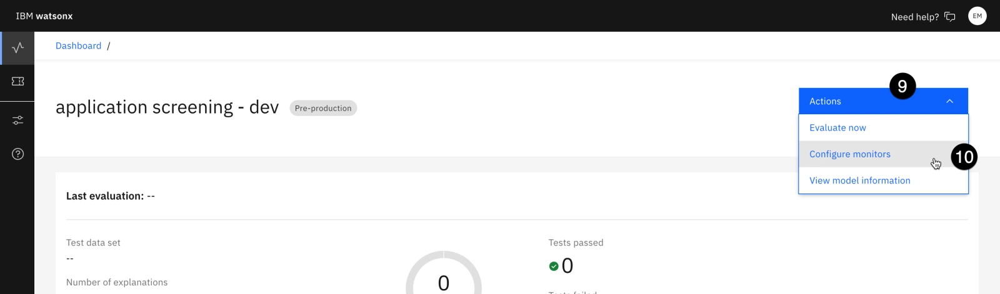

Note that much of the information, including training data label, features, and model output details have already been automatically gathered from the model metadata.

11.  Click on the **Edit** icon in the **Configuration package** tile.


12.  Click on the **Next** button to perform a manual setup.
    
13.  Providing the training data file to watsonx.governance will allow you to more easily configure the **Drift v2** monitor. Click the link to browse to the [hiring\_training\_data.csv](https://github.com/CloudPak-Outcomes/Outcomes-Projects/raw/main/watsonx-governance-l4/data/hiring_training_data.csv) file you downloaded to your machine earlier to train the model.
    
14.  Click on the **Select delimiter** dropdown and select the **Comma (,)** option from the list.
    

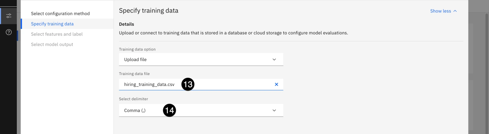

15.  Click on the **Next** button. Watsonx will take up to a minute to read in the data file.
    
16.  From the list of columns, ensure that **HIRED** is identified as the **Label/Target**.
    
17.  Scroll to the bottom of the list and check the **Categorical** box for the **IsFemale** feature to denote that this feature is categorical.
    
18.  Click on the **Next** button. The **Select model output** screen opens.
    


19.  Verify that the **Prediction** and **Probability** features are correctly identified, and click on the **View summary** button.
    
20.  Click on the **Finish** button to save your configuration. Completing the setup can take up to two minutes to finish.
    

## 6\. Configure explainability and fairness

Next, you will configure the explainability service and the fairness monitor.

1.  In the **Explainability** section, click **General settings**.


2.  Click the **Edit** button in the **Explanation method** tile. Watsonx.governance offers two different algorithms to explain predictions: LIME (Local Interpretable Model-Agnostic explanations), and SHAP (SHapley Additive exPlanations).
    
3.  Click the **Next** button to use the LIME method.
    
4.  You can upload an explainability archive to use for explaining predictions. Click the **Next** button to continue without uploading the archive. The **Controllable features** panel opens.
    
5.  You can designate certain features of the model as controllable, and can subsequesntly choose to include or exclude features that you cannot control when running an analysis. Use the switches to adjust controllable features as you wish, then click the **Save** button to save your choices.
    
6.  From the **Evaluations** section in the left panel, click on **Fairness**.
    
7.  Click on the **Edit** button in the **Configuration** tile.
    
8.  The **Configure manually** configuration type has been selected. Click the **Next** button.
    

To monitor fairness, you need to identify favorable and unfavorable outcomes, as well as monitored and reference groups. In this particular model, **1** represents a hiring recommendation, and is a favorable outcome. **0** represents a no-hire recommendation, and is unfavorable.

9.  Enter **0** in the **Select the favorable outcomes** field and click the **Add value** button.


10.  Enter **1** in the **Select the favorable outcomes** field and click the **Add value** button.
    
11.  Use the checkboxes to mark **0** as **Unfavorable** and **1** as **Favorable**.
    


12.  Click on the **Next** button. The **Sample size** screen opens.
    
13.  Enter **100** in the **Minimum sample size** field. This will allow you to calculate evaluations without needing more than 100 rows of data.
    
14.  Click on the **Next** button. The **Metrics** screen opens.
    

Multiple metrics are available for measuring fairness. Two of them (**Disparate impact** and **Statistical parity difference**) can be calculated at runtime strictly from data being submitted to the model. The others require feedback (ground truth) data. More information on the metrics can be found in the [watsonx.governance documentation](https://www.ibm.com/docs/en/watsonx/saas?topic=evaluations-fairness-metrics).

15.  Click on the **Next** button.
    
16.  The [standard threshold for disparate impact](https://labor.hawaii.gov/wp-content/uploads/2012/12/WIA-MOA-Element-7-2012-Exhibit-J-Adverse-80-Rule.pdf) is 80%, though it can be adjusted to meet specific requirements.
    
17.  Click on the **Next** button. The **Select the fields to monitor** screen opens.
    
18.  Scroll down in the table on the right and check the box to the left of the **IsFemale** item.
    
19.  Click on the **Next** button.
    


In this model, females are denoted with a **1** in the IsFemale feature column, while males are denoted with a **0**. Note that in a real-world example, you would use the indirect bias detection feature explored in the [watsonx governance level 3 labs](/watsonx/watsonxgov/202).

1.   Click the **Add value** button to add the 0-0 range to the table.
    
2.   Enter **1** in both text entry boxes and click **Add value** to add the 1-1 range to the table.
    
3.   Click the checkboxes to designate the **0** value (0-0 range, males) as **Reference** group and the **1** value (1-1 range, females) as the **Monitored** group.
    

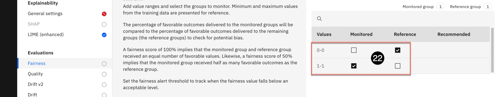

23.  Click the on **Next** button.
    
24.  Note that you have the option to set different thresholds for each fairness monitor. Click on the **Save** button to save your fairness configuration.
    

## 7\. Configure quality and drift

Next, you will configure the quality and drift monitors. Drift refers to the degradation of model performance due to changes in data or changes in relationships between input and output.

1.  From the **Evaluations** section on the left, click on the **Quality** item.
    
2.  Click on the **Edit** icon in the **Quality thresholds** tile.
    


3.  Over a dozen quality metrics are automatically calculated by watsonx.governance. You can find more information on each of them in the [documentation](https://www.ibm.com/docs/en/watsonx/saas?topic=evaluations-quality). Click on the **Next** button to accept the default thresholds.
    
4.  Enter **100** in the **Minimum sample size** field.
    
5.  Click on the **Save** button to save your configuration.
    
6.  From the **Evaluations** section on the left, click on the **Drift v2** item.
    
7.  Click on the **Edit** icon in the **Compute the drift archive** tile.
    


8.  Because you uploaded the training data earlier when configuring the monitors, you now have the option to let Watson OpenScale compute the necessary statistics to measure drift. Click on the **Next** button.
    
9.  Leave the default drift thresholds set to their default values. Click on the **Next** button. The **Important features** screen opens.
    
10.  When developing the model in AutoAI, you identified the features that had the greatest impact on the model's output. Locate those features in the list and check the boxes to the left of them to mark them as important.
    
11.  Once all of the important features have been identified, click on the **Next** button to continue. The **Most important features** screen opens.
    

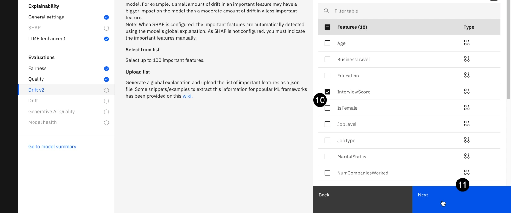

12.  Check the box to the left of the most important feature to identify it.
    
13.  Click on the **Next** button to continue.
    
14.  Leave the **Minimum sample size** value set to its default and click the **Save** button. Watson OpenScale begins training the drift model in the background. This process can take up to five minutes. Once it has finished, the monitors will be fully configured and the model can be evaluated.
    

## 8\. Evaluate the AutoAI model

Evaluation methods in watsonx.governance differ depending on whether the models are deployed to production spaces or pre-production spaces. Production models hosted in the same environment as watsonx.governance automatically register their input and output into the watsonx.governance datamart. Third-party production models can use a REST API to write their input and output into the datamart. Pre-production models are evaluated by uploading data in comma-separated value (CSV) files.

1.  Right click on the link for the [hiring\_evaluation\_data.csv](https://github.com/CloudPak-Outcomes/Outcomes-Projects/raw/main/watsonx-governance-l4/data/hiring_evaluation_data.csv) file and download it to your machine.
    
2.  Click on the **Dashboard** link in the upper left corner of the screen to return to the **Insights dashboard**.
    

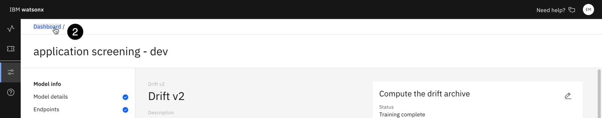

3.  Click on the tile for your deployed model. The subscription details screen opens.
    
4.  Click on the **Actions** button. The **Actions** menu opens.
    
5.  Click on the **Evaluate now** menu item. The **Import test data** panel opens.
    

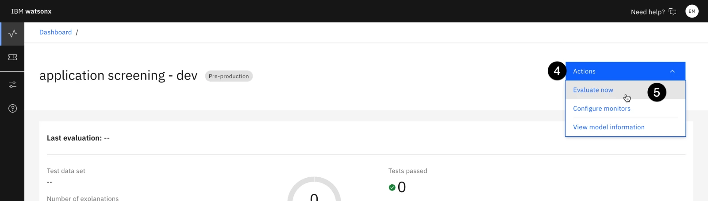

6.  Click on the **Import** dropdown and select **from CSV file**.
    
7.  Click the link to browse to the _hiring\_evaluation\_data.csv_ file you downloaded in step 1.
    


8.  Click on the **Upload and evaluate** button to begin the evaluation. Note that the evaluation can take up to five minutes to complete.
    
9.  When the evaluation has finished, take a moment to review the results. The model has likely failed several tests. Clicking on the individual monitors provides further details.
    

At this point, you can find the model in the governance console and view the metrics associated with it. You may do so now if you wish. Next, you will evaluate a third-party model deployed to Amazon SageMaker. Instructions for reserving an account that can connect to this model are in the [environment configuration lab](/watsonx/watsonxgov/level-4/201#getting-amazon-sagemaker-credentials-optional).

## 9\. Add the SageMaker model to the dashboard

1.  Return to the watsonx monitoring (OpenScale) Insights dashboard and click on the **Configure** button. The **System setup** screen opens.

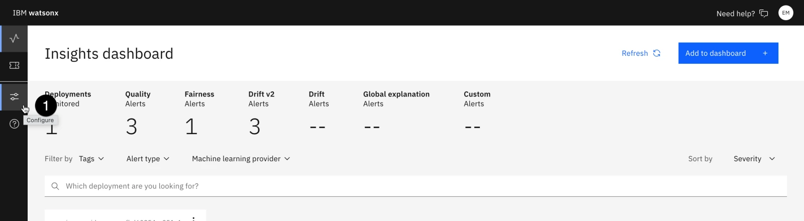

2.  From the **Required** section in the left panel, click on **Machine learning providers**.
    
3.  Click on the **Add machine learning provider** button.
    


4.  Click the **Edit** button for the **Machine learning providers** to edit the provider name.


5.  Enter **SageMaker development** in the text field and click the **Apply** button.
    
6.  Click on the **Edit** button in the **Connection** tile. The **Connection** panel opens.
    
7.  Click on the **Service provider** dropdown. Note the different pre-built connectors available, including Microsoft Azure ML Studio and Microsoft Azure ML Service. Select **Amazon SageMaker** from the list.
    


Enter your SageMaker credentials from your [TechZone reservation](https://techzone.ibm.com/my/reservations).

8.  In the **Access key ID** field, enter the **AWS\_ACCESS\_KEY\_ID** value from your reservation.
    
9.  In the **Secret access key** field, enter the **AWS\_SECRET\_ACCESS\_KEY** value from your reservation.
    
10.  In the **Region** field, enter the **Region** value from your reservation.
    

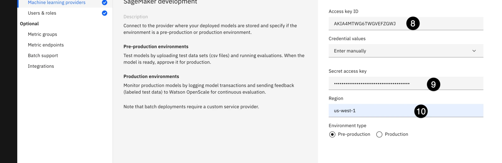

11.  Click on the **Save** button to save the SageMaker service as a machine learning provider for watsonx.governance.
    
12.  Click on the **Insights dashboard** button to return to the dashboard.
    

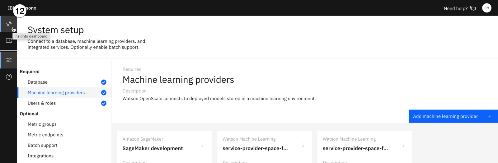

13.  Click on the **Add to dashboard** button. The **Select a model deployment** window opens.
    
14.  In the **Select model location** section, click on the **Machine learning Providers** button. A list of providers appears.
    
15.  Click on the **SageMaker development** provider from the list.
    

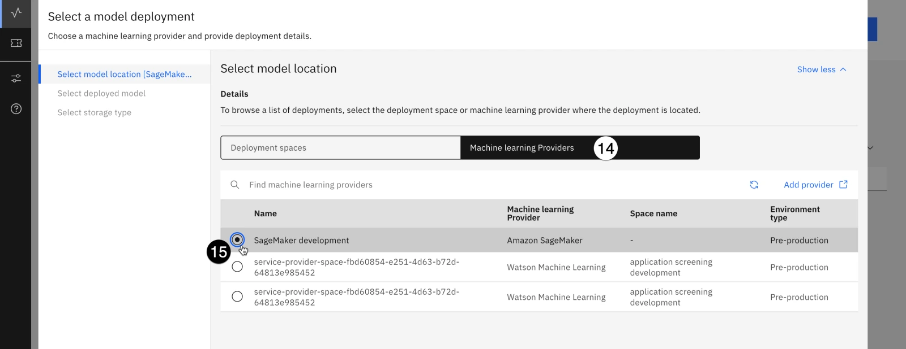

16.  Click on the **Next** button. The monitoring service will query the SageMaker service using the credentials you provided to get a list of deployed model endpoints.
    
17.  Click on the **hiring-endpoint-scoring...** deployment from the list.
    


18.  Click on the **Next** button. The **Select storage type** window opens.
    
19.  Click on the **Data type** dropdown and select **Numeric/categorical** from the list.
    
20.  Click on the **Algorithm type** dropdown and select **Binary classification** from the list.
    


21.  Click on the **View summary** button.
    
22.  Click on the **Save and continue** button to add the deployed model to the dashboard. The **Configure hiring-endpoint...** screen opens.
    

## 10\. Configure the SageMaker monitors

Next, you will configure the SageMaker model information and monitors.

1.  Leave the **Configuration method** set to **Manual setup** and click on the **Next** button. The **Specify training data** window opens.
    
2.  Click the link to browse to the [hiring\_training\_data.csv](https://github.com/CloudPak-Outcomes/Outcomes-Projects/raw/main/watsonx-governance-l4/data/hiring_training_data.csv) file you downloaded to your machine earlier to train the AutoAI model. The same file was used to train the SageMaker model.
    
3.  Click on the **Select delimiter** dropdown and select the **Comma (,)** option from the list.
    
4.  Click the **Next** button. The monitoring service reads the CSV file. The **Select the feature columns and label column** screen opens.
    
5.  Check the **Label / Target** box for the **HIRED** column.
    
6.  Check the box in the table header row to select the remaining columns as features.
    
7.  Click on the **Next** button. The monitoring service queries the model to determine the structure of its output. The **Select model output** screen opens.
    


8.  Check the **Prediction** box for the **predicted\_label** field.
    
9.  Check the **Probability** box for the **score** field.
    

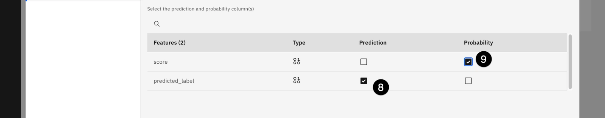

10.  Click on the **View summary** button.
    
11.  Click on the **Finish** button to finalize your configuration.
    
12.  Configure the model monitors and explainability service for the SageMaker model using the same values and thresholds you used for the AutoAI model, making sure to set the minimum records required for fairness and quality scoring to **100**.
    

## 11\. Evaluate the SageMaker model

1.  Return to the **Insights dashboard** for the monitoring service.
    
2.  Click on the tile for the **hiring-endpoint-scoring** model.
    
3.  Click on the **Actions** button to open the **Actions** menu.
    
4.  Click on **Evaluate now** from the list of actions.
    
5.  Click on the **Import** dropdown and select **from CSV file**.
    
6.  Click the link to browse to the [hiring\_evaluation\_data.csv](https://github.com/CloudPak-Outcomes/Outcomes-Projects/raw/main/watsonx-governance-l4/data/hiring_evaluation_data.csv) file you used to evaluate the AutoAI model.
    
7.  Click on the **Upload and evaluate** button to begin the evaluation. Note that the evaluation can take up to five minutes to complete.
    
8.  When the evaluation has finished, take a moment to review the results. Compare the evaluations for this model with the AutoAI model.
    

## 12\. Link the SageMaker model to the use case

Now that the SageMaker model has been evaluated, it will appear in the **External models** page found in the **AI governance** menu. However, the model entry defaults to the **admin** user as the owner. In order to add it to the use case, you will need to log in as the **admin** to add it to the use case.

Again, due to issues with watsonx governance console sessions, it is **HIGHLY ADVISED** that you use a different browser or a browser window running in private/incognito mode when changing users.

1.  Log into the Cloud Pak for Data home screen as the **admin** user that you used to do the configuration steps.
    
2.  Click on the **hamburger menu** in the upper left.
    
3.  Click on the **AI governance** menu item to expand it.
    
4.  Click on the **External models** menu item. The **External models** screen opens.
    

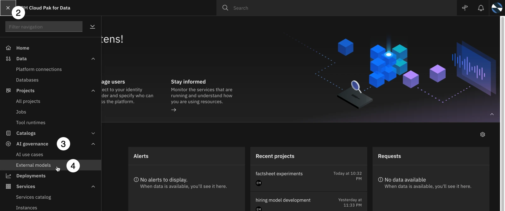

5.  Locate the external hiring model in the list and click on the **three vertical dots** to the right of the model. The context menu opens.
    
6.  Click on the **Track in AI use case** menu item from the context menu. The **Track in AI use case** window opens.
    

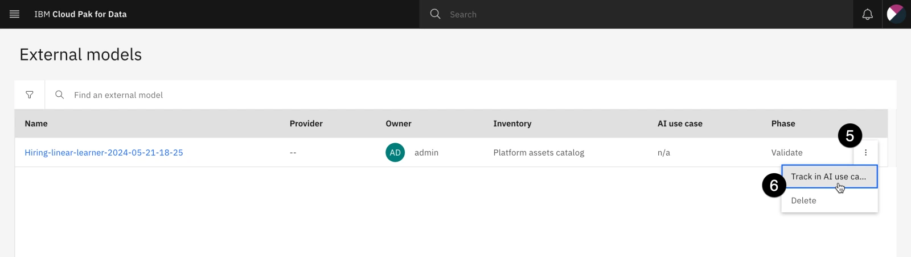

7.  Locate the **Application screening** use case in the list and check the circle to the left of the use case name to select it.


8.  Click on the **Next** button. The **Define approach** window opens.
    
9.  Click on the **Next** button to accept the default approach. The **Define asset record** window opens.
    
10.  Click on the **New asset record** tile to create a new record for the model in the inventory and the governance console.
    


11.  Click on the **Next** button. The **Assign version** window opens.

The versions listed here refer to there already being a model defined for this particular use case; the AutoAI version of the model was created as version 1.0.0. Therefore, this model is seen as an iteration on the AutoAI model, with version numbers changing to reflect that. Choose the version change as desired or leave it set to **Patch change**.

12.  Click on the **Next** button. The **Review** window opens.
    
13.  Click on the **Track asset** button to being tracking the asset in the use case.
    

## 13\. View the model metrics in the use case

1.  Return to the governance console, signed in as the created user, and click on the **hamburger menu** in the upper left corner.
    
2.  Click on the **Inventory** menu item to expand it.
    
3.  Click on the **Use Cases** menu item. The **Use Cases** tab opens.
    


4.  Uncheck the **Active Only** box to be able to see all use cases.


5.  Click on the **Application screening** use case from the list.
    
6.  Scroll down to the **Performance Monitoring** section. Note that the metrics for both models are combined here, organized into breach status for major categories such as quality, fairness and more. You can explore the metrics in detail, clicking into each to find more information.
    

Note that you can also view the model metrics, and the updates made to the model lifecycle, in the model Factsheet. The Factsheet can be found in the **AI use cases** page of the **AI governance** section of Cloud Pak for Data.

Metrics data is generated by the watsonx.governance monitoring service (OpenScale), and automatically written to the Factsheet, then automatically updated in the governance console. In this way, data is always kept in sync and stakeholders automatically receive the most current information in the format that is most useful for them.

## 14\. Promote the model to production

In this section, you will promote the AutoAI-created model to a production deployment space to see how this change is reflected in the model lifecycle and how it affects the appearance and calculations of metrics data.

1.  From the Cloud Pak for Data home screen, click the **hamburger icon** in the upper left.
    
2.  Click on the **Projects** menu item to expand it.
    
3.  Click on the **All projects** menu item. The **Projects** screen opens.
    


4.  From the list of projects, click on the **hiring model development** project. The project information screen opens.
    
5.  Click on the **Assets** tab to open it.
    
6.  CLick on the **three vertical dots** to the right of the **application screening...** model to open the context menu.
    
7.  Click on the **Promote to space** menu item. The **Promote to space** window opens.
    


8.  Click on the **Target space** dropdown and select **Create a new deployment space**. The **Create a deployment space** window opens.


9.  Enter **application screening production** in the **Name** field.
    
10.  Click on the **Deployment stage** dropdown and select **Production**.
    
11.  Click **Create** to create the space, which can take up to two minutes.
    


12.  Click the **x** icon to close the **The space is ready** dialog. The **Promote to space** window opens.
    
13.  Check the box to the left of **Go to the model in the space after promoting it**.
    


14.  Click the **Promote** button to promote the model to the space. Promoting the model can take up to a minute. When the process has finished, the deployment information screen for the model opens.
    
15.  Click the **New deployment** button. The **Create a deployment** window opens.
    
16.  Enter **application screening - production** in the **Name** field.
    
17.  Click the **Create** button to create the deployment. The **Create a deployment** window closes. The deployment you created now shows in the list, with the **Status** field showing as **Initializing**. It may take up to two minutes for the deployment to be ready.
    
18.  When the **Status** field changes to **Deployed**, click on the link for the deployment name. The deployment information screen opens to the **API reference** tab.
    


19.  Click on the **Copy** button for the **Deployment ID** value in the information panel on the right to copy it to your clipboard. You will use this value in upcoming steps in a Jupyter notebook as the **DEPLOYMENT\_ID** value.
    
20.  Click on the **Deployments breadcrumb** link at the top of the screen. The list of deployment spaces opens.
    


21.  Click on the **application screening production** space from the list.
    
22.  Click on the **Manage** tab.
    
23.  Click on the **Copy** icon for the **Space GUID** value to copy it to your clipboard. You will use this value in upcoming steps in a Jupyter notebook as the **SPACE\_GUID** value.
    

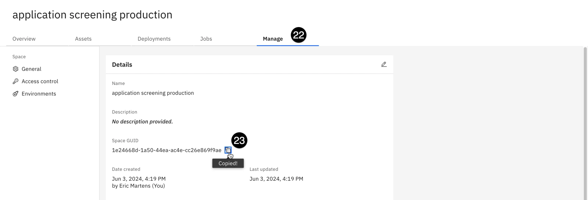

The model has now been deployed to a production deployment space. In the next step, you will configure monitoring for a production model.

## 15\. Configure production monitoring

Now that the model has been deployed to a production space, you can configure it to be monitored as if it were in a production environment. For models in production environments, watsonx.governance records all input and output data of the model in a datamart, which is a set of tables in the Db2 database you configured for the monitoring service (OpenScale) in the environment configuration lab.

For IBM models hosted in the same environment as your watsonx.governance services (in this case, the AutoAI hiring model), that data is automatically written to the datamart without any further effort or code required. For third-party models or IBM models hosted in other environments (the SageMaker hiring model, the Azure and watsonx resume summarization models) that data must be written to the datamart using API calls.

Additionally, for production environments, the monitoring service will automatically run at timed intervals to take evaluations. Fairness and quality are evaluated hourly, and drift is evaluated every three hours. Disparate impact (fairness) and drift are computed based on the model input and output, and do not require additional ground truth feedback data. Quality **does** require the upload of additional ground truth feedback data.

1.  Return to the watsonx.governance monitoring service (OpenScale) Insights dashboard. Recall that it can be found from the **Instances** item in the **Services** section of the Cloud Pak for Data home page menu.
    
2.  Click on the **Configure** button on the left.
    


3.  Click on the **Machine learning providers** item in the menu on the left.
    
4.  Click on the **Add machine learning provider** button.
    


5.  Click on the **Edit** icon for the \*\*Machine learning providers.
    
6.  Enter **application screening production space** in the name field and click the **Apply** button.
    


7.  Click on the **Edit** button in the **Connection** tile. The **Connection** window opens.
    
8.  Click on the **Service provider** dropdown and select **Watson Machine Learning (V2)**.
    
9.  Click on the **Location** dropdown and select **Local**.
    
10.  Click on the **Deployment space** dropdown and select the **application screening production** space you created in a previous step.
    
11.  Use the radio button to select the **Production** setting for **Environment type**.
    

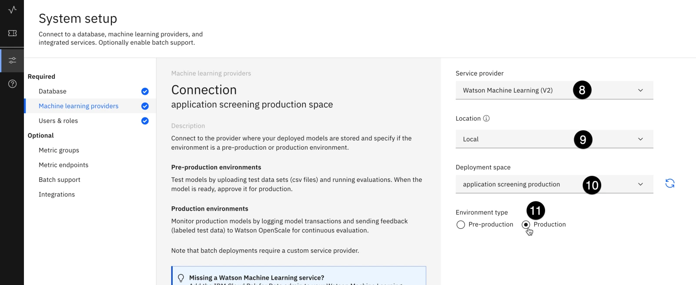

12.  Click on the **Save** button to save the deployment space as a machine learning provider.
    
13.  Return to the **Insights dashboard** by clicking the button in the upper left.
    
14.  Click on the **Add to dashboard** button in the upper right.
    
15.  Use the radio button to select the **application screening production** deployment space from either the **Deployment spaces** list or the **Machine learning providers** list.
    


16.  Click on the **Next** button. The **Select a deployed model** screen opens.
    
17.  Use the radio button to select the **application screening - production** deployment.
    
18.  Click on the **Next** button. The **Select storage type** screen opens.
    

Because you have already configured monitoring for the pre-production version of this model, you can import those settings without having to re-enter all of them.

19.  Check the **Import settings** box.


20.  Click on the **Next** button. The **Select pre-production deployment** screen opens.
    
21.  Use the radio button to select the **application screening - dev** deployment.
    

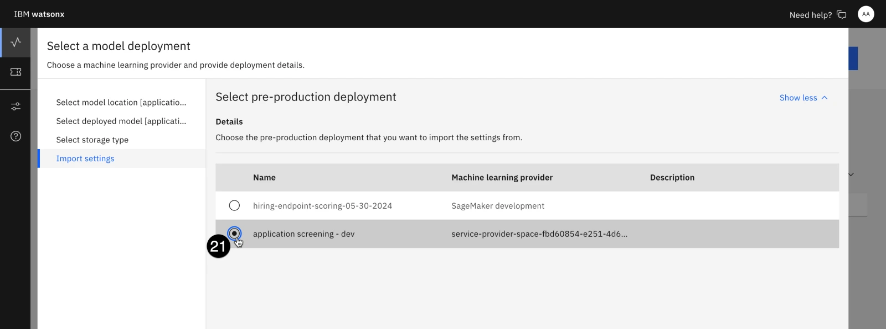

22.  Click on the **View summary** button. The configuration settings for the model appear.
    
23.  Click on the **Finish** button to complete the monitoring configuration.
    

## 16\. Feed data to the model

Because IBM-hosted production models log data directly into the datamart from requests received by the model, you will need to send actual scoring requests to the model to trigger the evaluations. In this step, you will run a Jupyter notebook to feed data to the model.

1.  Click on the **hamburger menu** in the upper left.
    
2.  Click on the **Projects** menu item to expand it.
    
3.  Click on the **All projects** menu item. The **Projects** screen opens.
    


4.  Click on the **hiring model development** project from the list to open it.
    
5.  Click on the **Assets** tab to open it.
    
6.  Click on the **New asset** button. The **New asset** window opens.
    


7.  Scroll down to the **Code editors** section and click on the **Jupyter notebook editor** tile. The **New notebook** window opens.
    
8.  Click on the **URL** option from the panel on the left.
    
9.  Enter **production model feed** into the **Name** field.
    
10.  Copy and paste the following URL into the **Notebook URL** field:

```
https://github.com/CloudPak-Outcomes/Outcomes-Projects/raw/main/watsonx-governance-l4/notebooks/production_model_feed.ipynb

```

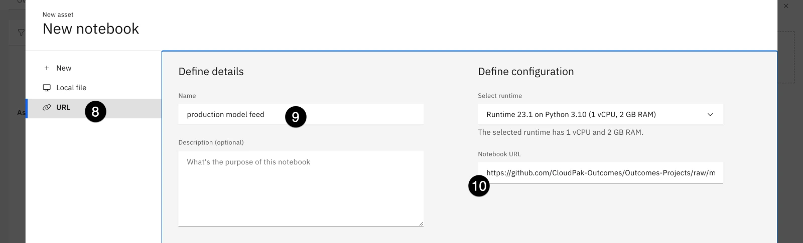

1.   Click the **Create** button to create the notebook.
    
2.   Update the values in the first code cell.
    

*   The **USERNAME** and **PASSWORD** values are for the user you created as part of the lab, and will already be filled out if you have followed the instructions exactly.
*   The **CPD\_URL** value will be the URL of your Cloud Pak for Data environment.
*   The **DEPLOYMENT\_ID** and **SPACE\_GUID** values are the ones you obtained in [Promote the model to production](#14-promote-the-model-to-production).
*   **RECORDS\_TO\_SCORE** is the number of requests that will be sent to the model, and must be greater than or equal to the minimum number of records required for **Fairness** and **Drift** evaluations you configured when setting up the model monitoring.

1.   Run the notebook, examining what the cells are doing. Note that this notebook can be configured as a scheduled job to continually feed data to the model for demo purposes.

Once the notebook has finished, the model's datamart payload log will have enough data to perform fairness and drift evaluations. You can also upload the evaluation data you used for the pre-production models if you would like to calculate model quality.

Take a moment to view the model Factsheets and observe the updates to the model's lifecyle, as well as changes in the governance console.
