#  Smart Assistant, Risk Spotter, and Active Threat Analytics

## 1 Introduction

This lab showcases the following:
 - Smart Assistant functions, which helps quickly configure monitoring for GDPR, PCI, SOX, and other security standards and regulations.
 - Risk Spotter that uses a holistic algorithm to dynamically assess risk factors, and to identify potential risks across the entire system.
 - Active Threat Analytics dashboard that shows potential security breach cases, based on the outlier mining process and on identified attack symptoms.

## 2 Environment Walkthrough

- Log on to the Raptor server as user `root` password `P@ssw0rd`. Ensure that all steps in the
    lab preparation guide have been completed, including enabling malicious traffic. 
> **Note:** Perform the steps in the preparation guide before starting the demo, preferably several hours or more, so that there is sufficient traffic generated.

- On the Raptor server, open a Firefox browser. The browser opens with two tabs, one forthe collector (C200) and another for the Central Manager (MA170). Click the Central Manager (MA170) tab. Login with `labadmin` password `P@ssw0rd`.

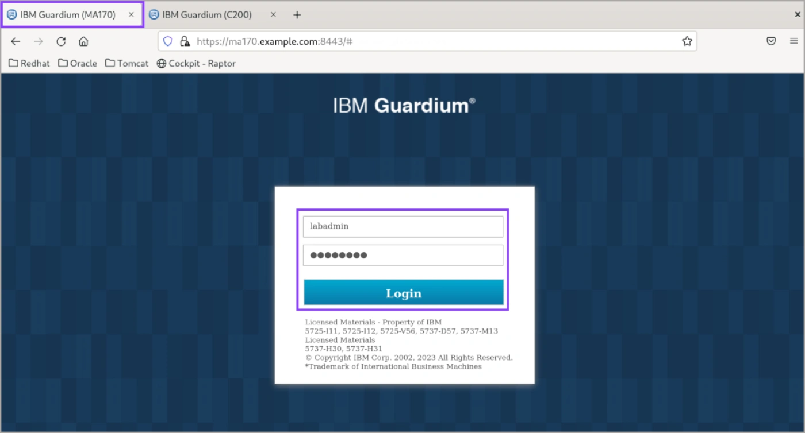

IBM Security Guardium Data Protection solution has its own access management
functions. Access management consists of four tasks: account administration,
maintenance, monitoring, and revocation. Access Management is separate from system
administration duties.
Guardium can define users, roles, permissions, and assign a role to a user to grant specific
access privileges. When a role is assigned to an application, only those Guardium users
who are also assigned that role can access that component.
User definitions can be imported from LDAP.
This demonstration uses an administrative account to access all functions.

- Review the notice dialog and then close it by clicking any area on the main page.

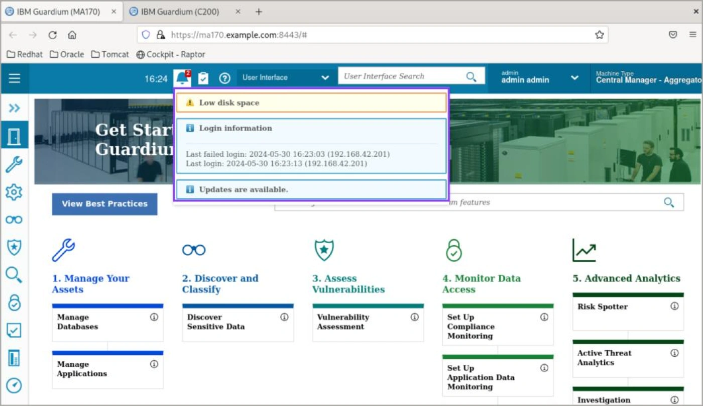

Guardium has hardened appliances. It does not only audit data sources, but it also
monitors itself and reports Guardium user activities. When you login, you see the last login
information, fix pack details if needed, and tasks to review.

- Review the flow in the main page.

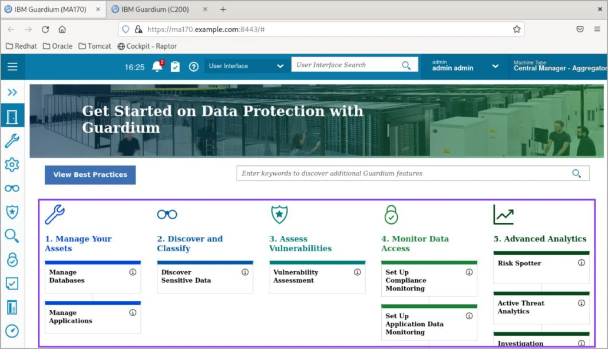

The Guardium welcome page shows a flow for data security that is built on experience in
this area. It starts with managing the assets and identifying data sources and sensitive
data and continues with vulnerability assessments to identify the gaps in the security
posture of the data sources. After you have more visibility over the data sources and
sensitive data, you can take the next step. With the proper permissions, a user can monitor
and audit activities, report activities, perform actions, and run advanced analytics. This
capability provides a bird's eye view of potential risks in the systems and risk trends over
time, and tools to investigate the potential risks.

### Smart Assistant

- In the MA170 GUI, sign in as `labadmin`.
- In the Navigation menu, go to **Setup > Smart Assistant > Compliance Monitoring**.

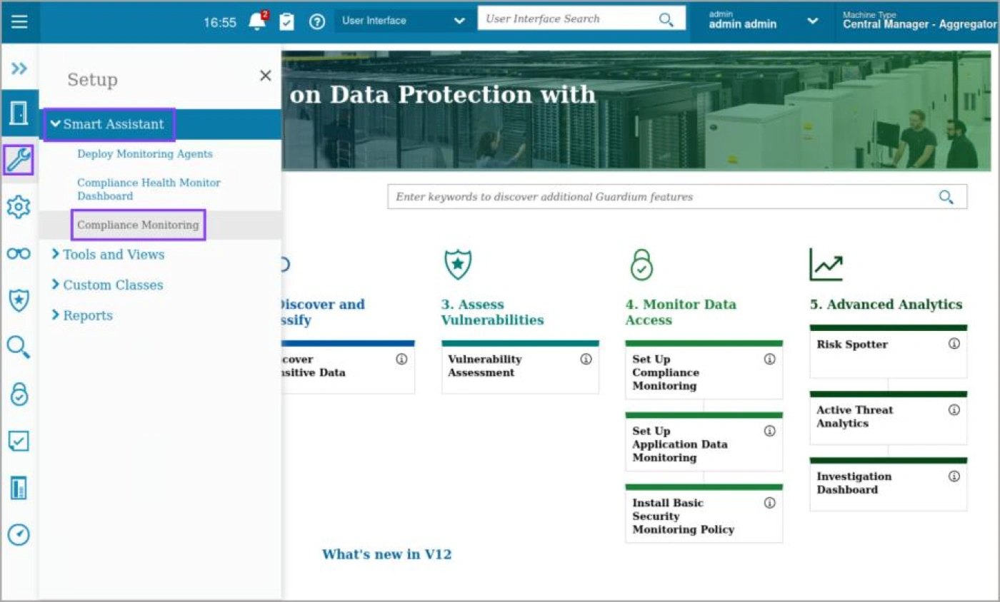

Guardium has compliance monitoring smart assistant functions that help quickly configure
monitoring for GDPR, PCI, SOX, and other security standards and regulations.

- On the General Data Protection Regulation (GDPR) pane, click View details.

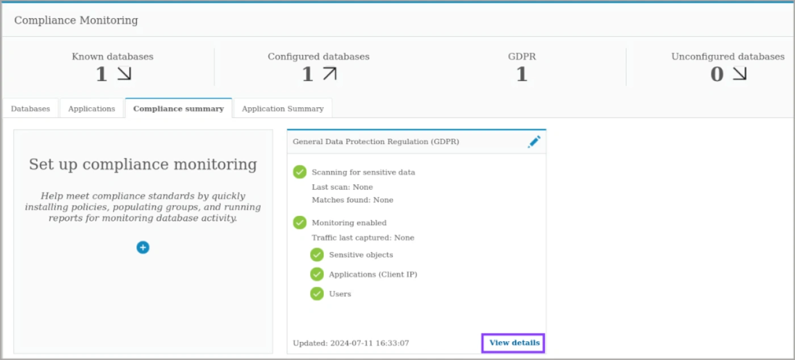

Now, view the details for an existing GDPR compliance configuration.

- View the Summary tab.

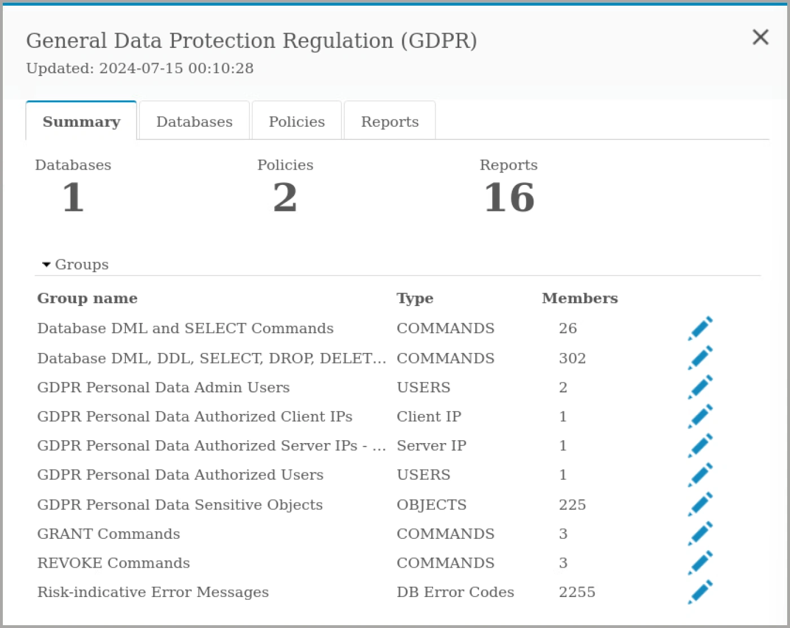

The summary tab shows that one database is being monitored, and there are two policies,
and sixteen reports associated with this compliance monitoring.

- Select the Databases tab.
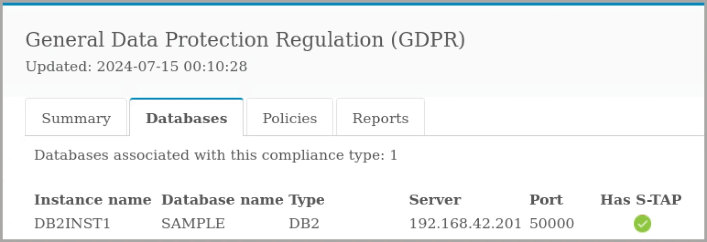

The databases tab shows more detailed information about the database being monitored.
In this case, there is one database of type Db2 and it is being monitored by a S-TAP agent.

- Select the Policies tab.
- Review the security policy, then optionally expand the discovery scenario section to show
    which types of data Guardium searches for.

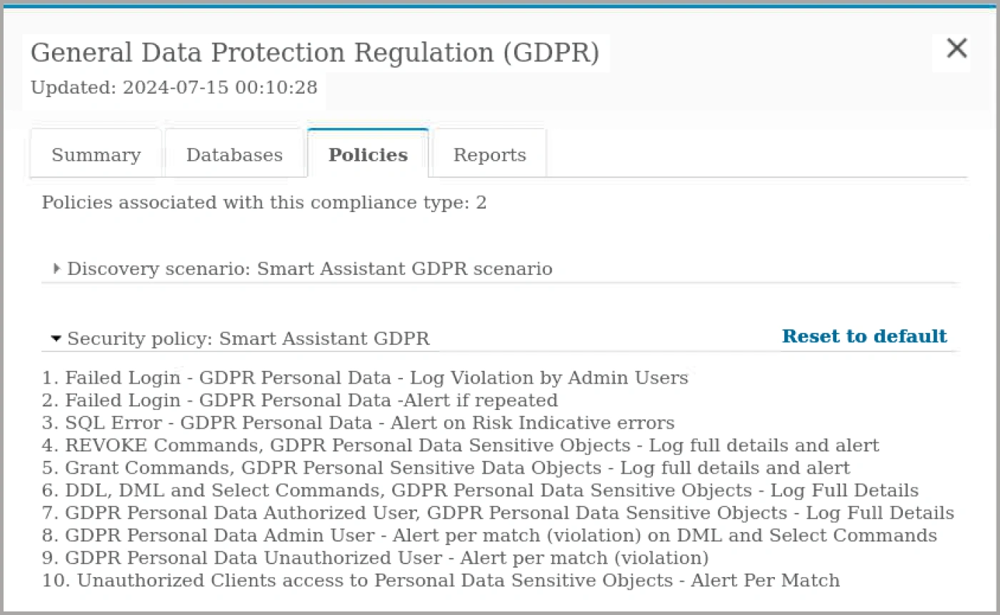

There are two policies associated with the GDPR compliance monitoring. The security
policy has ten rules for evaluating database traffic. The discovery scenario describes the
types of data Guardium searches for in monitored databases, such as age, gender, or
convictions.

- Select the Reports tab and review the reports associated with GDPR compliance.

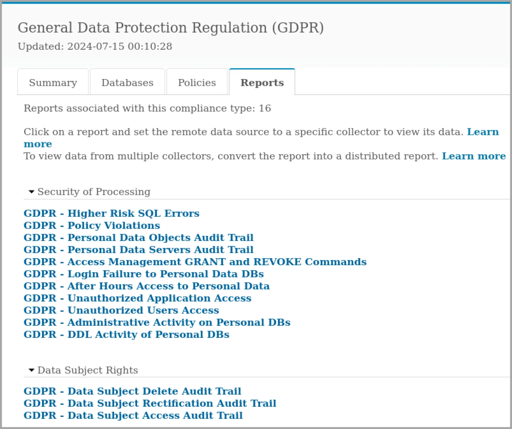

Guardium provides preconfigured reports for GDPR auditing and reporting requirements.
These reports can be used as-is or as templates for customized reports.

- Close the details pane.

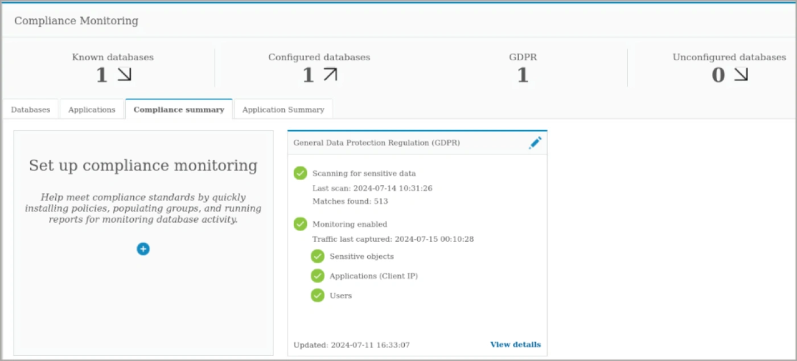

The compliance monitoring dashboard shows a summary of all compliance monitoring.
Guardium provides wizards to add other compliance monitoring scenarios, such as SOX,
HIPAA, or PCI-DSS. Guardium can monitor applications as well as databases. Guardium
can monitor multiple databases and multiple applications for multiple compliance
standards and regulations.
Now, you look at the compliance dashboards.

- On the navigation menu, click **Setup > Smart Assistant > Compliance Health Monitor Dashboard**.

- Show the reports on the dashboard.

This dashboard shows reports that help with compliance progress. For example, the
number of known databases and number of databases that are configured for compliance,
privileged users, and monitored objects in the databases, failed logins, commands, and
other issues.
Select the tabular view to see the values or the graphical view for summary.

- On the navigation menu, click **Setup > Smart Assistant > Deploy Monitoring Agents**.
- Review the page.

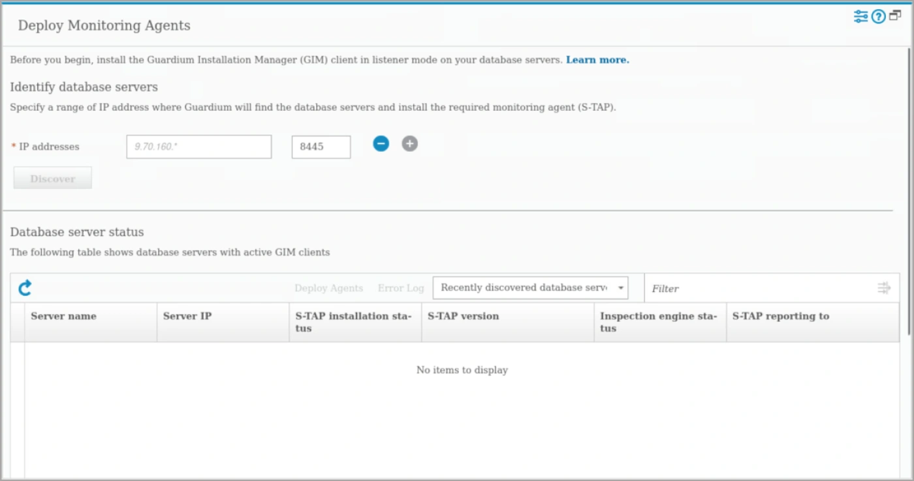

Guardium includes the Deploy Monitoring Agents tool to automatically activate GIM clients,
install S-TAPs, and begin monitoring database traffic.
The Deploy Monitoring Agents tool simplifies the process of establishing a Guardium
deployment. Building on existing Guardium installation manager (GIM) infrastructure, the
Deploy Monitoring Agents tool helps quickly find database servers, install monitoring
agents (S-TAPs), and configure inspection engines for the databases. In addition, the tool
provides a centralized view for tracking and reviewing deployment status.

You reviewed the Smart Assistant tool, the process to configure and manage
it, and dashboards that help to identify the status and gaps.

### Risk Spotter

- In the MA170 GUI, sign in as `labadmin`.
- On the navigation menu, go to **Protect > Uncover Threat Vectors > Active Risk Spotter**.

Now, look at another tool, Active Risk Spotter.

- Review Risk Spotter page.

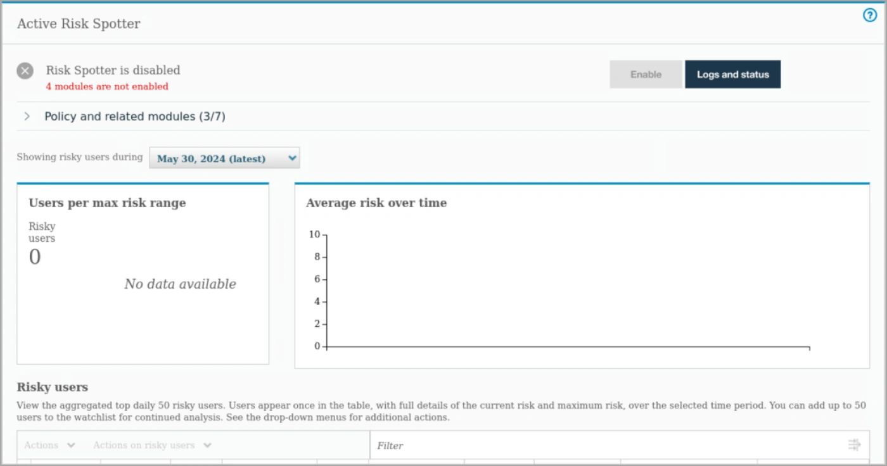

Risk Spotter is a First of its Kind technology, changing the security paradigm to an Artificial
Intelligence Data Protection Policy. It uses a holistic algorithm to dynamically assess risk
factors, and it uses a smart algorithm to identify potential risks across the entire system.

- Expand Policy and Related modules.

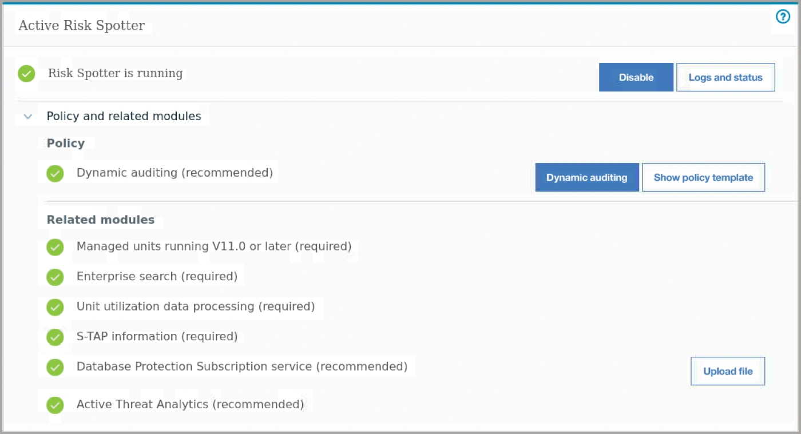

The Risk Spotter algorithm uses Guardium modules to analyze the risk indicators and to
identify risky users. Guardium adds three types of users to the Risk Spotter.
The first one is risky users, users identified by the Risk Spotter algorithm together with the
installed policies.
Another type of users is watchlist users that are a group of users for further observation or
investigation. Guardium can add users to the watchlist.
The last type is random sampled users. Risk Spotter continuously scans the system,
beyond the policy radar, evaluating non-audited users and identifying potential risky users.
The Risk Spotter algorithm uses Guardium modules to analyze the risk indicators and to
identify risky users. Each user's overall risk score is calculated daily, based on the audited
data. Risk Spotter assigns each user a score in the range 0 - 10. The detailed risk data is
presented in the Risky Users table in the Risk Spotter page.
Guardium has Behavioral Analytics for a specific database or user. You can view all cases
that are associated with this entity, the distribution of working hours, and the distribution of
verbs.

You reviewed the Risk Spotter tool.

### Active Threat Analytics

- In the MA170 GUI, sign in as `labadmin`.

- On the navigation menu, click **Protect > Uncover Threat Vectors > Active Threat Analytics**.

> **Note:** Change the scope from Last 1 Day to start on July 1, 2024, to show data.

- Review the report and scroll down.

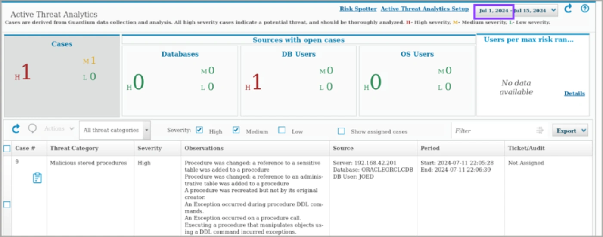

The Active Threat Analytics dashboard shows potential security breach cases, based on
both the outlier mining process, and identified attack symptoms. In this dashboard, you
can view and investigate cases and act on individual cases.
A row of results tabulates the most critical cases, open cases per databases, DB users,
OS users, file systems, and file user. The cases in each category are identified by their
risk level: high, medium, and low.
If a database, database user, file system, or OS user is associated with multiple cases,
that database or user is only counted one time. For example, of 40 critical cases, 10 are
associated with database A. 10 are associated with user B. The other 20 are associated
with various databases and users. The total number of cases is 22, not 40; 1 for database
A, 1 for user B and 20 for other databases and users.
The graph shows violations, outliers, errors, and activities over the same period.
In summary, Guardium offers advanced analytical tools based on machine learning (ML)
algorithms, using a combination of rules-based policies and symptom analysis to detect
patterns of behaviors that map to known industry attack vectors. This identifies insider and
external threats. This capability helps act faster and more effectively.

You reviewed the Active Threat Analytics tool, its reports, and its configuration.
