# Vulnerability Assessment and Policy Management

## 1 Introduction

In this lab, we demonstrates the Vulnerability Assessment functions that help identify and correct security vulnerabilities in database infrastructure. We go over the details about policy management that helps monitor and audit traffic.

### Vulnerability Assessment

- In the C200 GUI, sign in as `labadmin`.
- Go to **Harden > Vulnerability Assessment > Assessment Builder**.

Guardium Vulnerability Assessment helps to identify and correct security vulnerabilities in
the database infrastructure.
Database Vulnerability Assessment is used to scan the database infrastructure for
vulnerabilities and provide evaluation of database and data security health, with real time
and historical measurements.

- Ensure DB2 Assessment is selected and click **Edit** (Pencil).

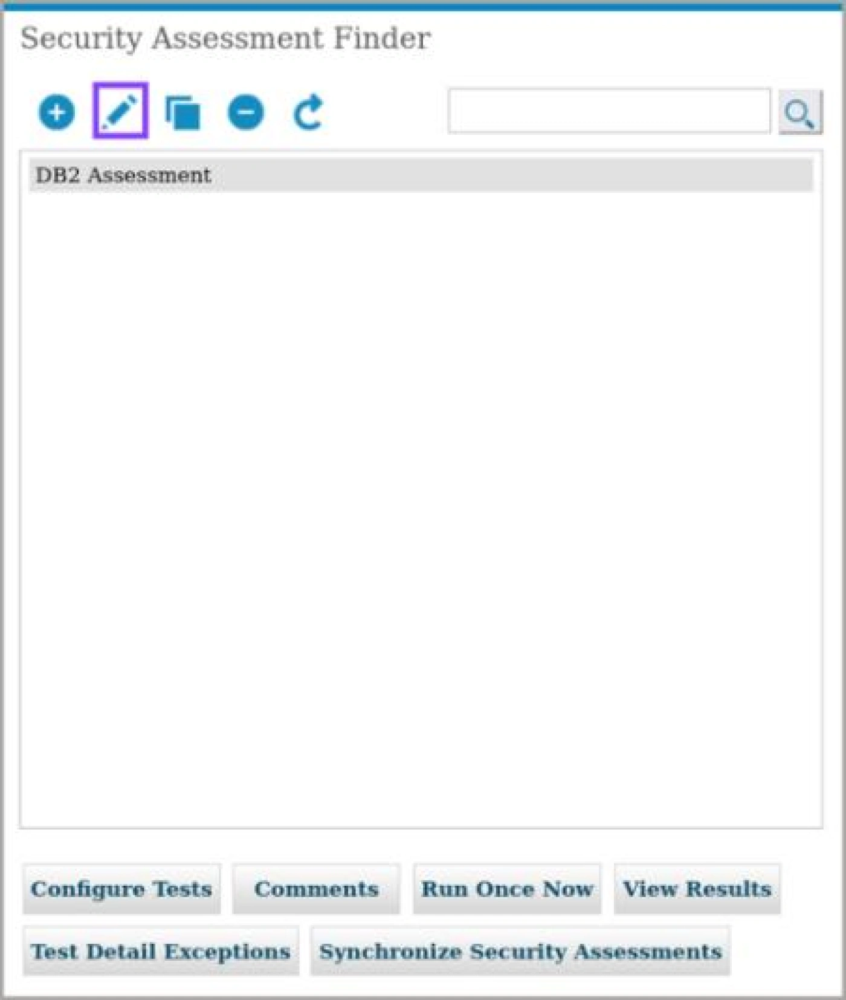

A Vulnerability applies a set of tests to one or more datasources. A datasource contains
connection information for a database.

- Click **Edit** (Pencil) by the data source.

Running Guardium vulnerability assessments and using the Guardium classifier requires
access to the database and specific database privileges. Here you see the datasource
contains information Guardium needs to connect to a database, including host, port, type,
credentials, and name. Datasources are used for many functions in Guardium, including
discovery and assessment.

- Close the data source.

- Click Apply and then click **Configure Tests**.
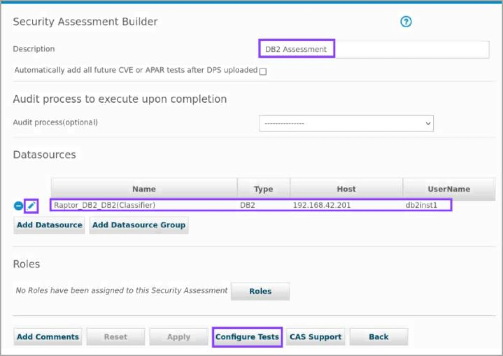

A Vulnerability Assessment contains predefined or custom tests.
Predefined tests are designed to illustrate common vulnerability issues that may be
encountered in database environments. However, due to the highly variable nature of
database applications, some of these tests are suitable for certain databases but
inappropriate for others, even within the same organization. Therefore, Guardium enables
customization of some predefined tests to meet specific organizational requirements. Also,
to keep assessments current with industry standards and protect against new threats,
Guardium distributes new assessment tests and updates on a quarterly basis. These
updates are part of the IBM Database Protection Subscription (DPS) Service.

- Scroll down and click **Back** to return to the assessment builder. Then click **Back** again to return to the assessment finder.

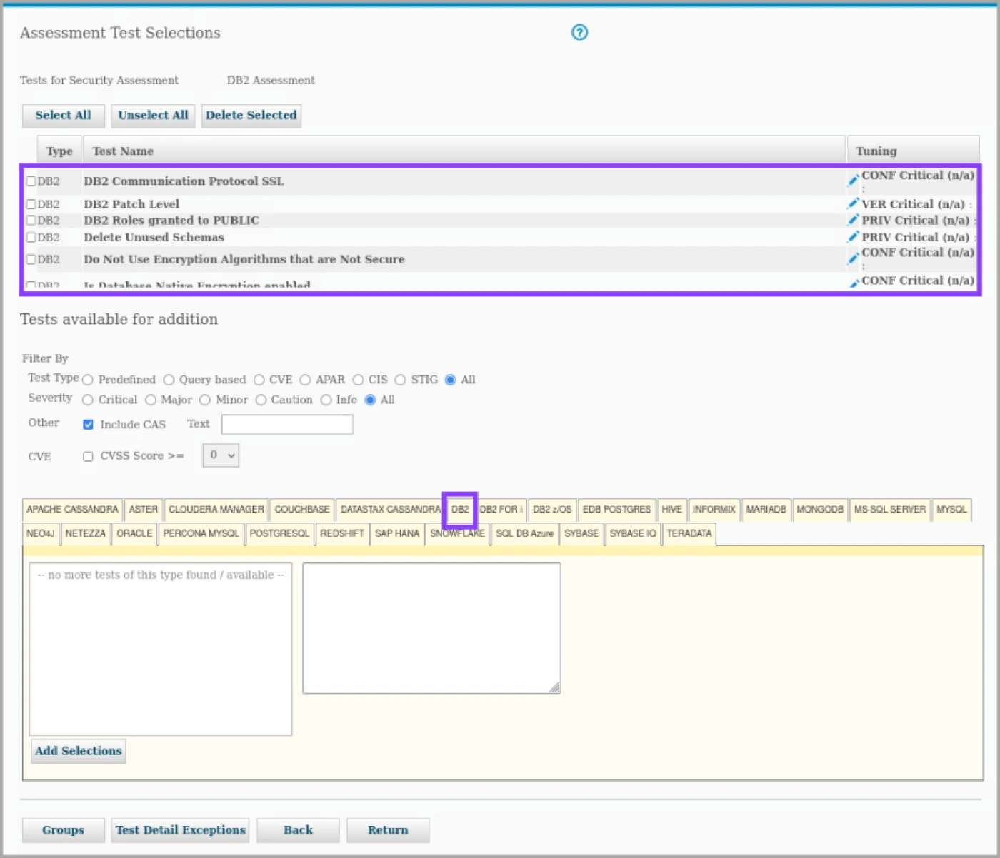

- Select your new assessment and click **Run Once Now**.

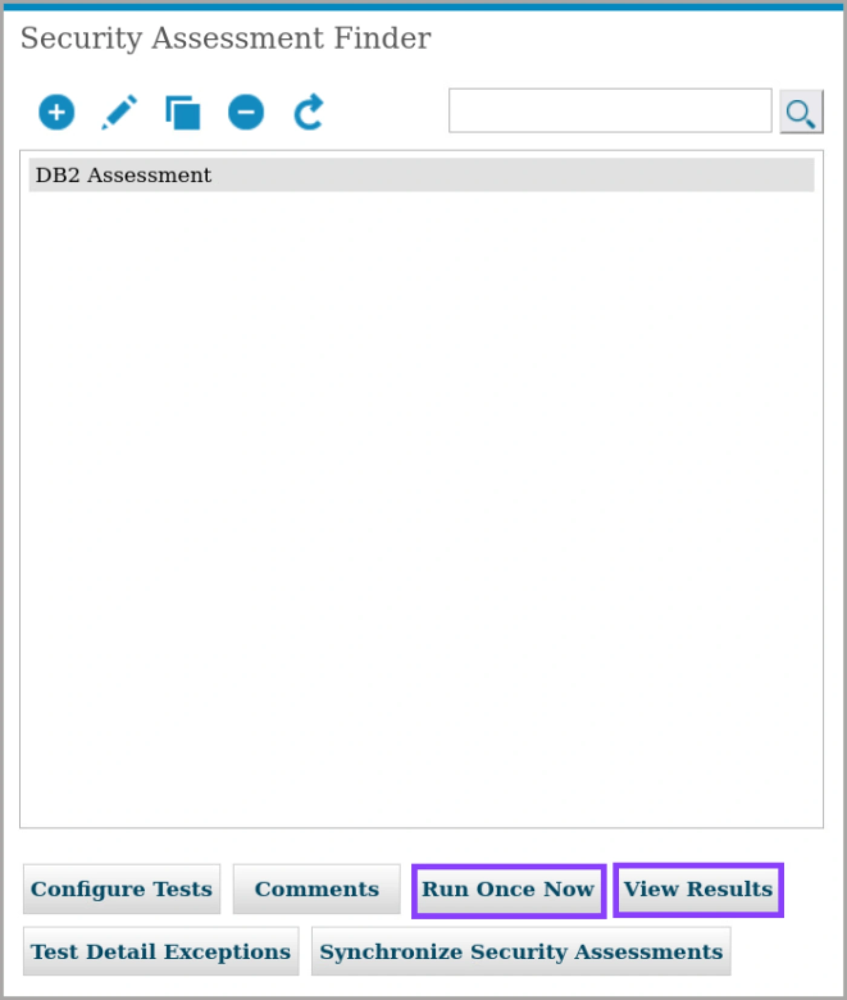

- Close the dialog and wait a moment. You can optionally access the Guardium Job Queue to show the progress.

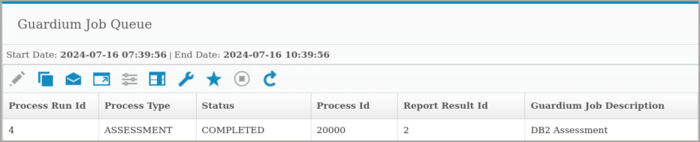

- Return to the assessment builder. Select your assessment and click View Results. A new report window opens. Adjust the size of the window as necessary.

Let’s view the assessment results.

- Review the report.

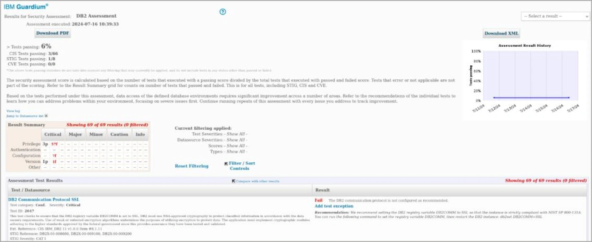

An assessment evaluates multiple tests based on multiple reports. The overall results are
displayed in a window entitled Security Assessment Results. The report has sections for
Assessment Identity, Assessment Selection, Assessment Results History, Results
Summary, Assessment Test Results, and some more details.
The Assessment Results History shows the percentage of tests that are passed over a
period.

In the Results Summary section, a tabular graph summarizes all the tests that were run
within this assessment. The X-axis represents the tests, and you have the type of the tests
on the Y-axis. The grid shows the number of tests that passed, failed, and caused an error.
The assessment test results section describes the tests that are taken, information about
the target datasource, each test's pass or fail status, severity, external reference, and
reason for the status. You can filter test results.
CVE Records and CVSS information are displayed in the Assessment test result viewer.
You can generate a PDF version of the Assessment result, download as SCAP xml or
download as AXIS xml.

- In the Assessment results section, scroll down and click **Db2 Patch Level**. A new window
    opens. Resize as necessary.
- Review the test details and then click **Close this window**.

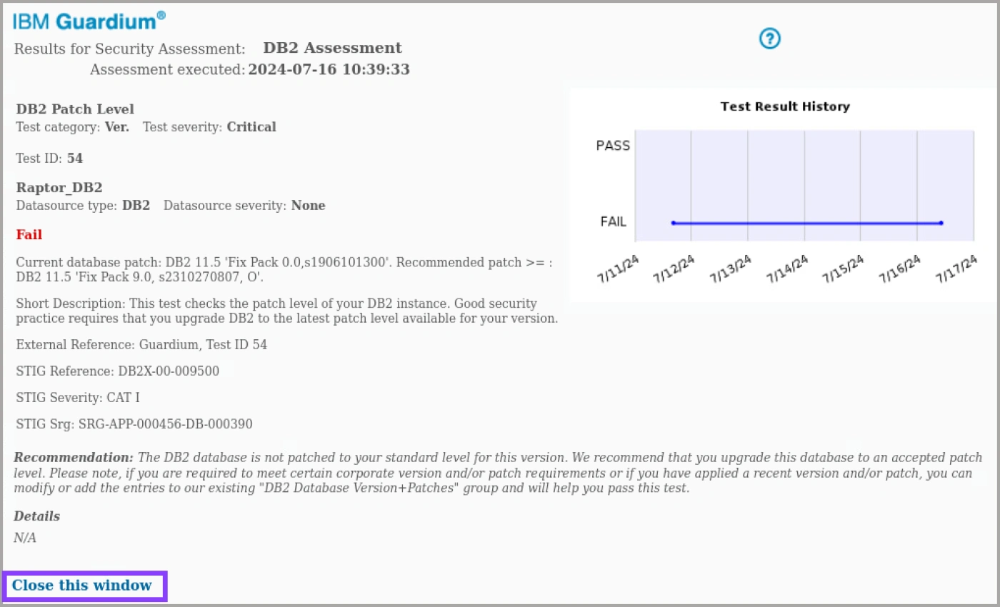

In this Vulnerability Assessment test details dialog, you see that the Db2 on Raptor server
does not have required updates. When the database version and update level do not meet
the defined levels, the security assessment is designed to fail. To override this failure, the
necessary update level and database version can be manually added to the Group Builder.

- Click the **Add test exception** link for Db2 Patch Level.

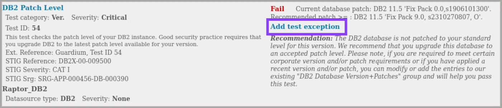

When a test fails, you can apply an exception to the test.

- Add a justification and click **Save**.

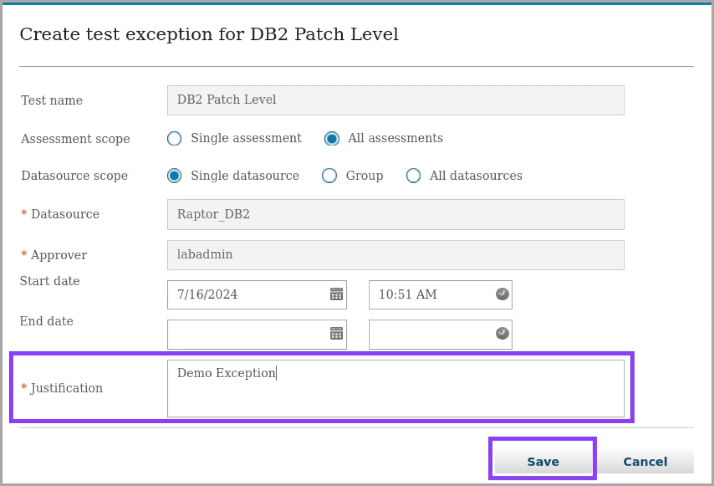

- Click **Filter/Sort** Controls.

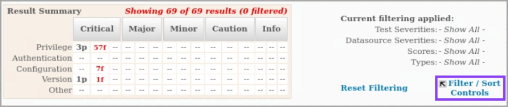

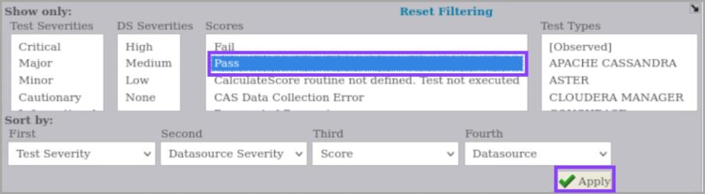

The assessment results page has filtering capability to find the required test faster. If you
want to change the filtering, you can remove the filter by using the Reset Filter option or
choose Filter / Sort Controls to open filter and sort options for the report.
Options in this dialog filter include severities, datasource, severity classification, scores,
and test types.

- Select Pass and click **Apply**.

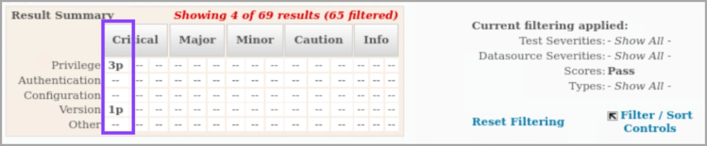

- Scroll down the page and click **Nested Roles test**.

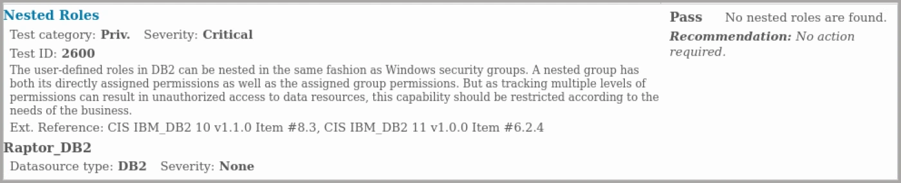

A passed test has test and data source details but no exception links because it passed.

- Close the window.

To sum up, Guardium vulnerability assessments can proactively scan databases for
vulnerabilities, misconfigurations, authentication controls, and missed updates before they
can be used. Quarterly data protection subscriptions (DPS) and rapid response DPS help
you keep ahead of zero-day vulnerabilities.

You discussed the Vulnerability Assessment tool.

### Policy Management

- Log into C200 as `labadmin` for policy and reporting exercises. You must do this from the collector.

- Go to **Protect > Security Policies > Policy Builder for Data**.

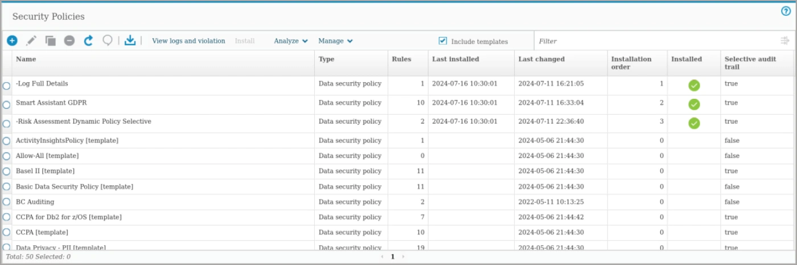

Now, you learn about security policies. Guardium is a data-specific security solution, which
means that it is SQL-aware. It knows how to parse SQL.
Policies are sets of rules and actions that are applied in real time to the database traffic
observed by a Guardium system. Policies define which traffic is ignored or logged, which
activities require more granular logging, and which activities must trigger an alert or block
access to the database.
Multiple policies can be installed and active at the same time.

- Filter on `pci`. Select **PCI [template]** and click **Copy**. 
> **Note:** You will not install this policy.

This policy was chosen because it has examples of access, exception, and extrusion rules.

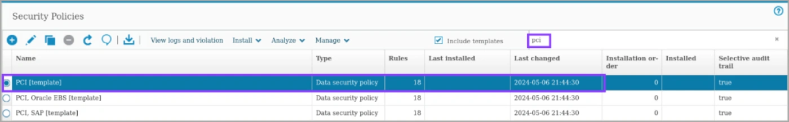

Guardium provides predefined policies that support established data-security standards.
For example, the PCI template conforms to the Payment Card Industry Data Security
Standard (PCI DSS). It is also possible to create or customize policies.
Multiple policies can be defined, and multiple policies can be installed on a Guardium
appliance at the same time.

- Enter `Demo PCI Policy` as the name.

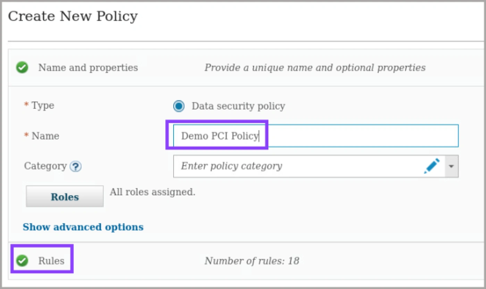

- Expand the Rules section.

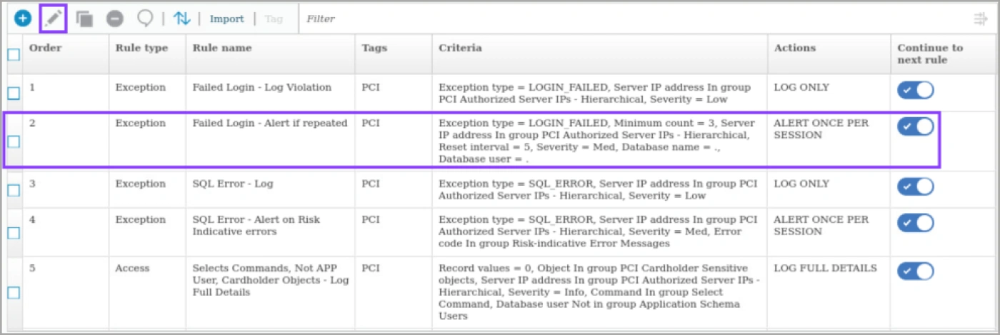

This policy is a copy of a template. It contains all the rules from the template. You can edit
existing rules or create new rules to customize the copied policy. A security policy contains
an ordered set of rules to be applied to the observed traffic between database clients and
servers. Each rule can apply to a request from a client, or to a response from a server.
Policies include three types of rules:

- An access rule applies to client requests. For example, it might test for UPDATE
    commands that are issued from a specific group of IP addresses.
- An exception rule evaluates exceptions that are returned by the server. For example, an
    exception rule might test for five login failures within one minute.
- An extrusion rule evaluates data that is returned by the server. For example, an extrusion
    rule might test the returned data for numeric patterns that might be social security or
    credit card numbers.
You can use categories, classifications, or tags to easily group the policies.

- Select the 2 nd rule, **Failed Login – Alert if repeated** and click **Edit** (Pencil).

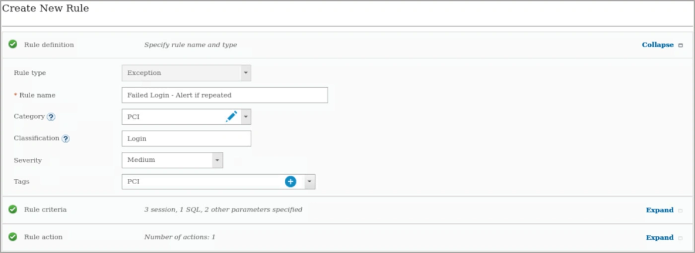

- Review the Rule definition and expand the Rule criteria section.

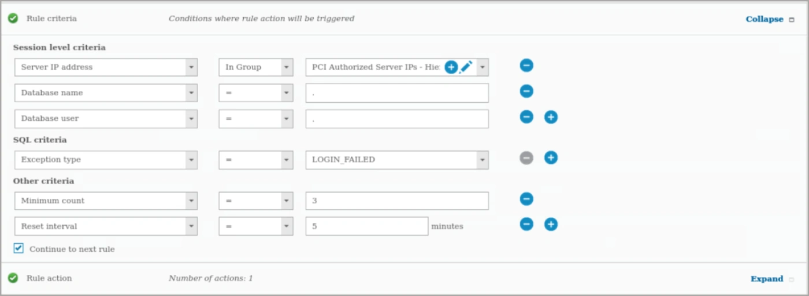

Each rule in a policy defines a set of conditions. The condition that is tested can be a
simple test. For example, it might check for any access from a client IP address that does
not belong to an Authorized Client IPs group. Or the condition can be complex, considering
multiple message and session attributes (database user, source program, command type,
time of day, and so on). The test can count the number of times a condition is met within
a specified time frame.
This policy rule tests for 3 login failures within 5 minutes to a server whose IP address is a
member of the PCI Authorized Server IPs group.

- Review the Rule criteria and expand **Rule action** section.

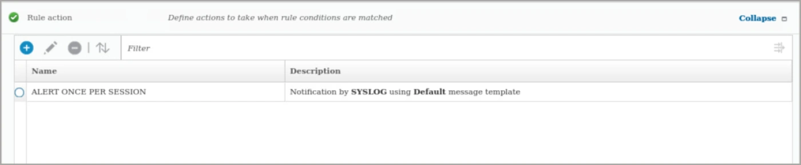

- Click **New (+)** to check the action options and then OK. 

> **Note:** You do not need to add another action, as this is just to show the action options.

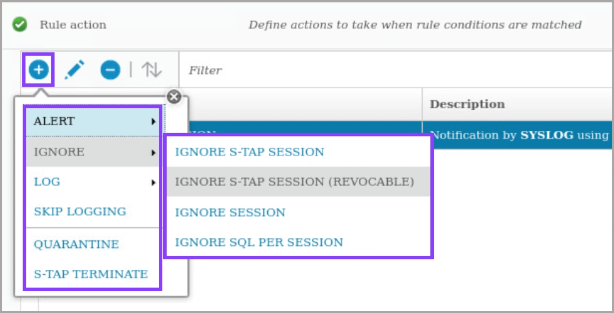

The action triggered by the rule can be a notification action such as an email, a blocking
action (the client session disconnected), or the event might simply be logged as a policy
violation. Custom actions can be developed to perform tasks unique to a given
environment or application.
You can also set the granularity of the action. For example, you can send one alert per
session, one alert per day, or one alert for each event.
In this case, one alert per session is sent if the criteria are met.

- To return to policy, scroll down and click **Cancel**. Select the 4 th rule, **SQL Error – Alert on Risk Indicative errors** and click **Edit** (Pencil).

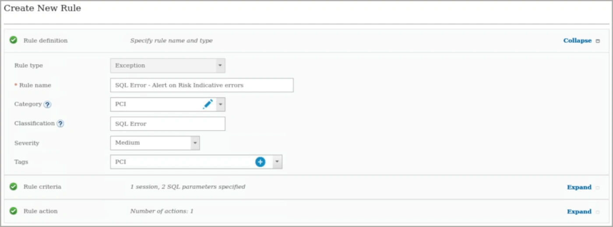

Another example of an exception rule is one that triggers in case of a SQL error.

- Review the rule definition and expand the **Rule criteria** section.

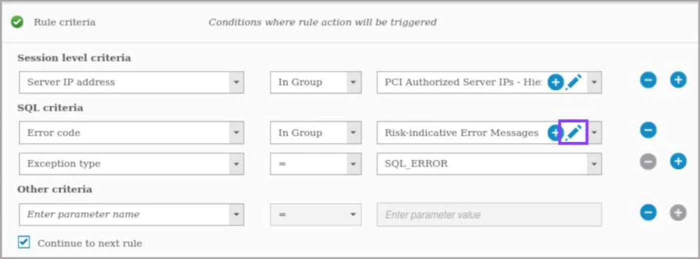

- Click **Edit** (Pencil) for **Risk-indicative Error Messages** in the Error code criteria.

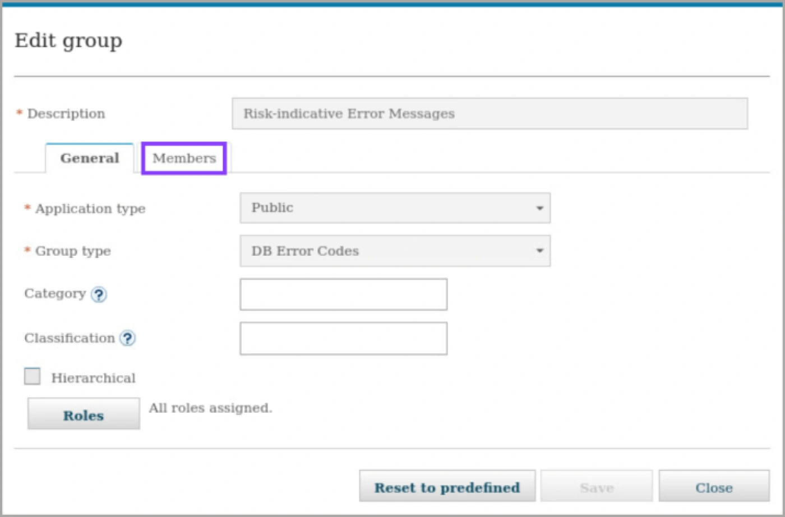

For many policy rule criteria, you can specify a single value or a group of values.

- Go to the **Members** tab and then click **Close**.

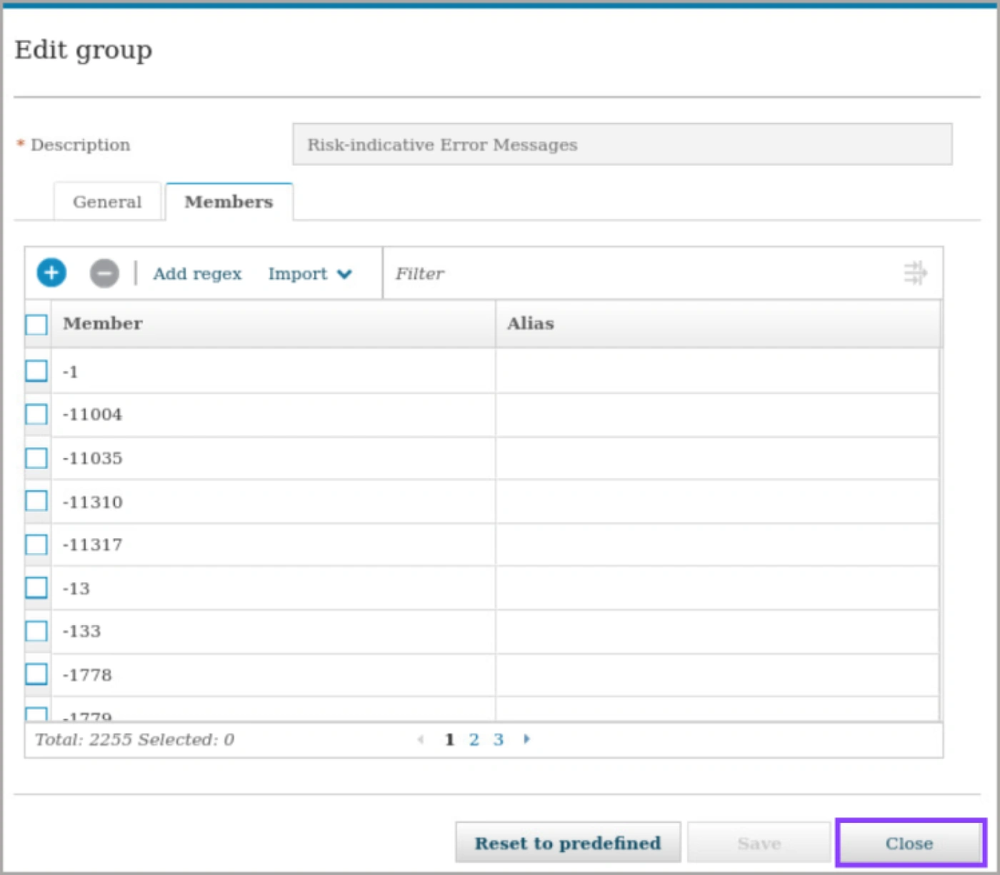

Groups simplify creating and managing policy definitions. Rather than having to repeatedly
define a set of data objects for a policy rule, you can put the objects into a group to easily
manage them.
Many predefined groups are included with Guardium. SQL Error codes is one of them. As
a Guardium admin or security specialist, you do not need to know all of the error codes
that databases can return. You just use the group.

- Expand **Exception type** criteria and review the filters.

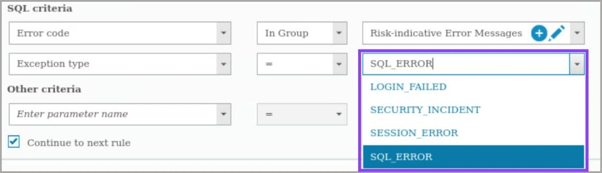

Guardium can differentiate the error type, such as if it is a login failure or SQL error.

- To close the edit rule dialog and return to the policy dialog, scroll down and click **Cancel**.
- Edit the 6th rule, DDL Commands, Cardholder Objects – Log Full Details.

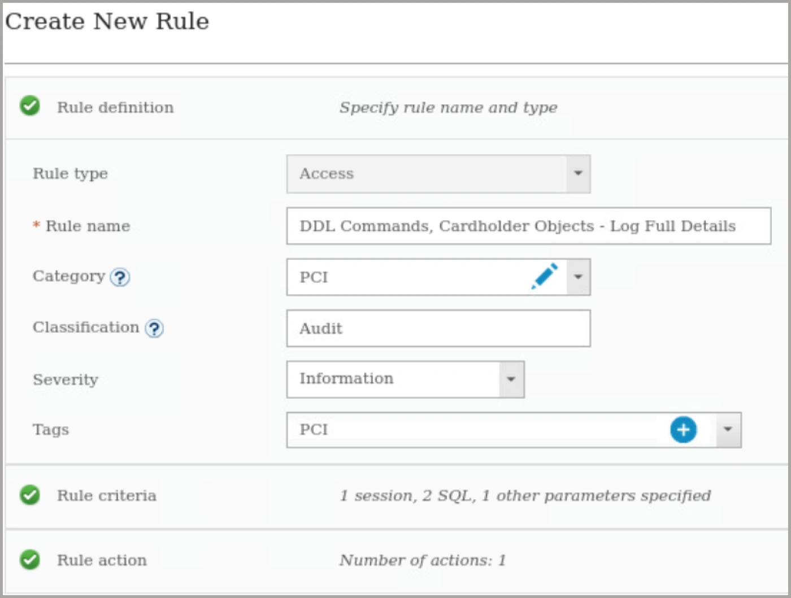

- Review the Rule definition and expand the **Rule criteria** section.

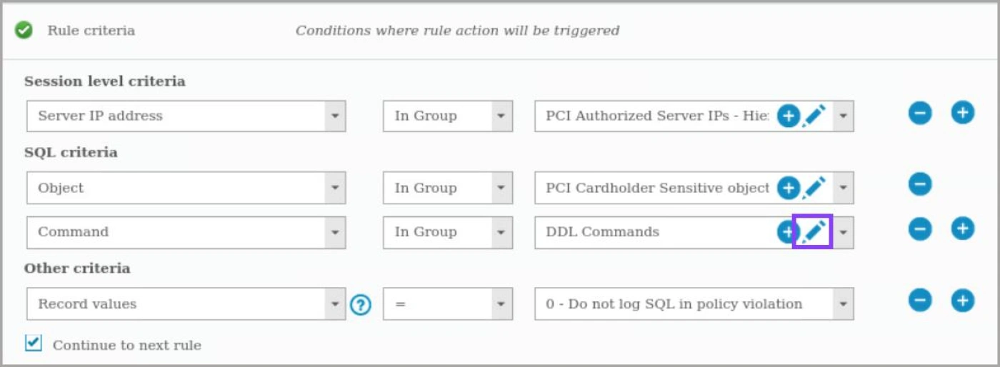

You can have filters for different criteria. In this case, the rule filters the DDL activities
running on cardholder sensitive objects on authorized servers.

- Click **Edit** (Pencil) for **DDL Commands** in the Command criteria. Review the members.

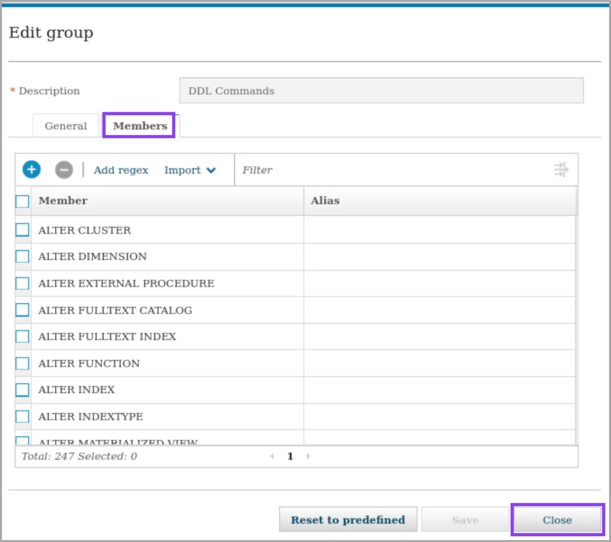

This rule uses the DDL Commands group for the Commands criteria.
As a security professional, you don’t need to know which commands are DDL commands
in specific databases. Guardium includes prebuilt groups to help security and Guardium
administrators build more effective policies quickly.

- Close the DDL Commands Group.
- Expand the **Rule action** section.

Access rules, exception rules, and extrusion rules differ in which actions are available. For
example, Log and Ignore actions are available for most policies, but the Audit Only action
is only available for policies using the Selective Audit Trail setting.

- Click to add an action and drill down to **Ignore**.

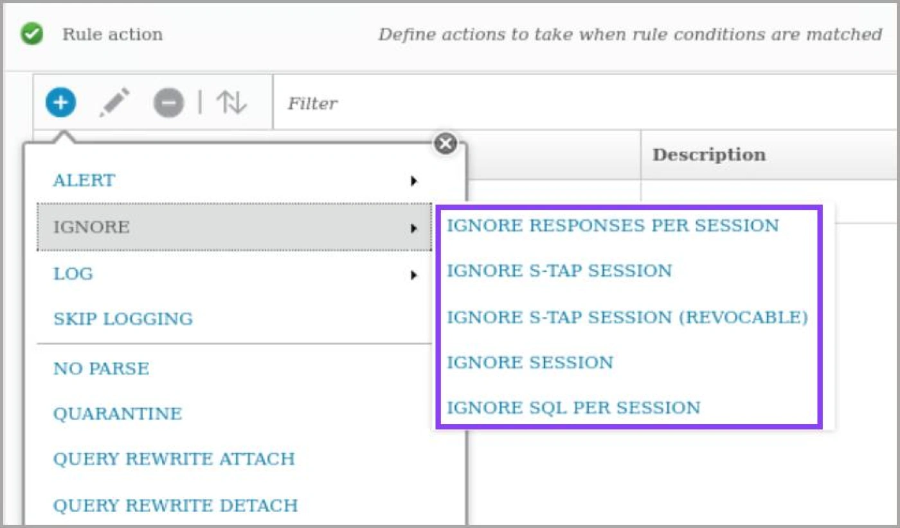

To control and decrease the load on a Guardium system, ignore actions can be used.
Ignore S-TAP Session is a useful action. With this action, the current request and the
remainder of the S-TAP session are ignored. This action is done with specific systems,
users, or applications that are producing a high volume of network traffic. This action is
useful in cases where you know that the database response from the S-TAP session is of
no interest. For example, if you have applications with auditing enabled in the application
side, you can ignore the traffic from these applications. This action decreases the CPU
consumption of S-TAP because it does not forward the traffic to the Guardium system. It
also decreases the load on the Guardium system, which increases system performance.
Guardium provides different options for ignoring. You can ignore the traffic at the S-TAP
level. You can ignore specific sessions, or you can ignore SQL commands for the
remainder of the session.

- Click **Cancel** to close the rule.
- Click **OK** to save the policy and close the dialog.

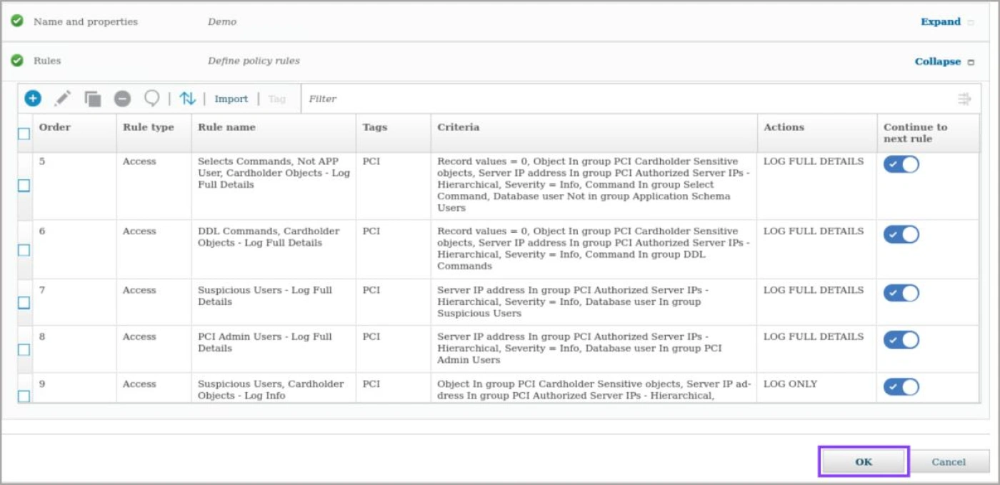

- Go to **Protect > Security Policies > Group Builder**.

Guardium groups help create and manage classifier, policy, and query definitions.

- Review pre-built groups.

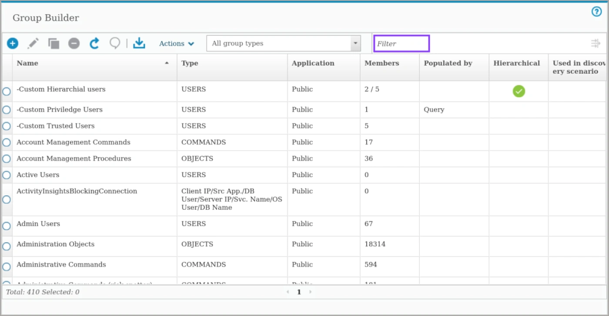

Groups are practical to use. By grouping similar data objects, you can use the whole set
of objects in policies, classifications, queries, and reports, rather than having to select
multiple data objects individually.
If you need to change a query or policy, rather than applying those changes to each
individual object, you can apply those changes to the group.
Many predefined groups are included with Guardium.

- To filter the report, enter **DDL**, select the **DDL Commands** group, and click **Edit** (Pencil).

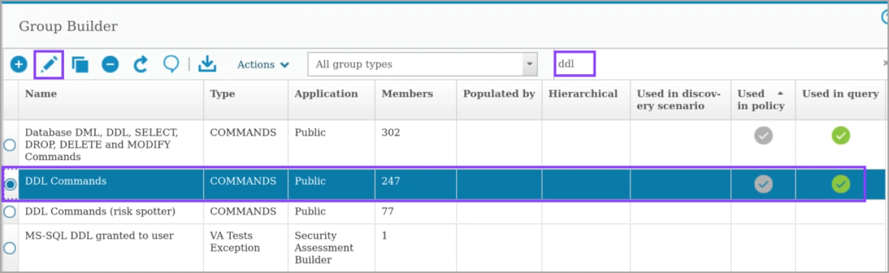

You can search by the group name in the group builder.

- Go to the **Members** tab.

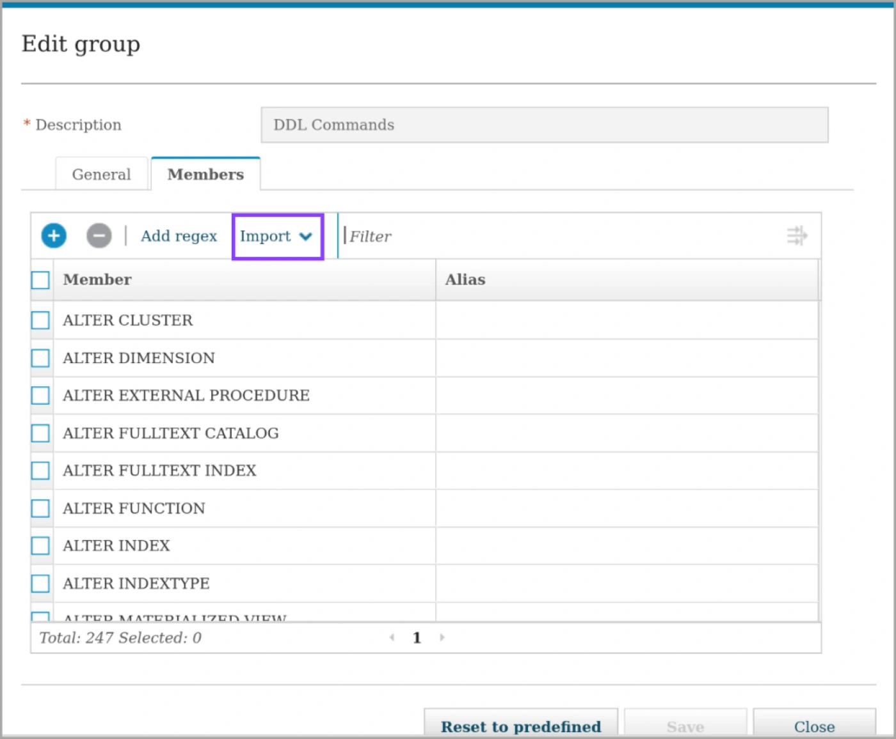

As you already reviewed this DDL Commands group earlier in the policy, you can see the
members of the group here.

- Click **Import** and review the methods.

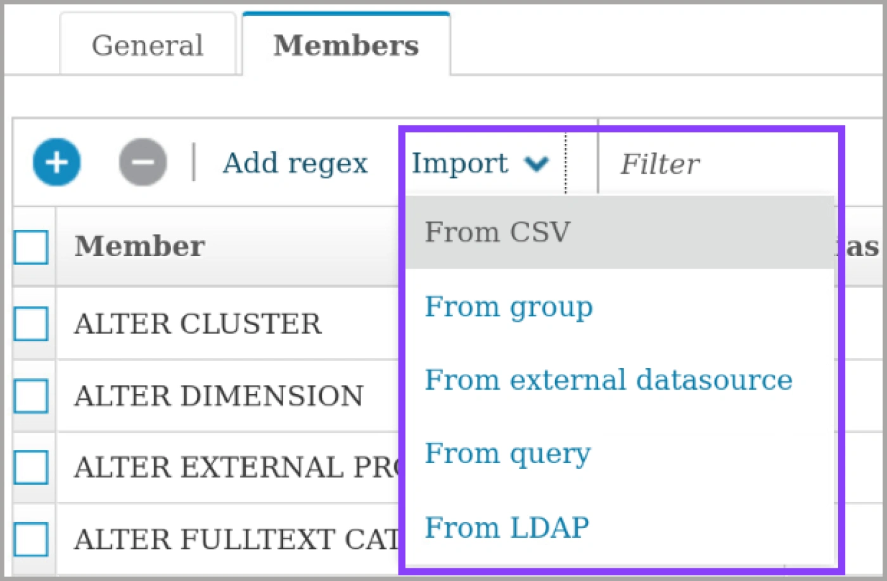

It is possible to add group members manually or automatically. CSV, groups, external
datasources, queries, or LDAP are the methods to add group members. This enables
Guardium groups to be populated with data from your own datasources and keep those
groups in sync with your data.

- Click **Close**.
- Click the **All group types** filter and review the options.

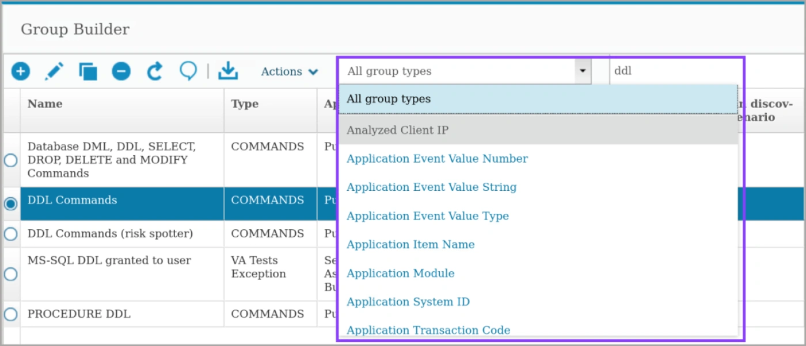

- Go to **Protect > Security Policies > Time Period Builder**.

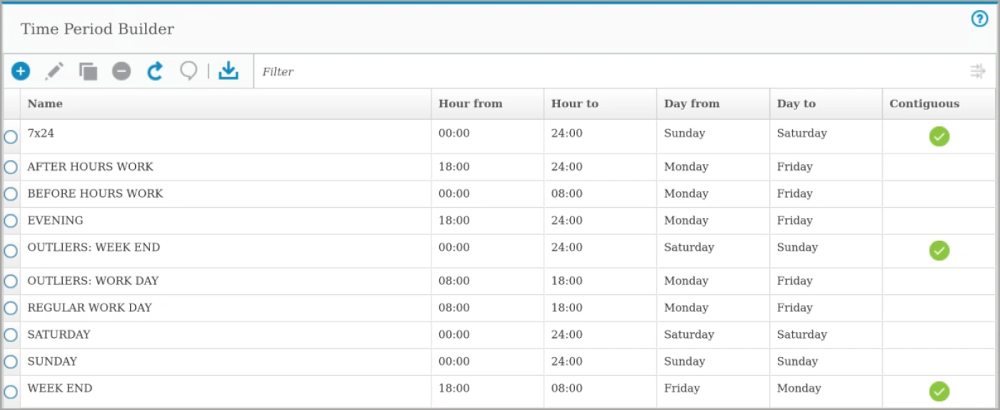

Policy rules and query conditions can test for events that occur (or don’t occur) during user-
defined time periods. When you open the Time Period Builder, a set of pre-defined time
periods is available. You can edit the available time periods to meet your needs, or you
can define your own.
In the Policy Management section of the demo, you saw that Guardium includes predefined
security and compliance policy templates that can be customized based on the audit and
regulatory requirements. Policies can be built to detect any threat scenario with the most
common audit constructs and other contextual information. To automate compliance
tracking and reporting, policies and rules can be easily created, updated, and tagged for
specific data security and privacy regulations and standards, without duplicating
administrative efforts.
These policies instruct real-time data activity monitoring and security alerts, which inform
detailed audit trails and risky user profiles. Guardium Data Protection notifies security
analysts with alerts in real-time when a security policy is violated.

You discussed the Policies and other tools that support policy management.

