# Informes

## 1 Introducción

En este laboratorio mostramos las funciones de generación de informes y el valor de los informes predefinidos, los informes personalizados y la visualización de los datos de auditoría.

### Informes

> **Nota:** Esto debe realizarse en el C200.

*   Vaya a **Aceleradores > PCI > Descripción general > Norma de seguridad de datos PCI**.

Ahora, aprenderá sobre las capacidades de generación de informes. IBM Security Guardium Data Protection incluye políticas e informes predefinidos. Algunas de estas configuraciones predefinidas son aceleradores. Los aceleradores proporcionan informes, políticas, herramientas y automatización de flujos de trabajo personalizables y específicos de la normativa que aceleran el cumplimiento y simplifican la validación con una amplia gama de requisitos. Guardium incluye aceleradores específicos para PCI, Basilea II, Data Privacy, SOX, GDPR y CCPA.

*   Repase los conceptos básicos de PCI-DSS.

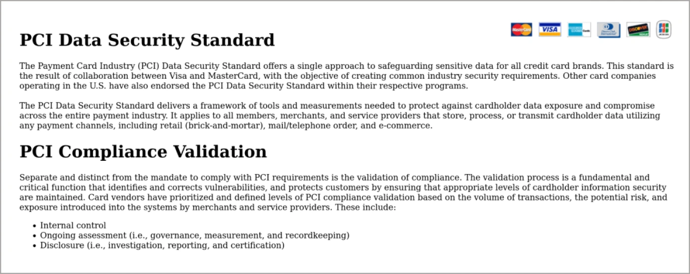

Aquí encontrará información general sobre la normativa PCI-DSS.

*   Vaya a **Aceleradores > PCI > Descripción general > Acelerador PCI para el cumplimiento de normativas**.
*   Consulte esta página para obtener más información sobre el acelerador PCI.

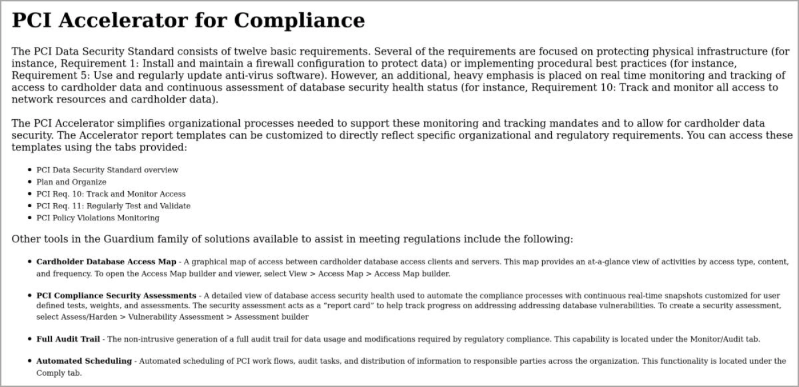

En la página PCI Accelerator for Compliance, puede conocer cómo Guardium le ayuda a proteger sus datos y cumplir los requisitos PCI. Proporciona informes personalizables específicos de PCI DSS, políticas, herramientas y automatización del flujo de trabajo que aceleran el cumplimiento y simplifican la validación con una amplia gama de requisitos.

*   Vaya a **Aceleradores > GDPR > Cumplimiento del GDPR**.

Ahora, puede saltar a GDPR. GDPR es otra regulación para la que Guardium tiene definiciones pre-construidas.

*   Revise el cumplimiento y el acelerador del GDPR.

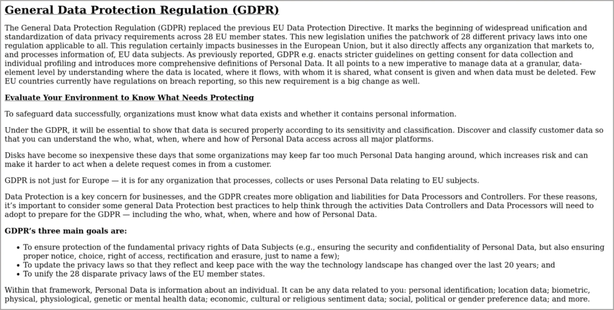

En la página del acelerador del GDPR para el cumplimiento normativo, aprenderá cómo Guardium ayuda a proteger los datos y a cumplir los requisitos del GDPR. Proporciona informes, políticas, herramientas y automatización de flujos de trabajo personalizables específicos del GDPR que aceleran el cumplimiento normativo y simplifican la validación con una amplia gama de requisitos.

*   Vaya a **Cumplir > Informes > Gestión de incidencias**. Revise el informe.

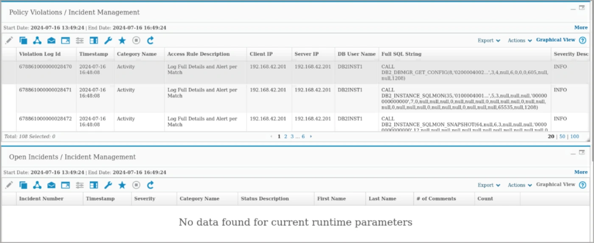

Uno de estos informes útiles es el de Violaciones de Políticas y Gestión de Incidentes. Este informe muestra una lista de incidentes que infringieron las políticas instaladas.

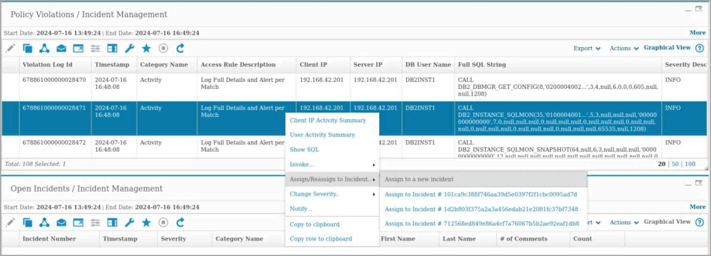

*   Haga clic con el botón derecho en un incidente y seleccione **Asignar/Reasignar a incidente > Asignar a un nuevo incidente**.

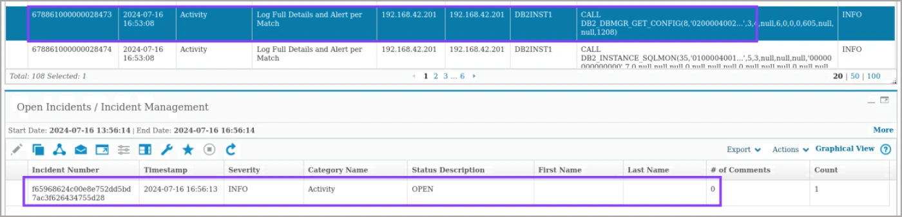

Puede realizar acciones sobre incidentes individuales. En este caso, se asigna una infracción de la política a un nuevo incidente abierto.

*   Vaya a **Investigar > Actividades de la base de datos > Bases de datos / Servidores**.

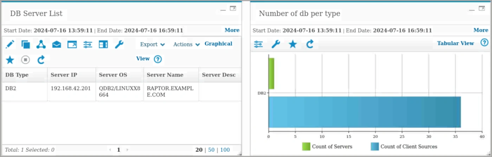

Otro informe es el del inventario de bases de datos. En este informe, puede ver el número de servidores y las fuentes de clientes que acceden a estos servidores según el tipo de base de datos. Este informe puede ayudarle a validar los tipos de base de datos que más utiliza.

*   Escriba **error** en la barra de búsqueda.

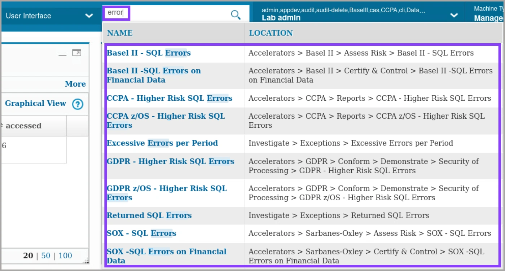

Si no recuerda el menú de una herramienta específica en Guardium, puede buscarla con la barra de búsqueda.

*   Vaya a **Informes > Herramientas de configuración de informes > Generador de informes de consulta**. Seleccione un informe para mostrar los detalles.

> **Nota:** puede hacer una copia o abrir el original.

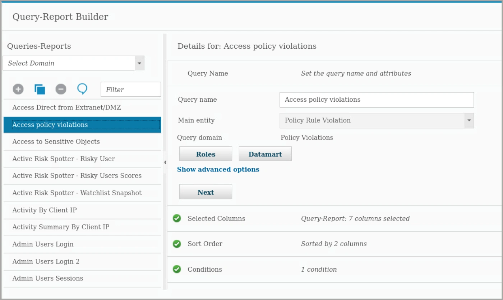

Guardium incluye muchas consultas e informes predefinidos. Puede utilizarlos, personalizarlos o crear un informe personalizado.

> **Nota:** El constructor de procesos de auditoría debe demostrarse en la interfaz de usuario C200. Vaya a **Cumplir > Herramientas y vistas > Generador de procesos de auditoría**. Seleccione **Todo**. A continuación, seleccione **Demo Appliance Monitoring**.

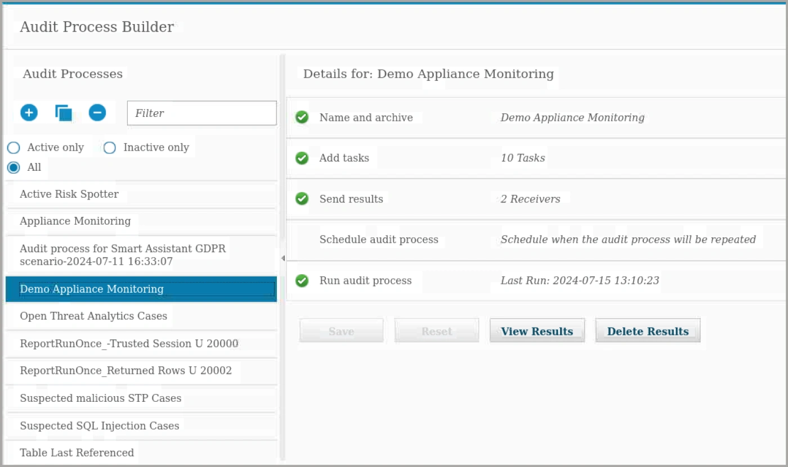

Para apoyar la generación de informes, Guardium incluye Audit Process Builder para agilizar el proceso de flujo de trabajo de cumplimiento al consolidar, en un solo lugar, las tareas de monitoreo de la actividad de la base de datos, tales como: descubrimiento de activos; evaluación y fortalecimiento de vulnerabilidades; monitoreo de la actividad de la base de datos y generación de informes de auditoría; distribución de informes; aprobación por parte de las partes interesadas clave; y escalamientos. También es posible exportar los resultados de la auditoría a repositorios externos para un análisis más forense, tales como archivos Syslog, CSV o CEF, o alimentación externa.

*   Amplíe la sección **Añadir tareas**.

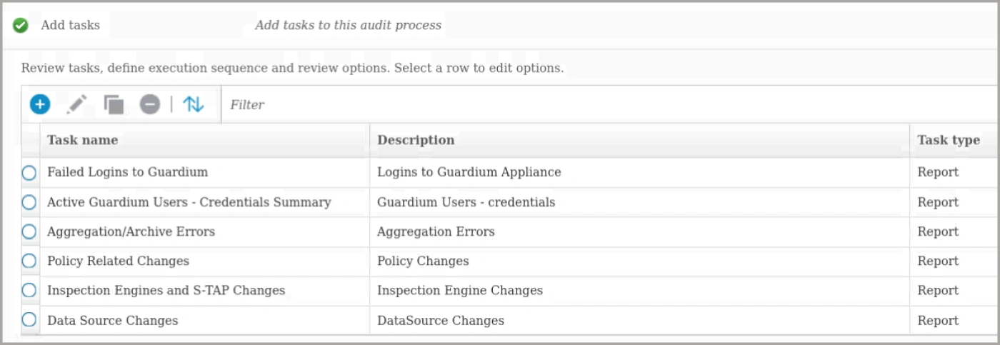

Un proceso de auditoría puede contener varias tareas de auditoría. Cuando se añade una tarea de tipo informe, ésta produce un informe, ya sea personalizado o un informe predefinido de Guardium, que se puede distribuir. Los informes pueden exportarse en formatos CSV, CEF y PDF o escribirse en Syslog para alimentar otras soluciones.

*   Ampliar **Enviar resultados**.

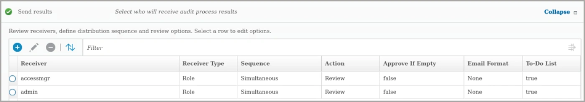

El generador de procesos de auditoría automatiza la distribución de los resultados de los procesos de auditoría a usuarios y funciones individuales. Los receptores del proceso de auditoría reciben una notificación por correo electrónico o a través de su lista de tareas de los resultados pendientes del proceso de auditoría. Puede designar a cualquier receptor como firmante de un proceso. En este caso, los resultados pueden retenerse en ese punto de la lista de distribución hasta que ese receptor firme electrónicamente los resultados o los libere. Puede definir cualquier número de receptores para un proceso de automatización del flujo de trabajo, y controlar el orden en que reciben los resultados.

*   Expanda **Ejecutar proceso de auditoría** y haga clic en **Ejecutar una vez ahora**.

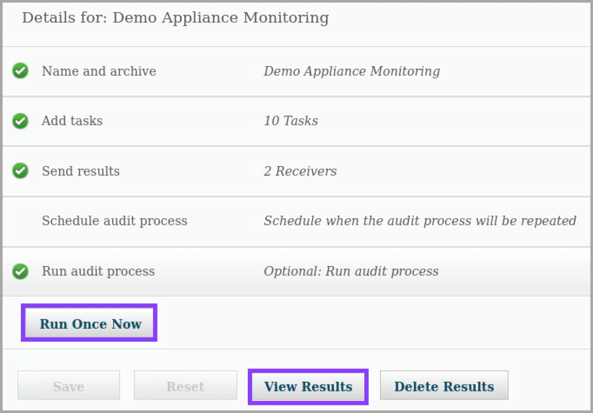

Puede ejecutar el proceso de auditoría manualmente o programarlo para que se ejecute periódicamente. La programación es útil a efectos de cumplimiento para enviar un conjunto periódico de resultados para su auditoría.

*   Haga clic en **Ver resultados**.
*   Despliegue el estado Distribución y uno de los informes para mostrar los receptores y los datos enviados a los receptores.

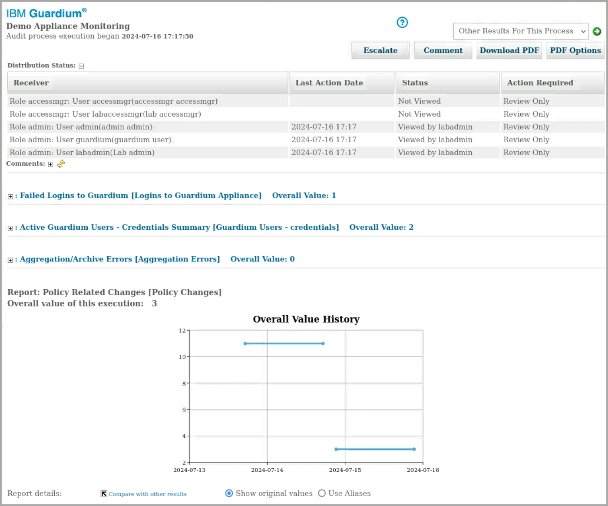

Una vez ejecutado el proceso de auditoría, puede revisar los resultados. Los resultados incluyen qué receptores vieron o firmaron el flujo de trabajo, comentarios y los informes, evaluaciones y otras tareas incluidas en el proceso. Los receptores pueden descargar una versión en PDF del informe. Además, los receptores pueden notificar a otros receptores, usando la función Escalar. Esta sección de laboratorio cubrió las funciones de reporte. Guardium Data Protection ofrece herramientas para reducir el tiempo necesario para auditar e informar sobre el cumplimiento con aceleradores de cumplimiento y flujos de trabajo automatizados.

### Enhorabuena, has llegado al final del laboratorio 104.

Hablamos de Reporting y otras herramientas de apoyo a los informes.

Haga clic en, **[laboratorio 105](/guardium/105)** para iniciar el siguiente laboratorio.
