# Reporting

## 1 Introduction
- Switch to the reporting functions. Show the value of prebuilt reports, custom reporting, and visualization of the audit data.

### Reporting

> **Note:** This must be performed on C200.
- Go to **Accelerators > PCI > Overview > PCI Data Security Standard**.

Now, you learn about reporting capabilities. IBM Security Guardium Data Protection
includes predefined policies and reports. Some of these prebuilt configurations are
accelerators. Accelerators provide customizable regulation-specific reports, policies, tools,
and workflow automation that accelerate compliance and simplify validation with a broad
range of requirements. Guardium includes PCI, Basel II, Data Privacy, SOX, GDPR, and
CCPA-specific accelerators.

- Review PCI-DSS basics.

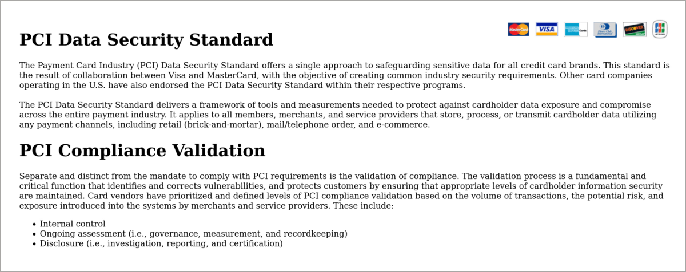

Here you see general information about PCI-DSS regulation.

- Go to **Accelerators > PCI > Overview > PCI Accelerator for Compliance**.
- Review this page to learn about PCI Accelerator.

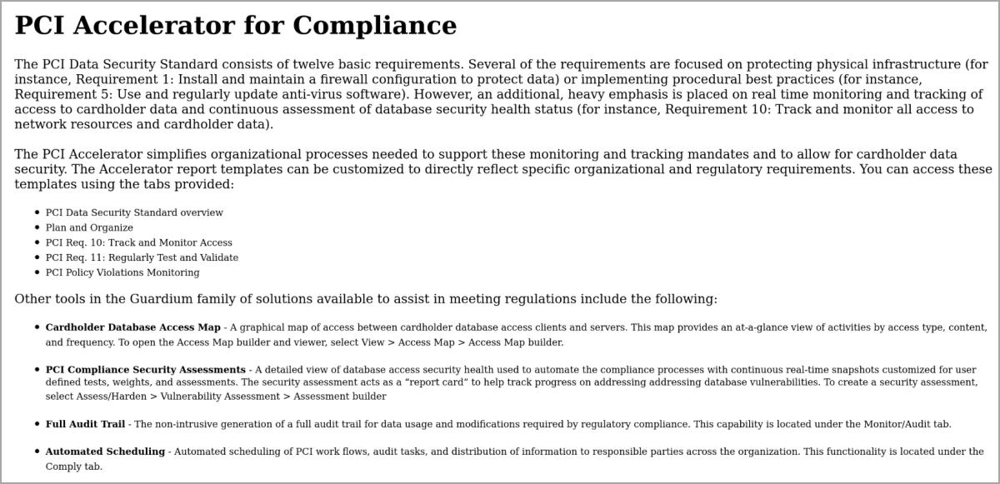

In the PCI Accelerator for Compliance page, you can learn how Guardium helps secure
your data and meet PCI requirements.
It provides customizable PCI DSS-specific reports, policies, tools, and workflow
automation that accelerate compliance and simplify validation with a broad range of
requirements.

- Go to **Accelerators > GDPR > GDPR Compliance**.

Now, you can jump to GDPR. GDPR is another regulation for which Guardium has prebuilt
definitions.

- Review the GDPR compliance and accelerator.

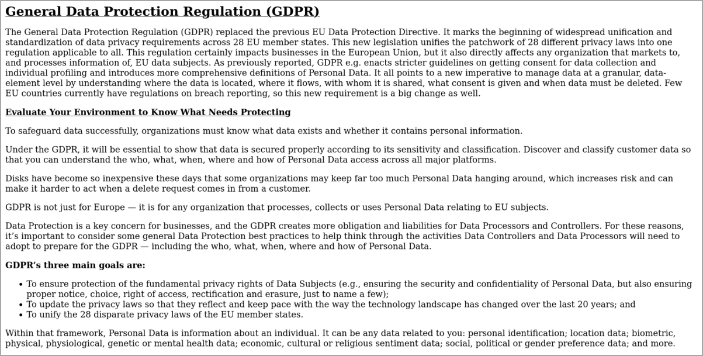

In the GDPR accelerator for compliance page, you learn how Guardium helps secure data
and meet GDPR requirements.
It provides customizable GDPR-specific reports, policies, tools, and workflow automation
that accelerate compliance and simplify validation with a broad range of requirements.

- Go to **Comply > Reports > Incident Management**. Review the report.

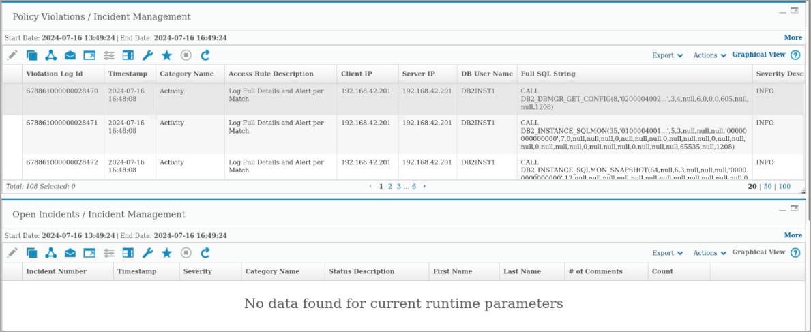

One such useful report is on Policy Violations and Incident Management. This report shows
a list of events that violated installed policies.

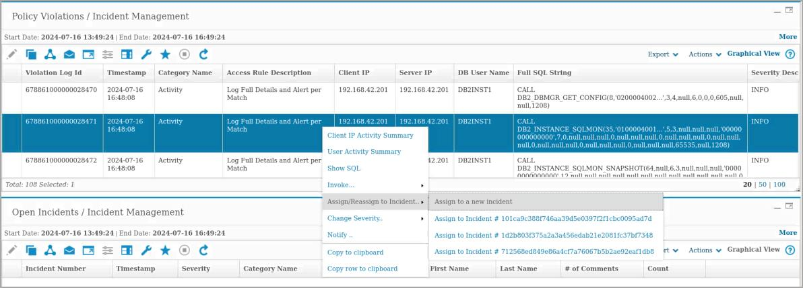

- Right click an event and select **Assign/Reassign to Incident > Assign to a new incident**.

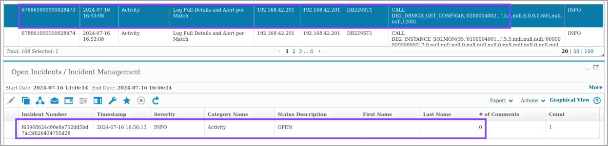

You can perform actions on individual events. In this case, you assign a policy violation to
a new open incident.

- Go to **Investigate > Database Activities > Databases / Servers**.

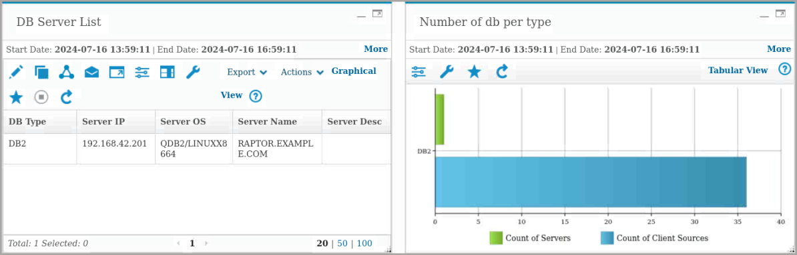

Another report is for the database inventory. In this report, you can see the number of
servers and client sources accessing these servers by the database type. This report can
help you validate the database types that you are using most.

- Type **error** in the search bar.

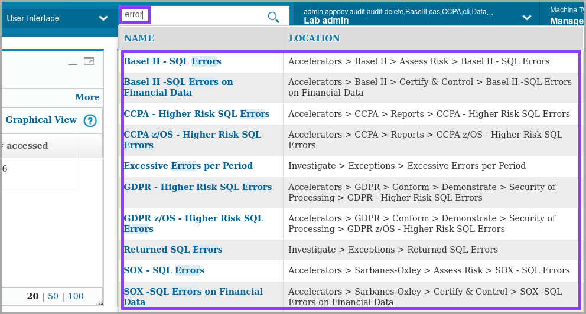

If you don’t remember the menu for a specific tool in Guardium, you can search for it with
the search bar.

- Go to **Reports > Report Configuration Tools > Query-Report Builder**. Select a report to display details. 
> **Note:** you can either make a copy or open the original.

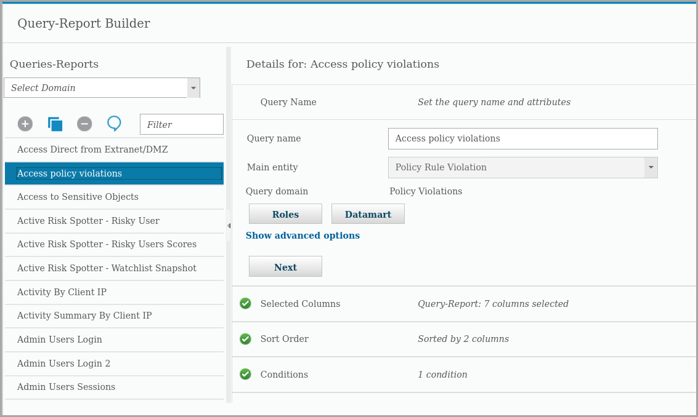

Guardium includes many prebuilt queries and reports. You can use them, customize them,
or create a custom report.

> **Note:** Audit process builder must be demonstrated on the C200 user interface. Go to **Comply > Tools and Views > Audit Process Builder**. Select **All**. Then select **Demo Appliance Monitoring**.

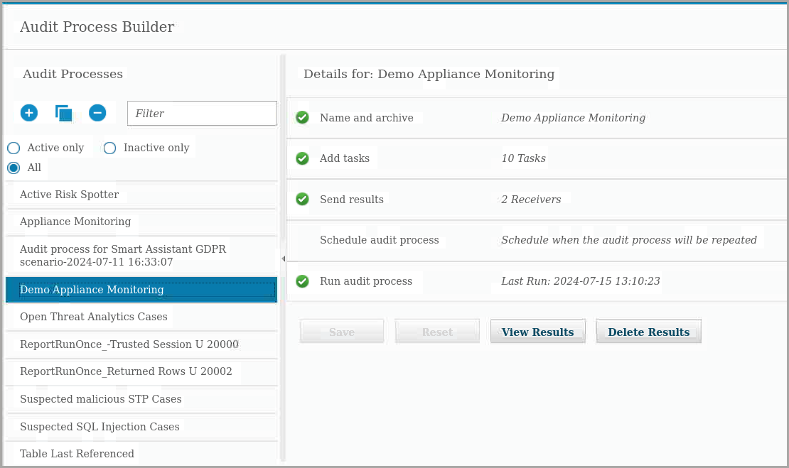

To support reporting, Guardium includes Audit Process Builder to streamline your
compliance workflow process by consolidating, in one spot, database activity monitoring
tasks such as: asset discovery; vulnerability assessment and hardening; database activity
monitoring and audit reporting; report distribution; sign off by key stakeholders; and
escalations.
It is also possible to export audit results to external repositories for more forensic analysis
such as Syslog, CSV or CEF files, or external feed.

- Expand the **Add tasks** section.

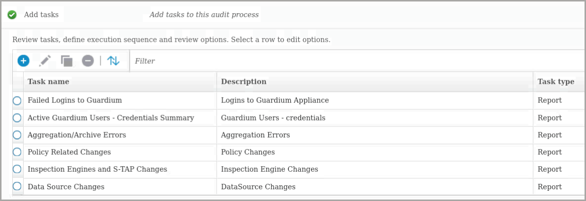

An audit process can contain multiple audit tasks. When you add a report type task, it
produces a report, either custom or a Guardium predefined report, which can be
distributed. Reports can be exported in CSV, CEF, and PDF formats or written to Syslog
to feed other solutions.

- Expand **Send results**.

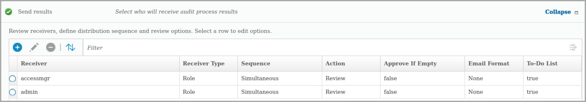

The audit process builder automates distributing audit process output to individual users
and roles. These process receivers can view and manage audit process output.
Audit process receivers are notified by email or by their task list of pending audit process
results. You can designate any receiver as a signer for a process. In this case, the results
can be held at that point on the distribution list until that receiver electronically signs the
results or releases them.
You can define any number of receivers for a workflow automation process, and you
control the order in which they receive results.

- Expand **Run audit process** and click **Run Once Now**.

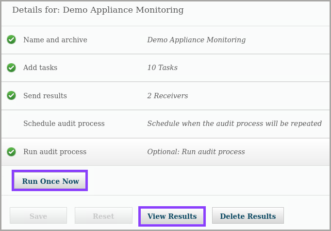

You can run the audit process manually or schedule it to run periodically. Scheduling is
useful for compliance purposes to send a periodic set of results for auditing.

- Click **View Results**.
- Expand the Distribution status and one of the reports to show the receivers and the data sent to the receivers.

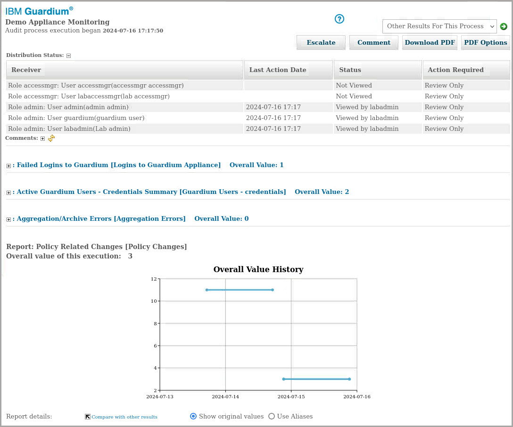

After the audit process runs, you can review the results. Results include which receivers
viewed or signed off on the workflow, comments, and the reports, assessments, and other
tasks included in the process. Receivers can download a PDF version of the report. In
addition, receivers can notify other receivers, using the Escalate function.
This lab section covered reporting functions. Guardium Data Protection offers tools to
reduce the time it takes to audit and report on compliance with compliance accelerators
and automated workflows.

You talked about Reporting and other tools supporting reports.
