# Configuración y gestión

## 1 Introducción

En este laboratorio, repasaremos la sección Configuración y gestión en Guardium. Esta sección proporciona detalles sobre los agentes, su gestión y el Health Monitoring que ayuda a reducir los costes operativos. Finalmente, discutiremos brevemente las configuraciones y su administración.

### Configuración y gestión

*   Inicie sesión en la consola de usuario MA170 como usuario `labadmin`.
*   Vaya a **Administración > Vista Sistema > Monitor del Sistema**.

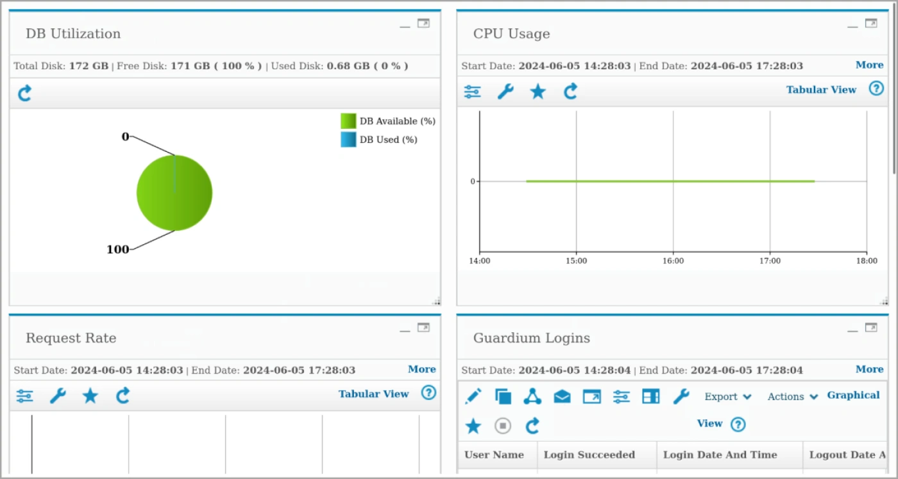

Hablemos ahora de la administración de Guardium. Los administradores de Guardium realizan varias tareas de administración y mantenimiento. Las tareas de administración incluyen el monitoreo de la salud del sistema y la administración de artefactos tales como grupos, dominios y notificaciones. Estas son algunas de las principales actividades de administración de Guardium.

*   Revise los informes.

La vista del sistema es la vista inicial por defecto para muchos usuarios. Muestra elementos clave del estado del sistema. La ventana Monitor del sistema muestra detalles actualizados sobre los datos entrantes, el uso de la CPU y otra información. El uso de disco de los sistemas Guardium, las tasas de solicitudes y los inicios de sesión en los sistemas Guardium son algunos de estos detalles.

*   Vaya a **Gestionar > Vista del sistema > Topología del estado de despliegue**.

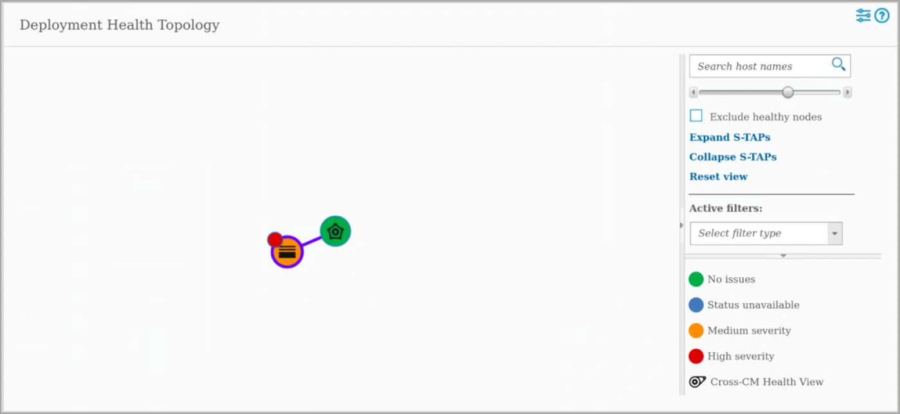

Guardium proporciona herramientas para monitorizar la salud del entorno Guardium. La topología de salud del despliegue muestra una vista gráfica del entorno Guardium y la salud de los nodos.

*   Pasa el ratón por encima del nodo colector.

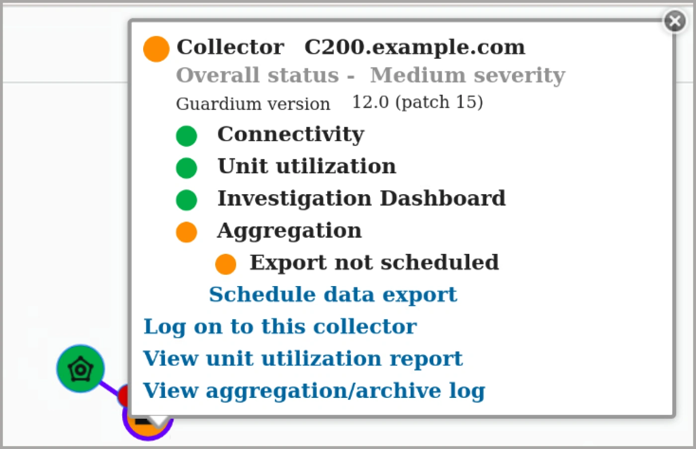

Aquí puede ver que el recopilador se encuentra en buen estado, excepto que la agregación no está configurada. Puede acceder a los informes que muestran detalles sobre el nodo o iniciar sesión en el nodo.

*   Inicie sesión en C200 como usuario `labadmin`.

> **Nota:** S-TAP Status Monitor sólo está disponible en el colector, C200.

*   Vaya a **Gestionar > Vista del Sistema > Monitor de Estado S-TAP**.

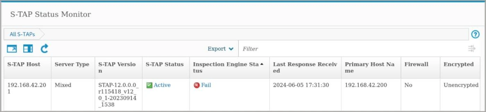

Para cada S-TAP que informa a este sistema Guardium, este informe identifica el host S-TAP, el tipo de servidor de base de datos, la versión de S-TAP, el estado y el estado del motor de inspección. Por lo tanto, el administrador de Guardium puede ver el estado del agente S-TAP en el servidor de base de datos sin necesidad de acceder al servidor de base de datos supervisado.

*   Vaya a **Gestión > Control de actividad > S-TAP Control**.

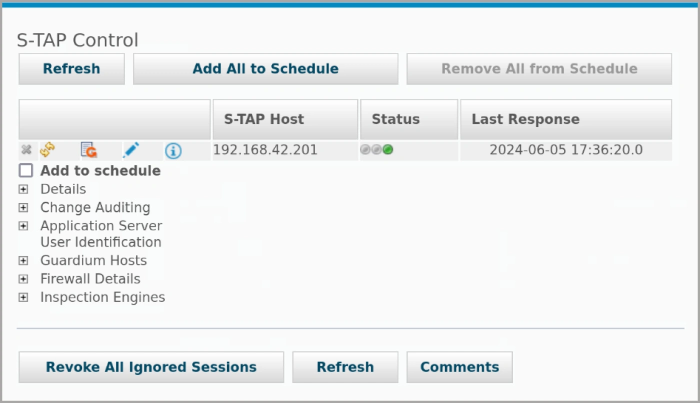

La ventana de control de S-TAP muestra información sobre los agentes S-TAP y ofrece opciones para enviar un comando al agente S-TAP, mostrar registros de eventos de S-TAP y editar la configuración de S-TAP. La ventana de control de S-TAP ofrece un punto centralizado para ver todos los S-TAP gestionados por este sistema Guardium, gestionar S-TAP individuales y ejecutar un conjunto de operaciones en todos los S-TAP.

*   Amplíe la sección Motores de inspección.

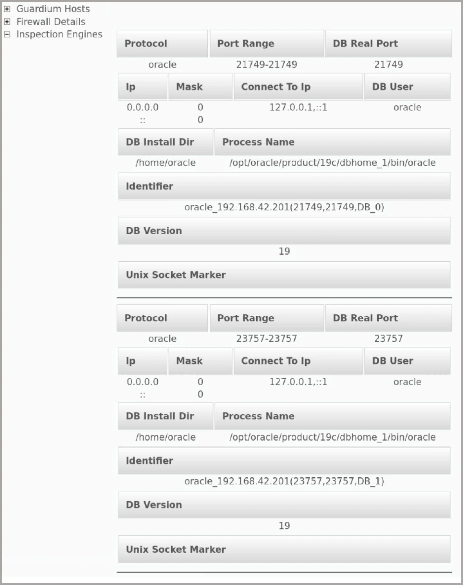

Los motores de inspección son el conjunto de parámetros configurados para cada base de datos monitorizada. El agente S- TAP escanea periódicamente el servidor de bases de datos en busca de nuevas bases de datos y configura automáticamente un motor de inspección para cada una de ellas. Sin embargo, también puede crear manualmente un nuevo motor de inspección o modificar los parámetros de los motores de inspección existentes.

*   Inicie sesión en **C200** como `labadmin`.

> **Nota:** En este entorno de laboratorio, el servidor GIM está en el recopilador, C200. El administrador central, **MA170**, no tiene clientes GIM en su página Configuración por cliente.

*   Vaya a **Gestión > Instalación de módulos > Configuración por cliente**.

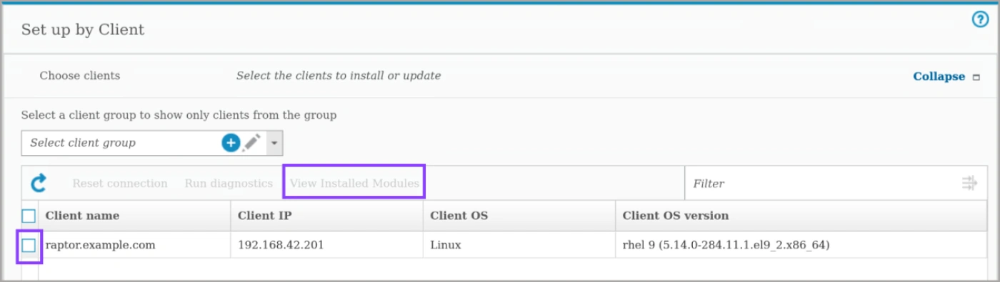

Guardium tiene un componente que se llama Guardium Installation Manager (GIM) que se utiliza para instalar y mantener los componentes de Guardium en los servidores gestionados. GIM incluye un servidor GIM, que se instala como parte del sistema Guardium, y un cliente GIM, que se instala en los servidores que alojan las bases de datos que se desea monitorizar. El cliente GIM es un conjunto de scripts Perl que se ejecutan en cada servidor gestionado. Tras la instalación, el cliente GIM trabaja con el servidor GIM para ejecutar tareas. El cliente GIM instala, actualiza, configura y desinstala agentes. El cliente GIM también supervisa y controla los procesos de los agentes en el servidor de base de datos. Para gestionar un gran número de instalaciones GIM, cree grupos de clientes GIM. A continuación, utilice los grupos para instalar, actualizar y gestionar paquetes de software.

*   Seleccione el cliente raptor y haga clic en **Ver módulos instalados**.

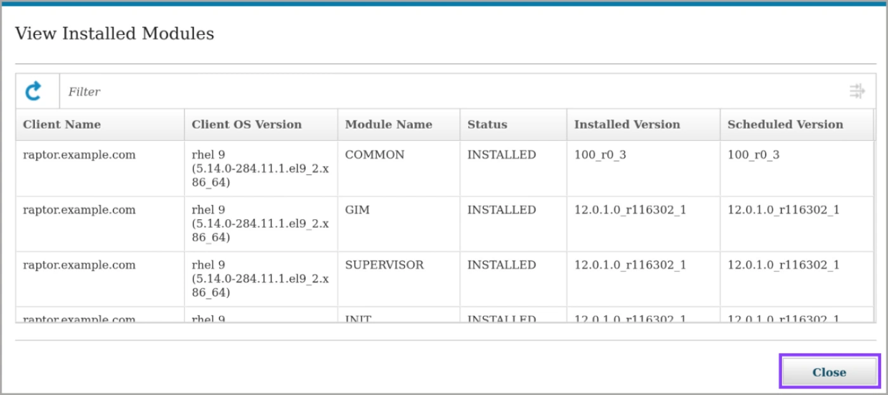

*   Cierre el cuadro de diálogo de módulos instalados, expanda **Elegir paquete** y seleccione **Paquete-STAP** en el menú de paquetes.

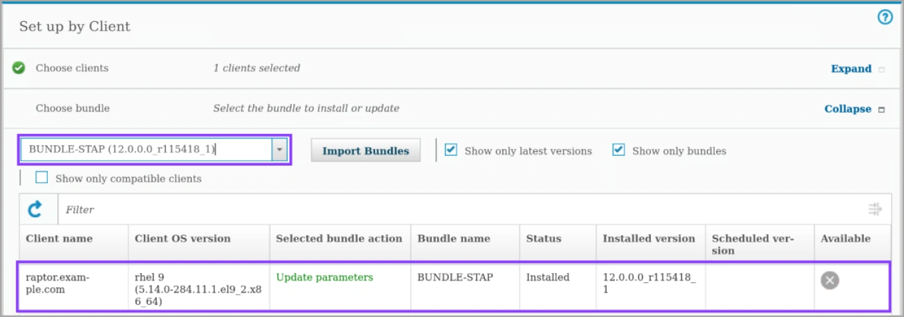

En la sección Elegir paquete, puede ver los módulos que pueden instalarse o actualizarse para el servidor elegido en el paso anterior. Tras la selección del paquete de software, puede ver las acciones que se pueden ejecutar, como los parámetros de instalación, actualización y mejora.

*   Amplíe **Configurar clientes** y seleccione **Mostrar parámetros editables**.

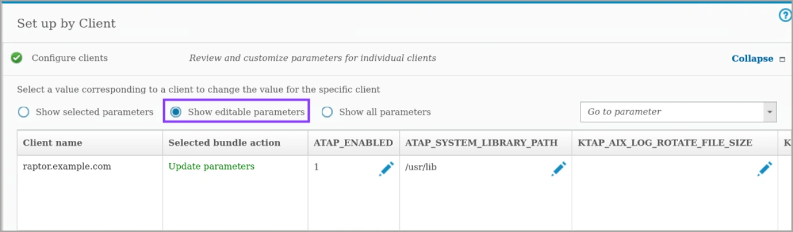

*   Revise los parámetros y desplácese hacia abajo hasta que aparezca el botón **Instalar**. No haga clic.

Con la opción de actualización de parámetros, los parámetros del paquete se actualizan en el cliente. Verás los parámetros y sus valores actuales. Puedes cambiarlos según tus necesidades. Puedes instalar o desinstalar directamente el paquete o crear una API para llamar a la instalación desde otras herramientas o scripts. Con GIM, puede ejecutar inmediatamente o programar la instalación para ventanas de mantenimiento durante la noche o los fines de semana.

*   Vaya a **Gestión > Utilización de unidades > Utilización de unidades**.

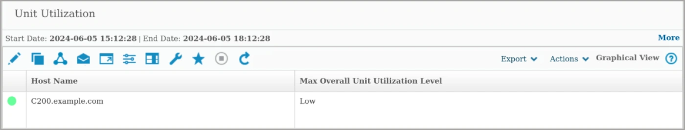

También puede realizar un seguimiento del rendimiento de los dispositivos Guardium. El informe de utilización de unidades proporciona una visión a nivel de empresa del uso de los colectores. Emplea un simple indicador de Bajo, Medio o Alto que muestra qué colectores están sobreutilizados o infrautilizados. El análisis se basa principalmente en los datos del monitor de uso, con algunos parámetros de las estadísticas de Guardium, recopilados internamente en los colectores.

*   Vaya a **Gestión > Gestión de datos > Copia de seguridad del sistema**.

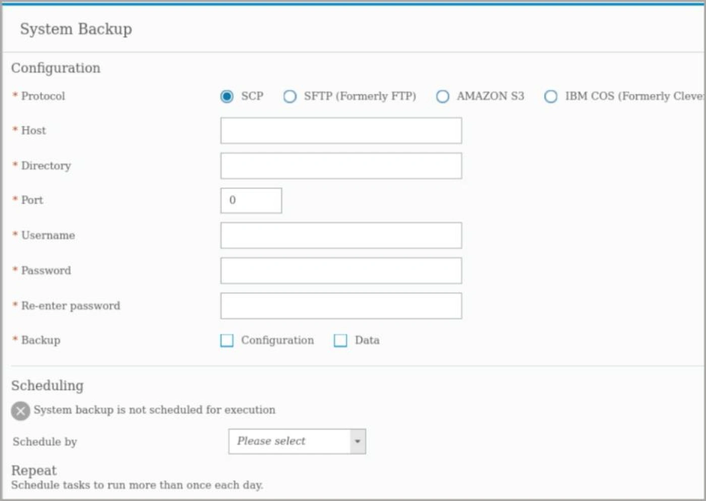

Ahora, la demostración trata de cómo gestionar los dispositivos Guardium. Para gestionar el sistema Guardium, existen páginas e informes en la interfaz de usuario que puede configurar y mantener. Una de estas tareas es la copia de seguridad del sistema. Las copias de seguridad del sistema almacenan todos los datos y valores de configuración necesarios para restaurar el sistema Guardium. Existen diferentes protocolos disponibles para la copia de seguridad, como SCP o SFTP, y Amazon S3. Puede seleccionar realizar la copia de seguridad de la configuración, de los datos o de ambos.

*   Vaya a **Configuración > Herramientas y Vistas > Alerter**.

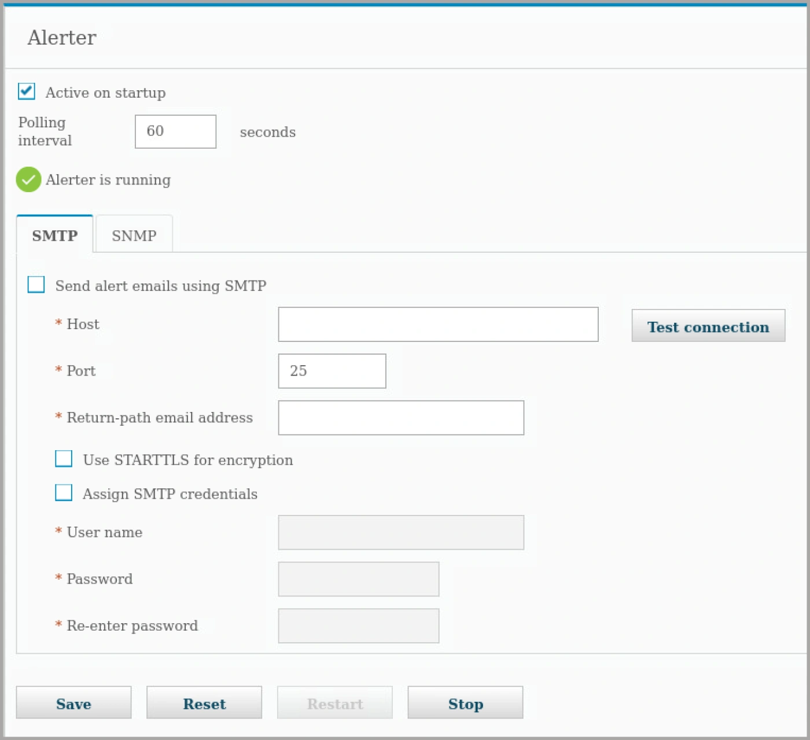

*   Revise los parámetros del Alerter.

Otro ajuste se refiere a las notificaciones. Guardium dispone de un Alerter para enviar mensajes de correo electrónico, traps SNMP y mensajes Syslog relacionados con alertas. Otros componentes crean y ponen en cola mensajes para el Alerter. El Alerter comprueba si hay mensajes y los envía en función del intervalo de sondeo especificado.

*   Vaya a **Configuración > Herramientas y Vistas > Perfil Global**.

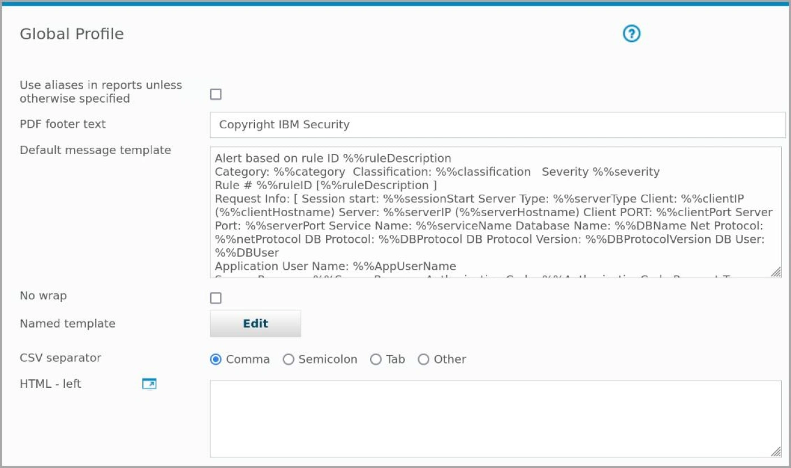

La página Perfil Global define los valores por defecto que se aplican a todos los usuarios. Establece los valores por defecto para su sistema Guardium. Puede añadir su propio encabezado y pie de página a los informes, cargar el logotipo de su empresa, crear una plantilla de mensaje predeterminada y mucho más.

*   Vaya a **Configuración > Herramientas y Vistas > Sistema**.

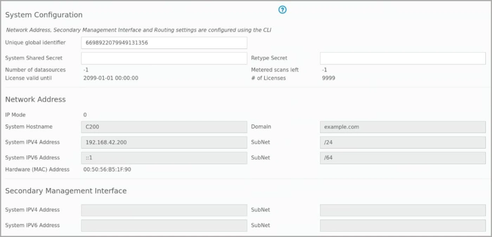

Parte de la información se puede configurar en la página de configuración del sistema. Sin embargo, la mayor parte de la información de la ventana de configuración del sistema se configura mediante la CLI.

*   Vaya a **Configuración > Herramientas y Vistas > Portal**.

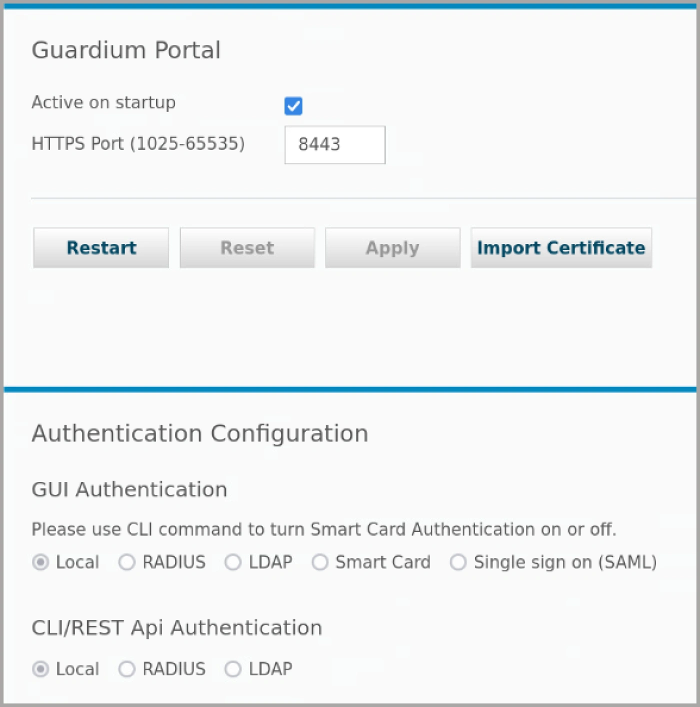

Desde la página del portal de Guardium, puede restablecer el puerto del servidor web del dispositivo Guardium, importar certificados SSL y configurar la autenticación de los usuarios del sistema Guardium. Las opciones de autenticación son usuarios locales, Radius, LDAP y tarjeta inteligente. La autenticación multifactor (MFA) añade una capa adicional de seguridad a las cuentas de usuario de Guardium. Guardium soporta el motor de autenticación DUO o RSA SecurID.

*   Haga clic en **Bienvenido** en el menú de navegación.

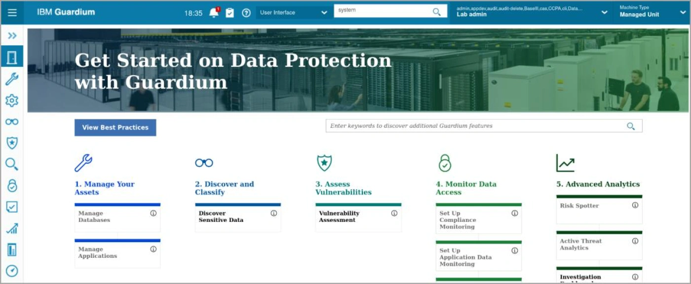

En resumen, Guardium supervisa las operaciones de acceso a los datos en tiempo real para detectar acciones no autorizadas basadas en políticas. Guardium Data Protection reduce el riesgo de violación de datos al proporcionar visibilidad e inteligencia de seguridad de datos en tiempo real. Guardium permite a las organizaciones hacer frente a las cada vez más complejas normativas de seguridad y privacidad de datos, mitigando las amenazas y a los usuarios de riesgo.

### Enhorabuena, has llegado al final del laboratorio 105.

Hablamos de la configuración y el mantenimiento de Guardium.

¡Enhorabuena! Hemos terminado todos los laboratorios de la serie Guardium Data Protection L3.
