#  Policy Management

## 1 Introduction

This lab showcases the following:
 - Create and install a policy
 - Configure and access alert rule
 - Implement policy rules

## 2 Creating and installing a policy

Until policy rules are created, Guardium doesn’t collect anything to store in its database. It does not know what to collect yet. We might want to be selective about what it collects. For example, we might decide to ignore database activity that originates from a group of trusted users and to be alerted to unusual database activity, such as access to a predefined group of sensitive database tables.

### Create and install a new policy

In this task, you will create a new data security policy, **-LabPolicy**, and configure two rules for it. Next, you install **-LabPolicy** and override all other policies so that **-LabPolicy** is the only installed policy.

1. Log in to the **Collector (C200) Graphical console** as user `labadmin` with password `P@ssw0rd`.

2. Go to **Protect > Security Policies > Policy Installation**. The Policies Installation pane opens.

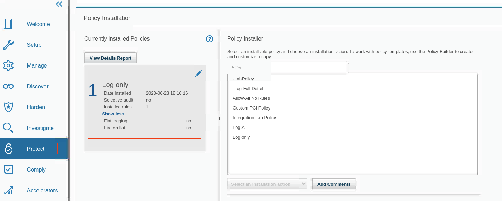

You can see the following useful information in the Policy Installation pane:

- When a policy was installed
- Whether a policy uses a selective audit trail
- The number of rules in a policy

Additionally, you can manage your policies from this pane. You can install, reinstall, delete, edit, or add a policy.

3. You see that the Log Only policy is installed. Next, you create and install a new policy.
4. In the **Navigation** menu, go to **Protect > Security Policies > Policy Builder for Data**.

5. Click the **Analyze** menu and verify that the **Policy analyzer** is running. If it’s stopped, start it.

6. To create a new policy, click **New** icon. The Create New Policy pane opens.

    Guardium has two types of policies for data:

      - **Data security policy** provides the most options for criteria and actions. In this exercise, you create a data security policy.

      - **Session level policy** is a specialized type of policy that improves performance by validating criteria at the beginning of processing, but only works on   session-level criteria.

> **Note:** You might wonder why you create a regular data security policy when one of your rules is a session-level rule, which seems like a fit for a session-level policy. The reason is because a session-level policy can have only session-level rules, but your new data security policy can include both session-level and object-level rules. You could have two policies, one for the session-level rules and one for object-level rules, but instead you keep things simple by creating a single policy with two rules.

Fill the form with following details: 

**Type:**     Data security policy 

**Name:**     -LabPolicy

**Category:** Access

> **Note:** To find your policy in the list easily, and also to designate it as a user-created policy, incorporate a dash (-) at the beginning of your policy name.

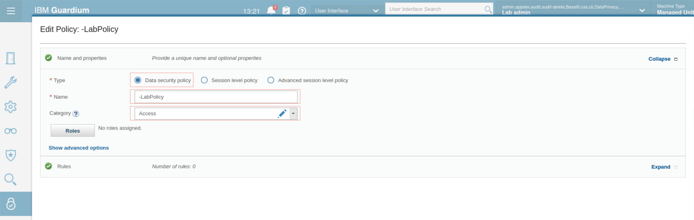

7. To save your new, but still empty policy, scroll down and click **OK**.

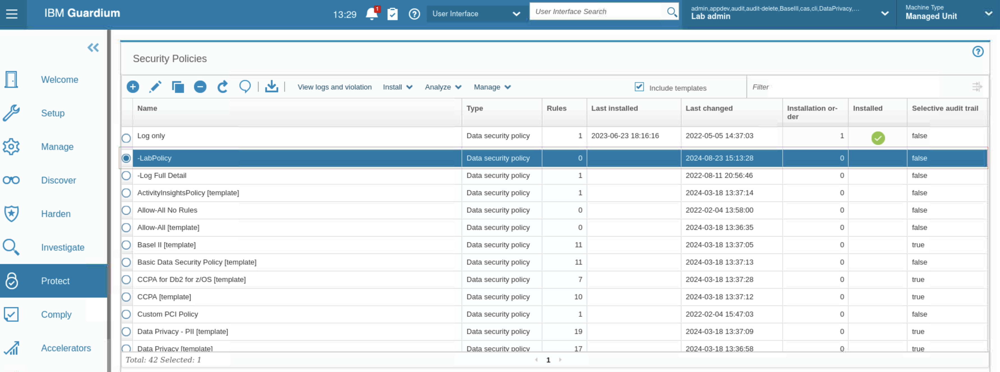

The settings are saved, and you see the new policy in the Security Policies pane. The policy has no rules, and it is not yet installed.

8. Select your new policy and click **Edit**. The policy çediting pane opens. 

9. Click **Show advanced options**

The advanced options are these:

- **Log flat** signals Guardium to log traffic immediately, and to postpone detailed analysis until later. This option can reduce the load on the collector. Some actions do not work with log flat.
- Rules on flat is only available when Log flat is selected. It examines session-level rules in real time, but not regular rules.
- Selective audit trail limits the amount of logging on the system. Leaving this box unchecked, ensures a “non-selective” policy is being added.

Leave all the advanced options cleared.

10. To configure the rules, in the **Rules** section, click **Expand**. The Rules table opens.

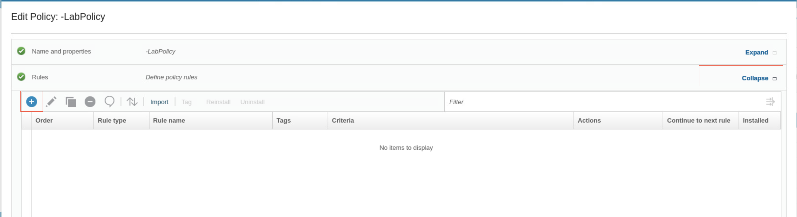

11. To add a rule, click **New**. The Create New Rule window opens. 

Fill the forms with following values

Rule name:  Ignore S-TAP session for trusted users
Category:   Access
Severity:   Information
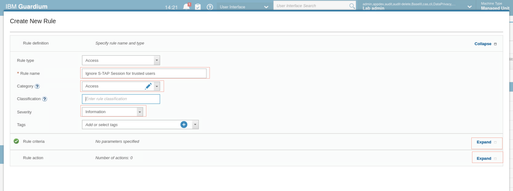
12. In the **Rule criteria** section, click **Expand**. There are three subsections where you enter criteria.
- Session level criteria
- SQL criteria
- Other criteria

13. In **Session level criteria**, set the fields as follows:
**Parameter name:**   Database user
**Condition:**        In Group
**Parameter value:**  Lab Trusted Users

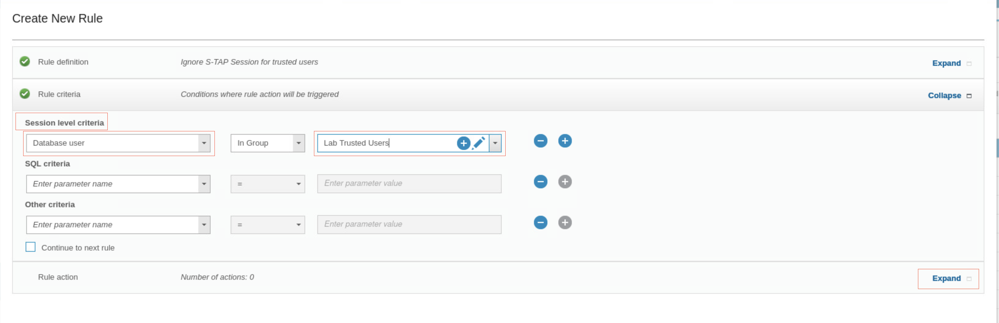

14. Define the actions to take when a database access event meets the Rule criteria.

- To display the Rule action table, in the Rule action section, click Expand.
- To add an action, click **New** . A list of possible actions opens.
- Select **IGNORE > IGNORE S-TAP SESSION**. 

This action tells the collector to ignore any information from this session, and also tells the S-TAP agent to not send any more information from this session, which reduces network traffic. The Rule pane updates with the new action.

15. To save your new rule, scroll down and click **OK**.

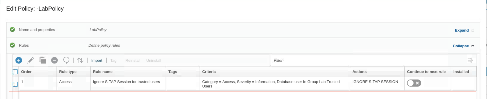

16. To add a second access rule to your policy, click **New**. Use the following information:
 - **Rule type:** Access
 - **Rule name:** Alert on access to sensitive objects
 - **Severity:**  High (this makes it easier to see in the incident log later)

 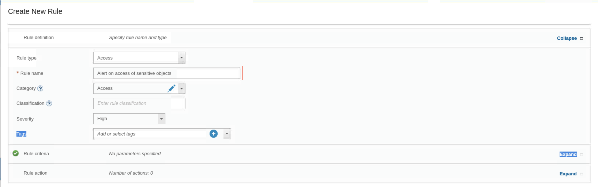

17. For Session level criteria, select **Database User: In Group: Lab Privileged Users**.

18. For SQL criteria, select **Object: In Group: Sensitive Objects**.

 

19. Set the following two rule actions:

  - Action 1. **ALERT > ALERT PER MATCH**, with the Default message template and **SYSLOG** as the Notification Type
  - Action 2. **OG FULL DETAILS**
 

20. Scroll down and click OK. You return to the Edit Policy pane. Now you have two rules.

  

21. To save your policy and return to the Security Policies pane, scroll down and click OK, then close the confirmation dialog. Your new policy now shows two rules.

22. Now it is time to replace the currently installed policy with the policy you created. 
  - Select the new policy, **-LabPolicy**.
  - From the **Install** menu, select **Install**.
  - In the Install policy window, select the Installation action Install & override. 
  - Leave All policies selected

    

  - Click **OK** and close the confirmation message.

    The Security policies pane shows that your policy is installed, and the **Last Installed** column is updated
    
23. Go to **Protect > Security Policies > Policy Installation**. The Policy Installation pane opens. Your policy is the only currently installed policy.

    

### Test the new policy

Now you generate some data, test your policy, and review the results. You start with the privileged users rule and generate some data. You access the tables: CC,CREDITCARD, PATIENT, and SSN as users JOE and JOAN. JOE and JOAN are both members of the privileged users group. Therefore, when they attempt to access a table that is listed in the sensitive objects group, the rule triggers and logs a policy violation.

1. To start a terminal session on the database server, on your database server’s desktop, click the Terminal icon. 

    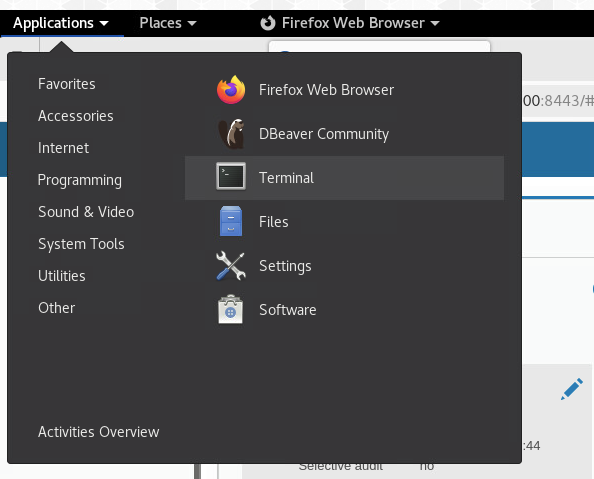

2. To change to user **db2inst1**. enter the command `su - db2inst1`.

3. To enter the Db2 command environment, run `db2`.

    

4. In the **Db2** command environment, run the following commands:   

`connect to sample user joe using P@ssw0rd`
`select * from db2inst1.patient`
`select * from db2inst1.cc`
`select * from db2inst1.creditcard`
`select * from db2inst1.ssn`
`connect to sample user joan using P@ssw0rd`
`select * from db2inst1.patient`
`select * from db2inst1.cc`
`select * from db2inst1.creditcard`
`select * from db2inst1.ssn`

5. After you receive the results, type quit.

6. In the Guardium GUI, go to **Reports > Real-Time Guardium Operational Reports > Incident Management**. You see policy violations for privileged users JOE and JOAN, who accessed database tables in sensitive objects. You might need to wait a few minutes for some results to appear. 

    

You see that the access to the **SSN**, **PATIENT**, and **CREDITCARD** tables result in violations, but 
the access to the CC table does not. That is because SSN and PATIENT match objects in the 
**Sensitive Objects** group.

## Configuring an access alert rule

In this exercise, you modify the existing policy to add an alert rule. This rule will alert when a privileged user attempts to access a sensitive data object containing a creditcard token.

### Create a rule

In this task, you create a rule that sends an alert when a user accesses the creditcard table.

1. Iog in to **the collector (C200)** graphical console as user `labadmin` with password `P@ssw0rd`. In the Guardium GUI menu, go to **Protect > Security Policies > Policy Builder for Data**.

2. To modify the policy, select **-LabPolicy** and click **Edit**.

3. Expand the Rules section.

4. To add a rule, click **New** 

    Fill the forms with following values

    **Rule name:**  Alert on CreditCard Access
    **Severity:**   Medium
    **Category:**   Sensitive Data

    

5. Expand the Rule criteria section.

  - For **Session level criteria**, select **Database user: In Group: Admin Users**.
    
    The Admin Users group contains a list of the privileged users that you audit for this policy rule. You can view the group members to verify that JOE is a member of this group.    

  - For **SQL criteria**, select **Object = %creditcard**

    

6. Click the **Rule Action** section. 

  - To add a new action, click **New** and select **ALERT > ALERT PER MATCH**.
  - In the **Add New Action** window, for **Message Template**, keep Default.
  - For **Notification Type**, select **SYSLOG**.

    
  - Click **OK**.
  - To save the rule, scroll down and click **OK**.

    You now have three rules in the policy. Only two of the rules are installed because the policy must be reinstalled to activate the rule you just created.
    

7. For the rule, **Alert on access to sensitive objects**, set **Continue to next rule** to **On**.

> **Note:** Creditcard table is part of the sensitive objects group. Therefore, if a member of the Admin group, for example, JOE, runs the command select * from creditcard, you see it logged with Details and Send an Alert. To accomplish this, you must select Continue to Next Rule in the previous Access Rule (the one with Log Full SQL) because by default, when a rule is triggered, the Guardium appliance stops the rule analysis there.

8. Click **OK**. You return to the **policy builder**. Your policy now shows **three rules**.

9. To reinstall the policy, select **-LabPolicy** and click **Install > Reinstall**.

    

    The last installed value updates.

 ### Test the alert policy

In this task, you generate traffic to test the policy.

1. Run the following commands in the Db2 command environment:

`connect to sample user joe using P@ssw0rd`
`select * from db2inst1.creditcard`
`select lastname,firstname from db2inst1.creditcard`

2. After you receive the results, type `quit`.

3. Back in the **GUI**, to locate the Incident Management report and verify that the alert was 
reported, click **Comply > Reports > Incident Management**.

    
> **Note** The color of an event is associated with severity and can help identify and prioritize critical alerts.

### Configure the alert rule

Policy analyzer provides insights that help you identify frequently fired rules, optimize rule order, and evaluate rule changes.

1. In the policy builder, select the **-LabPolicy** and then from the **Analyze** menu, click **View results > Continuous analysis**.

    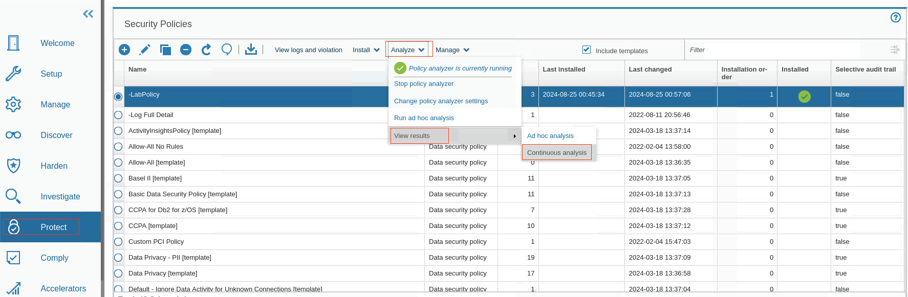

2. If there is no data for the analysis, you might need to go back in time, for example, 3 hours.

    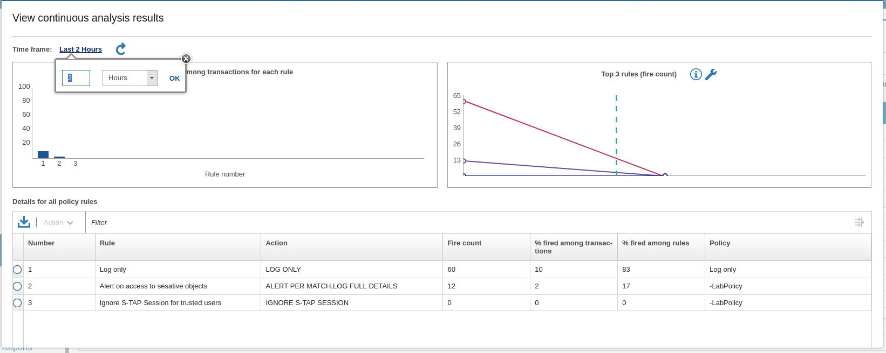
  
    In this exercise, the Policy Analyzer shows that all rules were fired. When several policies are installed, each with many rules, the Policy Analyzer can be a helpful tool to help you verify whether the rules you defined hit the traffic that is running. You make adjustments if a rule has zero hits.A different way to see policy violations and traffic that is logged is through the **View logs and violation option**.

## Implementing policy rules

Guardium supports granular, deterministic policies to positively identify violations, rather than relying on heuristics. Rules are based on specific session properties such as client IP address, MAC address, source application, DB user, OS user, application user, time-of-day, SQL command and table names, which are typically defined by way of predefined groups to simplify ongoing management. A broad range of policy actions can be invoked for policy violations, such as real-time alerts (SMTP, SNMP, Syslog, CEF), user quarantine, and terminate connection. 

In addition to examining SQL, the Guardium Data-Level Access Control module also examines query results. For example, a connection from an anomalous script or application that is suddenly seen to be extracting Personally Identifiable Information (PII) from the database can be terminated or quarantined while you investigate, although a valid application that extracts the same PII data will be allowed. 

Quarantine is available for access,exception, and extrusion rules, and can prevent the same user from logging in to the same server for a certain period of time. There is one validation item: you cannot have a rule with a QUARANTINE action without a value for amount of time that the user is quarantined. Each element has, in addition to the timestamp, a server IP, server type, a DB username, a service name, and a flag that indicates whether this was a watched session.

In this exercise, you learn how Guardium can quarantine a suspicious user for a specified period of time and send out alerts. During this time, the user is not allowed to log in to the server from the same IP address with the same userID. Therefore, the alerted administrators can secure against possible further intrusions. If the situation is deemed a harmless mistake, an administrator can lift the quarantine. In this lab, you learn how to do the following tasks: 

- Build a new policy
- Add a log full details rule and a quarantine rule to the policy
- Install and test the new policy
- Validate the quarantine results

Follow these instructions to perform the exercise. If necessary, ask your instructor for assistance.

### Build a new policy

In this task, you create a new policy.

1. Log into the Collector (C200) graphical console as user `labadmin` with password `P@ssw0rd`.

2. Use the Guardium GUI to create the new policy. In the Navigation menu, go to **Protect > Security Policies > Policy Builder for Data**.

3. To create the new Data security policy, click **New** and fill following details

  Name:     -Lab Quarantine Policy
  Category: PCI

    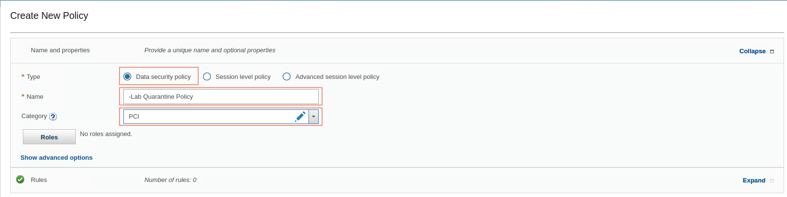

### Add a log full details rule and a quarantine rule to the policy

In this task, you add a quarantine rule to prevent unauthorized access to sensitive objects

1. To add a rule to this policy, click the **Rules** section.

2. Click **New** and fill following detail

  **Rule Type:**  Access
  **Category:**   PCI
  **Rule name:**  Log Full Details
  **Severity:**   Information

    

3. Click the Rule criteria section. You do not need to add any criteria here, but you MUST select the **Continue to next rule** checkbox.

    

    > **Note:** Selecting Continue to next rule is a critical step. If this is not checked, none of the subsequent rules are processed. You must repeat this step for all dependent rules.

4. To add a new rule action, expand **Rule action** and click **New** 

5. From the **Rule Action** list, select **LOG > LOG FULL DETAILS**. 

   

6. Add another rule of with following detail: type Access with name Quarantine PCI Objects and Severity Medium.

  **Rule Type:**  Access
  **Category:**   PCI
  **Rule name:**  Quarantine PCI Objects
  **Severity:**   Medium

    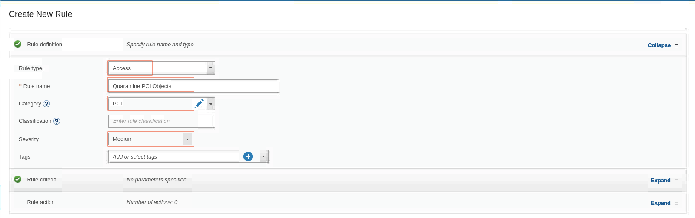

> **Note:** Medium severity policy violations are marked automatically with ORANGE in the Incident Management report.

7. Click the **Rule criteria** section. 
  - For **Session Level criteria**, select **Database type = DB2**.
  - For **SQL criteria**, set **Field = cardnumber**.
  - To add another **SQL criteria**, click **New** and set **Object = %creditcard**.
  - From the **Other criteria** list, select **Quarantine for = 15 minutes**.

    

    > **Note:** There is no need to select the Continue to next rule checkbox because this is the last rule and there are no more dependent rules.

8. Click the **Rule action** section, click **New**, and select **QUARANTINE**

    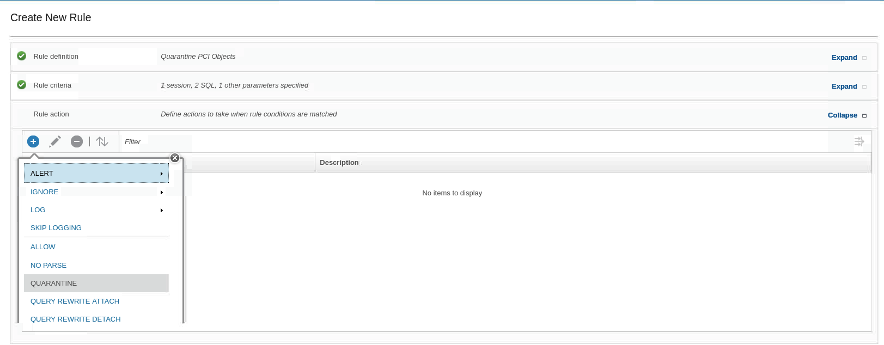

9. To save the rule, scroll down and click **OK**. You now have two rules in your policy. 

10. Enable Continue to next rule for the **Log Full details** rule.

    

11. To save the policy, scroll down and click **OK**. Then **close** the confirmation dialog. You return to the **Policy Builder**.

### Install and test the new policy

In this task, you install and test the new policy.

1. To install the newly created **-LabQuarantine** Policy, select it from the Security Policies list and click **Install > Install > Install and Override > OK**.

2. To verify that the policy was successfully installed, from the **Navigation** menu, go to **Protect > Security Policies > View Installed Policy**

  Now, you test the -Lab Quarantine Policy. To do so, you must switch the Raptor DB server user from root to db2inst1

3. Navigate to **Terminal** Session. Ensure you have logged in using `db2inst1` user

4. To enter the Db2 command environment, run **db2**.

5. Run the following commands in the Db2 command environment:

    `connect to sample user joe using P@ssw0rd`
    `select lastname,cardnumber from db2inst1.creditcard`

    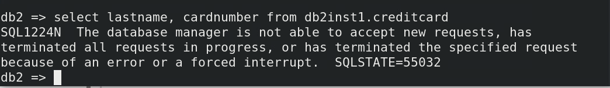

    The select command is unsuccessful. The session is dropped and the user JOE is quarantined for 15 minutes.

### Validate the quarantine results

There are two ways to find the Incident Management report and validate your results.

1. Validate that the policy successfully triggered a Policy Violation in the **Guardium GUI**.

  - Go to Comply > Reports > Incident Management.

    When you view this report, you see the quarantined user, **JOE**, with a medium severity level.

    

2. Next, validate that the user **JOE** is **quarantined**. There are 2 ways to find the **Connections Quarantined** report:

    - Use the search bar at the top of the GUI and type `conne-` until you see the Connections Quarantined report. Click it and you go to the Report page.
    - Alternatively, from the Navigation menu, go to **Comply > Reports > Connections Quarantined**

        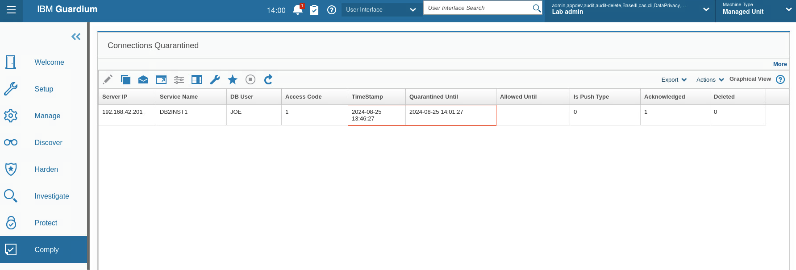

        You see that the quarantined user JOE is quarantined for 15 minutes.

3. Lastly, validate that the user JOE can’t perform any SQL activity within the quarantine period. In your Raptor DB server (C200) terminal session, type the following commands:

  `connect to sample user joe using P@ssw0rd`
  `select * from db2inst1.ssn`
  `select * from db2inst1.patient`

  JOE does not have access to any other objects during the quarantine period. Your output looks similar to this screen capture: 
        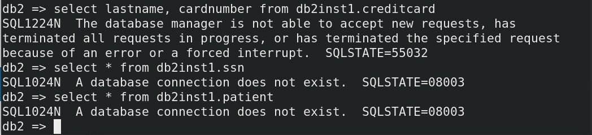

## Congratulations, you've reached the end of lab 205.

Click, **[lab 206](/guardium/dataprotection/level-4/206)** to start the next lab.
