# 100: Configuración del entorno y resolución de problemas

## 1. Introducción

Este documento explica cómo preparar el entorno de Guardium Data Protection.

## 1.1 Arquitectura de alto nivel

Los componentes de Guardium Data Protection se agrupan en las siguientes categorías:

*   Electrodomésticos:

    *   Colectores: Utilizados para la captura y análisis en tiempo real de la actividad de la base de datos.
    *   Agregadores: Descargan la actividad de generación de informes de los recopiladores y consolidan los informes de varios recopiladores.
    *   Gestores centrales: Funcionalidad especializada habilitada en un agregador para gestionar y controlar múltiples dispositivos Guardium.

*   Agentes:

    *   Agente software TAP (S-TAP®): Instalado en el servidor de base de datos para monitorizar y retransmitir la actividad observada al Guardium Collector.
    *   Agente Guardium Installation Manager (GIM): Instalado en el servidor de base de datos para facilitar la instalación de S-TAP y la actualización y modificación de la configuración de los agentes.

Guardium Data Protection ofrece soluciones flexibles y escalables para dar soporte a los distintos requisitos de arquitectura de los clientes.

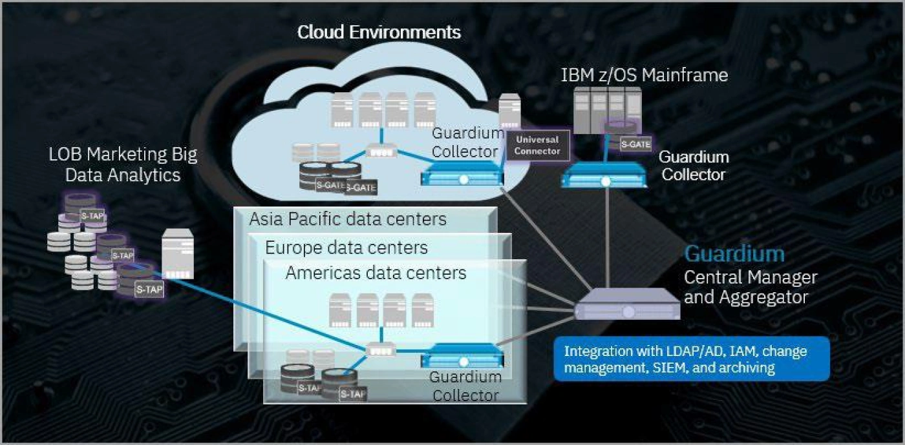

La arquitectura anterior muestra recopiladores, dispositivos y agentes S-TAP instalados en servidores de bases de datos supervisados en cada centro de datos. Los agentes S-TAP capturan y transmiten las actividades relevantes de la base de datos a los colectores Guardium para su análisis y registro. Empleamos métodos de supervisión basados en agentes, proxy y sin agentes. La monitorización sin agente ingiere registros de auditoría, mientras que Universal Connector garantiza una monitorización sin fisuras. Los recopiladores están configurados para agregar actividades a los informes centrales. En este ejemplo, hay un dispositivo de gestión central dedicado para la solución que permite capacidades de gestión federada, como la gestión de acceso, la aplicación de parches y el repositorio de metadatos. La gestión central envía las políticas a los recopiladores, y la agregación central almacena los datos en un repositorio de auditoría central.

Este entorno de habilitación cuenta con un Administrador Central, un recopilador y un servidor de base de datos llamado Raptor que aloja bases de datos DB2, Oracle y MySQL. Además, contiene datos dentro de estas bases de datos e incluye un script generador de tráfico diseñado para ejecutar automáticamente tanto actividades de base de datos como actividades maliciosas.

## 1.2 Usuarios

Estos son los usuarios y contraseñas utilizados en esta demostración:

*   GUI Guardium: `labadmin` / `P@ssw0rd`
*   GUI de Guardium: `admin` / `P@ssw0rd`
*   GUI Guardium: `accessmgr` / `P@sssw0rd`
*   Línea de comandos Guardium: `cli` / `P@ssw0rd`
*   Servidor de base de datos Raptor: `root` / `P@ssw0rd`

## 2 Prepararse

Para configurar el entorno, siga estos pasos:

1.  Para programar reservas en IBM Technology Zone, abra un navegador y utilice la siguiente dirección para navegar:

```
https://techzone.ibm.com/collection/guardium-data-protection-sales-enablement/environments
```

2.  Haga clic en **Reserva** para **Guardium Data Protection **-** Sales Enablement**. 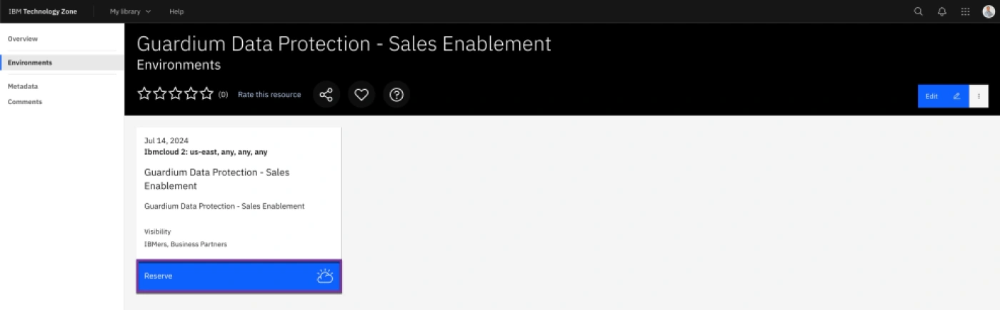
3.  Haga clic en **Reservar ahora**. 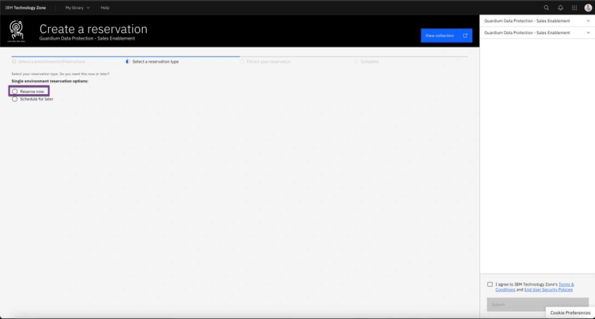
4.  Introduzca un nombre en el campo **Nombre** y elija **Educación** como finalidad. Proporcione una descripción, seleccione una **ubicación geográfica** para alojar el entorno y establezca la fecha de finalización. Revise los Términos y Condiciones y la información sobre la política y, a continuación, marque la casilla correspondiente. Por último, haga clic en **Enviar** para continuar. 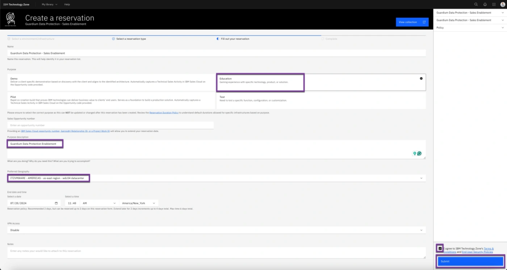
5.  Compruebe la ventana emergente de confirmación y haga clic en **Mis reservas**. 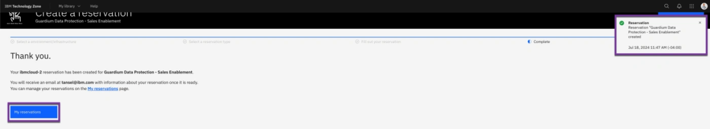
6.  Cuando el estado sea "Listo", pulse la **flecha derecha** junto a Estado. 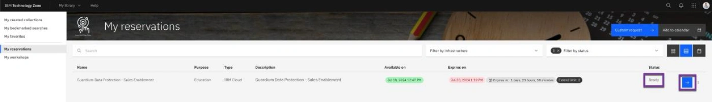
7.  Compruebe que las máquinas virtuales se están ejecutando. Haga clic en VMs en la sección VM Remote Console. 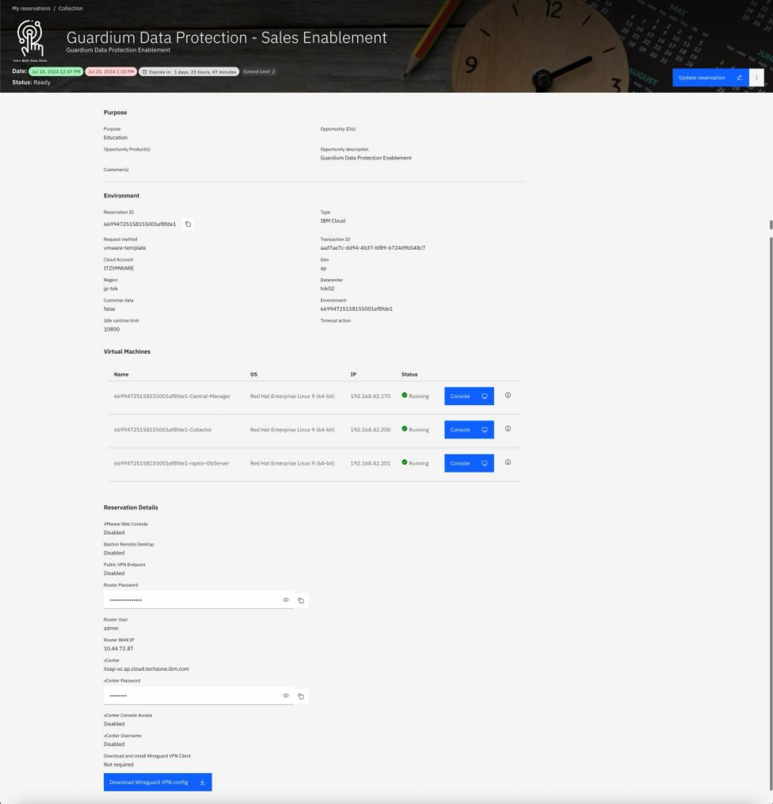

## 3 Generador de tráfico

1.  Inicie sesión en el servidor Raptor con el usuario root.

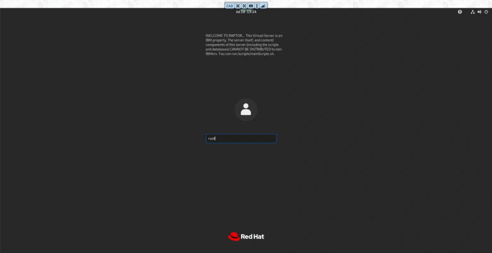

> El servidor de bases de datos Raptor, que se ejecuta en RedHat Linux, aloja bases de datos DB2, MySQL y Oracle. Se utiliza un script para mantener el servidor y realizar actividades.

2.  Abra un Terminal y ejecute /scripts/mainScript.sh. 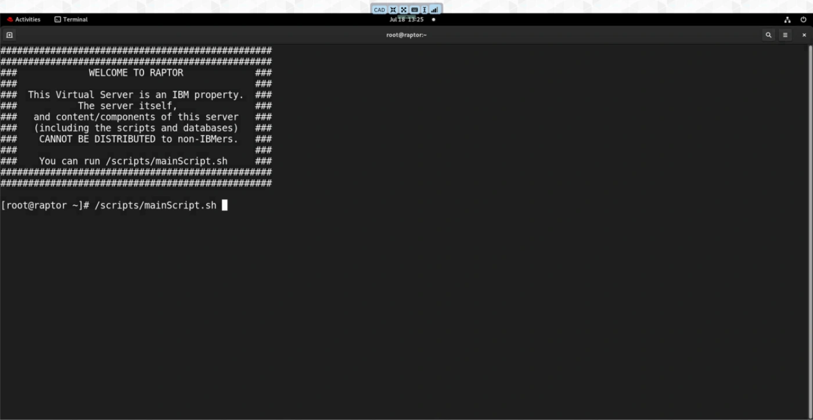

3.  Introduzca **1** para Operaciones de base de datos y, a continuación, vuelva a seleccionar **1** para iniciar todos los servicios de base de datos si alguno de ellos no se está ejecutando. 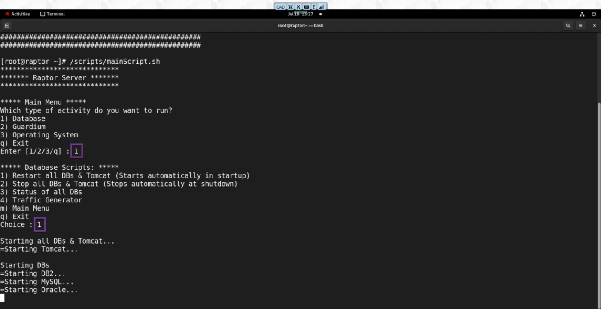

4.  Introduzca **1** para las operaciones de la Base de Datos, luego **4** para el Generador de Tráfico, y finalmente **1** para iniciar los scripts del Generador de Tráfico.

    > Nota: Este script generador de tráfico se ejecuta automáticamente al arrancar el sistema, por lo que no es necesario volver a ejecutarlo. Ejecutarlo de nuevo puede hacer que se detenga. Sin embargo, si se detiene por cualquier motivo, puede ejecutar manualmente el script para reiniciarlo.

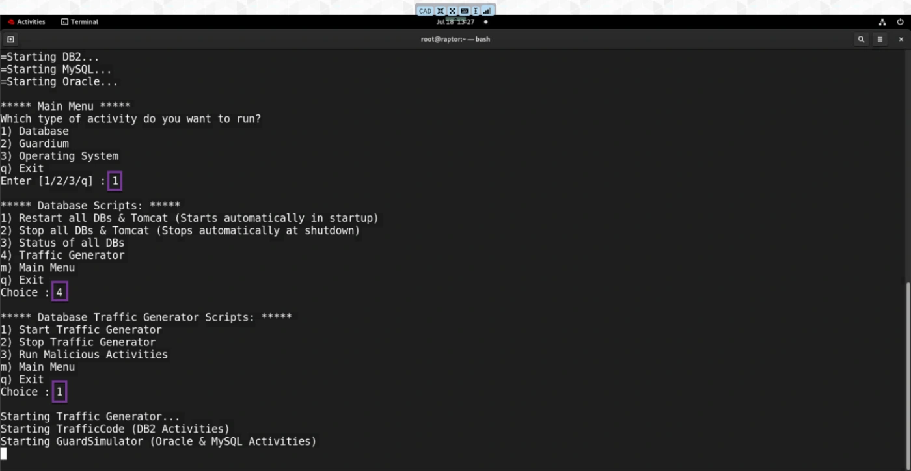 5. Introduzca **1** para operaciones de Base de Datos y **4** para Generador de Tráfico y luego **3** para ejecutar actividades maliciosas. 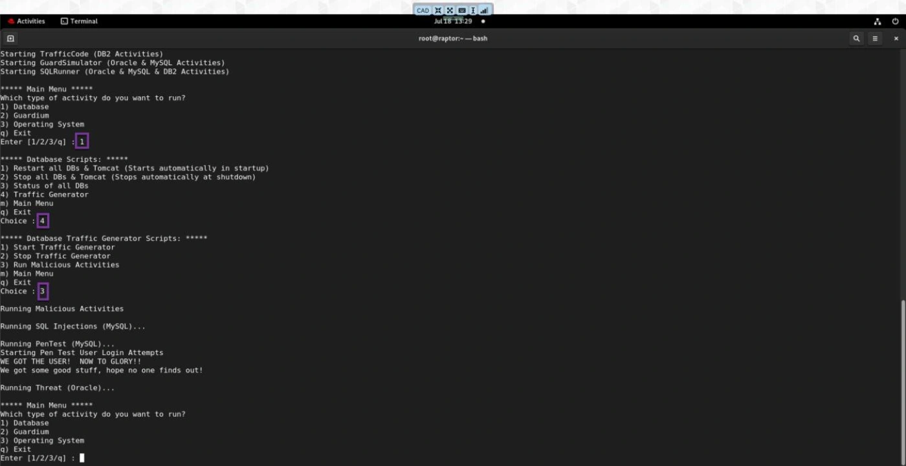

¡Ha reservado correctamente el entorno!

## 4 Solución de problemas

## 4.1 Configuración del teclado

Si tiene dificultades para teclear algunos caracteres como '@' o ';', realice los siguientes pasos:

1.  Cambia la configuración del teclado de tu estación de trabajo a teclado US.
2.  Mayús+2' escribirá la '@'.
3.  También puedes activar el teclado en pantalla con las instrucciones que aparecen a continuación:

a. ****Windows 11****: Vaya a **Inicio**, seleccione **Configuración > Accesibilidad > Teclado** y active la opción Teclado en pantalla. Aparecerá en pantalla un teclado que puede utilizarse para desplazarse por la pantalla e introducir texto. El teclado permanecerá en la pantalla hasta que la cierre.

b. ****Windows 10****: Vaya a **Inicio**, seleccione **Configuración > Facilidad de acceso > Teclado** y active la casilla **Usar el teclado en pantalla**. Aparecerá en pantalla un teclado que puede utilizarse para desplazarse por la pantalla e introducir texto. El teclado permanecerá en la pantalla hasta que la cierre.

c. ****Mac****: En su Mac, elija el **menú Apple > Preferencias del Sistema**, haga clic en **Accesibilidad**, haga clic en **Teclado**, haga clic en **Visor** y, a continuación, seleccione **Activar teclado de accesibilidad**. También puede activar el Teclado **de** accesibilidad haciendo clic en el menú Entrada de la barra de menús y, a continuación, seleccionando **Mostrar visor de teclado**.

## 4.2 Problemas de recogida de datos y sincronización horaria

1.  Inicie sesión en dbserver-raptor como usuario **root**. Abra una ventana de terminal y ejecute el comando `date`.

2.  Desde una ventana de terminal, haga ssh al Administrador Central utilizando el siguiente comando: `ssh cli@ma170`. Visualice la información horaria utilizando el comando `show system clock all`.

3.  Establezca la fecha, hora y zona horaria apropiadas (EST o EDT para que coincida con raptor) utilizando los comandos:

    `store system clock datetime <YYYY-MM-DD> <hh:mm:ss>` `store system clock timezone America/New_York` and `store system clock datetime <YYYY-MM-DD> <hh:mm:ss>`

4.  Reinicie la consola GDP con el comando **restart gui**.

5.  Repita el procedimiento en el servidor del recopilador.

El siguiente gráfico muestra el procedimiento de ajuste de la hora ejecutado en el servidor MA170 para que coincida con el servidor raptor: 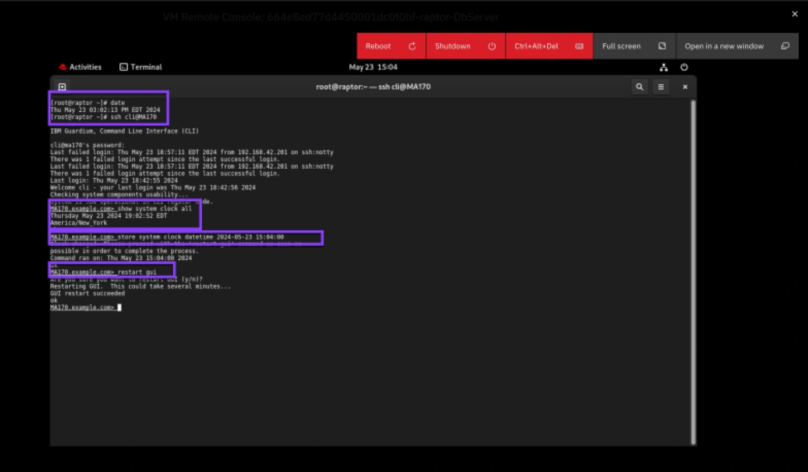

## 4.3 Servidores inaccesibles

1.  Si ha recibido un error como el siguiente en el que no se puede acceder al servidor, siga los pasos para reiniciar el servidor. 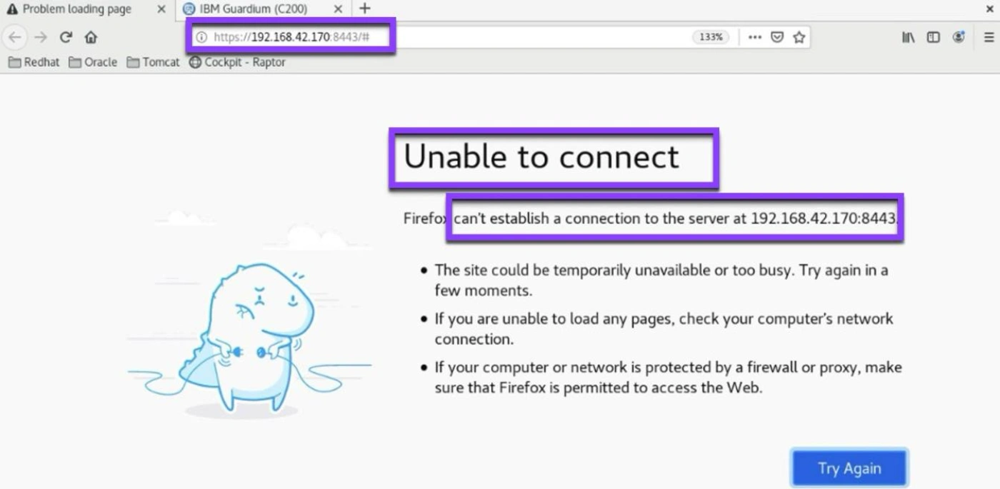
2.  En la ventana del servidor, haga clic en el icono **Reiniciar**. 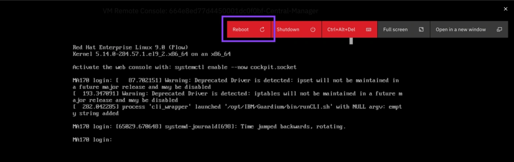

### Enhorabuena, has llegado al final del laboratorio 200.

Hemos reservado y aprovisionado el entorno Techzone y resuelto cualquier problema técnico.

Haga clic en, **[laboratorio 201](/guardium/level-4/201)** para iniciar el siguiente laboratorio.
