# Create / Manage Users and Assign Job Roles

This lab will focus on showing us how to create new users, manage these users, as well as assign roles for these users.
A simple high-level architecture view of this lab can be seen below

## Prepare

After ensuring that your environment is set up and in working order, we will want to ensure a few things before jumping into the exercises for this lab

There are a couple of steps, listed below, we will want to ensure are complete before jumping into this labs

1. Start or Ensure all three virtual machines. <br />

2. Log in to the DB server (raptor) virtual machine as user `root` with password `guardium`. <br />

3. Check that the Db2 database is running. <br />

   - Open a Terminal window. <br />
   - To switch to the DB2INST1 user account, type:
     ```bash
     su - db2inst1.
     ```

    <br />

   - To verify that the database is running, type:
     ```bash
     db2start
     ```

    <br />
    - To activate the Db2 database, type:
        ```bash
        db2 activate database sample.
        ```
    <br />

   If the database is running, you receive the following message: <br />

   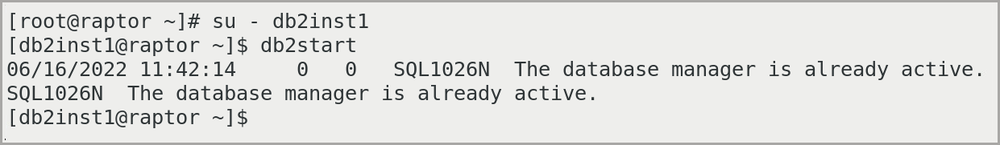

   <br />
   If the database is **NOT** running, you can start it by running the following command:
   <br />

   ```bash
   db2start
   ```

   <br />

   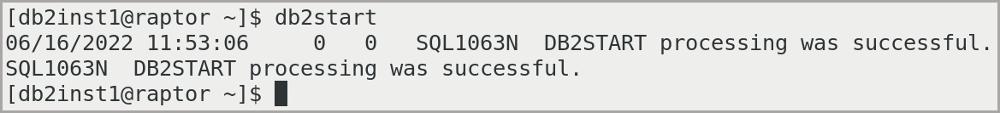

   <br />

4. After closing the terminal window,lets ensure that raptor can connect to `MA170` and `C200`. You can verify this be ensuring that login screen for each Guardium interface is displayed.

// TODO: ADD Login Image

## Creating Guardium Users and Roles

In this section of the lab, we will use the IBM Guardium Data Protection console to create Guardium users and assign them to the appropriate roles. Guardium includes two built-in users to manage access to the Guardium console:

- `labaccessmgr`

  A member of the `accessmgr` role. Use this user to create other users and roles, and to set role memberships. <br />

- `labadmin`

  A member of the `admin` role. Use this user for all other administrative functions.

> Guardium provides `admin` and `accessmgr` users. You cannot delete these users, nor can you remove them from their default roles. This lab guide follows the security principle of avoiding the use of high-level accounts.

> In an environment with a central manager, such as the lab environment, Guardium users must be managed from the central manager.

### Creating Users

1. On the database server, go to the Guardium graphical console for the central manager `MA170` at `https://192.168.42.170:8443` <br />

2. Log in with user name `labaccessmgr` and password `P@ssw0rd`. <br />

3. Navigate to **Access** > **Access Management**. <br />

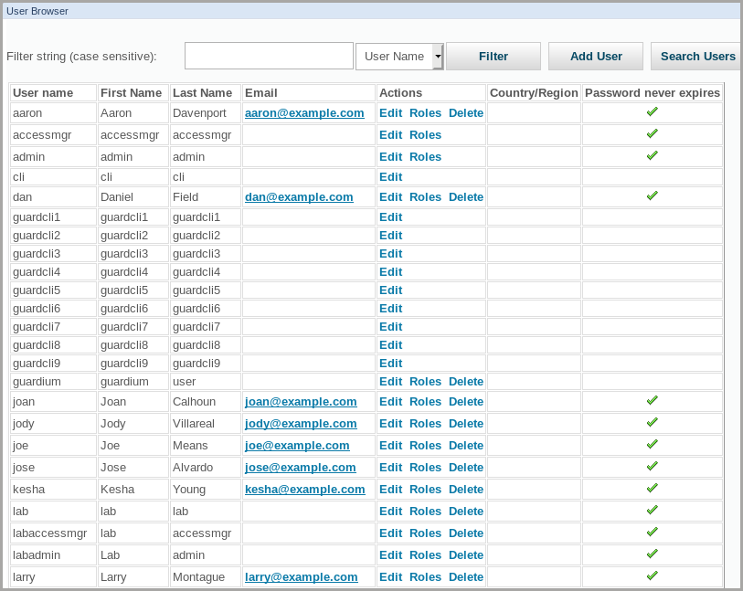

> Extra users were added to the Guardium server for instructional purposes. A new installation of Guardium does not include all of these users.

4. To add a user, click **Add User** and enter the following information:

   – **Username**: `User01`
   – **Password**: `P@ssw0rd`
   – **First Name**: `Henry`
   – **Last Name**: `Davis`
   – **Email**: `henry.davis@example.com`
   – **Disabled checkbox**: not selected

<Warning text='Remember to clear (or unselect) the **Disabled** checkbox because it is enabled by default.'/>

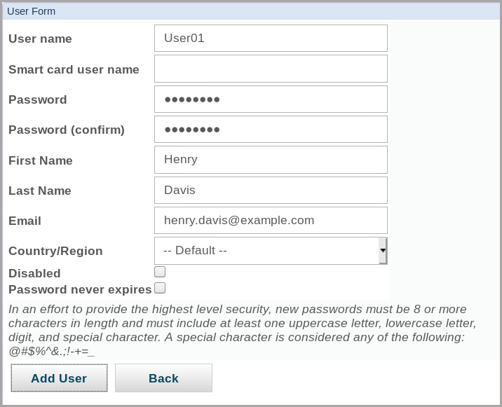

5. Click **Add User**

   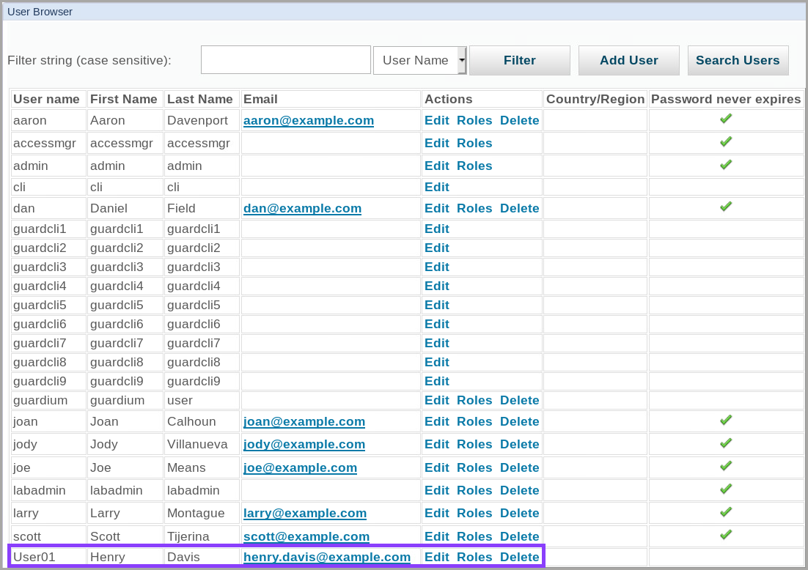

> If you do not see **User01**, you might need to go to the second page of users, or filter on user name **User01**

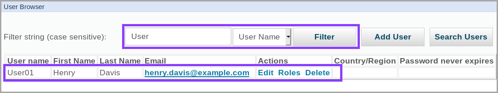

6. For `User01`, click the **Roles** link.

7. To add `User01` to the **Infosec** role, select the **Infosec** checkbox.

   `User01` is already a member of the user role. Observe that the user role is selected.

   

8. Scroll down and click **Save**.

   _The user browser should be displayed again._

9. To display summary information about user and role memberships, navigate to **Access** > **User & Role Reports**

   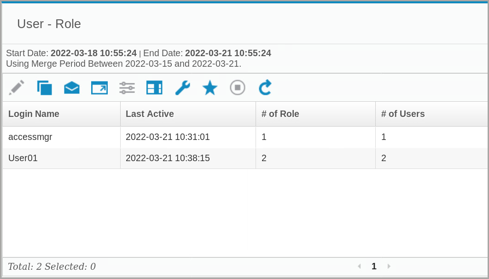

<Callout>
You should see the user that you created earlier in the **User - Role** report.
</Callout>

10. To display a report with the user roles, right-click the user that you created and select **Record Details**.

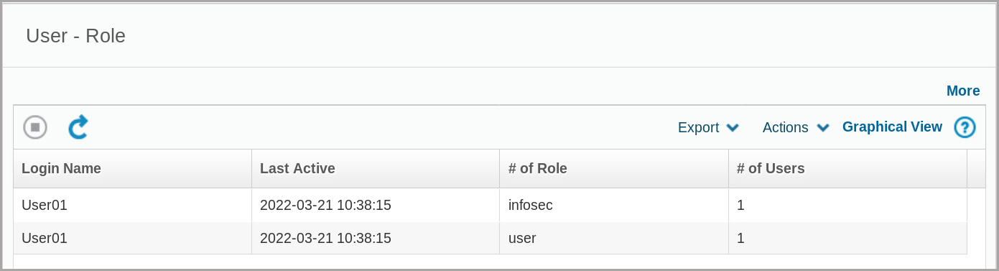

<Callout>
A new window opens with the details.
</Callout>

11. Close the window and go back to the main Guardium Interface.

### Creating Guardium Roles

In this section of the lab, we will now create a role and assign access permissions to the role.

1. Navigate to **Access** > **Access Management**.

<Callout>
The **User Browser** pane opens and you should see a list of Guardium users.
</Callout>

2. Select **Role Browser**.


<Callout>
The **Role Browser** pane opens
</Callout>

3. Click **Add Role**

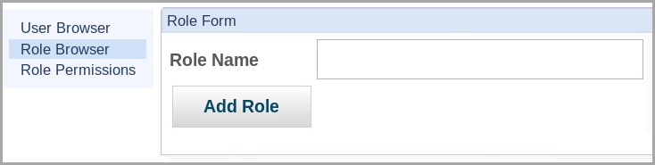

<Callout>
The **Role Form** window opens.
</Callout>

4. In the **Role Name** field, enter `labrole` and click **Add Role**. You should see the new role, `labrole`, listed in the **Role Browser**.

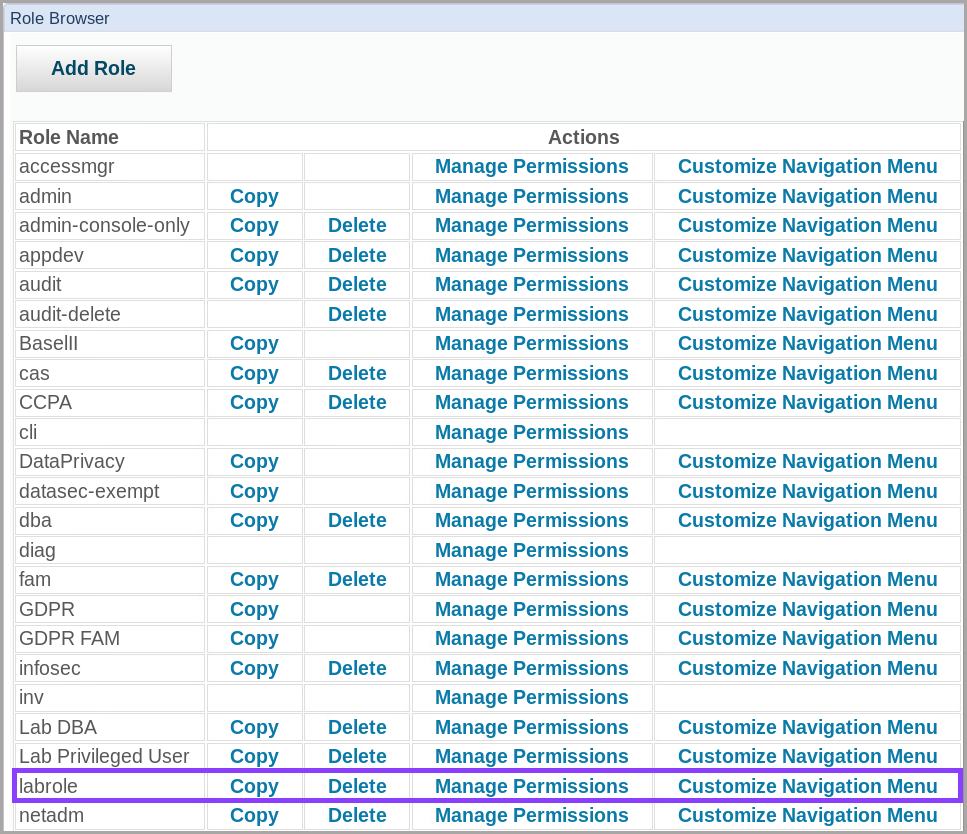

5. On `labrole` row item, click **Manage Permissions**

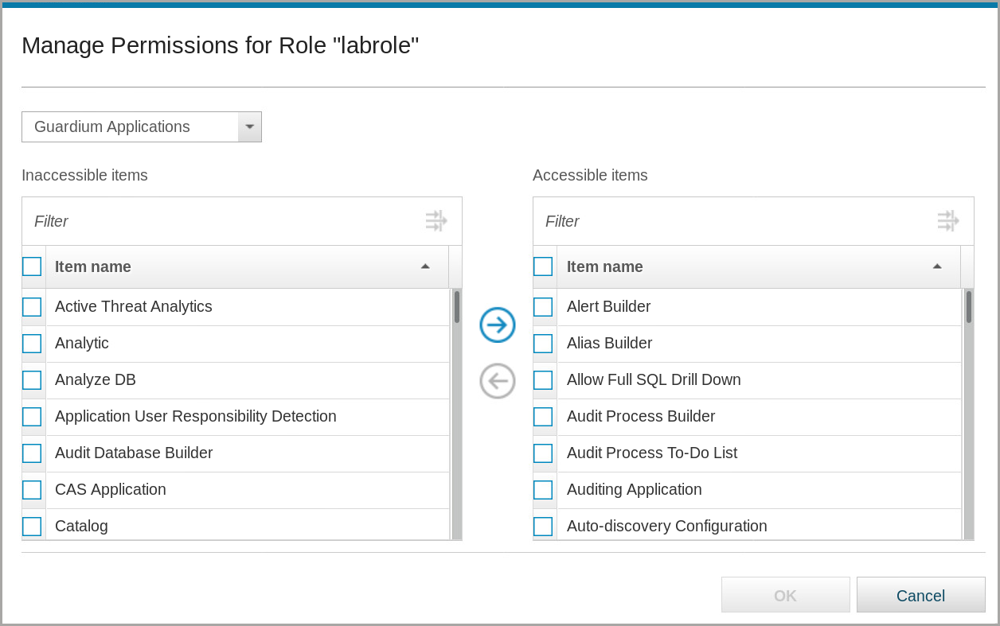

<Callout>
The **Manage Permissions** for Role `labrole` window opens.
</Callout>

6. Next we are going to add the _System Configuration_ application to the new role.

   - In the **Inaccessible items** list, use the filter field to search for `system` and then select **System Configuration**.

   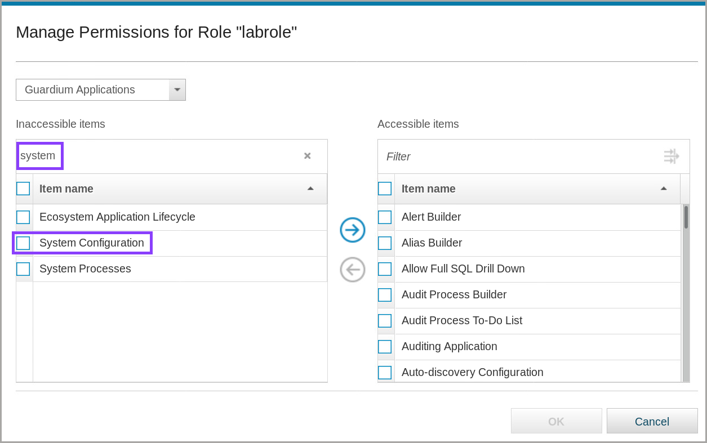

   - To move **System Configuration** to the **Accessible items** list, click **Move Right (Right Arrow → )**

   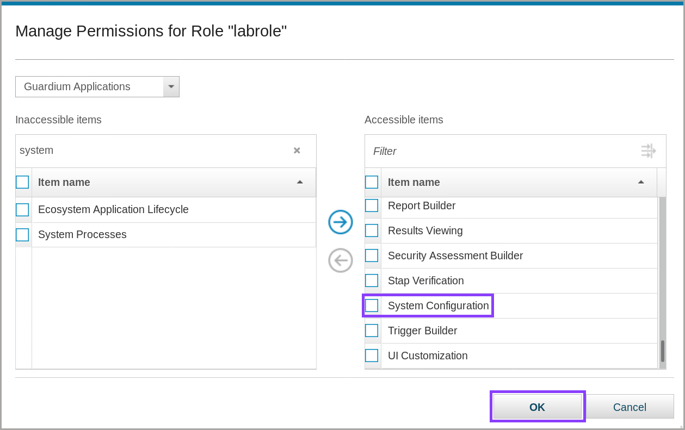

   - Click **OK** and close the confirmation message.

    <Callout>
    The Role Browser should reopen.
    </Callout>

7. Now we are going to add our newly created role to a user

   - Go to the **User Browser**.

   - Search for `User01`, which we created in the previous section of the lab, and click **Roles**.

   - You should see the `labrole` available to add as a role.

     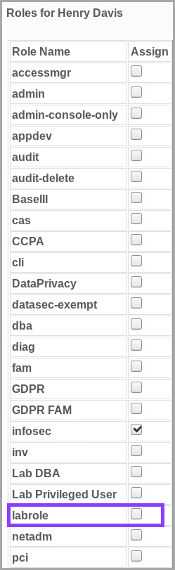

   - Select `labrole`

   - Hit **Save** to complete adding this new role to `User01`

8. Now that we have completed creating the new user, roles, and assigning the new roles we can sign out of the Guardium console.

### Test User w/Roles

Now that you added a user to the central manager, you need to synchronize the portal user data with the collector. Normally, this synchronization is automatically scheduled. In this section of the lab, we will synchronize manually rather than waiting for the scheduled job. Then, you log in as the new user on the collector and explore the console.

1. Log in to the Guardium portal on `MA170` as user `labadmin` with password `P@ssw0rd`.

2. Go to **Manage** > **Central Management** > **Central Management**.

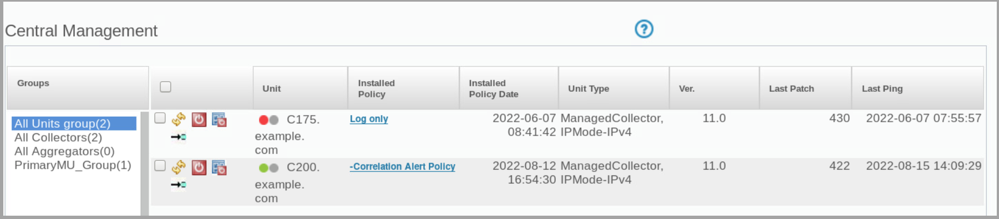

<Callout>
The **Central Management** pane opens.
</Callout>

3. Next to Unit _C200.example.com_, click **Refresh**

<Callout>
Wait 2 minutes for the refresh to complete.
</Callout>

> If refresh is not working, select the checkbox of item to refresh, scroll down the page and click the refresh button on the screen rather than the icon, Or try **Manage** > **Central Management** > **Portal User Sync**, and refresh from there.

4. On the collector _(C200)_, log in to the Guardium console as `labaccessmgr` with password `P@ssw0rd`.

5. Navigate to **Access** > **Access Management**

<Callout>
The **User Browser** pane opens and you see should your new user form the previous section, _Henry Davis_, in the **User Browser**.
</Callout>

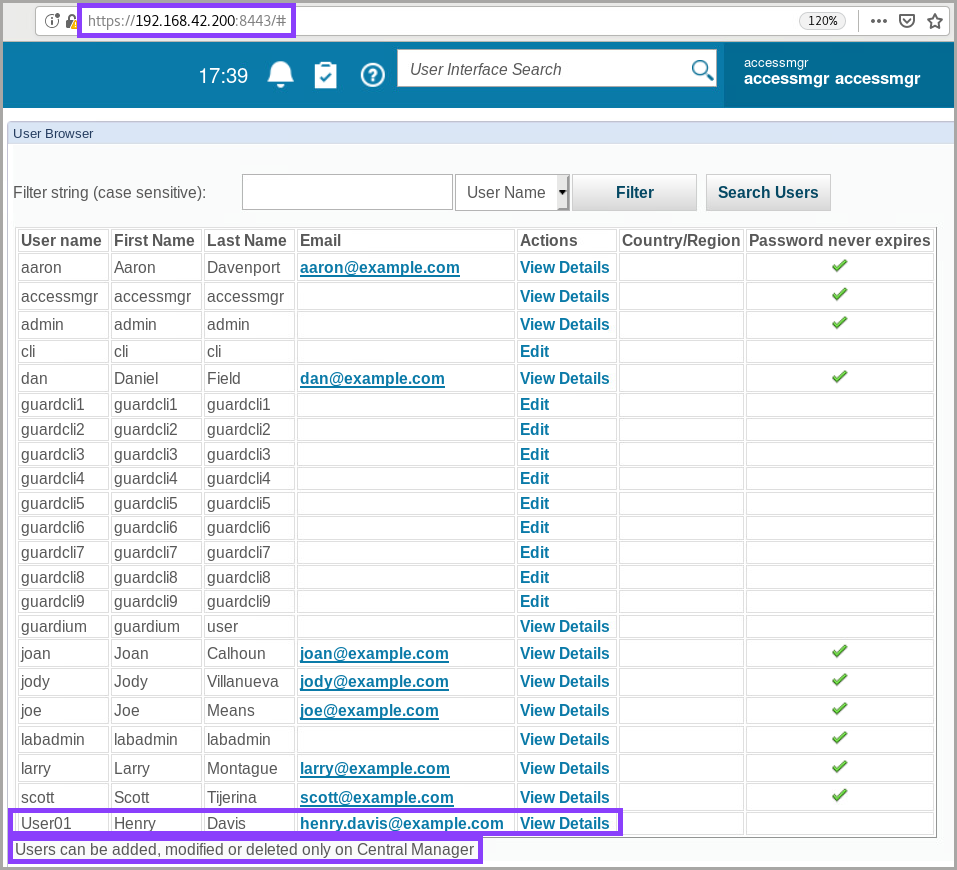

> If you do not see the new user, wait 5 minutes, then refresh the browser. Also check the second page or filter to find `User01`.

6. Log out as `labaccessmgr`

7. On the collector _(C200)_, log in to the Guardium console as `User01`.

   If your password has expired, a _Change your account password_ dialog opens.

8. Enter the old password of `P@ssw0rd`, and then choose a new password that matches the requirements in the dialog. An example might be `P@ssw0rd1`. Take note or write down this new password for future reference:

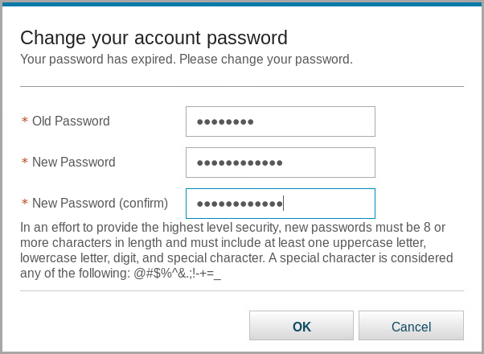

9. Click **OK**

   A Success dialog opens and should show that the password was changed successfully.

10. Close the dialog. The console for `User01` should open.

11. Explore the console by using the user interface search and the navigation menu and note the features.

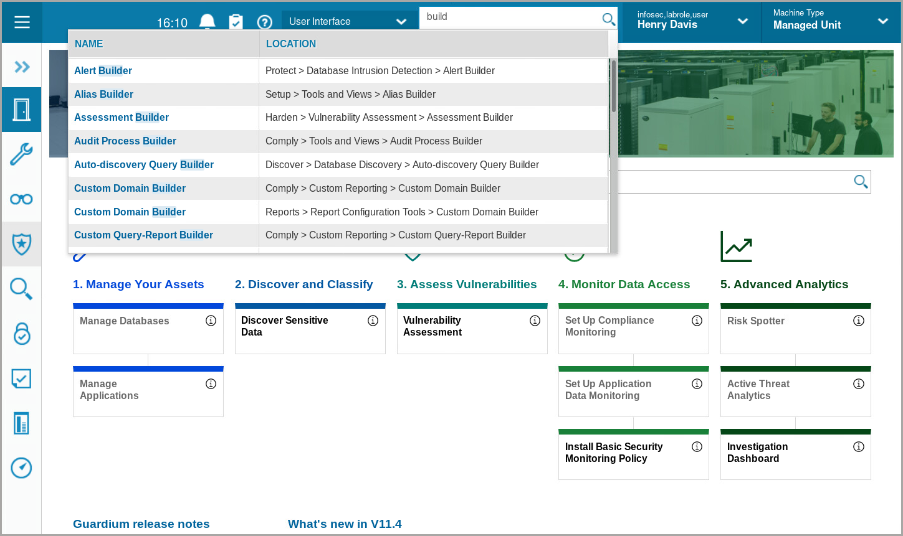

A few of the differences from the `admin` user portal that you might notice are:

– The **Manage** and **Application** icons are not available in the navigation menu.

– There are fewer reports listed under the **Reports** icon. Specifically, the **Guardium Configuration Items** and **Monitoring of Guardium System** report categories are unavailable.

– There are fewer options under **Harden** > **Vulnerability Assessment**.

12. Log out of `User01`

Congratulations, this is the end of Lab 201, you have successfully completed this lab where you learend how to create new users, create new roles, and assign roles to users.

Continue onward to [Lab 202](/guardium/level-4/202)
