# Groups

In this lab, we create some Guardium groups that include different users. We also add some objects to a predefined group. By the end of this lab exercise we will have learned how to do the following tasks:

• Examine Group Builder
• Create a new group
• Use a query to populate a group
• View groups

## Examining the Group Builder

We start things off by accessing the group builder:

1. On the database server, start the web browser and log in to the Guardium console on `MA170` as user `labadmin` with password `P@ssw0rd`.

2. In the navigation menu on the left side of the page, go to **Setup** > **Tools and Views** > **Group Builder**.

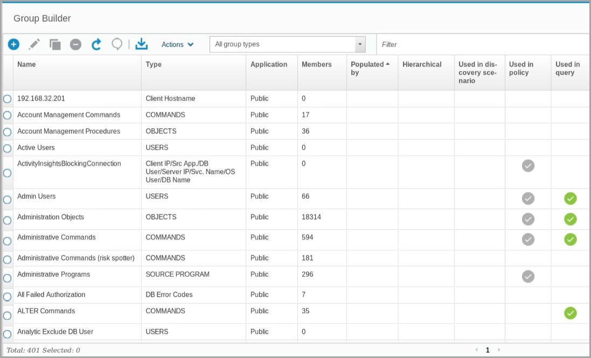

<Callout>
Group Builder is an important application, and you can access it through a number of paths, depending on your roles.
</Callout>

The Group Builder window shows the following features:

- A header, with icons to create, edit, copy, and remove groups

- An icon to refresh the view

- An icon to view and add comments

- An icon to download the list of groups as a CSV file

- An actions menu

- Methods to filter the group by type or name

- Column headings that help you find details about the groups:
  – Name
  – Type

In Group Builder, there are many preconfigured groups. You can manage the membership of these groups.

### Creating a New Group

One useful group might be a list of trusted database users. This group can include applications that use the database. You can use this list to write a policy that ignores sessions that are created by these users, which reduces the processing load on the network and the Guardium server. Lets create a new group within the Guardium Data Protection.

1. To open the _Create new group window_, click **New**

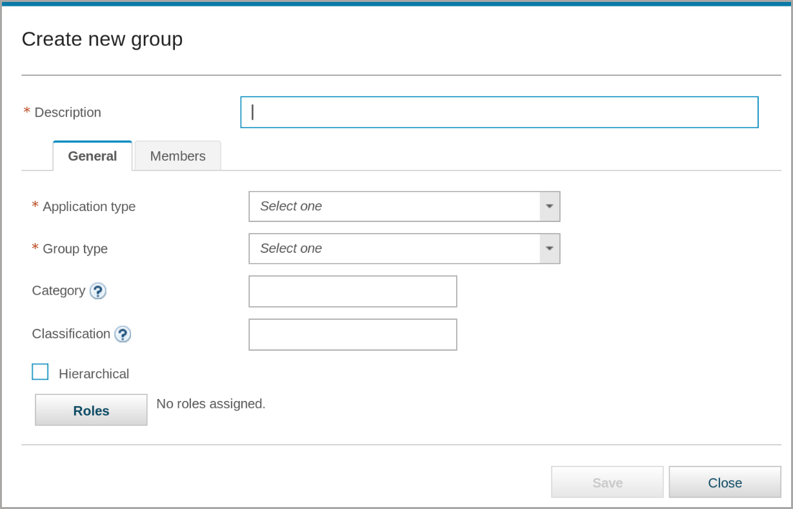

2. In the **General** tab, complete the following fields:

– **Description**: `-Custom Trusted Users`

– **Application type**: Public

– **Group type**: USERS

– **Category and Classification**: leave blank

– **Hierarchical**: not selected

> It is a good practice to identify the groups that you create with a prefix to distinguish user-added groups from the built-in groups. This example uses _-Custom_. The “-” shows that it is a user-created group. If you sort the groups by name, alphabetically ascending, the custom group is near the beginning of the list in Group Builder.

3. To add the new group, click **Save** and then close the confirmation message.

<Callout>
The new group is created but it contains no members.
</Callout>

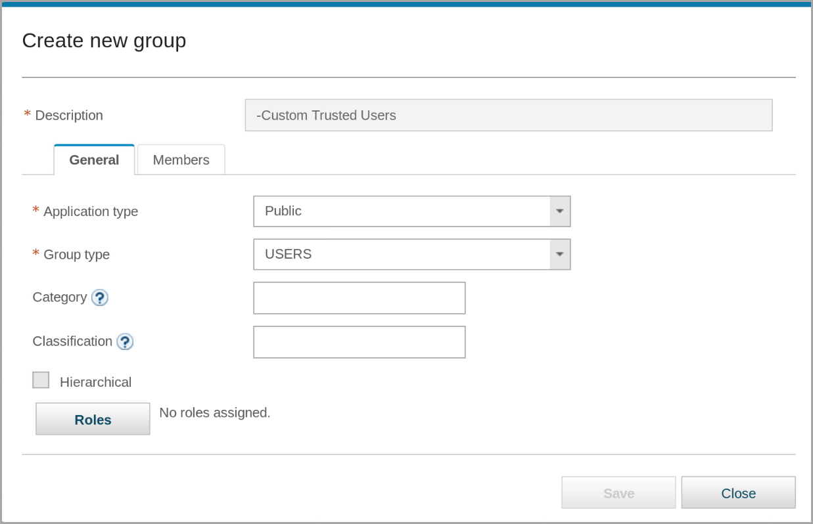

4. To add members to the group, click the **Members** tab.

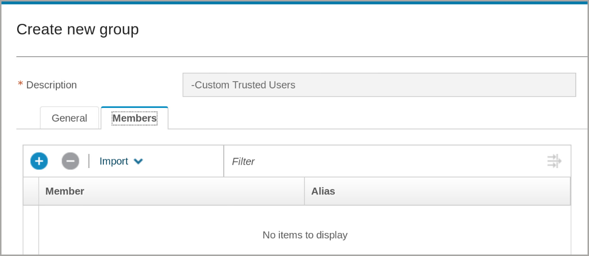

5. To examine the options, click the **Import** menu.

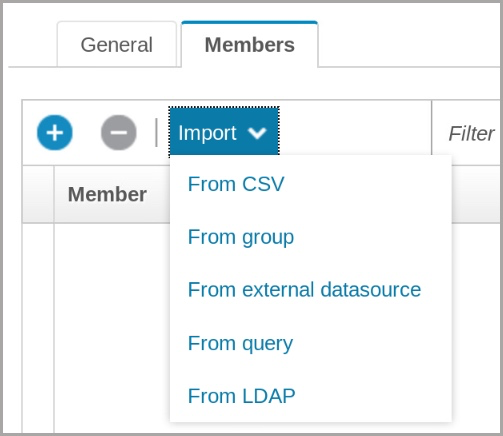

When you add new members, the options include:

– **From CSV**: You can import group members from a simple file. The file can be a single column with a header, or multiple columns with a header for Tuple groups.

– **From group**: This option adds members from another group.

– **From external datasource**: This option adds members from an external database table.

– **From query**: This option adds members based on a Guardium query.

– **From LDAP**

> In this section of the lab, we add users from another group.

6. From the **Import** menu, select **From group**.

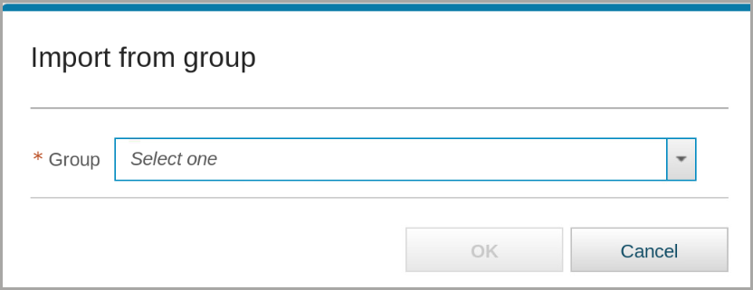

7. From the **Group** menu, select **Lab Trusted Users**.

8. Click **OK**

> Verify that `KESHA` and `OMAR` are added to the new group.

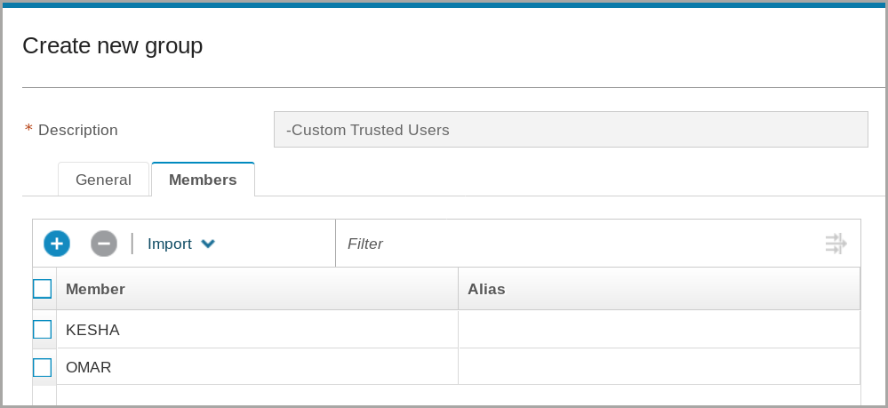

9. Scroll down and click **Save**.

10. To close the confirmation message, click **OK**, then click **Close**.

<Callout>
You see the new group in the Group Builder window.
</Callout>

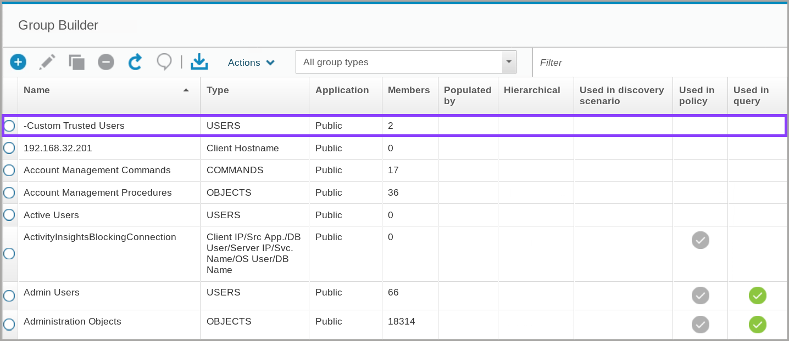

> If you do not see the group, click the **Name** header twice to sort by name, ascending. The “-” proceeding the group name places it at the top of the list.

### Use a query to populate a group

In this part of the lab, you want to create a group of users who have a high level of privilege on databases that contain sensitive data. You might want to monitor actions by these users more closely to ensure that these privileges are not abused.

> For this task use the web browser tab that connects to the collector (C200).

1. In this task, you create a group and use a query to populate

Create a group with the following characteristics:

– **Description**: `-Custom Privileged Users`

– **Application type**: Public

– **Group type**: USERS

– **Category** and **Classification**: _leave blank_

– **Hierarchical**: not selected

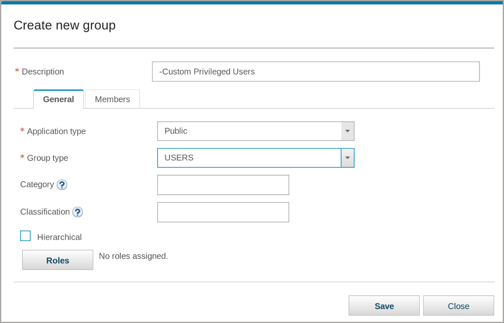

2. On the **Members** tab, from the **Import** menu, select **From query**.

<Callout>
A new tab, Import by query, opens.
</Callout>

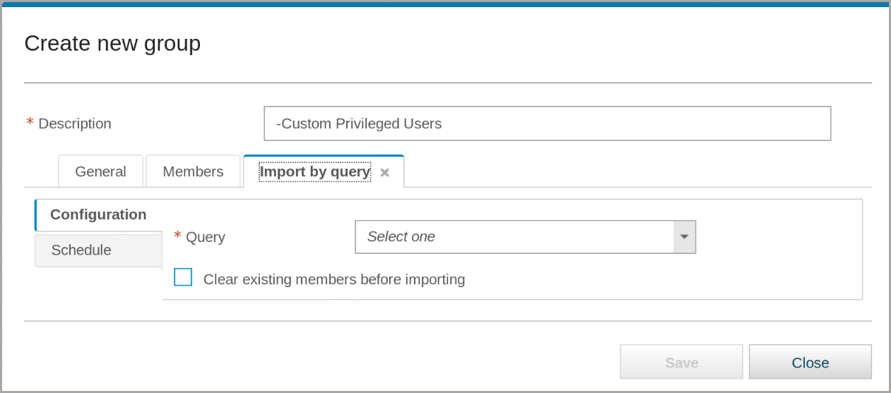

3. From the **Query** menu, select **Detailed Sessions List**.

> Notice more fields are added to the **Import** by query tab.

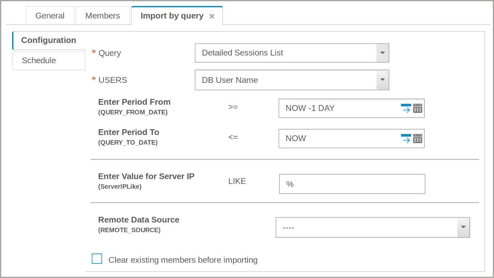

4. In the Enter Period From field, click the **Calendar** icon.

5. Set the values in the calendar window to **1 January 2022** and the Remote Date Source to **C200.example.com**.

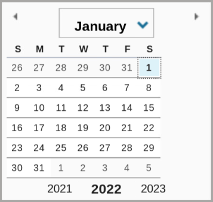

6. Leave all the other fields at their default settings and click **Save**.

7. To close the confirmation message, click **OK**.

<Warning text="You set up the query, but you did not run it yet, so NO members are added to the group." />

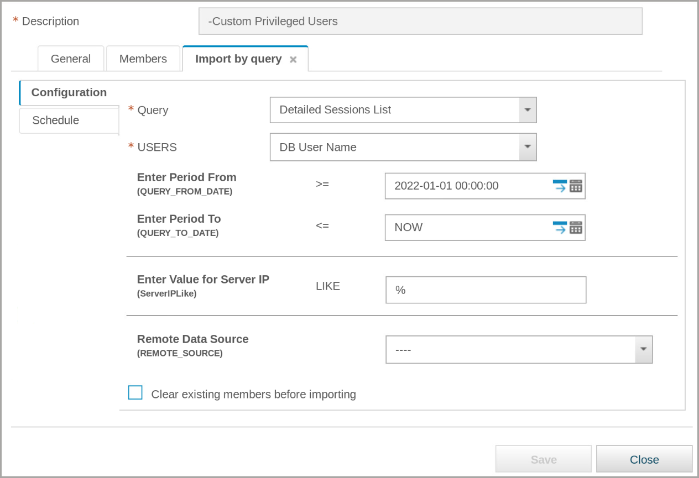

8. On the left side of the window, click the **Schedule** tab

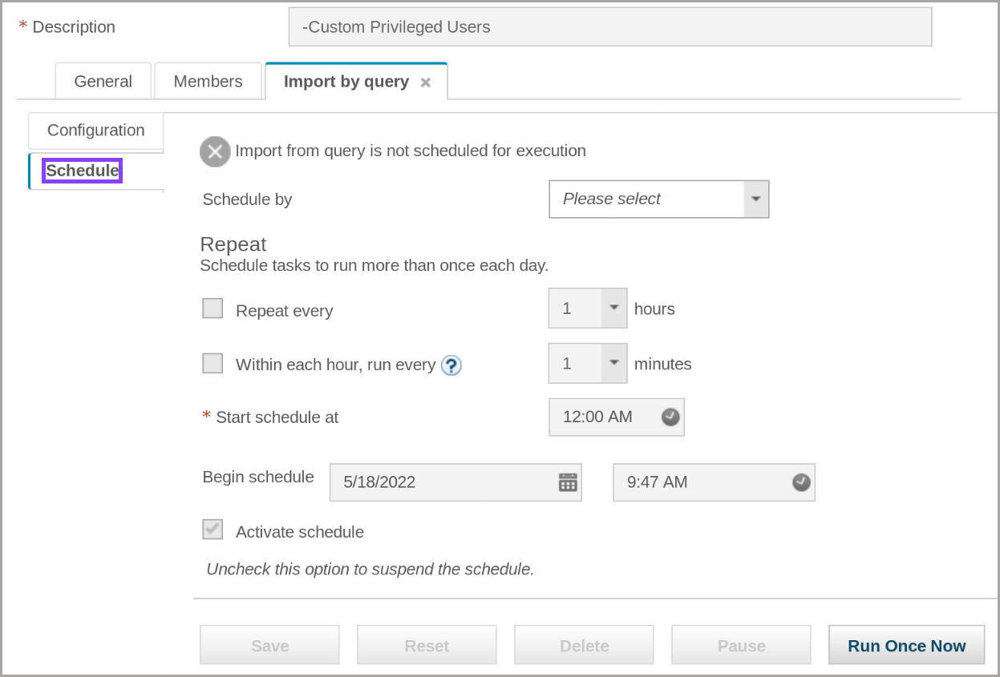

9. You can set up a schedule to run the query periodically; however, for this exercise, you run the query once. Scroll to the bottom of the window and click **Run Once Now**.

10. To close the informational message, click **OK**.

11. Click the **Members** tab.

<Callout>
You see that the import was successful.
</Callout>

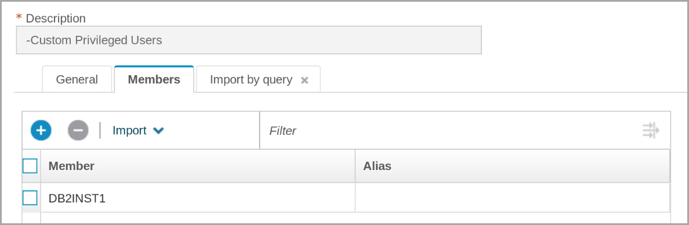

12. **Save** and **Close** the group.

<Callout>
Your new group is added to the Group Builder window.
</Callout>

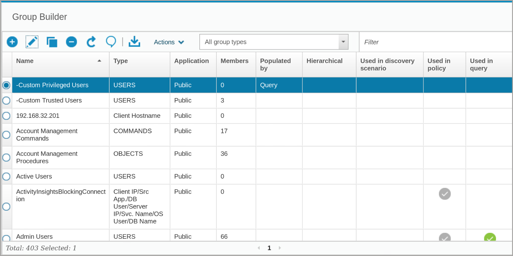

> You might have to click **Refresh** to show that the group has one member.

### View Groups

In this part of the lab, we view the details of groups we created.

> Return to the web browser tab that connects to the central manager _(MA170)_ for the rest of the exercises in this unit.

1. To view an existing group, search for and select the **Sensitive Objects** group.

<Callout>
You can narrow the list of groups by typing the name into the filter field.
</Callout>

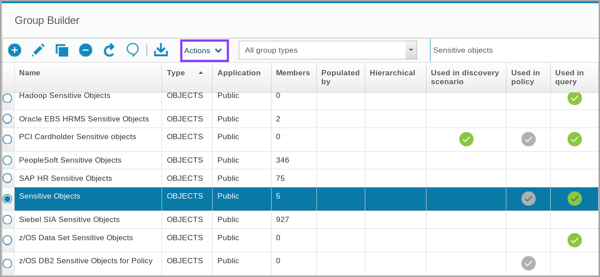

> You see that the **Sensitive Objects** group has five members and is used in one or more policies, and in queries.

2. From the **Actions** pull-down menu, select **View Details**Z

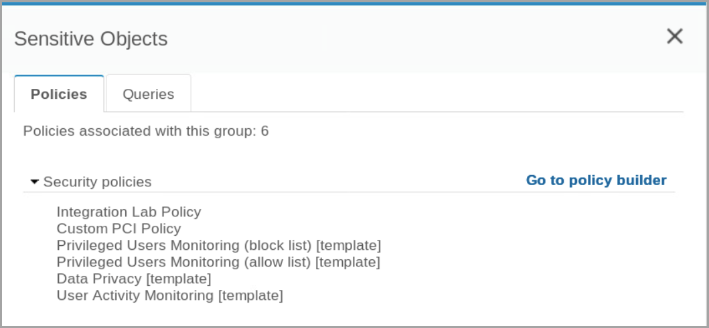

<Callout>
The **Sensitive Objects** group is associated with several security policies. There is a link to Go to policy builder.
</Callout>

3. Select the **Queries** tab.

<Callout>
The **Sensitive Objects** group is associated with six queries and six reports.
</Callout>

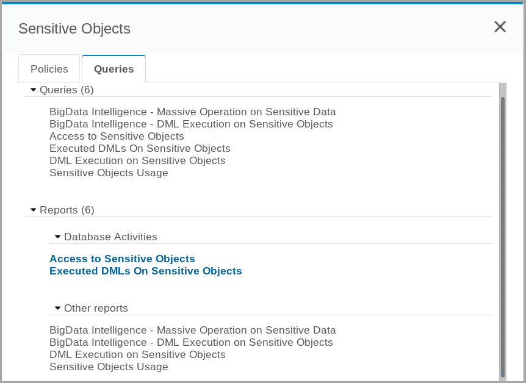

4. Close the **Sensitive Objects** window.

5. To open the Edit group window, click **Edit** and then click the **Members** tab.

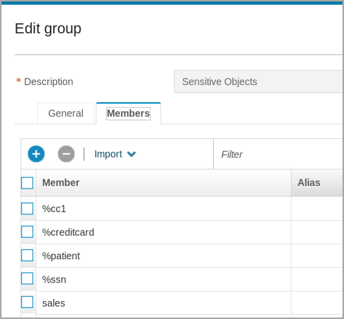

> Some of these group members contain regular expression wildcards (%).

6. Close the group

In this lab, we learned how to use the following functionality from Guardium Data Protection:

- **Use Group Builder**
- **Create a new group**
- **Use a query to populate a group**

Continue onward to [Lab 203](/guardium/level-4/203)
