# Vulnerability Assessment

Guardium Vulnerability Assessment helps identify and address database vulnerabilities. The assessment process evaluates and suggests actions to improve the health of your database environment. Guardium provides predefined tests that you can add to security assessments, and you can define custom tests. In this exercise, you perform the following tasks:

- Grant permissions to create and run security assessments
- Create and run a security assessment
- Use the report to harden database and validate assessment
- Create an exception to test the assessment

## Running a Vulnerability Assessment

To create and run security assessments, a Guardium user must have the vulnerability-assess role. In an environment with multiple managed units and a central manager, the user role must be granted on the central manager.

In this task, you verify that the admin user has the vulnerability assessment role and access to the vulnerability assessment tools.

### Granting permissions to create and run security assessments

To create and run security assessments, a Guardium user must have the vulnerability-assess role. In an environment with multiple managed units and a central manager, the user role must be granted on the central manager.

In this lab, we verify that the `admin` user has the vulnerability assessment role and access to the vulnerability assessment tools.

1. Log in to the MA170 Guardium graphical console as user `labaccessmgr` with password `P@ssw0rd`.

> Roles are managed from the central manager, in this case MA170.

2. Click **Access** > **Access Management**

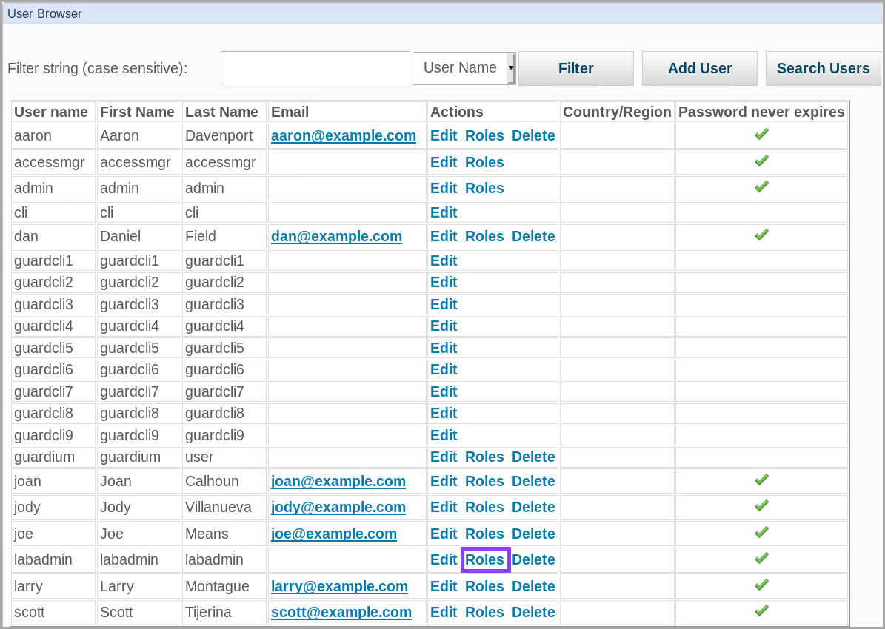

3. To view the roles for user `labadmin`, click **Roles**.

4. To enable vulnerability assessment for user `labadmin`, scroll down, ensure the **vulnerability-assess role** is selected, and click **Save**.

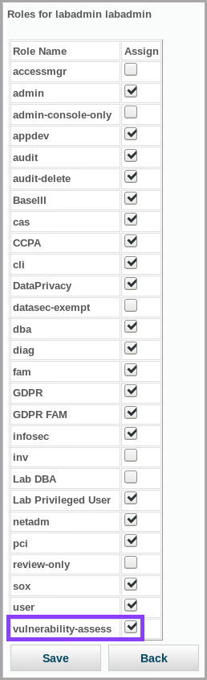

5. To log out as user `labaccessmgr`, from the account menu on the blue banner on the upper-right quadrant of the screen, click **Sign Out**.

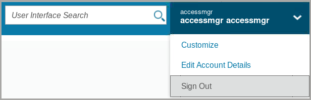

### Creating and running a security assessment

After you verify that the Guardium user has the correct role, you create, configure, and run a security assessment. A security assessment is associated with a datasource or a group of datasources. Each datasource contains the connection information that Guardium uses to access and run tests on a database. Add Guardium predefined tests to control what the assessment checks.

Generally, an assessment is an iterative process. You develop an action plan that prioritizes which vulnerabilities to concentrate on. The assessment is run periodically, and assessment results detail the progress in remediating vulnerabilities. After you fix the highest priority problems, you can address the lower priority tests.

In this section of the lab, we log in to the collector to create and use the assessment

1. Log in to the Guardium collector _(C200)_ console as user `labadmin` with password `P@ssw0rd`

2. To begin the assessment, in the left navigation menu, go to **Harden** > **Vulnerability Assessment** > **Assessment Builder**.

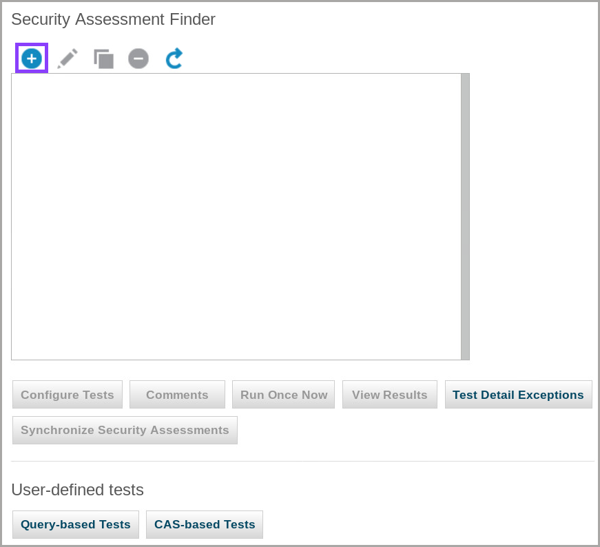

3. To add a test, click **Create**

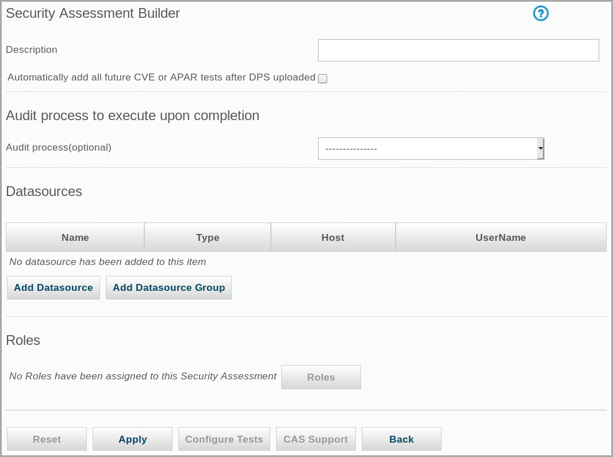

4. For Description, type `Lab_VA` and click **Apply**.

5. To add a classification datasource, click **Add Datasource**.

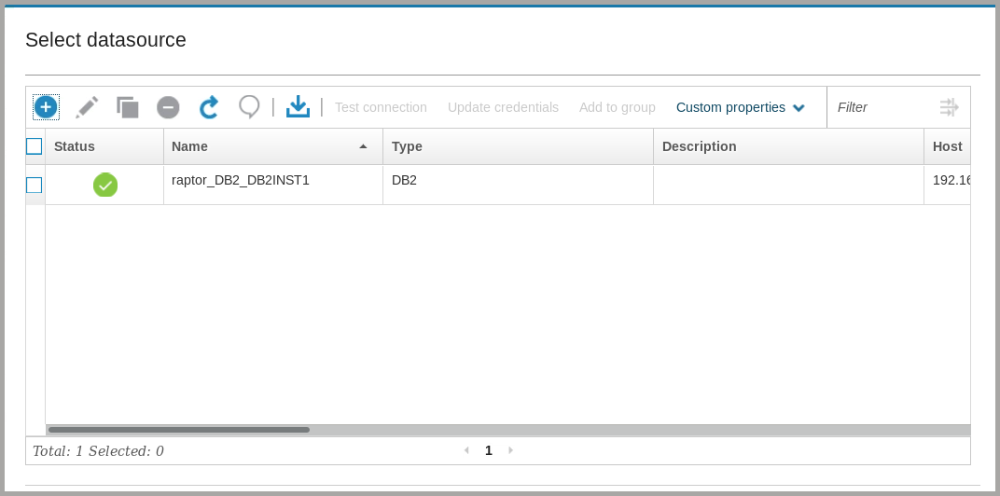

6. Select the **raptor_DB2_DB2INST1** datasource and click **Save**.

<Callout>
The datasource is added to the security assessment.
</Callout>

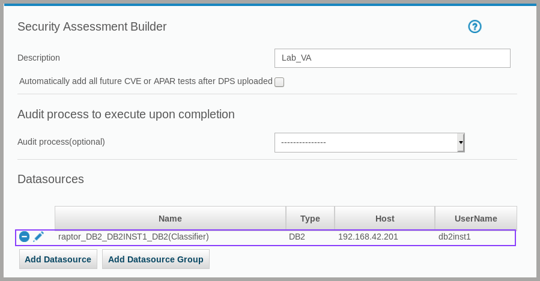

> Note that the datasource is listed but _Configure Tests_ is not enabled

7. To enable _Configure Tests_, click **Apply**.

<Callout>
You set up a security assessment and created a datasource for it to use. Now, you specify which tests the assessment runs.
</Callout>

8. To configure the tests, click **Configure Tests**.

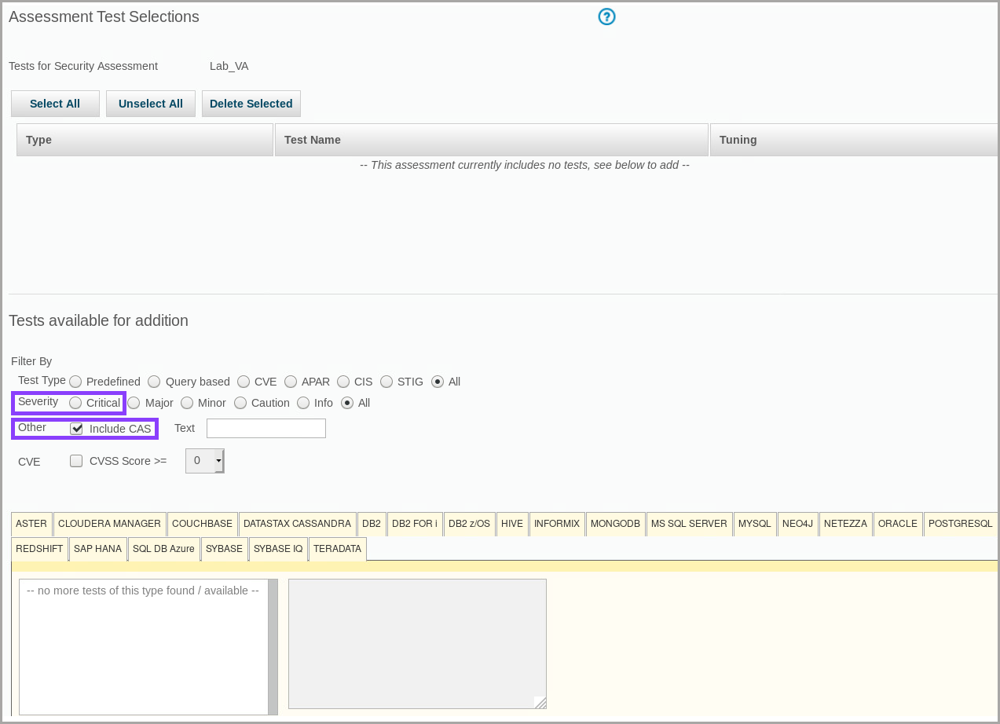

> Vulnerability assessment is an iterative process. Generally, you initially choose only a high priority subset of available tests. After you resolve the security concerns for these tests, you can incorporate lower priority tests into the assessment.

9. To filter the tests, select Severity **Critical**.

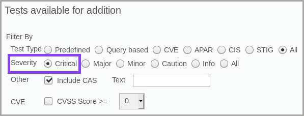

10. Scroll down and select the **DB2** tab.

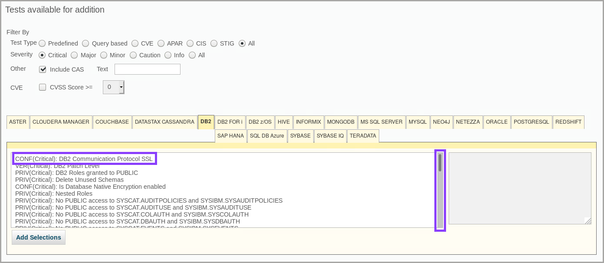

<Callout>
Critical tests for the **IBM® Db2®** database are displayed.
</Callout>

11. To select all critical tests, click the first test in the list, scroll down, press the **Shift** key, and click the last test on the list.

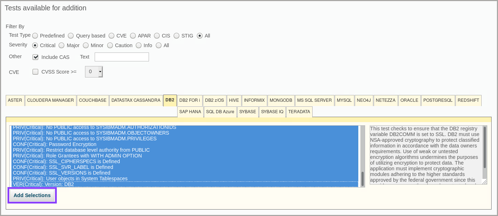

12. Click **Add Selections**

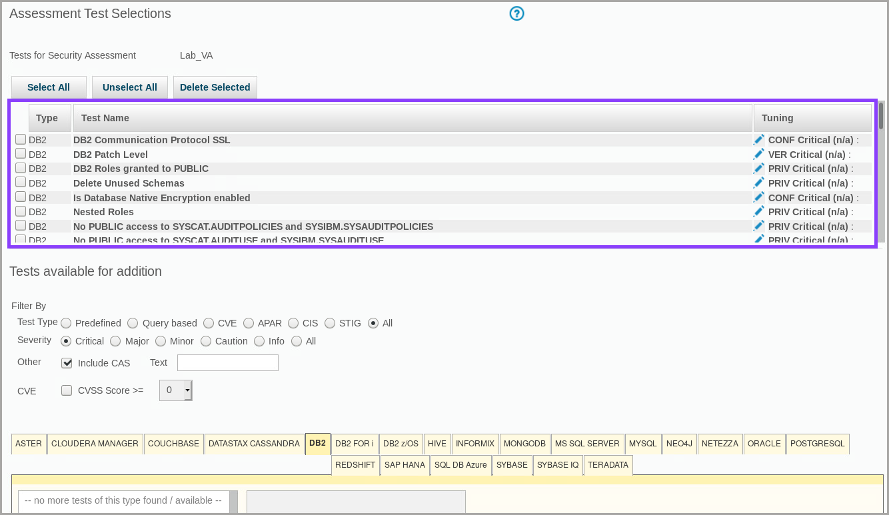

13. To return to the Security Assessment Finder window, scroll down and click **Return**.

14. To run the security assessment, click **Run Once Now**.

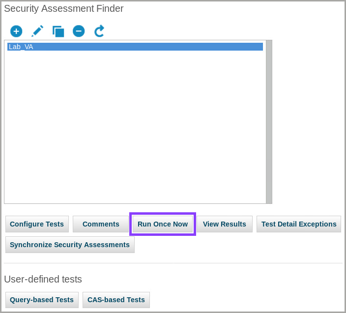

15. On the confirmation window that indicates the test is in the Guardium job queue, click **OK**.

16. In the left navigation menu, go to **Harden** > **Vulnerability Assessment** > **Guardium Job Queue**.

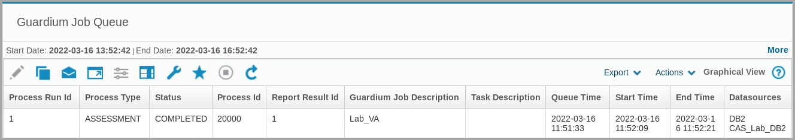

17. If the job does not have a status of _COMPLETED_, click **Refresh**

> Keep in mind it might take a few minutes for the job queue to run, so wait a bit and refresh the page to see the completed job

18. View a comprehensive report available through the **Security Assessment Builder**.

  a. In the left navigation menu, go to **Harden** > **Vulnerability Assessment** > **Assessment Builder**

  b. _Lab_VA_ is autoselected. Click **View Results**

  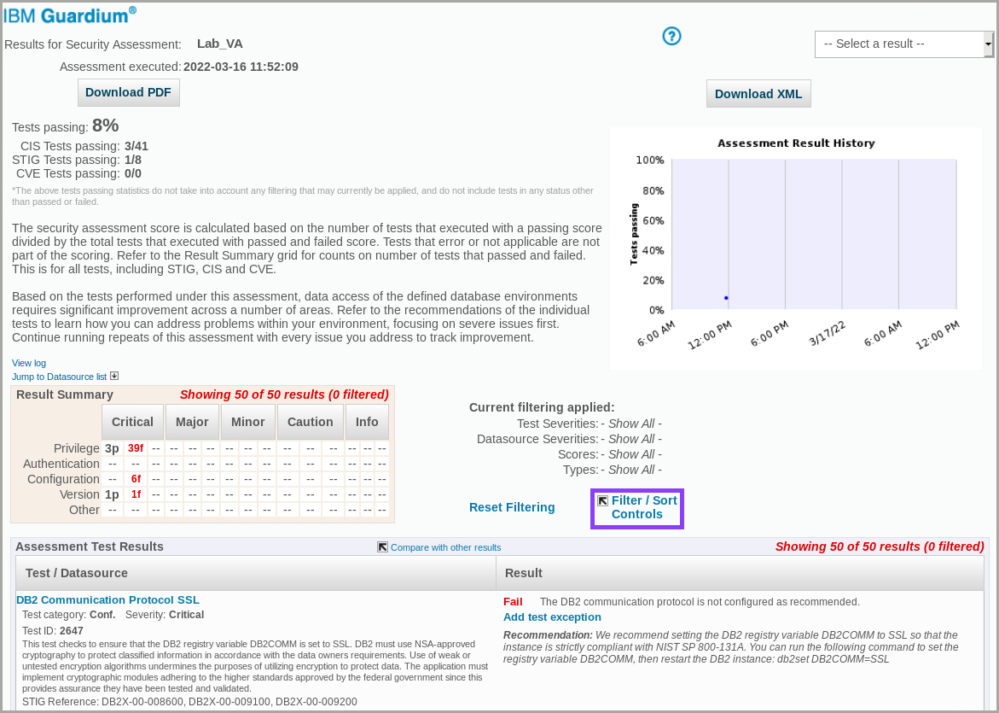

19. Explore the various features of the report.  

  a. Click **Filter / Sort** Control.

  b. In the Show only window, from the Score column, select **Fail** and click **Apply**.

  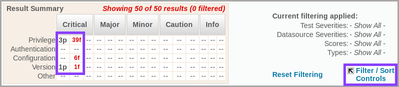

  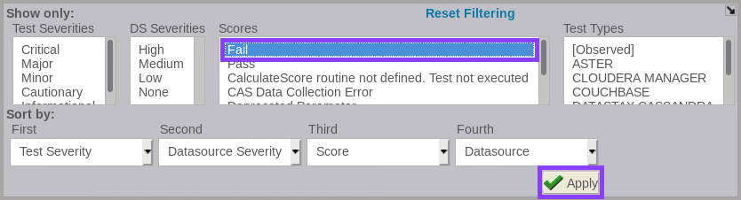

> With this filtering criteria the results are filtered to show only assessment failures.

  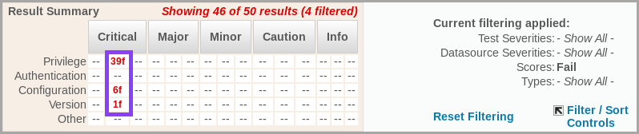

  c. To download a PDF file of the security assessment, click **Download PDF** and click **OK** to close the open window. Then, select **Open with Document viewer (default)** and click **OK**.

20. To return to the browser version of the report, close the PDF.

### Using assessment results to harden the database

Fixing vulnerabilities is an iterative process. The security assessment report provides not only a picture of which tests failed, but a set of suggested actions to fix the vulnerabilities revealed by the failed tests. After you apply recommendations, you run the report again to determine which vulnerabilities remain. Repeat the process until your environment complies with organizational standards.

In this section of the lab we will learn how to use the report to harden a database.

1. In the security assessment report, scroll through the assessment test results.

> You will notice that the tests that _failed_ have recommendations, including suggested commands, to fix the vulnerability.

2. Locate the assessment tests with the following names:

– _No PUBLIC_ access to _SYSCAT.AUDITPOLICIES_ and _SYSIBM.SYSAUDITPOLICIES_

– _No PUBLIC_ access to _SYSCAT.AUDITUSE_ and _SYSIBM.SYSAUDITUSE_

> Note the cause of failure and the recommendations, which includes the database commands to remediate the failures.

3. Close the report window.

4. Now, we can run the SQL commands on the database server to remediate the failures. To access the database server, open a terminal console.

5. In the console, change to the `db2inst1` user with the following command:

```bash
su - db2inst1
```

6. To enter the Db2 command environment, run the `db2` command in your terminal after changing the user.

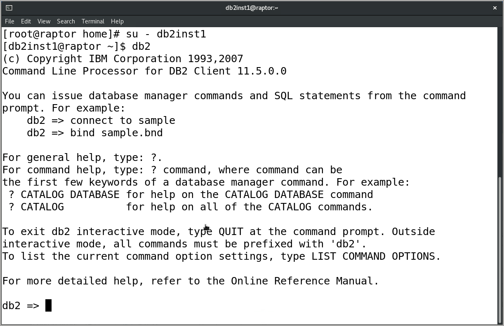

7. To connect to the database, use the following command:

```bash
connect to sample
```

8. Apply the recommendations from the two tests in step 2 of the assessment. 

> Recommendations often contain two commands to run, separated by a period. When you have two commands, run them as two separate commands. For this lab, we only have one so run each command separately:

```bash
REVOKE ALL ON SYSIBM.SYSAUDITPOLICIES FROM PUBLIC 
```

```bash
REVOKE ALL ON SYSCAT.AUDITPOLICIES FROM PUBLIC 
```

```bash
REVOKE ALL ON SYSCAT.AUDITUSE FROM PUBLIC 
```

```bash
REVOKE ALL ON SYSIBM.SYSAUDITUSE FROM PUBLIC
```

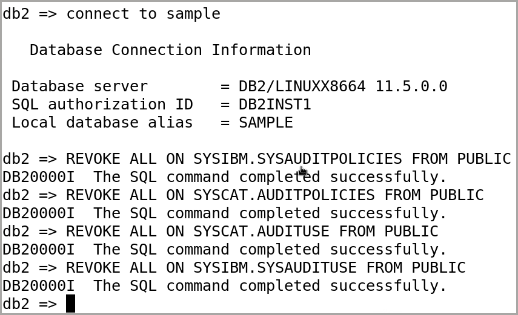

9. Return to the Guardium console on _C200_. and access the Security Assessment Finder at **Harden** > **Vulnerability Assessment** > **Assessment Builder**.

10. To begin the second assessment, click **Run Once Now**.

11. On the confirmation window that indicates the test is in the Guardium job queue, click **OK**.

12. In the left navigation menu, go to **Harden** > **Vulnerability Assessment** > **Guardium Job Queue**.

13. If the job does not have a status of completed, click **Refresh** .

14. To view the results, go to **Harden** > **Vulnerability Assessment** > **Assessment Builder**.

15. To view the results of the assessment, click **View Results**.

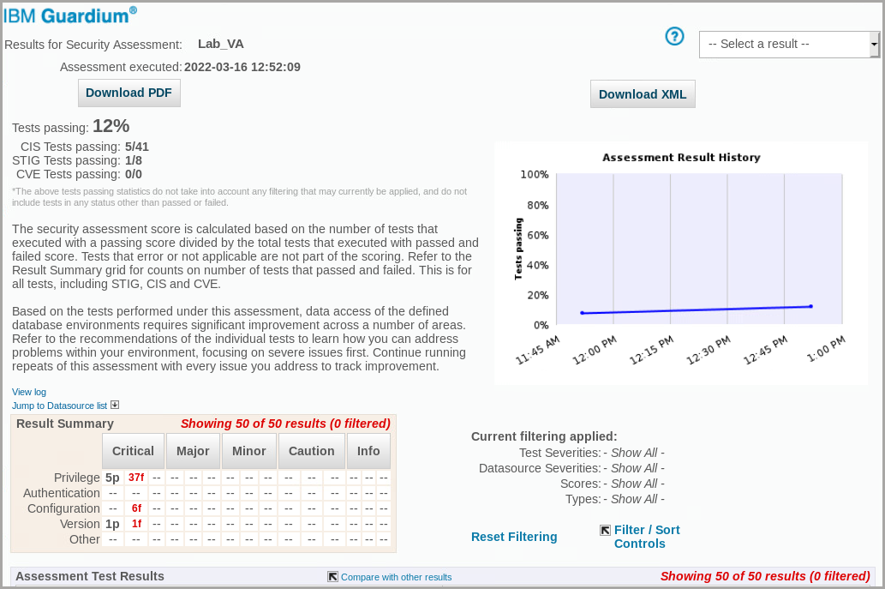

> Note that the result summary shows an improvement in the pass rate. The Assessment Result History graph displays the progress improvement.

16. To filter the results to show only tests that have a status of Pass, click **Filter / Sort Controls**, from the Score column, select **Pass**, and click **Apply**.

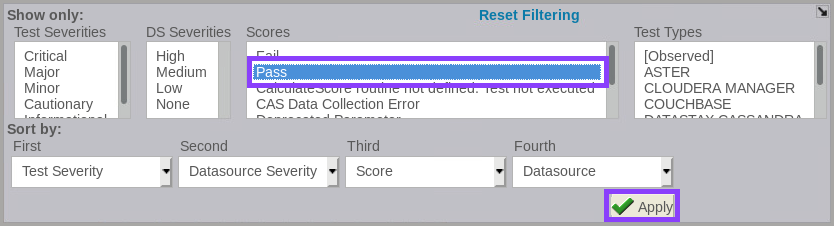

17. Scroll down and view the details of the vulnerabilities you addressed.


### Creating an Exception

Sometimes you want an assessment test to apply generally to your environment, but you want to create an exception. For example, the test might require that no database users have a particular role, but some users need or require that role. In this situation, you can create a test exception. The test runs, but allows the exception. The exception is documented in the test results.

In this task, you create an exception and view the results.

1. Reset the filtering to show all results.

2. In the Assessment Test Results section, locate the **Db2 Roles granted to PUBLIC** test.

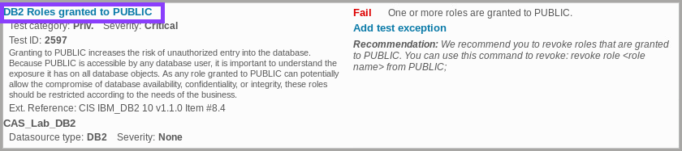

3. Click the **Db2 Roles granted to PUBLIC** link.

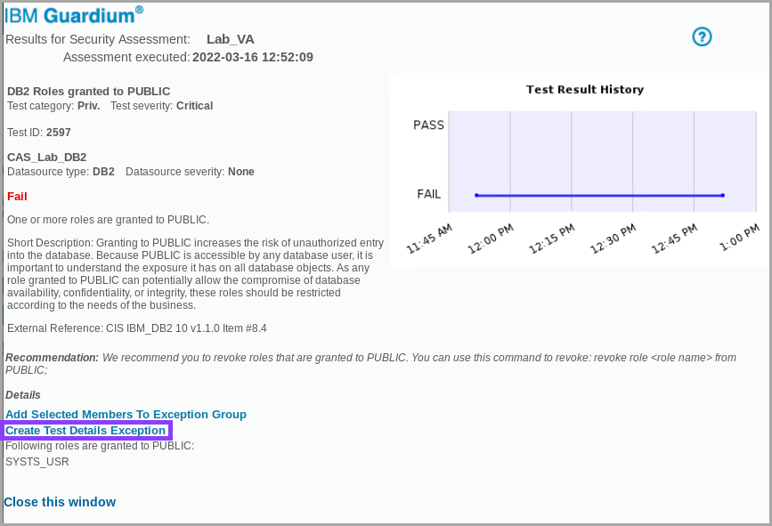

4. Click **Create Test Details Exception**

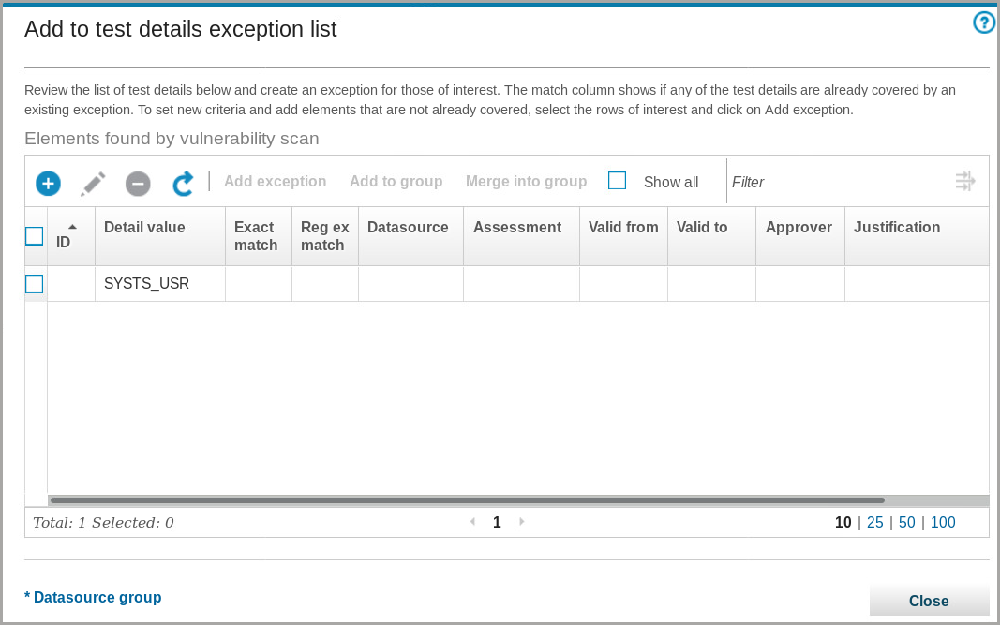

5. Select **SYSTS_USR**

<Callout>
The Add exception link is enabled.
</Callout>

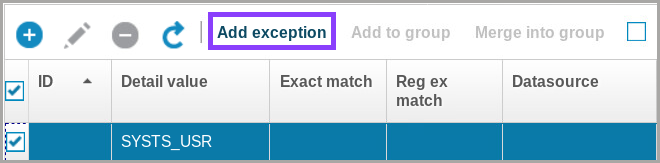

6. Click **Add exception**.

7. Change the End date to two days after your current date.

8. For End date time, choose **11:00 PM**.

9. For Justification, type `Lab Exercise`.

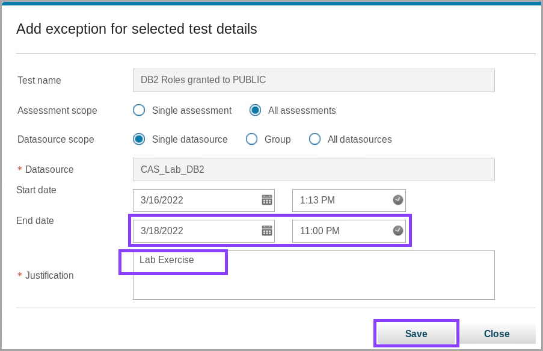

10. Click **Save**

11. Close the confirmation dialog.

12. In the Add to test details exception list, click **Close**.

> The “Db2 Roles granted to PUBLIC” report details window now displays the test exception.

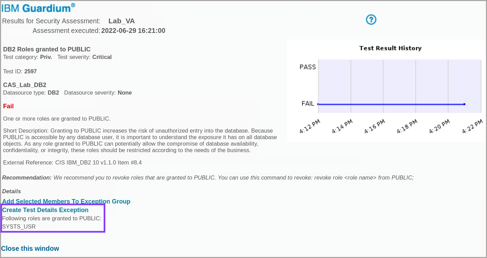

13. Close the Db2 Roles granted to PUBLIC details window and close the security assessments results window.

In this lab, we learned how to use the following functionality from Guardium Data Protection:

- **Grant permissions to create and run security assessments**
- **Create and run a security assessment**
- **Use the report to harden the database and validate the assessment**
- **Create an exception to test the assessment**

Continue onward to [Lab 205](/guardium/level-4/204)
