# Gestión de políticas

## 1 Introducción

Este laboratorio muestra lo siguiente:

*   Crear e instalar una política
*   Configurar y acceder a la regla de alerta
*   Aplicar normas políticas

## 2 Creación e instalación de una política

Hasta que no se crean las reglas de política, Guardium no recopila nada para almacenarlo en su base de datos. Todavía no sabe qué recoger. Es posible que queramos ser selectivos con lo que recopila. Por ejemplo, podríamos decidir ignorar la actividad de la base de datos que se origina en un grupo de usuarios de confianza y ser alertados de actividad inusual en la base de datos, como el acceso a un grupo predefinido de tablas sensibles de la base de datos.

### Crear e instalar una nueva política

En esta tarea, creará una nueva política de seguridad de datos, **-LabPolicy**, y configurará dos reglas para ella. A continuación, instalará **-LabPolicy** y anulará todas las demás políticas para que **-LabPolicy** sea la única política instalada.

1.  Inicie sesión en la **consola gráfica del colector (C200** ) como usuario `labadmin` con la contraseña `P@ssw0rd`.
2.  Vaya a **Proteger > Políticas de seguridad > Instalación de políticas**. Se abrirá el panel Instalación de directivas.


Puede ver la siguiente información útil en el panel Instalación de directivas:

*   Cuando se instaló una política
*   Si una política utiliza una pista de auditoría selectiva
*   Número de reglas de una política

Además, puede gestionar sus políticas desde este panel. Puede instalar, reinstalar, eliminar, editar o añadir una política.

3.  Verá que la política Sólo registro está instalada. A continuación, cree e instale una nueva directiva.
4.  En el menú **de navegación**, vaya a **Proteger > Políticas de seguridad > Creador de políticas para datos**.

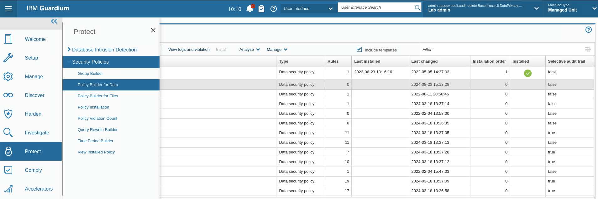

5.  Haga clic en el menú **Analizar** y compruebe que el **analizador de políticas** está en marcha. Si está parado, inícielo.

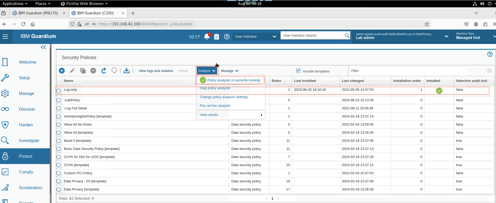

6.  Para crear una nueva política, haga clic en el icono **Nueva**. Se abre el panel Crear nueva política.

    Guardium dispone de dos tipos de políticas para los datos:

    *   **La política de seguridad de datos** es la que ofrece más opciones de criterios y acciones. En este ejercicio se crea una política de seguridad de datos.
    *   **La política a** nivel de sesión es un tipo especializado de política que mejora el rendimiento mediante la validación de criterios al inicio del procesamiento, pero sólo funciona con criterios a nivel de sesión.

> **Nota:** Puede que te preguntes por qué creas una política de seguridad de datos normal cuando una de tus reglas es una regla de nivel de sesión, que parece adecuada para una política de nivel de sesión. La razón es que una política a nivel de sesión sólo puede tener reglas a nivel de sesión, pero tu nueva política de seguridad de datos puede incluir reglas tanto a nivel de sesión como a nivel de objeto. Podrías tener dos políticas, una para las reglas a nivel de sesión y otra para las reglas a nivel de objeto, pero en lugar de eso simplificas las cosas creando una única política con dos reglas.

Rellene el formulario con los siguientes datos:

**Tipo:** Política de seguridad de datos

**Nombre:** -LabPolicy

**Categoría:** Acceso

> **Nota:** Para encontrar fácilmente su política en la lista, y también para designarla como política creada por el usuario, incorpore un guión (-) al principio del nombre de su política.


7.  Para guardar su nueva política, pero aún vacía, desplácese hacia abajo y haga clic en **Aceptar**.


Los ajustes se guardan y verá la nueva política en el panel Políticas de seguridad. La política no tiene reglas y aún no está instalada.

8.  Seleccione su nueva política y haga clic en **Editar**. Se abrirá el panel de edición de políticas.
9.  Haga clic en **Mostrar opciones avanzadas**

Las opciones avanzadas son éstas:

*   **Registro plano** indica a Guardium que registre el tráfico inmediatamente y que posponga el análisis detallado hasta más tarde. Esta opción puede reducir la carga del colector. Algunas acciones no funcionan con el registro plano.
*   Reglas en plano sólo está disponible cuando está seleccionada la opción Reglas en plano. Examina las reglas a nivel de sesión en tiempo real, pero no las reglas normales.
*   El registro de auditoría selectivo limita la cantidad de registros en el sistema. Si se deja esta casilla sin marcar, se garantiza que se está añadiendo una política "no selectiva".

Deje todas las opciones avanzadas desactivadas.

10. Para configurar las reglas, en la sección **Reglas**, haga clic en **Expandir**. Se abre la tabla Reglas.


11. Para añadir una regla, haga clic en **Nueva**. Se abre la ventana Crear nueva regla.

Rellene los formularios con los siguientes valores

Nombre de la regla: Ignorar sesión S-TAP para usuarios de confianza Categoría: Acceso Gravedad: Información  En la sección **Criterios de la regla**, haga clic en **Expandir**. Hay tres subsecciones en las que puede introducir criterios.

*   Criterios a nivel de sesión
*   Criterios SQL
*   Otros criterios

13. En **Criterios de nivel de sesión**, configure los campos del siguiente modo: **Nombre del parámetro:** Usuario de la base de **datos Condición:** En grupo **Valor del parámetro:** Usuarios de confianza del laboratorio


14. Defina las acciones a realizar cuando un evento de acceso a la base de datos cumpla los criterios de la Regla.

*   Para mostrar la tabla Acción de regla, en la sección Acción de regla, haga clic en Expandir.
*   Para añadir una acción, haga clic en **Nuevo**. Se abre una lista de posibles acciones.
*   Seleccione **IGNORAR > IGNORAR SESIÓN S-TAP**. 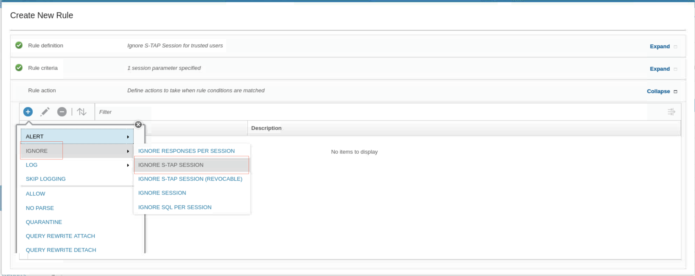

Esta acción le indica al recopilador que ignore cualquier información de esta sesión y también le indica al agente S-TAP que no envíe más información de esta sesión, lo que reduce el tráfico de red. El panel Regla se actualiza con la nueva acción.

15. Para guardar la nueva regla, desplácese hacia abajo y haga clic en **Aceptar**.


16. Para añadir una segunda regla de acceso a su política, haga clic en **Nueva**. Utilice la siguiente información:

*   **Tipo de regla:** Acceso
*   **Nombre de la regla:** Alerta de acceso a objetos sensibles
*   **Gravedad:** Alta (esto hace que sea más fácil de ver en el registro de incidentes más tarde)


17. Para los criterios de nivel de sesión, seleccione **Usuario de base de datos: En grupo: Usuarios con privilegios de laboratorio**.
18. En Criterios SQL, seleccione **Objeto: En Grupo: Objetos sensibles**.


19. Establezca las dos acciones de regla siguientes:

*   Acción 1. **ALERT > ALERT PER MATCH**, con la plantilla de mensaje por defecto y **SYSLOG** como tipo de notificación.
*   Acción 2. **OG DETALLES COMPLETOS** 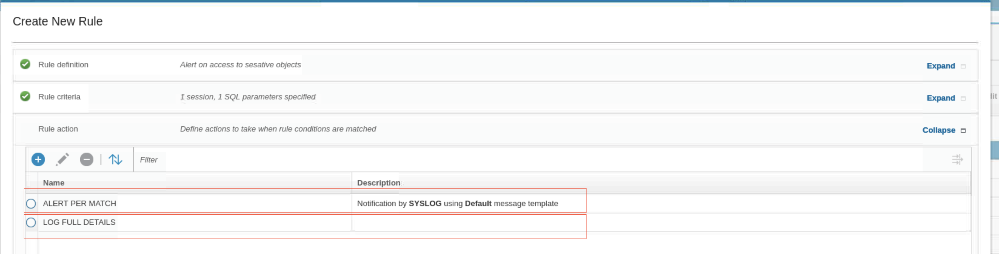

20. Desplácese hacia abajo y haga clic en Aceptar. Volverá al panel Editar política. Ahora tiene dos reglas.

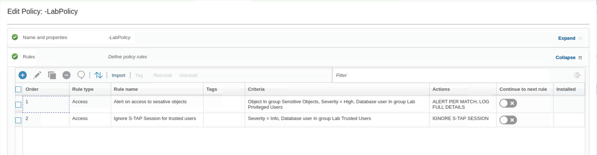

21. Para guardar su política y volver al panel Políticas de seguridad, desplácese hacia abajo y haga clic en Aceptar, a continuación, cierre el cuadro de diálogo de confirmación. Su nueva política muestra ahora dos reglas.
22. Ahora es el momento de sustituir la política actualmente instalada por la política que ha creado.

*   Seleccione la nueva política, **-LabPolicy**.

*   En el menú **Instalar**, seleccione **Instalar**.

*   En la ventana Instalar directiva, seleccione la acción de instalación Instalar y anular.

*   Dejar seleccionadas Todas las políticas

    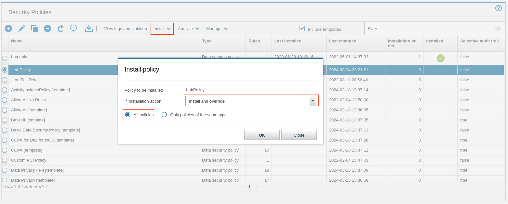

*   Haga clic en **Aceptar** y cierre el mensaje de confirmación.

    El panel de políticas de seguridad muestra que su política está instalada, y la columna **Última instalación** está actualizada

23. Vaya a **Proteger > Políticas de seguridad > Instalación de políticas**. Se abrirá el panel Instalación de directivas. Su política es la única política instalada actualmente.

    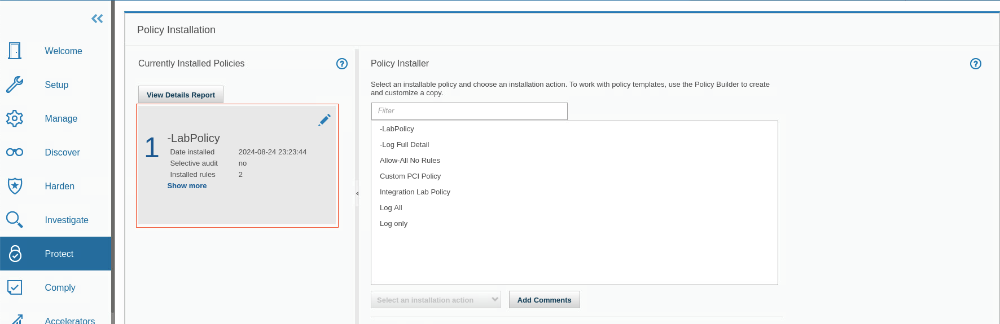

### Probar la nueva política

Ahora genere algunos datos, pruebe su política y revise los resultados. Comience con la regla de usuarios privilegiados y genere algunos datos. Accede a las tablas CC,CREDITCARD, PATIENT, y SSN como usuarios JOE y JOAN. JOE y JOAN son miembros del grupo de usuarios con privilegios. Por lo tanto, cuando intentan acceder a una tabla que aparece en el grupo de objetos sensibles, la regla se activa y registra una infracción de la política.

1.  Para iniciar una sesión de terminal en el servidor de base de datos, en el escritorio del servidor de base de datos, haga clic en el icono Terminal.

    

2.  Para cambiar al usuario `su - db2inst1`. introduzca el comando `su - db2inst1`.

3.  Para entrar en el entorno de comandos de Db2, ejecute `db2`.

    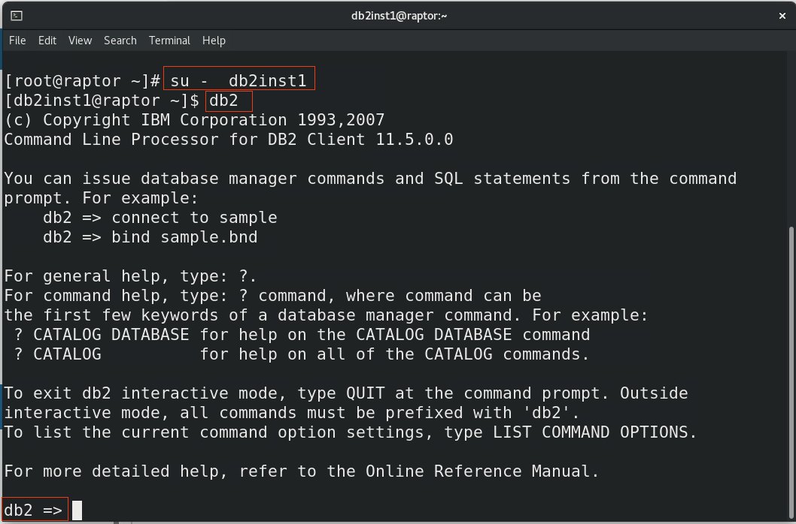

4.  En el entorno de comandos **Db2**, ejecute los siguientes comandos:

```bash
connect to sample user joe using P@ssw0rd
```

```bash
select * from db2inst1.patient
```

```bash
select * from db2inst1.cc
```

```bash
select * from db2inst1.creditcard
```

```bash
select * from db2inst1.ssn
```

```bash
connect to sample user joan using P@ssw0rd
```

```bash
select * from db2inst1.patient
```

```bash
select * from db2inst1.cc
```

```bash
select * from db2inst1.creditcard
```

```bash
select * from db2inst1.ssn
```

5.  Después de recibir los resultados, escriba `quit`.

6.  En la GUI de Guardium, vaya a **Informes > Informes operativos en tiempo real de Guardium > Gestión de incidentes**. Verá infracciones de políticas para los usuarios con privilegios JOE y JOAN, que accedieron a tablas de bases de datos en objetos sensibles. Es posible que tenga que esperar unos minutos hasta que aparezcan algunos resultados.

    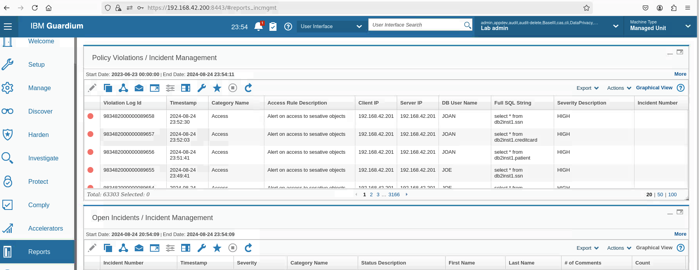

Verá que el acceso a las tablas **SSN**, **PATIENT** y **CREDITCARD** da lugar a infracciones, pero el acceso a la tabla CC no. Esto se debe a que SSN y PATIENT coinciden con objetos del grupo **Objetos sensibles**.

## Configuración de una regla de alerta de acceso

En este ejercicio, se modifica la política existente para añadir una regla de alerta. Esta regla alertará cuando un usuario con privilegios intente acceder a un objeto de datos sensibles que contenga un token de tarjeta de crédito.

### Crear una regla

En esta tarea, se crea una regla que envía una alerta cuando un usuario accede a la tabla de tarjetas de crédito.

1.  Inicie sesión en la consola gráfica **del recopilador (C200)** como usuario `labadmin` con la contraseña `P@ssw0rd`. En el menú GUI de Guardium, vaya a **Proteger > Políticas de seguridad > Creador de políticas para datos**.

2.  Para modificar la política, seleccione **-LabPolicy** y haga clic en **Editar**.

3.  Amplíe la sección Normas.

4.  Para añadir una regla, haga clic en **Nueva**

    Rellene los formularios con los siguientes valores

    **Nombre de la regla:** Alerta de acceso a tarjetas de crédito **Gravedad:** Media **Categoría:** Datos sensibles

    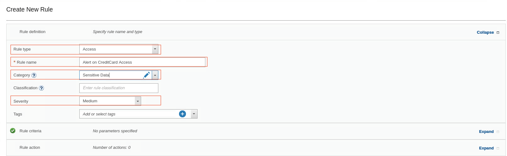

5.  Amplíe la sección Criterios de la regla.

*   En **Criterios de nivel de sesión**, seleccione **Usuario de base de datos: En Grupo: Usuarios Admin**.

    El grupo Usuarios administradores contiene una lista de los usuarios con privilegios que audita para esta regla de política. Puede ver los miembros del grupo para verificar que JOE es miembro de este grupo.

*   Para los **criterios SQL**, seleccione **Objeto = %tarjeta de crédito**

    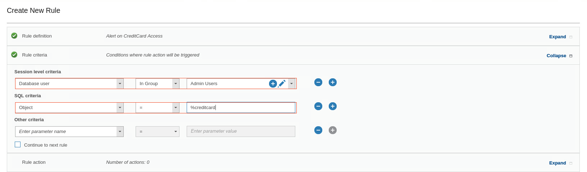

6.  Haga clic en la sección **Acción de la regla**.

*   Para añadir una nueva acción, haga clic en **Nuevo** y seleccione **ALERTAR > ALERTAR POR PARTIDA**.

*   En la ventana **Añadir nueva acción**, para **Plantilla de mensaje**, mantenga Predeterminado.

*   En **Tipo de notificación**, seleccione **SYSLOG**.

    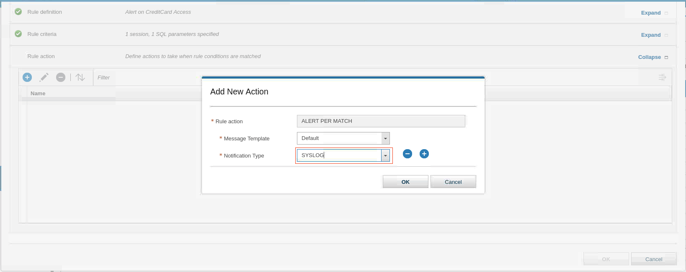

*   Haga clic en **Aceptar**.

*   Para guardar la regla, desplácese hacia abajo y haga clic en **Aceptar**.

    Ahora tiene tres reglas en la política. Sólo dos de las reglas están instaladas porque la política debe reinstalarse para activar la regla que acaba de crear. 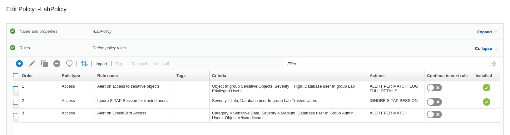

7.  Para la regla **Alerta de acceso a objetos sensibles**, establezca **Continuar a la siguiente regla** en **Activado**.

> **Nota:** La tabla Tarjeta de crédito forma parte del grupo de objetos sensibles. Por lo tanto, si un miembro del grupo Admin, por ejemplo, JOE, ejecuta el comando select \* from creditcard, verá que se registra con Detalles y Enviar una alerta. Para lograr esto, debe seleccionar Continuar a la Regla Siguiente en la Regla de Acceso anterior (la que tiene Registrar SQL Completo) porque por defecto, cuando se dispara una regla, el appliance Guardium detiene allí el análisis de la regla.

8.  Pulse **OK**. Volverá al **generador de políticas**. Su política muestra ahora **tres reglas**.

9.  Para reinstalar la política, seleccione **-LabPolicy** y haga clic en **Instalar > Reinstalar**.

    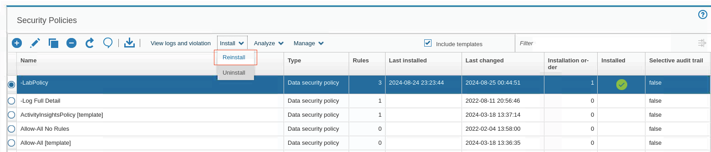

    Las últimas actualizaciones de valores instalados.

### Probar la política de alertas

En esta tarea, se genera tráfico para probar la política.

1.  Ejecute los siguientes comandos en el entorno de comandos Db2:

`connect to sample user joe using P@ssw0rd` `select * from db2inst1.creditcard` `select lastname,firstname from db2inst1.creditcard` `select * from db2inst1.creditcard` `select lastname,firstname from db2inst1.creditcard`

2.  Después de recibir los resultados, escriba `quit`.

3.  De vuelta en **la GUI**, para localizar el informe de **Gestión de Incidentes** y verificar que la alerta fue reportada, haga clic en **Cumplir > Informes > Gestión de Incidentes**.

    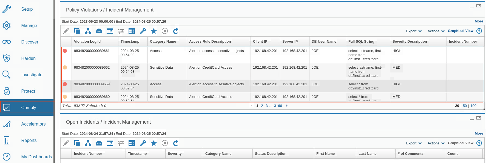

> **Nota** El color de un evento está asociado a la gravedad y puede ayudar a identificar y priorizar las alertas críticas.

### Configurar la regla de alerta

El analizador de políticas proporciona información que le ayuda a identificar las reglas que se disparan con frecuencia, optimizar el orden de las reglas y evaluar los cambios en las mismas.

1.  En el generador de políticas, seleccione **-LabPolicy** y, a continuación, en el menú **Analizar**, haga clic en **Ver resultados > Análisis continuo**.

    

2.  Si no hay datos para el análisis, es posible que tenga que retroceder en el tiempo, por ejemplo, 3 horas.

    

    En este ejercicio, el Analizador de Políticas muestra que todas las reglas fueron disparadas. Cuando se instalan varias políticas, cada una con muchas reglas, el Analizador de Políticas puede ser una herramienta útil para ayudarle a verificar si las reglas que definió aciertan con el tráfico que se está ejecutando. Una forma diferente de ver las infracciones de las políticas y el tráfico registrado es a través de la **opción Ver registros e infracciones**.

## Aplicación de normas políticas

Guardium soporta políticas granulares y deterministas para identificar positivamente las violaciones, en lugar de depender de la heurística. Las reglas se basan en propiedades específicas de la sesión, como la dirección IP del cliente, la dirección MAC, la aplicación de origen, el usuario de la base de datos, el usuario del sistema operativo, el usuario de la aplicación, la hora del día, el comando SQL y los nombres de tabla, que normalmente se definen mediante grupos predefinidos para simplificar la gestión continua. Se puede invocar una amplia gama de acciones en caso de infracción de las políticas, como alertas en tiempo real (SMTP, SNMP, Syslog, CEF), cuarentena de usuarios y finalización de la conexión.

Además de examinar SQL, el módulo de control de acceso a nivel de datos de Guardium también examina los resultados de las consultas. Por ejemplo, una conexión desde un script o aplicación anómala que de repente se ve que está extrayendo Información de Identificación Personal (PII) de la base de datos puede ser terminada o puesta en cuarentena mientras se investiga, aunque una aplicación válida que extraiga los mismos datos PII será permitida.

La cuarentena está disponible para las reglas de acceso, excepción y extrusión, y puede impedir que el mismo usuario se conecte al mismo servidor durante un determinado periodo de tiempo. Hay un elemento de validación: no se puede tener una regla con una acción de CUARENTENA sin un valor para la cantidad de tiempo que el usuario está en cuarentena. Cada elemento tiene, además de la marca de tiempo, una IP de servidor, un tipo de servidor, un nombre de usuario de BD, un nombre de servicio y una bandera que indica si se trata de una sesión vigilada.

En este ejercicio, aprenderá cómo Guardium puede poner en cuarentena a un usuario sospechoso durante un periodo de tiempo especificado y enviar alertas. Durante este tiempo, no se permite al usuario iniciar sesión en el servidor desde la misma dirección IP con el mismo userID. De este modo, los administradores alertados pueden protegerse contra posibles intrusiones posteriores. Si la situación se considera un error inofensivo, un administrador puede levantar la cuarentena. En este laboratorio, aprenderá a realizar las siguientes tareas:

*   Crear una nueva política
*   Añada una regla de registro de detalles completos y una regla de cuarentena a la política
*   Instalar y probar la nueva política
*   Validar los resultados de la cuarentena

Siga estas instrucciones para realizar el ejercicio. Si es necesario, pida ayuda a su instructor.

### Crear una nueva política

En esta tarea se crea una nueva política.

1.  Inicie sesión en la consola gráfica del colector (C200) como usuario `labadmin` con la contraseña `P@ssw0rd`.
2.  Utilice la GUI de Guardium para crear la nueva política. En el menú de navegación, vaya a **Proteger > Políticas de seguridad > Creador de políticas para datos**.
3.  Para crear una nueva política de seguridad de datos, haga clic en **Nuevo** y rellene los siguientes datos

Nombre: -Categoría de Política de Cuarentena de Laboratorio: PCI


### Añada una regla de registro de detalles completos y una regla de cuarentena a la política

En esta tarea, se añade una regla de cuarentena para impedir el acceso no autorizado a objetos sensibles

1.  Para añadir una regla a esta política, haga clic en la sección **Reglas**.
2.  Haga clic en **Nuevo** y rellene los siguientes datos

**Tipo de regla:** Acceso **Categoría:** PCI **Nombre de la regla:** Log Full Details **Gravedad:** Información

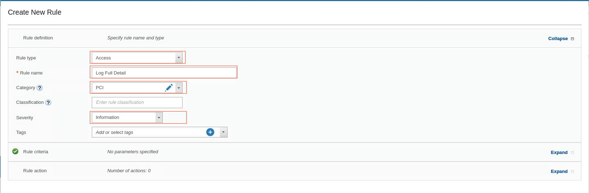

3.  Haga clic en la sección Criterios de la regla. No es necesario que añada ningún criterio aquí, pero DEBE seleccionar la casilla de verificación **Continuar con la siguiente regla**.

    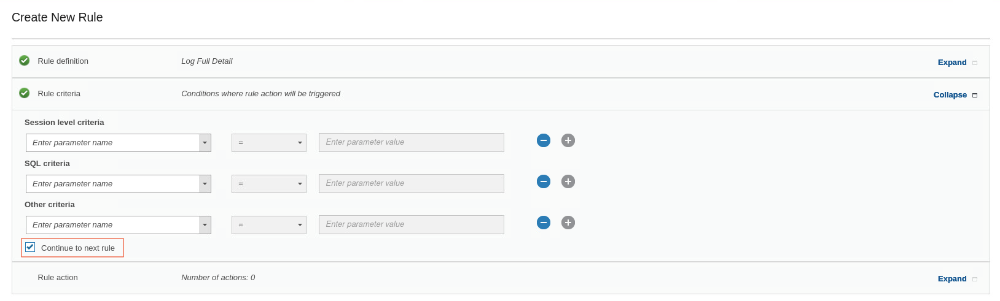

    > **Nota:** Seleccionar Continuar a la siguiente regla es un paso crítico. Si no se marca, no se procesará ninguna de las reglas siguientes. Debe repetir este paso para todas las reglas dependientes.

4.  Para añadir una nueva acción de regla, expanda **Acción de regla** y haga clic en **Nueva**

5.  En la lista **Acción de regla**, seleccione **REGISTRAR > REGISTRAR DETALLES COMPLETOS**.

    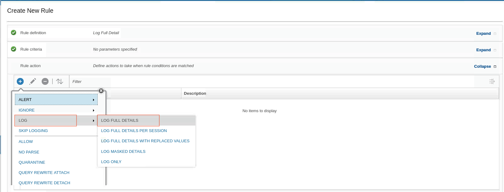

6.  Añada otra regla con el siguiente detalle: tipo Access con nombre Quarantine PCI Objects y Severity Medium.

**Tipo de regla:** Acceso **Categoría:** PCI **Nombre de la regla:** Cuarentena Objetos PCI **Severidad:** Media


> **Nota:** Las violaciones de la política de gravedad media se marcan automáticamente con NARANJA en el informe de Gestión de Incidentes.

7.  Haga clic en la sección **Criterios de la regla**.

*   Para **los criterios de nivel de sesión**, seleccione **Tipo de base de datos = DB2**.

*   Para los **criterios SQL**, establezca **Campo = número de tarjeta**.

*   Para añadir otro **criterio SQL**, haga clic en **Nuevo** y establezca **Objeto = %tarjeta de crédito**.

*   En la lista **Otros criterios**, seleccione **Cuarentena durante = 15 minutos**.

    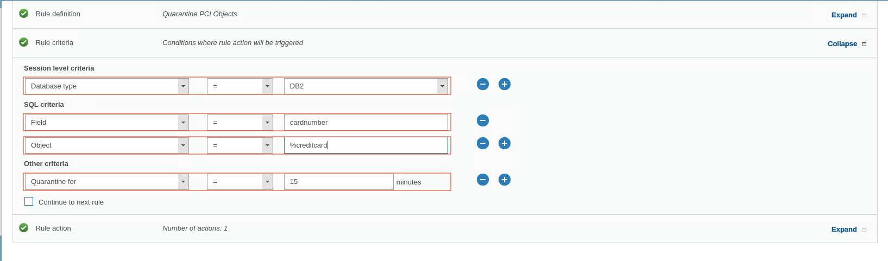

    > **Nota:** No es necesario seleccionar la casilla de verificación Continuar con la siguiente regla porque ésta es la última regla y no hay más reglas dependientes.

8.  Haga clic en la sección **Acción de la regla**, haga clic en **Nuevo** y seleccione **CUARENTENA**

    

9.  Para guardar la regla, desplácese hacia abajo y haga clic en **Aceptar**. Ahora tiene dos reglas en su política.

10. Activar la regla Continuar a la siguiente para la regla **Registrar detalles completos**.

    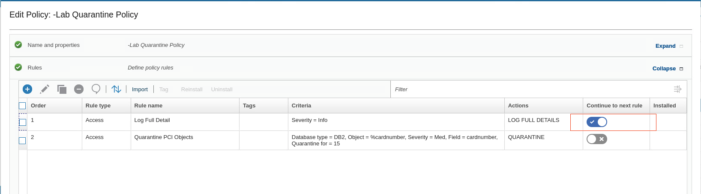

11. Para guardar la política, desplácese hacia abajo y haga clic en **Aceptar**. A continuación, **cierre** el cuadro de diálogo de confirmación. Volverá al **Creador de directivas**.

### Instalar y probar la nueva política

En esta tarea, se instala y prueba la nueva política.

1.  Para instalar la política **-LabQuarantine** recién creada, selecciónela en la lista Políticas de seguridad y haga clic en **Instalar > Instalar > Instalar y anular > Aceptar**.
2.  Para comprobar que la política se ha instalado correctamente, en el menú **de navegación**, vaya a **Proteger > Políticas de seguridad > Ver política instalada**.

Ahora, pruebe la Política de Cuarentena -Lab. Para ello, debe cambiar el usuario del servidor Raptor DB de root a db2inst1

3.  Vaya a la sesión de **terminal**. Asegúrese de haber iniciado sesión con el usuario `db2inst1`

4.  Para entrar en el entorno de comandos de Db2, ejecute **db2**.

5.  Ejecute los siguientes comandos en el entorno de comandos Db2:

    ```bash
    connect to sample user joe using P@ssw0rd
    ```

    ```bash
    select lastname,cardnumber from db2inst1.creditcard
    ```

    

    El comando select no tiene éxito. La sesión se cierra y el usuario JOE se pone en cuarentena durante 15 minutos.

### Validar los resultados de la cuarentena

Hay dos maneras de encontrar el informe de Gestión de Incidentes y validar sus resultados.

1.  Compruebe que la directiva ha activado correctamente una infracción de directiva en **la GUI de Guardium**.

*   Vaya a Cumplir > Informes > Gestión de incidencias.

    Cuando vea este informe, verá al usuario en cuarentena, **JOE**, con un nivel de gravedad medio.

    

2.  A continuación, valide que el usuario **JOE** esté **en cuarentena**. Hay 2 maneras de encontrar el informe **Conexiones en cuarentena**:

    *   Utilice la barra de búsqueda en la parte superior de la GUI y escriba `conne-` hasta que vea el informe Conexiones en cuarentena. Haga clic en él y accederá a la página Informe.

    *   Alternativamente, desde el menú de navegación, vaya a **Cumplir > Informes > Conexiones en cuarentena**

        

        Verá que el usuario en cuarentena JOE está en cuarentena durante 15 minutos.

3.  Por último, valide que el usuario JOE no pueda realizar ninguna actividad SQL dentro del periodo de cuarentena. En su sesión de terminal del servidor Raptor DB (C200), escriba los siguientes comandos:

`connect to sample user joe using P@ssw0rd` `select * from db2inst1.ssn` `select * from db2inst1.patient` `select * from db2inst1.ssn` `select * from db2inst1.patient`

JOE no tiene acceso a ningún otro objeto durante el periodo de cuarentena. Su salida se parece a esta captura de pantalla: 

## Enhorabuena, has llegado al final del laboratorio 205.

Haga clic en, **[laboratorio 206](/guardium/dataprotection/level-4/206)** para iniciar el siguiente laboratorio.
