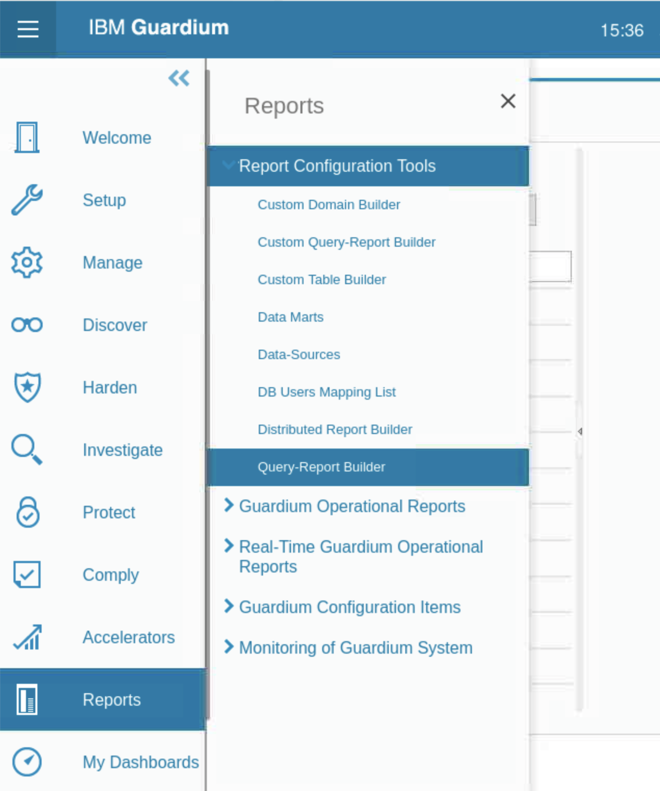
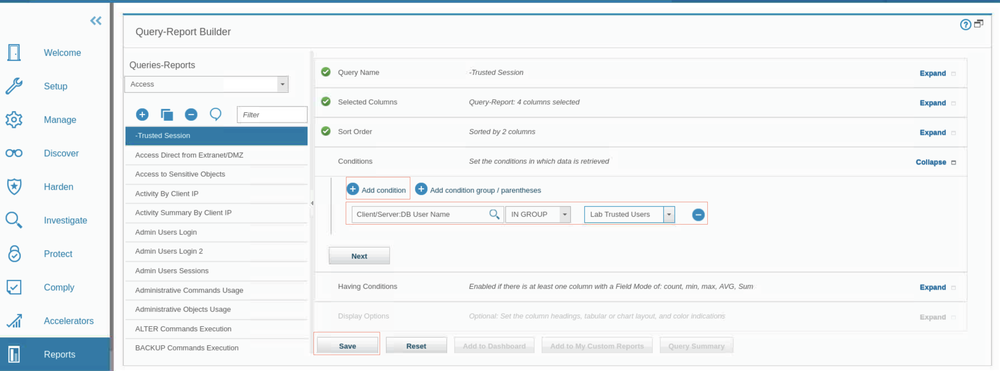
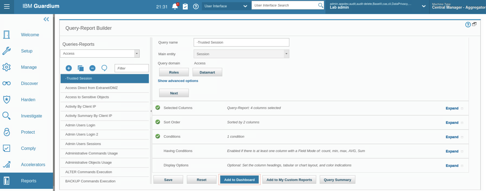
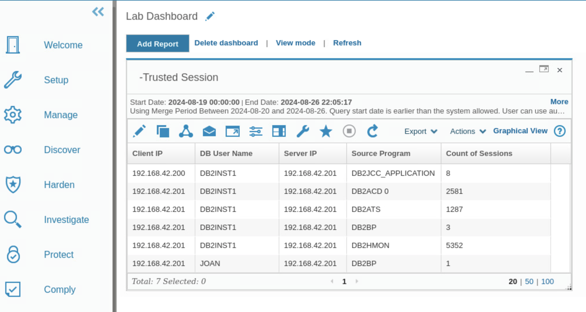
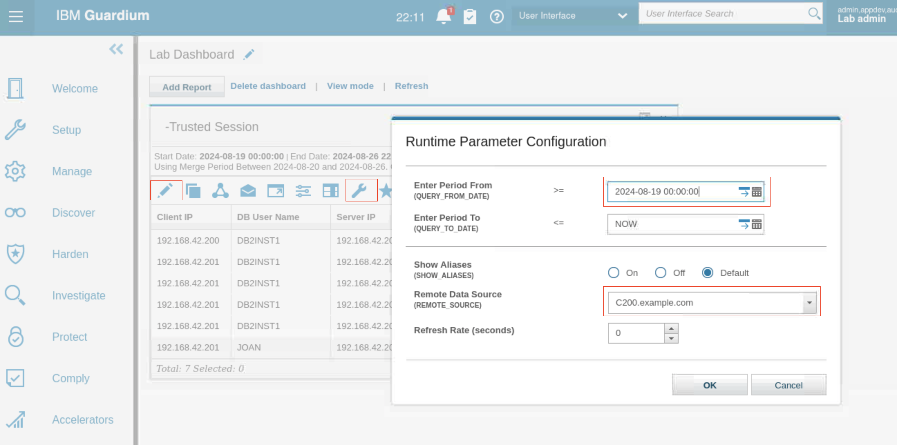
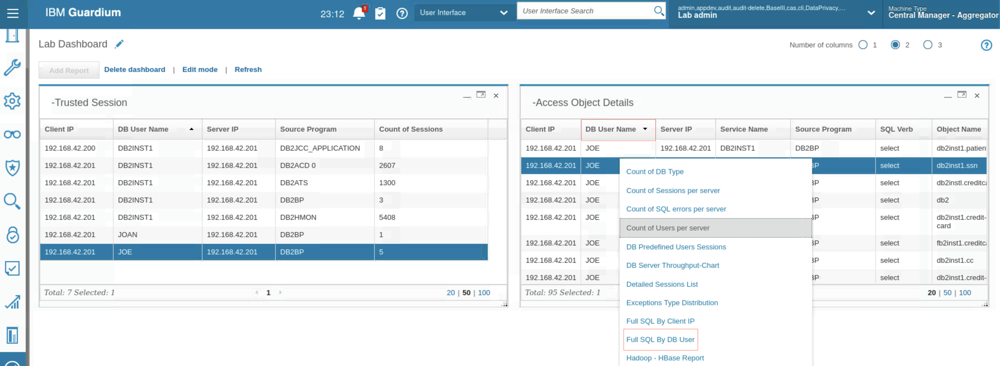
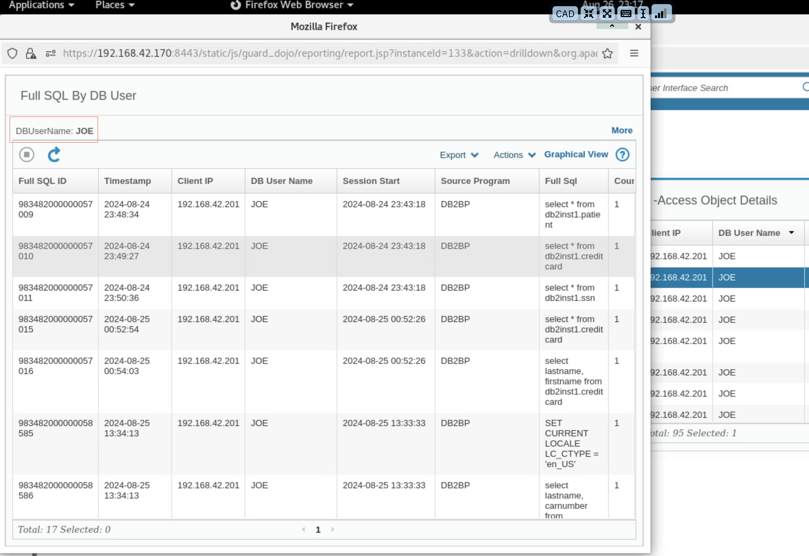

# Creación de ejercicios de consultas e informes

En estos ejercicios se crean consultas e informes personalizados.

## Creación de una consulta y un informe sencillos

En este ejercicio, usted crea su propia pestaña Consola para mostrar su informe. A continuación, cree una consulta simple y un informe que utilice dicha consulta y coloque el informe en su nueva página de informes. La consulta que creas devuelve detalles de todas las sesiones de confianza, es decir, sesiones abiertas por usuarios de base de datos que son miembros del grupo Lab Trusted Users. La consulta devuelve el nombre de usuario de la base de datos, las direcciones IP del cliente y del servidor y el nombre del programa de origen.

1.  En el servidor de base de datos, para iniciar **la GUI de Guardium**, haga doble clic en el icono del navegador web Firefox.
2.  Inicie sesión en la consola gráfica **Central Manager(MA170)** como usuario `labadmin` con la contraseña `P@ssw0rd`.

### Cree un nuevo cuadro de mandos para su informe

En esta tarea, se crea un nuevo cuadro de mando para contener el informe.

1.  En el menú de navegación de la izquierda, haga clic en **Mis cuadros de mando > Crear nuevo cuadro de mando**. Se abrirá el nuevo panel.

2.  Para editar el cuadro de mandos, haga clic en **Editar**

3.  Cambie el nombre del cuadro de mandos a **Cuadro de mandos de laboratorio** y haga clic en **Guardar**.

    

### Crear una consulta para el informe a utilizar

La consulta especifica qué información se recupera de la base de datos de Guardium y cómo se muestra.

1.  En el menú de navegación de la izquierda, haga clic en **Informes > Herramientas de configuración de informes > Generador de informes de consulta**. Se abrirá el panel Generador de informes de consulta.

2.  En **Dominio**, seleccione **Acceso**. Aparecerá un **icono para añadir** una nueva consulta y una lista de informes de acceso.
3.  Haga clic en **Nuevo**. Se abre el panel Nueva consulta.

> **Nota:** El Asistente para Nueva Consulta tiene varias secciones, que pueden expandirse o contraerse. El asistente le guía a través del proceso de creación de una consulta y generación de un informe. Para volver al panel de generación de consultas e informes, haga clic en **Generador de consultas e informes** en la esquina inferior izquierda del asistente.

*   Para el **nombre de la consulta**, escriba **-Sesiones de confianza**.
*   En **Entidad principal**, seleccione **Sesión**.
*   Haga clic en **Siguiente**.

Para determinar cómo se muestra la información, elija entidades de la lista Entidades y atributos para añadirlas a los campos Columnas seleccionadas. Añada entidades a las Condiciones de la consulta, que determinan la información que se mostrará.

4.  En la tabla **Entidades y Atributos**, seleccione **Entidad: Cliente/Servidor** con **Atributo: IP del cliente** y, a continuación, haga clic en el icono **Copiar**

La entidad se añade a la tabla Columnas seleccionadas en la parte derecha de la ventana.

5.  Desplácese hacia abajo o utilice el campo Filtro para buscar y añadir los siguientes atributos de la entidad Cliente/Servidor a la tabla Columnas seleccionadas

*   IP del servidor
*   Nombre de usuario de BD
*   Programa fuente

Cuando haya terminado, el generador de consultas incluirá cuatro entidades en la sección Columnas seleccionadas.

6.  Usted no pierde su trabajo, desplácese hacia abajo y haga clic en Guardar, a continuación, cierre la confirmación.

> **Nota:** Cuando cree o modifique una consulta en Guardium, guárdela pronto y con frecuencia para evitar pérdidas de trabajo y frustraciones.

7.  Para que los informes posteriores muestren el recuento de las sesiones en lugar de los detalles de cada sesión individual, seleccione **Recuento**.
8.  Para colocar los campos en la secuencia correcta, seleccione la entidad **Nombre de usuario de BD** y utilice las **flechas azules arriba y abajo** para moverla a la segunda posición de la secuencia.

9.  Para visualizar el orden de clasificación, pulse **Siguiente**
10. Para establecer el rango de **ordenación**, seleccione **Ordenar resultados por columnas** y, a continuación, haga clic en **Añadir columna de ordenación**. En el campo que se abre, puedes seleccionar por qué columnas ordenar y en qué orden.

*   En la lista desplegable, seleccione **Cliente/Servidor - IP cliente**.
*   Para ordenar los datos en orden ascendente, seleccione **Ascendente**
*   Para añadir otra entidad de **ordenación**, haga clic en el **icono Añadir columna de ordenación**. Seleccione **Cliente/Servidor - Nombre de usuario de BD** y **Ascendente**.
*   Para pasar a la sección Condiciones, haga clic en **Siguiente**. 

11. Añada **condiciones** a la consulta. Las condiciones controlan la información que se muestra en el informe. Como sólo le interesan los usuarios de confianza, compruebe que los usuarios de la base de datos sean miembros de un grupo denominado **Usuarios con privilegios de laboratorio**.

*   Para añadir una **condición**, haga clic en el **icono Añadir condición**.
*   Haga clic en el **icono Buscar**. Se abre la ventana Seleccionar un campo de condición.
*   Expanda **Cliente/Servidor**, resalte **Nombre de usuario de base de datos** y haga clic en **Seleccionar**.
*   Seleccione el operador **IN GROUP** y el parámetro de ejecución **Lab Privileged Users**.
*   Haga clic en **Guardar**.

### Añadir el informe al cuadro de mandos

En esta tarea, se añade el informe al cuadro de mandos.

1.  Haga clic en **Añadir al Cuadro de Mando**. Se abre la ventana **Añadir informe al cuadro de mando seleccionado**.

2.  Seleccione **Cuadro de mandos de laboratorio** y haga clic en **Añadir informe**.
3.  Haga clic en **Guardar**.
4.  En el menú **de navegación de la izquierda**, haga clic en **Mis Cuadros de Mando > Mis Cuadros de Mando Personalizados > Cuadro de Mando de Laboratorio**. El panel se abre en la pestaña **Añadir informe** con los datos del nuevo informe.

5.  Si no hay datos en su informe, edite su marco temporal para este informe.

    *   Haga clic en el **modo Editar**.
    *   Aparecerán más iconos y opciones para personalizar el informe.
    *   Haga clic en el **icono Configurar parámetros de tiempo de ejecución**. Se abre el cuadro de diálogo de configuración de parámetros de tiempo de ejecución.
    *   En el **campo Introducir período desde**, haga clic en **el icono del** selector de fecha y establezca los campos del selector de fecha en **AHORA menos 3 días** y haga clic en **Aceptar**.
    *   Para cerrar el cuadro de diálogo de configuración de parámetros de tiempo de ejecución, haga clic en **Aceptar**. Ya tiene datos en su informe.

## Creación de una consulta y un informe con funciones de desglose

En este ejercicio se crea un informe con parámetros de ejecución. Los informes que tienen esta estructura están disponibles como informes de desglose de otros informes en los que también están disponibles esos parámetros.

El informe devuelve detalles de todos los objetos de base de datos a los que accede una combinación especificada de usuario de base de datos o dirección IP de cliente. El usuario de la base de datos y la IP del cliente se configuran en forma de parámetro para que pueda definirlos en tiempo de ejecución, ya sea explícitamente o utilizando comodines.

1.  En el menú **de navegación de la izquierda**, haga clic en **Informes > Herramientas de configuración de informes > Generador de informes de consulta**.
2.  En **Dominio**, seleccione **Acceso**. Aparecerá un icono para añadir una nueva consulta y una lista de informes de acceso.
3.  Haga clic en **Nuevo**. Se abre **el** panel **Nueva consulta**.

*   Para el **nombre de la consulta**, escriba **-Detalles del objeto accedido**.
*   En **Entidad principal**, seleccione **Objeto**.
*   Haga clic en **Siguiente**.

4.  Para que los informes posteriores muestren el recuento de las sesiones en lugar de los detalles de cada sesión individual, seleccione **Recuento**.
5.  En la lista desplegable **Entidades y atributos**, seleccione Entidad: **Cliente/Servidor**. A continuación, seleccione el Atributo **IP de Cliente** y luego haga clic en **Copiar**.

El atributo IP del cliente se añade a la sección Columnas seleccionadas en la parte derecha de la ventana.

6.  Seleccione los siguientes atributos y muévalos a la sección Columnas seleccionadas:

*   Entidad: **Cliente/Servidor**, Atributo: **DB User Name**
*   Entidad: **Cliente/Servidor**, Atributo: **IP del servidor**
*   Entidad: **Cliente/Servidor**, Atributo: **Nombre del servicio**
*   Entidad: **Cliente/Servidor**, Atributo: **Programa fuente**
*   Entidad: **Comando**, Atributo: **Verbo SQL**
*   Entidad: **Objeto**, Atributo: **Nombre del objeto**

Ahora tiene siete atributos de entidad en la tabla **Columnas seleccionadas**.

7.  **Guarda** el informe.
8.  Añada dos condiciones. Enlaza estas condiciones con un **AND**, de modo que ambas condiciones deben cumplirse.

*   Para configurar las condiciones de su informe, amplíe la sección **Condiciones**.
*   Añade el atributo **DB User Name** de la carpeta **Client/Server** de la lista de entidades, con Operator establecido en **LIKE**, runtime parameter establecido en **Parameter**, y parameter value establecido en **DBUser**.
*   Añade el atributo **Client IP** de la carpeta **Client/Server** de la lista de entidades, con Operator establecido en **LIKE**, runtime parameter establecido en **Parameter**, y parameter value establecido en **ClientIP**.

9.  Guarde el informe y añádalo a su panel de control.

10. Para ver su tablero, vaya a **Mis tableros > Mis tableros personalizados > Tablero de laboratorio**, o buscando Tablero de laboratorio en el campo de búsqueda de la interfaz de usuario.

11. Si no hay datos en el informe **-Objetos de base de datos accesibles**, active el modo de edición y cambie la fecha de inicio a **AHORA -3 DÍA** y haga clic en **Aceptar**.
12. En el informe **-Accessed Object Details**, localice una de las entradas con **DB User Name JOE** y abra el **informe Full SQL by DB User**

*   Haga clic en la **columna Nombre de usuario de base de datos** hasta que las entradas se ordenen en orden **descendente**. Las entradas con **Nombre de usuario de base de datos JOE** estarán al principio de la lista. Si no es así, desplácese hacia abajo hasta que encuentre una entrada con el nombre de usuario de base de datos JOE.
*   **Haga clic con el botón derecho del ratón en** cualquier entrada con **nombre de usuario de base de datos JOE**. Se abre una ventana emergente con una lista de informes desglosados.
*   Desplácese hacia abajo y seleccione **SQL completo por usuario de base de datos**.

13. Se abre una nueva ventana con el informe de desglose, donde el **parámetro Nombre de usuario de BD** es **JOE**.

## Enhorabuena, has llegado al final del laboratorio 206.

Haga clic en, **[laboratorio 207](/guardium/dataprotection/level-4/207)** para iniciar el siguiente laboratorio.
