# Creating an audit

In these exercises, you explore audit process automation. You create an audit process definition that sends work, in the form of a couple of reports, to the infosec, dba, and audit roles. The process flow looks like the following figure. 

 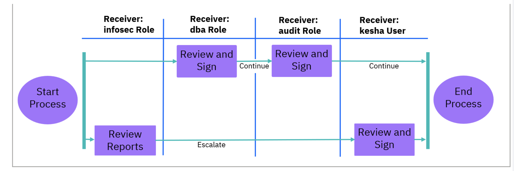 

After it starts, the audit process places work in the infosec role's To-Do list. All users with this role see the work but only one must do it. This work is marked Continuable, which means that the system does not wait for the user to complete the work before it moves to the next receiver.

The next receiver is the dba role. The work here is marked Review and Sign. The work does not progress until a user in the dba role reviews and signs. Additionally, the user must explicitly Continue the work to the next receiver. The next, and final receiver is the audit role, where again the user must Review and Sign the work and must Continue it to move it on. In this case, the work is moved to the end of the process.

In the exercises, the infosec role user escalates the work to a specific user, kesha, and asks that user to both Review and Sign the work. Escalation is not something that you can design into an audit process; it occurs at runtime at the discretion of the user who processes the work. 

You can run this process on the aggregator or the collector. In this exercise, you run it on the aggregator, because the aggregator has a holistic view of the data environment, and also to reduce the load on the collector.

## Creating an audit process definition

In this exercise, you define an audit process.

1. Log in to the **central manager/aggregator MA170** graphical console as user `lab` with password `P@ssw0rd`.

> **Note:** You must log in with user `lab` rather than user labadmin because labadmin is a member of the infosec role, and that membership interferes with the review process.

2. Navigate to **Comply > Tools and Views > Audit Process Builder**. The Audit Process Builder pane opens.

3. To view the processes that already exist, select **All**.

 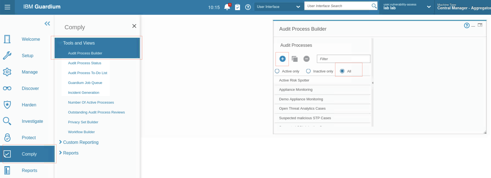 

4. To create a new audit process, click **New**. The Create New Audit Process pane opens. The window includes five sections. You complete each section one after another, but you can edit them later.

5. Enter the **name** for the audit process, such as **-Lab Audit Process**, and click **Show advanced options**. The advanced options are displayed.

6. To ensure that the results of the Audit process are archived, select the Archive checkbox.

 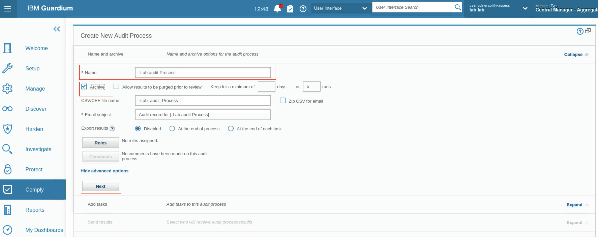 

7. Click **Next**. The Add tasks section opens.
8. Click **New**. The New task window opens.
 - To configure the new task, use the following table.

  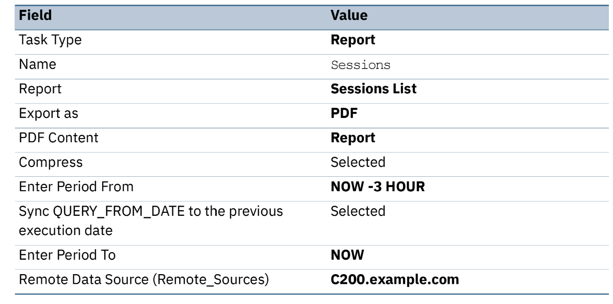 

 - You new task sreen should look like followiing

   

 - Click **OK**. 

  The New task window closes, and the **Sessions** task is added to your process.

9. To configure a second task, use the following table.

     

 - You new task screen should look like following

  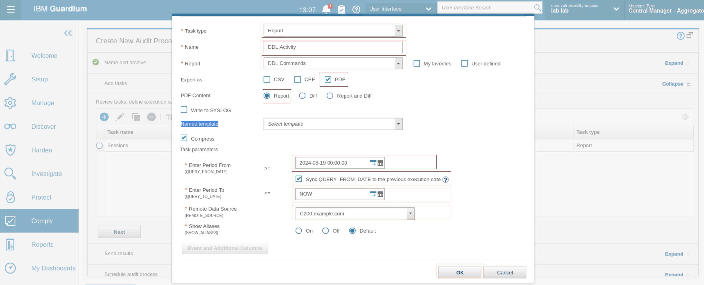 

 - Click **OK**. Now you have two tasks.

  

10. Click **Next**. The Receiver section opens. We will create 3 receivers. 

  - To add a receiver, click **New** 
  - Create first receiver using following table: 

    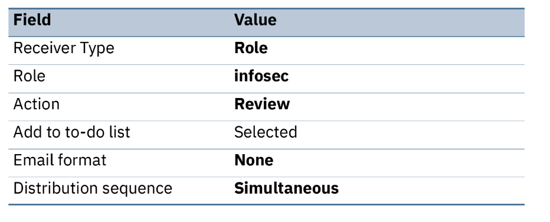 

     
  
  - Create second receiver using following table: 

     

    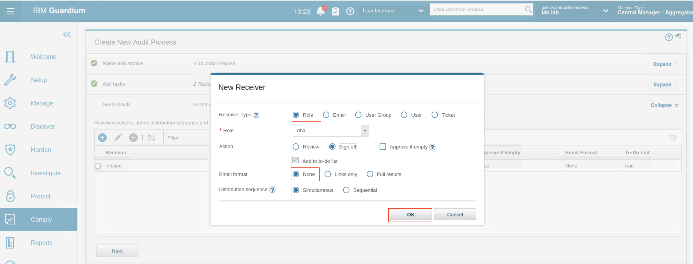 

  - Create third receiver using following table: 

     

     

  - Three receivers are listed in the Receiver section.

       

11. To proceed to the audit process scheduling section, click **Next**. 

12. Use following table to create schedule.

    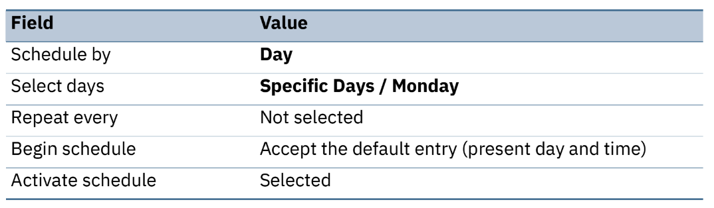 

     

13. At this point, you can run the process, but instead, scroll down and click **Save**. You return to the **Audit Process Builder**, and your new process is listed.

    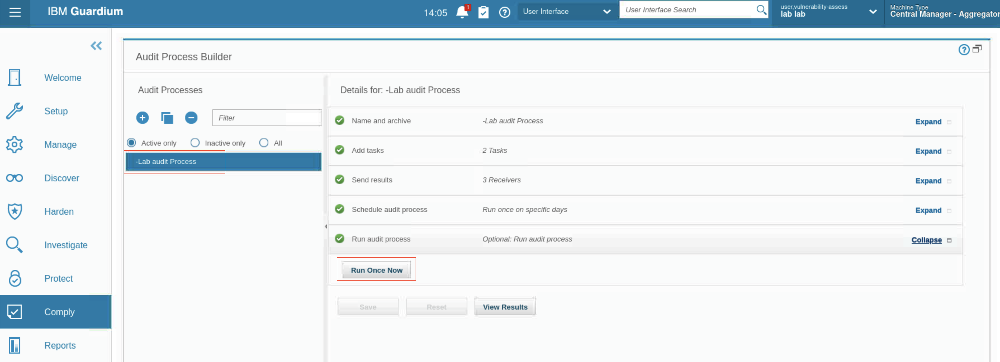 

14. Expand the **Run audit process** section and click **Run once now**. The process runs and provides results. The results are sent to the infosec and dba roles
simultaneously.

15. Sign out of the Guardium GUI now because to manage the audit results, you need to sign in as different users.

## Managing audit results

In this exercise, you play a few roles to manage the audit process results.

  

1. As larry, a member of the infosec role, you are the first user to view the results but you are not required to sign off on them. You add comments to the process, then escalate to your teammate, kesha.

2. The process workflow sends the results to the dba role at the same time. As user joe, a member of the dba role, you sign off on the results. Joe does not need for a member of the infosec role to view or sign the results. Joe’s signing causes the results to be sent to the audit role. Joe must sign off before the results are sent to the audit role.

3. As scott, a member of the audit role, you receive the results only after joe signs off. You sign off on the results. This sign off completes the process flow for this branch; however, the entire process is not complete until Kesha signs off, due to the escalation.

4. As user kesha, you view and sign larry’s escalation. This completes the workflow process.

### Review and escalate audit reports (Larry)

The first step in the process is to review and then escalate the report. Larry is part of the infosec role.

1. Log in to the **MA170 graphical console** as user `larry` with password `P@ssw0rd`.

2. View the toolbar. The **To-do** list indicates that there is a task to complete.

3. Click the **To-do** icon. The Audit Process To-Do List opens.

  

 The audit process you built and ran is listed in the to-do list. This process is included in user larry’s list because he is a member of the infosec role. Remember that the report was sent to the infosec role with the following parameters:
 - It is distributed simultaneously to the dba role. That is, no action must be taken by an infosec user before the process appears in the to-do lists of dba users. 
 - The process only needs to be reviewed. That is, it is sufficient that a member of the infosec role (any user with that role) views the report.

4. Click **View**. The process details open in a separate browser window.

  

5. Expand and view the various sections.
 - **Distribution status** - You see that the act of viewing the report has started the review process, and an action is logged.

  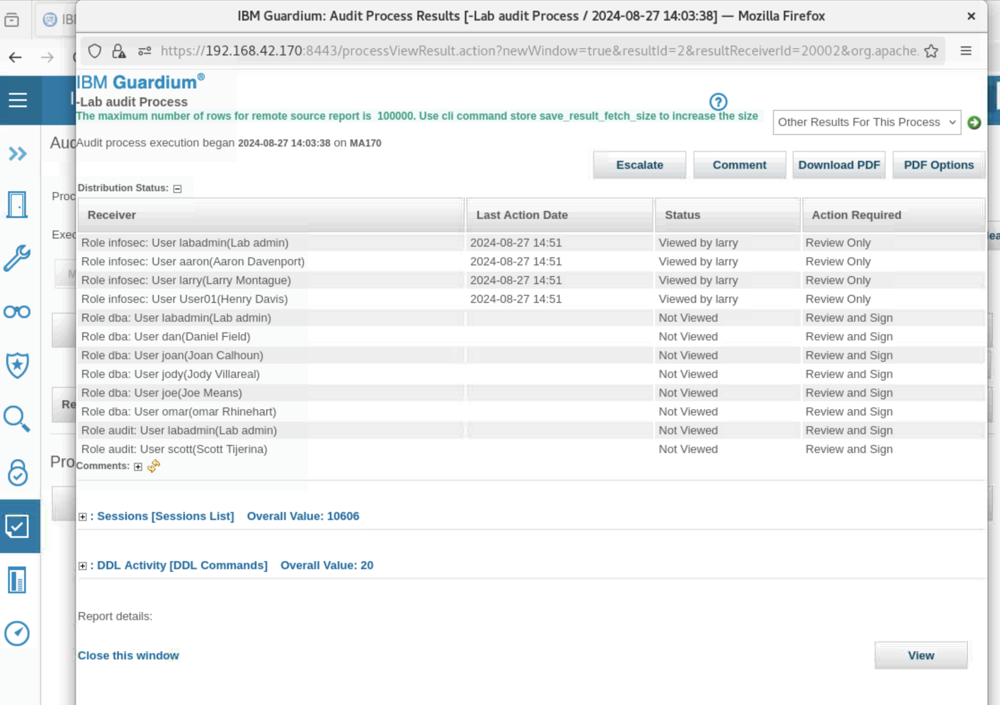

 - **Comments**. There are no comments currently.

 - **Report**: **Sessions (Session List)** - This is the first report that was added to the audit process.

   
 
 - **Report: DDL activity (DDL Commands)** - This is the second report that was added to the audit process.

   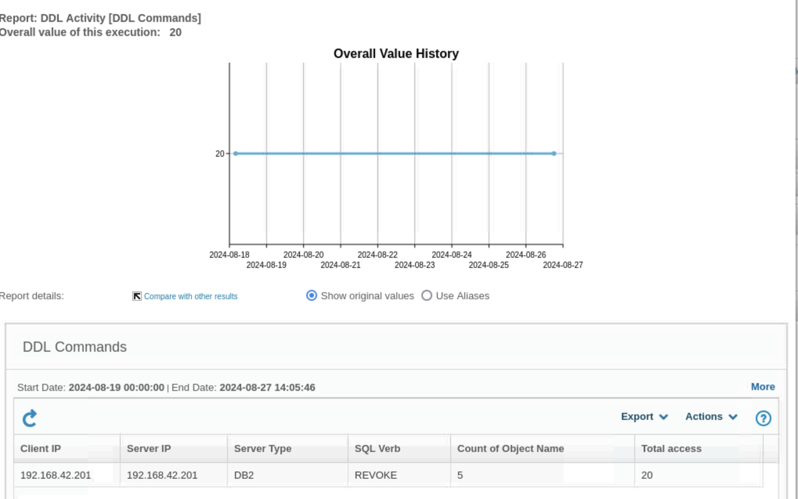

   > **Note:** The reports may be empty. This is OK, as this lab focuses on the process, not the contents of the reports.

6. Now, you add a **comment** and **escalate** to your coworker **kesha**.

 - Click **Comment**. The User Comment window opens.

 - Click **Add Comments**. 

 - Add a comment in the window, and click **Apply**. The comment is added.

    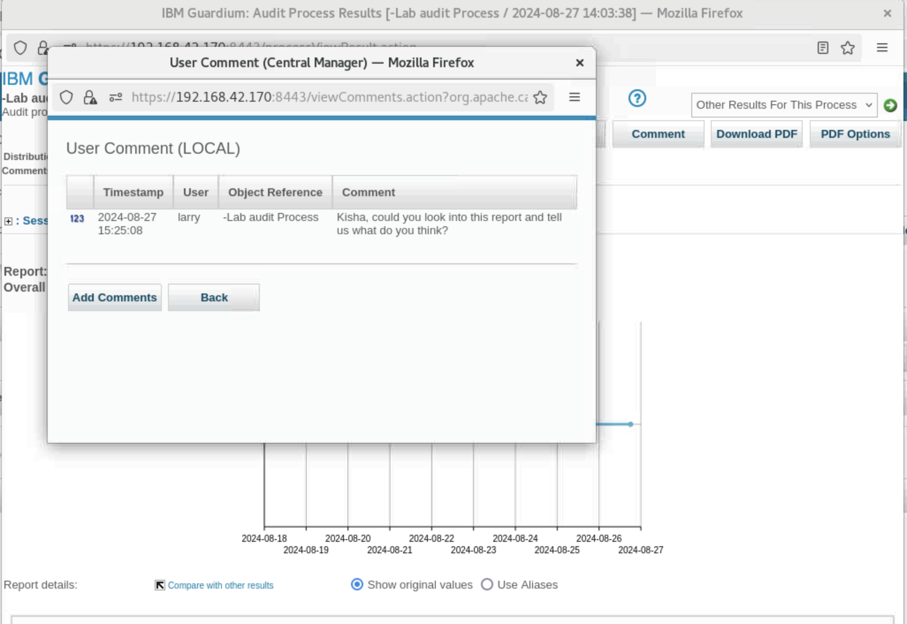

 - To return to the audit results window, click **Back**. 

 - Click **Escalate**. A window opens with a list of receivers.

 - For Receiver, select **kesha**.

 - Set Action Required to **Review and Sign**.

    

 - Click Escalate and close the confirmation dialog.

 In the results window, the **distribution** status now lists **kesha**.

    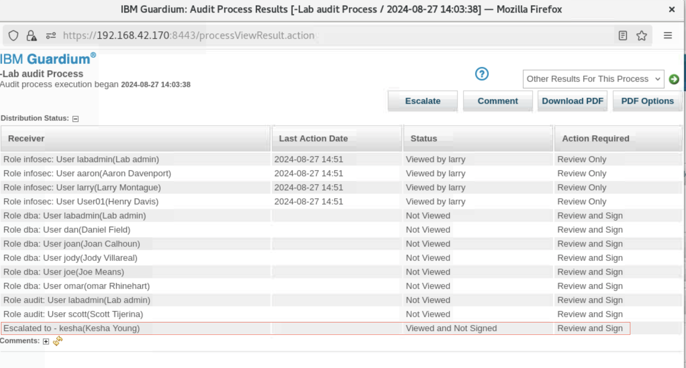

The results are not distributed to the audit role yet. This distribution happens only after the dba role signs off on the results because these receivers were sequential.

7. To close the process results window, scroll down and click **Close this window**.

8. Sign out of the console.

### Sign off on the audit report (Joe)

Joe needs to sign off on the report so that it is sent to the audit role. He is part of the dba role. 

1. Log in to the **MA170 graphical console** as user **joe** with password **P@ssw0rd**.

2. Open the **To-Do list**.

3. To open the process details window, click **View**. In this window, there is a Sign Results button.

    

4. Click **Sign Results**. The Sign Results button disappears, and a message is shown on the report window that the results were signed.

    

> **Note:** Joe normally views the distribution workflow results, including the distribution status and the two reports. 

5. Click **Continue**. The Continue button disappears.

> **Note:** You must both sign the results and click Continue for the process to move forward.

6. Open the Distribution Status and notice that now the role, dba, is updated with **Signed by joe**.

    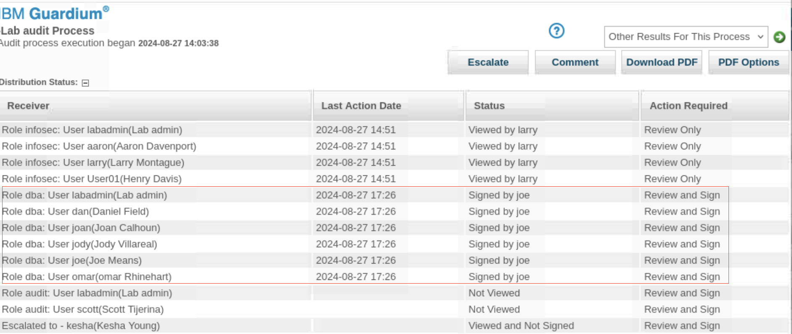

    Only one member of the dba role must sign the audit to complete the task for all members. Additionally, the status for Role audit was changed to **Not Viewed** and all users with that role audit are listed.

7. Scroll down and click **Close this window**. Sign out of the console.

### Sign off on the audit report (Scott)

The next task is to sign off on the report as a member of the audit role. Scott is part of the audit role.

1. Log in to the **MA170 graphical console** as user **scott** with password **P@ssw0rd**.

2. Open the **To-do list** and view the report. Note that the **distribution status** has a record of all the actions that are taken so far, and actions that remain. Also, the comments section includes larry’s comments.

    

3. **Sign off** on the report and click **Continue**. 

> **Note:** You must both sign the results and click **Continue** for the process to move forward.

    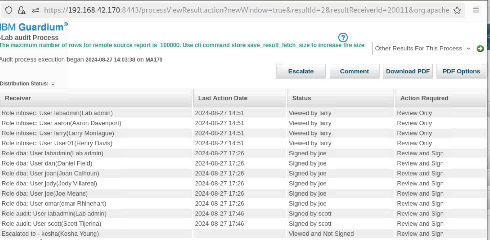

4. **Close the window** and **log out** as user scott.

### Reconcile the escalation (Kesha)

Larry escalated the workflow to Kesha, and designated that Kesha needs to view and sign off on the workflow. In this task, you reconcile the escalation.

1. Log in to the **MA170 graphical console** as user **kesha** with password **P@ssw0rd**.
2. Check the notification and open the report.

    

3. **Sign off** on the report and check the **distribution status**. All tasks are complete.

    

### View the reports

In this task, you view the reports that track the progress of the workflow. This is something a Guardium administrator does to ensure that the workflow functioned properly.

1. Log in to the **Guardium console (MA170)** as user **labadmin** with password **P@ssw0rd**.

2. Go to **Comply > Tools and Views > Audit Process Log**. The log shows that user **lab** ran the workflow.

    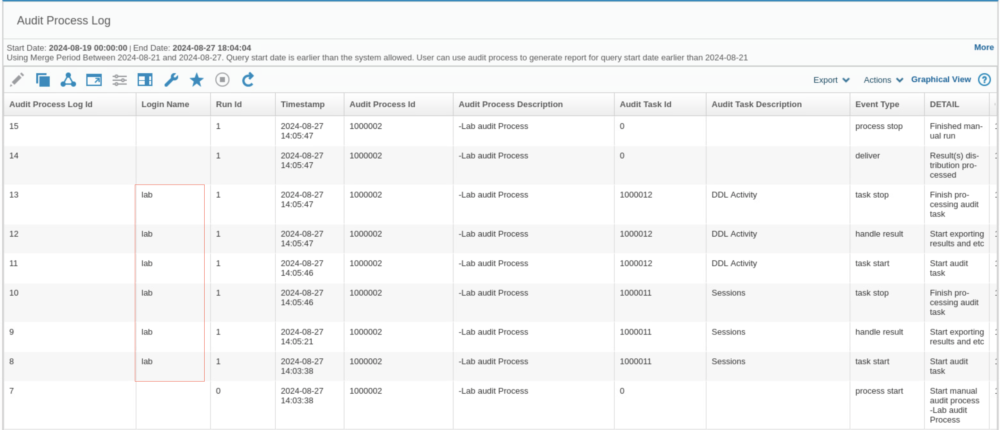

> **Note:** If the report does not show the data, set the start date to NOW-3 DAYS.

## Congratulations, you've completed all labs of Guardium Data Protection Level 4

