# 203: Configure the governance console & monitoring

In this lab We will enable the watsonx.governance console (OpenPages) integration with Factsheets and the watsonx.governance monitoring service (OpenScale), and load sample data into the governance console.

## Prerequisites

This lab depends on the setup in [Lab 201](/watsonx/watsonxgov/level-4/201), which means having a running CP4D environment from TechZone.

## Create a user

In this step, you will create a sample user in Cloud Pak for Data. This step is required for the rest of the hands-on labs.

1. First log in to Cloud Pak for Data using the *Console Route*, *Username*, and *Password* you got from the *update-configmap-success* CP4D pipeline logs in [Lab 201](/watsonx/watsonxgov/level-4/201).
2. From the home screen, click the **hamburger menu** in the top left, then under **Administration**, click **Access control**.  
3. Click the blue **Add users** button, and then fill out the profile information. Use `complianceofficer` for the username, as this will be referenced in future labs. Make sure not to forget your password! Click **Next**.  
4. Click the **Assign roles directly** tile, then click **Next**. Note that you can create user access groups to more efficiently manage access, but that is beyond the scope of this lab.
5. Use the checkboxes in the Roles section of the screen to assign *all roles* to the new user. Note that this will govern actions they can perform in Cloud Pak for Data, and will give them all the permissions necessary to perform the lab steps. You can create multiple users with different roles if your client is interested in how Cloud Pak for Data manages roles, but for the sake of simplicity, giving one user all permissions will allow you to focus on the features of watsonx.governance. Clicking on the different roles from this screen will show the various actions that each role is allowed to perform. For more information on these pre-defined roles and the permissions they grant, see the [Cloud Pak for Data documentation](https://www.ibm.com/docs/en/cloud-paks/cp-data/4.8.x?topic=users-predefined-roles-permissions-in-cloud-pak-data).  
6. Click **Next** and then **Add** to finalize creation of the new user.

## Configuring the governance console

1. ### Turn on OpenPages integration
    1. Make sure you're logged in to Cloud Pak for Data using the *Console Route*, *Username*, and *Password* like in the user creation step above.
    2. From the home screen, click the **hamburger menu** in the top left, then under **AI governance** click **External models**.  
    3. On the **External models** page, click the blue **Setup external model governance** button.  
    4. Click the toggle button for **External model governance** to activate it.  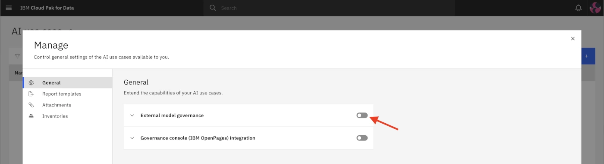
    5. Click on the **Inventory** dropdown and select the **Platform assets catalog** option.
    6. Click on the **Default owner** dropdown and select the **admin** user, then click **Apply**. You will return to the previous screen.
    7. Click the toggle button for **Governance console (IBM OpenPages) integration** to activate it.  
    8. On the **Sync with Governance console (IBM OpenPages)** page, click on the **OpenPages location** dropdown and select **IBM Cloud Pak for Data**. Note that, depending on the version you have, this option may be called watsonx instead.  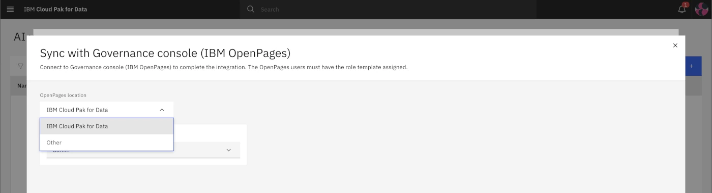
    9.  Click on the **OpenPages users** dropdown and select **admin**, then click **Complete setup**.   Integration between watsonx (or Cloud Pak for Data) and OpenPages has now been enabled. Next, you will create an inventory and give the created user access to it. Inventories are collections of model use cases. They are meant to be collaborative so that multiple people that perform different roles can contribute to governance of key assets.  
    10. Click the **Inventories** menu item on the left, and then click the **New inventory** button.  
    11. In the name field, enter `High Oaks Banks Model Use Cases`. Ensure that the **Add collaborators after creation** box is checked, and then click **Create**.
    12. On the **Set collaborators** page, click **Add collaborators**, then **Add user**, and start typing the user ID of the user you created to find it. Make sure **Admin** is selected, then click add.    Now that you have configured Cloud Pak for Data to use the watsonx governance console (OpenPages), model use cases created in the governance console will appear in the inventory in Cloud Pak for Data, and vice versa. You can close the **Set collaborators** and **Manage** windows to return to the **AI use case** screen, then return to the Cloud Pak for Data home page by clicking the title in the upper left corner.  

2. ### Launch the governance console

    In this section, you will launch the OpenPages service. With the release of watsonx.governance, IBM's AI governance solutions continue to be integrated and re-branded into a cohesive whole. However, previous versions of the service names may still appear in some locations, and your clients may be familiar with these separate services. In the context of watsonx.governance, the OpenPages product is frequently referred to as the **governance console**, but in the list of services running in your environment, is referred to as **OpenPages**.

    1. From the Cloud Pak for Data home page, click the hamburger menu in the top left, then under **Services** click **Instances**.  
    2. Locate the instance of OpenPages in the table and click on the link in the Name column to open the instance details screen.  
    3. Scroll down to the **Access information** section, and in the **URL** row, click the launch icon.  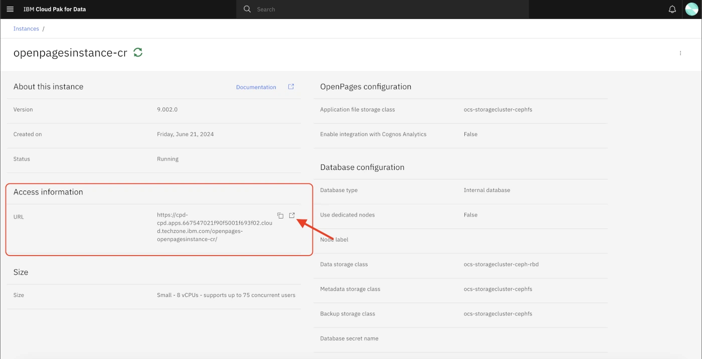

3. ### Load sample users

    In this step, you will load sample user data to more fully flesh out the organization. In the hands-on lab, you will work with the user you created in the previous step to see how accounts can be customized and given roles in the organization.

    For this exercise, you will be loading data and metrics relevant to the hands-on lab, but note that the ability to import and export these configurations allows for rapid customization and sharing of OpenPages environments, workflows, and data.

    There are two different import methods for the governance console:

    * Configuration imports, which consist of XML files
    * FastMap imports, which consist of Excel spreadsheets (xlsx)

     Both methods can be used to import user and organizational data, questionnaires, previous model metrics, and more.

    > **Note:** Actual user accounts should be created using the method in the [**Create a user** section](#create-a-user). The governance console uses Cloud Pak for Data to handle user authentication, so user accounts created within the governance console, or uploaded to the console via configuration imports will not be able to log in to the service. The example users below are being loaded for the sole purpose of filling out the governance console to make it appear more realistic, and because the organizational data being uploaded in a later step references some of the example user accounts.

    1. Download the following XML file to your machine: [MRG-users-op-config.xml](https://github.com/CloudPak-Outcomes/Outcomes-Projects/raw/main/watsonx-governance-l4/openpages-sample-files/MRG-users-op-config.xml)
    2. From the watsonx governance console (OpenPages), click the gear icon in the top right, and under **System Migration** click **Import Configuration**.  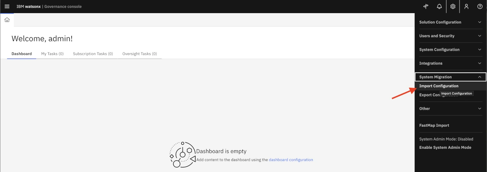
    3. Under **Import types** select **Local drive**, and then click **Add file** to choose the XML file you downloaded in step 1. Then click **Import**.  
    4. Click **Submit** to confirm your choice and import the file. The **History** tab will open to show the progress of the import. The file import may take a minute or two to complete; when it is finished, you will receive an **Import Completed Successfully** notification.  

4. ### Load sample organization and metrics data

    In this section, you will load additional data to flesh out the organization and the dashboard using the FastMap import tool.

    1. Save the following Excel file to your machine: [High_Oaks_All_MRG_Content.xlsx](https://github.com/CloudPak-Outcomes/Outcomes-Projects/raw/main/watsonx-governance-l4/openpages-sample-files/High_Oaks_All_MRG_Content.xlsx)
    2. Click the gear icon in the top right, and then click **FastMap Import**.  
    3. Click the Import button to open the **FastMap Import** window.
    4. Click the **Choose file** button and select the *High_Oaks_All_MRG_Content.xlsx* file you downloaded in step 1, then click **validate**. It might take a minute to finish.  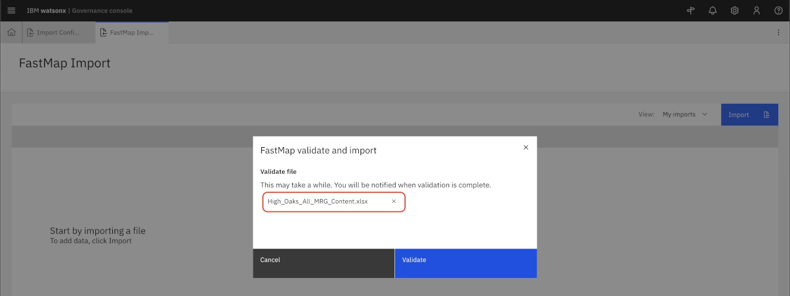
    5. Once validation is complete, click **Import**.  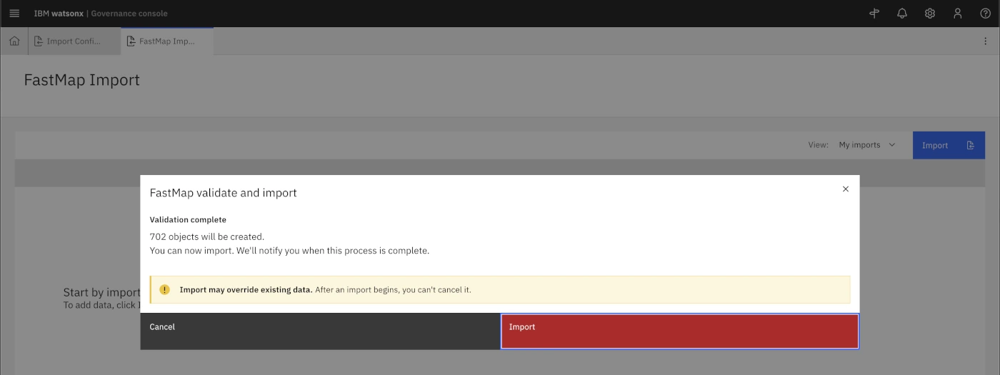  This step might take several minutes. You might want to take a look at the excel file while waiting to get an idea of the business organization and hierarchical structure. When finished, you can close the progress window, you have successfully imported details and metrics for the organization.  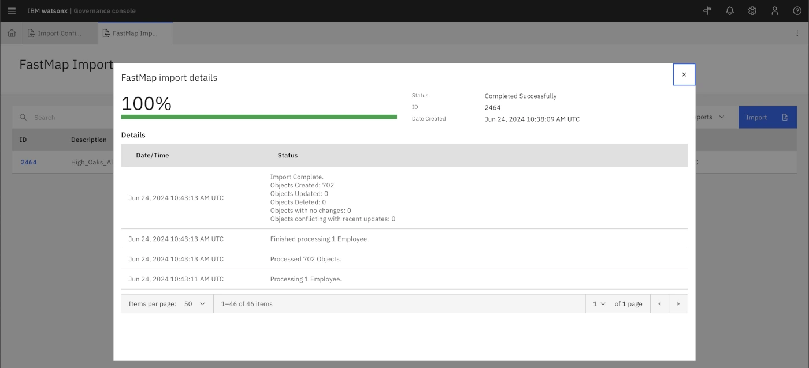

5. ### Enable on the watsonx profiles for the admin user
     
    Finally, for the governance console to show the new watsonx views and functionality for the admin user, you will need to add the relevant profiles to the user account.

    1. Click the gear icon in the top right and under **Users and Security**, click **Users**.  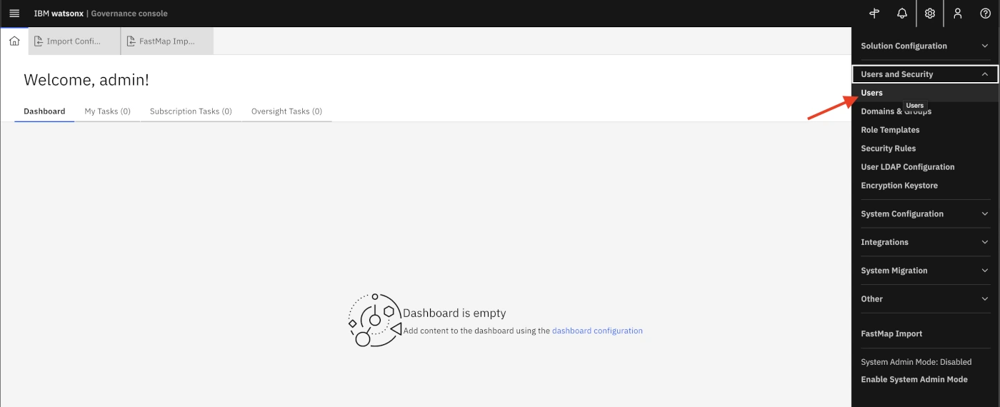
    2. Find the admin user and click it. Under **Locale and Profiles** click the pencil to edit **Allowed user profiles**. 
    3. Type `watsonx` to search, and then check the boxes for all 4; **watsonx-governance Modules Master**, **watsonx-governance MRG Master**, **watsonx-governance ORM Master**, and **watsonx-governance RCM Master**.  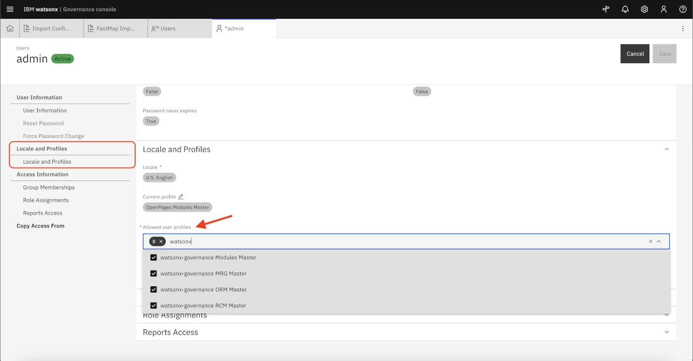
    4. Scroll up to **User Information** and enter an email address, and then click save. (Any email will do)    Now that you have enabled the watsonx profiles for the admin user, you will need to switch to the new profile.  
    5. Click the avatar icon in the top right, and then click **Change Profile**. Click on **watsonx-governance Modules Master** and then click save.  

6. ### Add views to the MRG role template

    At the time of writing, the Model Risk Governance role template does not have access to the Risk or Use Case Review views. You will need to manually add the view to the role template. Future versions of the governance console may change the role to automatically include access to these views.

    1. Click the gear icon in the top right, and then under **Users and Security** click **Role Templates**.  
    2. From the list in the left panel, scroll down to the **MRG - All Permissions** role and click on it.
    3. In the panel on the right, in the **Role Access Controls** section, click on the **Add** button.  
    4. In the **Add Object Type Access** panel, scroll down until you can see several Risk options. Check the boxes for **Risk**, **Risk Assessment**, **Risk Assessment Eval**, and **Risk Eval**.  
    5. Keep scrolling down and check the box for **Use Case Review** as well.
    6. Click the blue **Add** button at the bottom of the panel to add access. Note that you have only added Read level access at this point. The Add Object Type Access panel closes, and Risk as well as the other objects now appear in the main access list.
    7. Back in the main access list, select the options you just added: **Risk**, **Risk Assessment**, **Risk Assessment Eval**, **Risk Eval**, and **Use Case Review**.
    8. At the top of the table, click the **Edit** button,   and then change the **Write**, **Delete**, and **Associate** permissions to **Granted**.   Click **Done**. You have completed configurations for the governance console.
## Configure monitoring
    In this step, you will configure the watsonx.governance monitoring service, formerly known as OpenScale. The monitoring service provides metrics by capturing model input and output in a database known as a datamart. The datamart also holds information about the models being monitored, as well as the complete history of the metrics gathered.

    The datamart requires either a Db2 or PostgreSQL database.

1. ### Create a database
    1. Log in to Cloud Pak for Data as the admin user in your environment, using the Cloud Pak for Data *Console Route* and *password* gathered in step 8 of the Environment setup part of [Lab 201](/watsonx/watsonxgov/level-4/201).
    2. From the home screen, click the hamburger menu in the upper left, then under **Data**, click **Databases**. 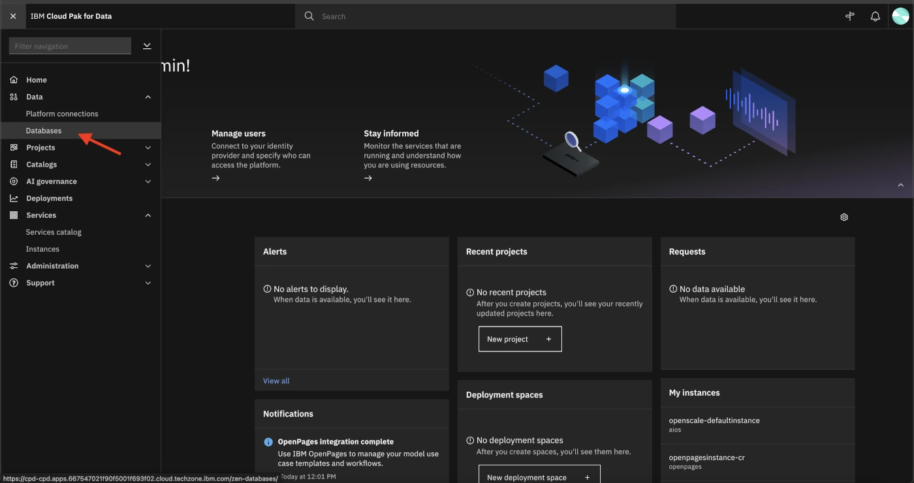  The reservation system may have created a database for you, in which case it will appear here. You may skip ahead to [Gather database credentials](#gather-database-credentials). If you do not see a database, you will need to follow the steps below to create one.
    3. Click the **Create a database** button, and verify that the **Db2** tile is selected as the database type, with the most recent software version selected in the dropdown. Click **Next** to continue.   
    4. Under **Storage option**, make sure **Single location for all data** is selected, and click **Next**. 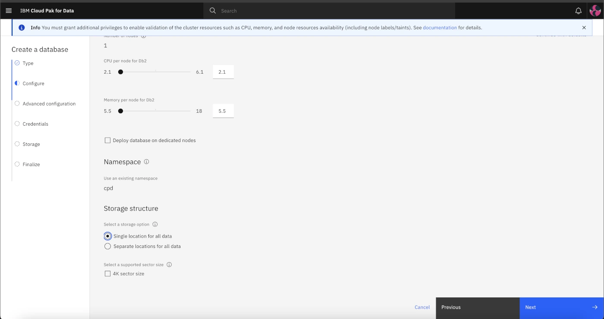 Keep the defaults and move on to the credentials page.
    5. Under credentials, use the **Input method** dropdown to select **Generate a Kubernetes secret** and click **Next**.  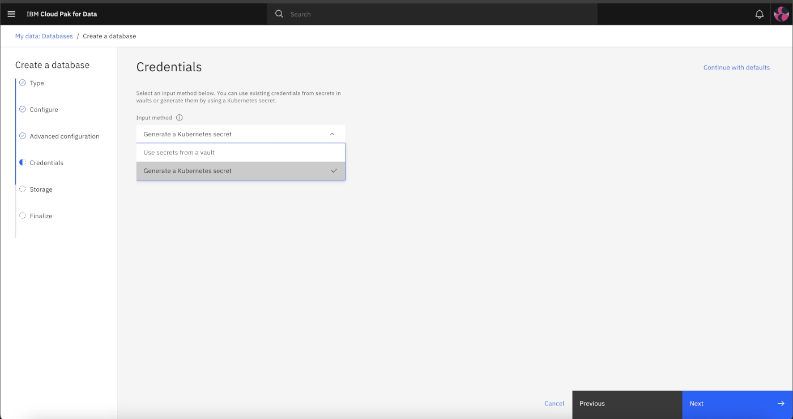
    6. For Storage, select **Create new storage**, **Use storage template**, and in the dropdown select **ocs-storagecluster-cephfs**. Reduce the size to **50 GiB** and click **Next**.   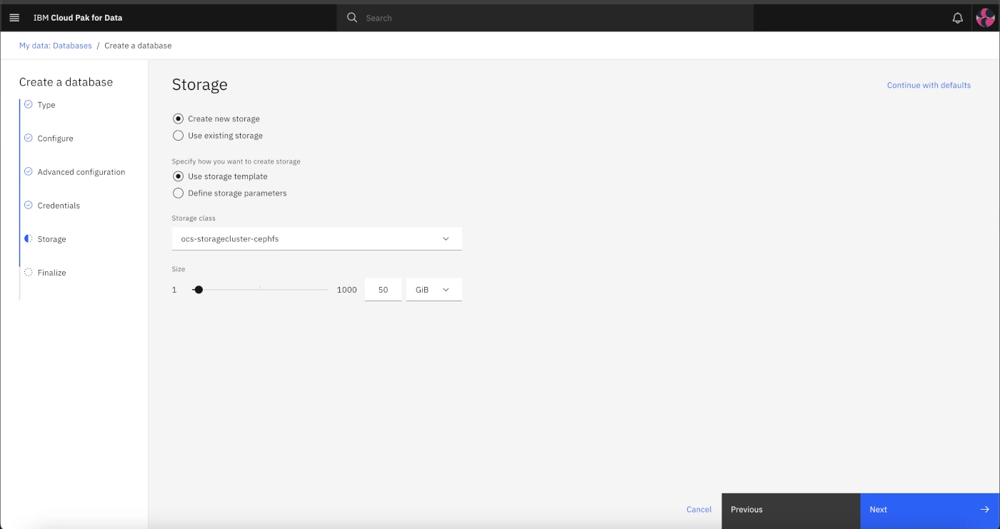
    7. On the Finalize screen, you can safely ignore the warning message. Set the Display name to `cpd-database` and click **Create**. The database will take roughly **30 minutes** to create. When it is finished, you can proceed to the next step.

2. ### Gather database credentials

    The watsonx.governance service will need to connect to the database you created in order to create and update the datamart. In this step, you will gather the credentials necessary for that connection.

    1. From your list of databases, locate the tile for the newly-created database (cpd-database), or existing database, and click the three dots in the upper right of the tile to open the context menu, then click details.   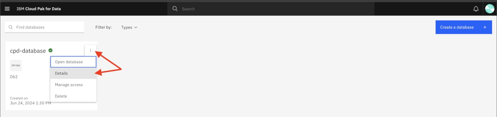
    2. Locate the **Deployment id** in the details towards the bottom of the page. Select and save the value somewhere for easy reference later.   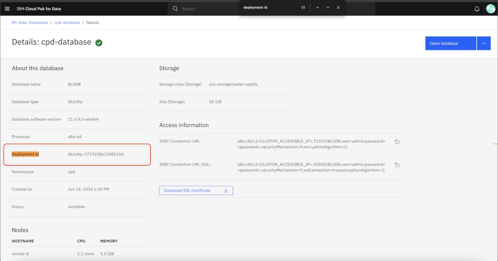
    3. Add a prefix of `c-` and a suffix of `-db2u` to the deployment ID value from the previous step to create the database host name. For example, in the screenshot above, the database has a deployment ID of **db2oltp-1719228613082150**. The corresponding host name would be **c-db2oltp-1719228613082150-db2u**.

3. ### Configure the monitoring service

    You have now created a database and are ready to connect it to the watsonx.governance monitoring service.

    1. From the CP4D home page, click the hamburger menu in the top left, and under **Services**, click **Instances**.
    2. Locate the **IBM Watson OpenScale instance** from the list.
        > Note that, on IBM Cloud, this service has been renamed to watsonx.governance. Future software releases will likely incorporate this change as well, so this screen may change to reflect the new name.
    3. Click the ellipsis button on the far right of the OpenScale instance, and then click open.   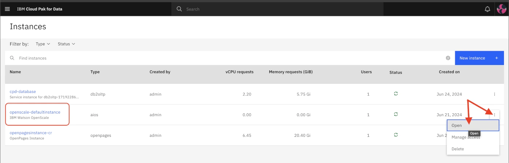
   > NOTE: If the Open option does not appear, the page may not have finished fully loading. Try waiting for up to a minute or refreshing the page.
    4. If this is the first time you have opened the watsonx.governance monitoring tool, you will see the **Model evaluation** modal window. Click **Manual setup**. Note that you can do an auto setup using the same credentials and database information as the steps below to fill out the dashboard with some example models, but the process will take up to 20 minutes longer.   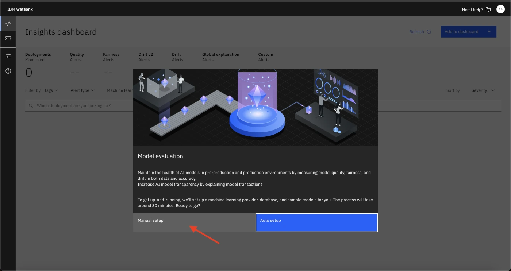
    5. From the **System setup** screen, click the Pencil icon on the Database tile to edit database information.
    6. Use the following values for the fields:
        - Database type: **db2**
        - Database location: **Other**
        - Hostname or IP Address: **The value you constructed earlier ending in -db2u**
        - Database: `BLUDB`
        - Username: `admin`
        - Password: **Your Cloud Pak for Data admin password**   
    7. Click **Connect**. The monitoring service will attempt to connect to the database using the credentials you supplied. If the connection fails, double-check that you have constructed the hostname correctly, and that you are using the admin username and password that you use to log into the Cloud Pak for Data or watsonx home screen.
    8. After successfully connecting, set **Schema** to **Auto-create a new schema**, and click save. When the changes have successfully saved, the watsonx.governance monitoring service will be configured and operational.   

4. ### Add the user to the monitoring service

    In order to perform model evaluations, the user you created in previous steps needs to be granted access to the monitoring service.

    1. From the CP4D home screen use the hamburger menu, then **Services** -> **Instances**
    2. Locate the OpenScale service in the table and open the ellipsis menu, then click on **Manage access**.   
    3. Click on **Add users**, then select the user you created, and set the role to **Admin**, then click **add**.     The created user will now have Admin privileges, which will allow them to add machine learning providers. Note that assigning Editor privileges would allow the user to create and remove model subscriptions and configure models for monitoring, but not add the deployment spaces or third-party environments that host the models.

Congratulations, you have learned how to configure the governance console, do user and organization management, assign roles, and configure monitoring.

Continue to [Lab 204](/watsonx/watsonxgov/level-4/204)
